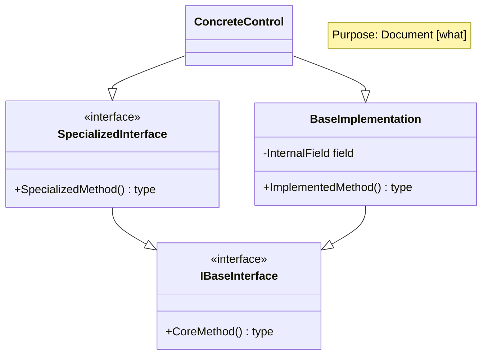
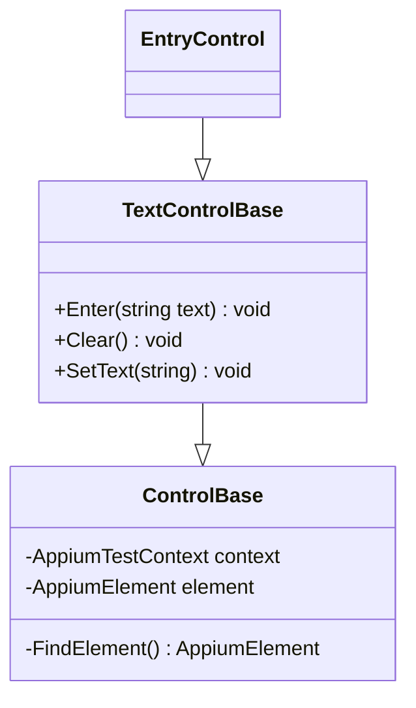

# Copilot Instructions for Brinell Framework

**Last Updated:** January 3, 2026

This document provides guidance for GitHub Copilot and other AI assistants working on the Brinell UI test automation framework.

---

## 1. Mermaid Diagram Syntax (Critical)

### Current Environment
- **Mermaid Version:** 11.x (latest as of January 2026)
- **Usage:** Class diagrams for control hierarchies, architecture visualization
- **Documentation:** https://mermaid.js.org/syntax/classDiagram.html

### ❌ DEPRECATED SYNTAX (Do NOT Use)

These patterns cause rendering errors in Mermaid 11.x:

**1. HTML tags in class labels**
```mermaid
❌ WRONG:
class IControlObject["IControlObject<br/>(Base)"]

✅ CORRECT:
class IControlObject {
    <<interface>>
}
note for IControlObject "Base interface"
```

**2. Method return types with space separator**
```mermaid
❌ WRONG:
IControlObject : IsExists() bool
IControlObject : GetText() string

✅ CORRECT:
+IsExists() bool
+GetText() string
```

**3. Complex inline method signatures**
```mermaid
❌ WRONG:
ITextControl : Enter(string) 
ITextControl : GetItems() IReadOnlyList~string~
ITextControl : AssertTextMatches(string, string?)

✅ CORRECT:
+Enter(string text) void
+GetItems() List
+AssertTextMatches(string pattern, string message) void
```

**4. Nullable type notation in diagrams**
```mermaid
❌ WRONG:
IControlObject? Page
string? GetText()

✅ CORRECT:
IPageObject Page
GetText() string
(Note: Use actual return/property types, not nullable notation)
```

**5. Generic type notation with tildes**
```mermaid
❌ WRONG:
GetItems() IReadOnlyList~string~
GetChild~T~(string) T

✅ CORRECT:
GetItems() List
GetChild(string) T
(Note: Simplify generics or use plain names)
```

### ✅ CORRECT PATTERNS

**1. Class declarations with interface marker**
```mermaid
class IControlObject {
    <<interface>>
    string AutomationId
    IPageObject Page
    +IsExists() bool
    +GetText() string
}
```

**2. Inheritance relationships**
```mermaid
IClickableControl --|> IControlObject
ITextControl --|> IControlObject
IEditableTextControl --|> ITextControl
```

**3. Visibility modifiers**
```mermaid
+IsExists() bool              ← Public method
#FindElement() AppiumElement  ← Protected method
-WaitForElement() AppiumElement ← Private method
string AutomationId           ← Public property
#IPageObject _page            ← Protected field
```

**4. Method signatures with return types**
```mermaid
+Click() void
+Enter(string text) void
+GetText() string
+WaitExists(bool exists, int timeout) bool
+AssertTextEquals(string expected, string message) void
```

**5. Using notes for additional context**
```mermaid
class ITextControl {
    <<interface>>
    +Enter(string text) void
    +Clear() void
}
note for ITextControl "For text input controls"
```

**6. Multiple inheritance (interfaces)**
```mermaid
class MyControl {
}
MyControl --|> IControlObject
MyControl --|> IClickableControl
MyControl --|> ITextControl
```

### Common Issues & Solutions

| Problem | Cause | Solution |
|---------|-------|----------|
| Classes don't render | Invalid method syntax | Simplify signatures, remove special characters |
| Missing relationships | Syntax errors in method defs | Check method format: `+name(params) return` |
| Diagram blank | HTML tags in class name | Use `<<interface>>` and separate notes |
| Text not displaying | Complex generic notation | Use simplified types (e.g., `List` instead of `IReadOnlyList~T~`) |
| Rendering timeout | Too many complex methods | Split large diagrams or reduce method count |

---

## 2. Class Diagram Best Practices

### Design Principles
1. **Keep it simple** - Too many methods in a class box causes rendering issues
2. **Use notes for descriptions** - Don't put descriptions in class names
3. **Show relationships clearly** - Use inheritance arrows for interface implementation
4. **Group related classes** - Organize base classes, then concrete implementations
5. **Limit methods shown** - Show ~10 key methods, not entire API

### Method Organization
```mermaid
class IControlObject {
    <<interface>>
    % Properties first
    string AutomationId
    IPageObject Page
    
    % Then methods in logical order
    % State checking
    +IsExists() bool
    +IsVisible() bool
    +IsEnabled() bool
    
    % Waiting/polling
    +WaitExists(bool, int) bool
    +WaitVisible(bool, int) bool
    
    % Assertions
    +AssertExists(string) void
    +AssertVisible(string) void
}
```

### Inheritance Chain Example
```mermaid
ControlBase --|> IControlObject
TextControlBase --|> ControlBase
TextControlBase --|> ITextControl
EditableTextControlBase --|> TextControlBase
EditableTextControlBase --|> IEditableTextControl
```

---

## 3. Brinell-Specific Guidelines

### Control Naming Conventions
- **Interfaces:** `I<ControlType>` (e.g., `IClickableControl`, `ITextControl`)
- **Base Classes:** `<ControlType>Base` (e.g., `TextControlBase`, `ToggleControlBase`)
- **Concrete Classes:** `<ControlType>Control` (e.g., `ButtonControl`, `EntryControl`)

### Platform Separation
When documenting multi-platform controls:
1. **Separate diagrams** for MAUI and Blazor implementations
2. **Use notes** to indicate platform context
3. **Reference common interfaces** in both diagrams
4. **Keep inheritance patterns consistent** across platforms

### Interface Categories
- **Core:** IControlObject (all controls)
- **Interaction:** IClickableControl (buttons, links)
- **Text:** ITextControl, IEditableTextControl
- **Selection:** ISelectorControl, IToggleControl
- **Range:** IRangeControl, ISlider
- **Collections:** IItemsControl, IContainerControl
- **Scrolling:** IScrollableControl

---

## 4. Creating New Diagrams

### Step-by-Step Process
1. **Start with interface hierarchy** - Define what each interface does
2. **Add base classes** - Show abstract implementation patterns
3. **Add concrete controls** - Show real control implementations
4. **Add relationships** - Connect inheritance and interface implementation
5. **Test rendering** - Verify no syntax errors
6. **Add notes** - Document complex relationships

### Template for New Diagram


### Validation Checklist
- [ ] All method signatures follow `+name(params) type` format
- [ ] No HTML tags in class names
- [ ] No nullable notation (`?`)
- [ ] No generic tildes (`~`)
- [ ] Interface markers use `<<interface>>`
- [ ] Relationships use proper arrows (`--|>`)
- [ ] Notes document complex relationships
- [ ] Diagram renders without errors
- [ ] Method count per class is reasonable (~10-15 max)

---

## 5. Troubleshooting Mermaid Errors

### Real-World Errors Encountered (January 2026)

**Error: Classes Don't Render or Render Blank**

**Root Cause:** Cross-diagram references
```mermaid
❌ WRONG - References class from different diagram:
classDiagram
    class ControlBase
    ControlBase --|> IControlObject  % IControlObject not defined in this diagram
```

**Solution:** Make each diagram self-contained
```mermaid
✅ CORRECT - Define all referenced classes:
classDiagram
    class IControlObject {
        <<interface>>
        +IsExists() bool
    }
    
    class ControlBase {
        -AppiumElement element
    }
    ControlBase --|> IControlObject
```

### Symptom: "Syntax error in text mermaid"
**Causes:**
- Invalid method signature (e.g., extra parentheses, special characters)
- Unclosed class definition
- Invalid relationship syntax
- Complex notes with special characters

**Fix:**
- Check all method signatures for proper format
- Ensure all `class Name { ... }` are closed
- Use `--|>` for inheritance, not `->` or other arrows
- Avoid notes with quotes or special formatting

### Symptom: Diagram renders blank
**Causes:**
- HTML/special characters in class names or notes
- Too many complex methods
- Invalid syntax preventing parse
- Cross-diagram references to undefined classes

**Fix:**
- Remove HTML tags from names (no `<br/>`)
- Move descriptions to separate document sections
- Simplify method signatures (reduce parameters)
- Test with simpler diagram first
- **Ensure all classes referenced are defined in the diagram**

### Symptom: Methods don't show
**Causes:**
- Methods defined outside class body
- Invalid method syntax
- Character encoding issues

**Fix:**
- Ensure methods are indented inside class blocks
- Use simple ASCII characters
- Avoid special symbols except standard operators

### Symptom: Relationships don't appear
**Causes:**
- Typo in class name reference
- Invalid arrow syntax
- Class not properly defined
- Referencing class from another diagram

**Fix:**
- Double-check class names (case-sensitive)
- Use `--|>` for inheritance arrows
- Ensure both classes are defined before relationship
- **Don't reference classes from other diagrams** - redefine them

---

### Best Practice: Self-Contained Diagrams

**Pattern:** Each diagram should work independently

```mermaid
✅ GOOD - Complete and standalone:
classDiagram
    direction TB
    
    class Base {
        -field type
        +method() return
    }
    
    class Derived {
    }
    Derived --|> Base
```

**Key Rules:**
1. **Define all referenced classes** - Don't assume classes from other diagrams exist
2. **Include only necessary methods** - 5-10 key methods per class
3. **Simplify method signatures** - Use simple types (List, string, bool, double)
4. **Add direction hint** - Use `direction TB` for clarity
5. **Remove complex notes** - Use document text instead
6. **Test in isolation** - Verify diagram renders alone before inclusion

---

## 5. Performance Considerations

### Diagram Size Limits
- **Small (good):** < 15 classes, < 100 methods total
- **Medium (acceptable):** 15-30 classes, 100-200 methods
- **Large (risky):** > 30 classes or > 200 methods
- **Split if:** Rendering takes > 5 seconds

### Optimization Tips
1. **Split large diagrams** - Create multiple focused diagrams
2. **Reduce method count** - Show only key methods
3. **Use inheritance** - Don't repeat methods in derived classes
4. **Simplify types** - Use `List` instead of `IReadOnlyList<T>`
5. **Remove redundancy** - Use notes instead of repeating info

### For Large Hierarchies
Instead of one giant diagram:
```
1. CORE-HIERARCHY.md: Interfaces only
2. MAUI-IMPLEMENTATION.md: MAUI controls
3. BLAZOR-IMPLEMENTATION.md: Blazor controls
4. CAPABILITY-MATRIX.md: Cross-reference table
5. METHOD-PATTERNS.md: Pattern examples
```

---

## 7. Examples from SPEC-002b

### Reference Implementation
See `specs/SPEC-002b-001-CONTROL-HIERARCHY-DIAGRAMS.md` for working examples of:
- ✅ Self-contained interface hierarchy diagram
- ✅ Self-contained MAUI implementation diagram  
- ✅ Self-contained Blazor implementation diagram
- ✅ Capability matrix diagram
- ✅ Method patterns diagram
- ✅ Container scoping diagram

### Real-World Fix Example

**Before (Broken):**
```mermaid
❌ WRONG - References undefined IControlObject:
classDiagram
    class ControlBase {
        -AppiumElement element
    }
    ControlBase --|> IControlObject
```

**After (Fixed):**
```mermaid
✅ CORRECT - All classes defined:
classDiagram
    direction TB
    
    class IControlObject {
        <<interface>>
        +IsExists() bool
        +IsVisible() bool
    }
    
    class ControlBase {
        -AppiumElement element
        -FindElement() AppiumElement
    }
    ControlBase --|> IControlObject
```

**Key Changes:**
- Defined `IControlObject` in the same diagram
- Added `<<interface>>` marker
- Included essential methods only
- Used `direction TB` for layout
- Removed complex parameter descriptions

### MAUI Implementation Example



**Pattern Notes:**
- Self-contained with all classes defined
- Clear inheritance hierarchy
- Simplified method signatures
- No HTML or special characters
- Direction hint for layout

---

## 8. When to Use Mermaid vs. Other Tools

### Use Mermaid for:
- ✅ Class hierarchies and inheritance
- ✅ Interface relationships
- ✅ Control implementation patterns
- ✅ Architecture overviews
- ✅ Method organization

### Use tables/lists for:
- ✅ Control capabilities matrix (summary)
- ✅ Property documentation
- ✅ Configuration options
- ✅ API reference (too detailed for diagrams)

### Use other tools for:
- Data flow diagrams → Flowchart
- Sequence of operations → Sequence diagram
- State machines → State diagram
- Entity relationships → ER diagram
- Timeline/roadmap → Gantt chart

---

## 9. Documentation Standards

### Every Mermaid Diagram Should Have

1. **Title/Note** - What does it show?
2. **Section header** - Where in the document?
3. **Legend/explanation** - What do symbols mean?
4. **Context** - How does it relate to other diagrams?
5. **Validation section** - What's documented?

### Example Header
```markdown
## 2. MAUI Control Implementation

### 2.1 Control Class Hierarchy

This diagram shows the inheritance relationships for MAUI platform controls,
including base classes and 17+ concrete control implementations.

\`\`\`mermaid
classDiagram
    note "MAUI Control Implementation Hierarchy"
    ...
\`\`\`

---

## Notes on this Diagram

- ControlBase implements IControlObject interface
- Base classes provide common functionality
- Concrete controls inherit from appropriate base classes
- Multiple inheritance used for interface implementation
```

---

## 10. Future Updates

### Lessons Learned (January 3, 2026)

During SPEC-002b creation, several critical Mermaid issues were discovered and fixed:

1. **Cross-Diagram References Fail** - Cannot reference classes from other diagrams. Each diagram must be self-contained with all referenced classes defined.

2. **Complex Notes Break Rendering** - Notes with special characters or quotes cause parse errors. Use simple text or move complex descriptions to document text.

3. **Self-Contained Diagrams are Essential** - Every diagram must work independently. Don't assume classes from prior diagrams exist.

4. **Direction Hints Help** - Adding `direction TB` clarifies layout and can help prevent rendering issues.

5. **Simplified Method Signatures Work Better** - Complex parameter descriptions cause problems. Use simple types and descriptions in separate documentation.

6. **HTML in Names Must Go** - Never use `<br/>` or other HTML tags in class labels. Use `<<interface>>` markers and notes instead.

### When to Revise This Document
- [ ] New Mermaid version released (check syntax compatibility)
- [ ] New diagram type needed (add examples)
- [ ] New pattern discovered (document it)
- [ ] Common error appears (add troubleshooting)

### Maintenance Schedule
- **Quarterly:** Check Mermaid version and breaking changes
- **Per release:** Update examples with new controls
- **Per document:** Validate diagrams render correctly
- **Per fix:** Document the error and solution here

---

## Quick Reference Card

### Most Common Syntax
```mermaid
classDiagram
    class IExample {
        <<interface>>
        +Method(param) return
        #ProtectedMethod() return
        -PrivateMethod() return
    }
    
    class Implementation {
    }
    Implementation --|> IExample
```

### What Works
- `class Name { ... }`
- `<<interface>>`
- `+method() type`
- `--|>` (inheritance)
- `note for Class "text"`

### What Doesn't Work
- `class Name["Name<br/>"]`
- `~T~` (generics)
- `method() type?` (nullable)
- `Type1? Type2` (nullable fields)
- `->` (wrong arrow)

---

**Version:** 1.0  
**Status:** Active  
**Last Review:** January 3, 2026  
**Next Review:** April 3, 2026

For questions about Mermaid syntax, consult:
- [Official Mermaid Docs](https://mermaid.js.org/)
- [Class Diagram Reference](https://mermaid.js.org/syntax/classDiagram.html)
- `SPEC-002b-001-CONTROL-HIERARCHY-DIAGRAMS.md` (reference implementation)
