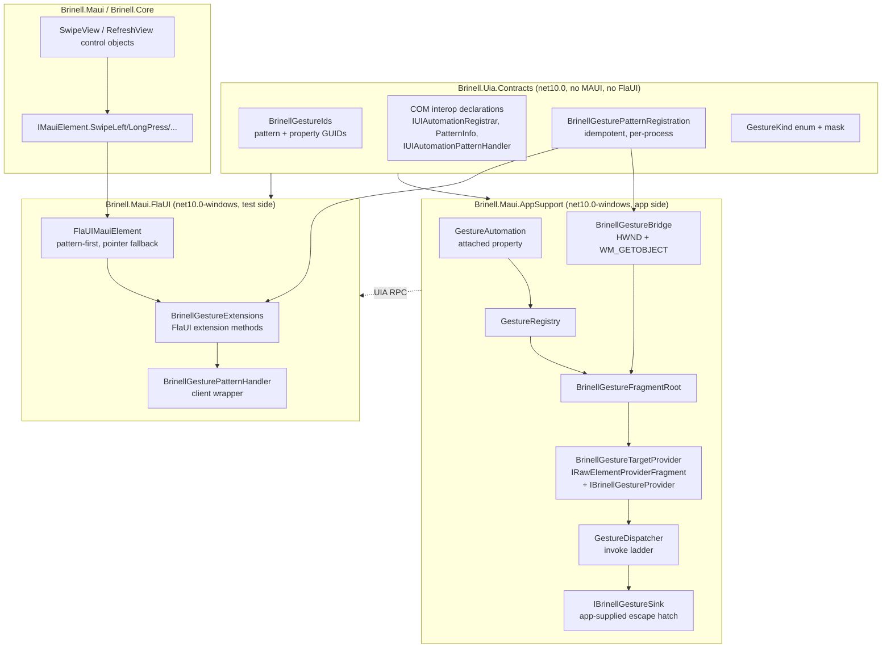
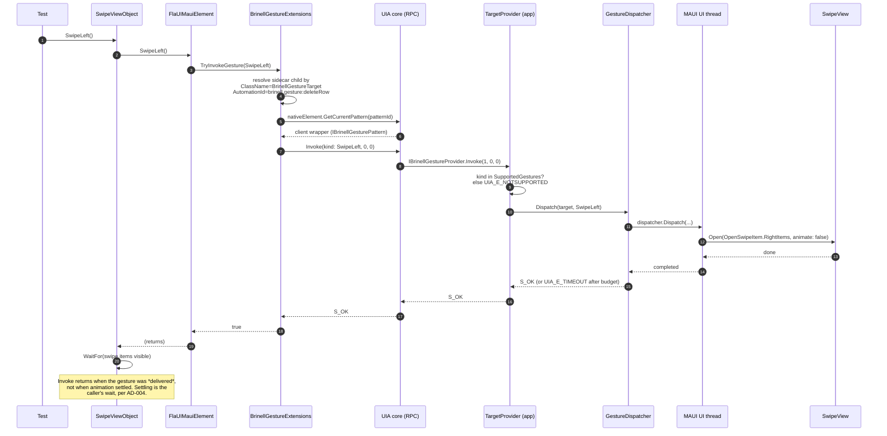

# MAUI Gestures Over UI Automation

Making MAUI gestures (swipe, long press, double tap, custom recognizers) callable from
FlaUI on Windows 11 through standards-based UI Automation rather than synthetic mouse
input, with FlaUI itself unchanged.

**Start here:** [steps.md](steps.md) — the whole programme as numbered, individually-requestable
steps.

Companion documents: [plan-uia-gesture-pattern.md](plan-uia-gesture-pattern.md) (gesture phases,
narrative) and [beyond-gestures-uia-candidates.md](beyond-gestures-uia-candidates.md) (what else
the bridge should carry, and background execution) — note the latter's recommendation to widen
the method table **before** the contract is frozen.

---

## 0. The question that has to be answered first

> Do WinUI 3 and .NET MAUI currently allow custom UI Automation providers to be attached
> to arbitrary controls?

**No. Not through any XAML-level API.** The whole design turns on this, so the reasoning is
spelled out rather than asserted.

### 0.1 Why the XAML route is closed

A MAUI `VisualElement` reaches UI Automation through exactly one path on Windows:

```
VisualElement  ->  IElementHandler  ->  PlatformView (Microsoft.UI.Xaml.FrameworkElement)
               ->  FrameworkElement.OnCreateAutomationPeer()
               ->  AutomationPeer
               ->  [XAML-internal UIA bridge]  ->  IRawElementProviderSimple  ->  UIA core
```

The break is at the peer. `AutomationPeer.GetPatternCore` has this shape:

```csharp
protected virtual object GetPatternCore(PatternInterface patternInterface);
```

`Microsoft.UI.Xaml.Automation.Peers.PatternInterface` is a **closed enum** of the built-in
patterns (`Invoke`, `Value`, `Scroll`, `Selection`, ...). There is no overload taking a
pattern GUID, no overload taking a registered pattern id, and no `GetCustomPatternCore`.

The XAML framework's own `IRawElementProviderSimple` implementation sits between the peer
and UIA core. When UIA asks it for a pattern by id, it maps that id onto a
`PatternInterface` value and calls `GetPatternCore`. A pattern id obtained from
`IUIAutomationRegistrar::RegisterPattern` has no such mapping, so the bridge returns `null`
before your peer is ever consulted. **The provider half of the custom-pattern contract is
physically unreachable from a XAML element.**

MAUI adds nothing above this. `SemanticProperties` and `AutomationProperties` set values on
the same built-in property set; MAUI has no AutomationPeer abstraction of its own.

### 0.2 The repo already holds the empirical corroboration

`samples/Brinell.Samples.Maui.App/Platforms/Windows/Handlers/AutomationRemainingHandlers.cs`
records a measured negative result: overriding `OnCreateAutomationPeer` on the WinUI
`SwipeControl` and `RefreshContainer` did not merely fail to add anything — it **collapsed
the entire UIA tree for the app**, making every element unaddressable while the app kept
rendering normally.

That file is the single most important input to this design. It says the XAML peer surface
is not a safe extension point *even for the things it does support*, on precisely the two
controls (`SwipeView`, `RefreshView`) that gesture work most wants to reach. Any design
whose first move is "subclass the platform view and override the peer" is walking into a
known trap.

### 0.3 What the Windows accessibility stack does offer

| # | Mechanism | Custom patterns? | Scope |
|---|---|---|---|
| E1 | `IUIAutomationRegistrar::RegisterPattern` + native `IRawElementProviderSimple::GetPatternProvider` | **Yes** | Any native provider you write |
| E2 | HWND provider: `WM_GETOBJECT` -> `UiaReturnRawElementProvider` | Yes, with E1 | An HWND you own |
| E3 | `IRawElementProviderFragmentRoot` / `IRawElementProviderFragment` | Yes, with E1 | Sub-elements of your provider, **no HWND per element** |
| E4 | Client-side proxy factories (`IUIAutomationProxyFactoryMapping`) | No — client-side synthesis only | HWND window classes |
| E5 | XAML `AutomationPeer` | **No** (§0.1) | XAML elements |
| E6 | Free-form strings on built-in patterns (`ItemStatus`, `HelpText`, `Value`) | N/A — abuse, not extension | XAML elements |

E1 + E2 + E3 is the supported, documented combination, and it is the one UIA has offered
since UIA 3. It requires a native provider, which means an HWND we own inside the app
process. **That is the redesign**: stop trying to decorate MAUI's elements, and stand up a
small native provider *beside* them.

---

## 1. Architectural overview

A **sidecar fragment provider** lives inside the app under test. It owns a 1x1 invisible
child HWND of the MAUI window, returns a raw UIA fragment root from `WM_GETOBJECT`, and
exposes one raw-view-only fragment child per gesture-enabled MAUI element. Each child
advertises a registered custom pattern. Invoking it marshals to the MAUI UI thread and calls
a **public** MAUI API — no synthetic input, no MAUI internals.

```
  TEST PROCESS                                 APP UNDER TEST
  ------------                                 --------------

  xUnit test
     |
     v
  Brinell control object            .------------------------------------.
  (SwipeViewObject.SwipeLeft)       |  MAUI visual tree                   |
     |                              |    ContentPage                      |
     v                              |      SwipeView  AutomationId=       |
  IMauiElement.SwipeLeft()          |          deleteRow                  |
     |                              |        GestureAutomation.Gestures=  |
     |  1. prefer pattern           |          "SwipeLeft,SwipeRight"     |
     |  2. fall back to pointer     '------------------|------------------'
     v                                                 | registers
  FlaUIMauiElement                                     v
     |                                          GestureRegistry
     v                                                 |
  BrinellGestureExtensions            .----------------v--------------------.
  (FlaUI extension methods)           | BrinellGestureBridge                |
     |                                |   1x1 child HWND, WS_CHILD          |
     v                                |   WM_GETOBJECT -> raw provider      |
  UIA3FrameworkAutomationElement      |                                     |
     .NativeElement                   |   BrinellGestureFragmentRoot        |
     |                                |     +-- BrinellGestureTargetProvider|
     v                                |     +-- BrinellGestureTargetProvider|
  IUIAutomationElement                |             (one per element)       |
     .GetCurrentPattern(patternId)    '-------------------|-----------------'
     |                                                    |
     +========== UIA cross-process RPC ===================+
                                                          v
                                                   GestureDispatcher
                                                   (marshals to UI thread)
                                                          |
                                                          v
                                                   SwipeView.Open(...)
                                                   SwipeGestureRecognizer.SendSwiped(...)
                                                   ICommand.Execute(...)
```

Three properties fall out of this shape, and they are the reasons to prefer it:

1. **FlaUI is untouched.** `UIA3FrameworkAutomationElement.NativeElement` is a public
   property (verified in FlaUI.UIA3 5.0.0). Everything else is our own extension method.
2. **No synthetic input.** The gesture is delivered as a method call on the app's own
   objects, on the app's own UI thread. Nothing depends on window focus, z-order, mouse
   capture, or the physical desktop — the exact class of flakiness the current
   `Mouse.MoveTo` / `Mouse.Scroll` path in `FlaUIMauiElement.Swipe` suffers from.
3. **The a11y tree is not disturbed.** We add a sibling HWND provider. We do not replace,
   wrap, or subclass any MAUI or WinUI automation peer, so §0.2 cannot recur.

---

## 2. Components



`Brinell.Uia.Contracts` referenced by **both** sides is the single most important structural
decision. The GUIDs are the wire contract; if the app and the test each declared their own
copy, a drift would show up as `GetCurrentPattern` quietly returning `null` — the worst
possible failure mode, indistinguishable from "the app isn't instrumented".

`Brinell.Maui.AppSupport` is the right home for the provider because it already exists for
exactly this purpose, and its csproj carries a rule worth preserving:

> DELIBERATELY NO ProjectReference TO ANYTHING IN THIS REPO. This project is designed to be
> copied, not only referenced.

That rule needs one narrow accommodation (§7.2): the contracts must be shared byte-for-byte.
The plan keeps the copy-out story intact by making the contracts a single self-contained
file with no dependencies, linked into both projects rather than referenced as an assembly.

---

## 3. Sequence diagrams

### 3.1 Registration — both processes, independently

```mermaid
sequenceDiagram
    autonumber
    participant App as App under test
    participant Reg as CUIAutomationRegistrar
    participant Core as UIAutomationCore
    participant Test as Test process (FlaUI)

    Note over App,Test: Pattern ids are dynamic and per-process.<br/>The GUID is the contract; the id is a local handle.

    App->>Reg: RegisterPattern(patternInfo{GUID, providerIID, clientIID, methods})
    Reg-->>App: patternId (e.g. 50100), availablePropertyId
    App->>App: create 1x1 child HWND of the MAUI window
    App->>Core: WM_GETOBJECT (lParam == UiaRootObjectId)<br/>UiaReturnRawElementProvider(fragmentRoot)

    Test->>Reg: RegisterPattern(same GUID, same method table,<br/>+ IUIAutomationPatternHandler)
    Reg-->>Test: patternId (e.g. 50084 — different number, same GUID)
    Note over Test: Never hardcode, never persist,<br/>never compare ids across processes.
```

### 3.2 The happy path — a test swipes a row



### 3.3 The fallback ladder — app not instrumented

```mermaid
sequenceDiagram
    autonumber
    participant FE as FlaUIMauiElement
    participant EX as BrinellGestureExtensions
    participant P as Pointer path (existing)

    FE->>EX: TryInvokeGesture(SwipeLeft)
    EX->>EX: sidecar child not found
    EX-->>FE: false (NotInstrumented)
    alt BRINELL_ALLOW_POINTER_INPUT set
        FE->>P: Swipe(x1,y1,x2,y2) — Mouse.MoveTo / Mouse.Scroll
        P-->>FE: performed
    else not set
        FE-->>FE: throw GestureUnavailableException<br/>("app not instrumented; call<br/>UseBrinellGestureBridge(), or set<br/>BRINELL_ALLOW_POINTER_INPUT")
    end
```

The ladder keeps `AD-005: Pointer Input Is Opt-In` intact and in fact strengthens it: the
pattern route is a semantic route, so the common case stops needing the opt-in at all.

---

## 4. Key design decisions and tradeoffs

### D-1: Sidecar native provider, not a XAML peer

Forced by §0.1. The alternatives and why they lose:

| Option | Verdict |
|---|---|
| Override `OnCreateAutomationPeer` on the platform view | **Impossible** for custom patterns (§0.1); **measured harmful** on SwipeView/RefreshView (§0.2) |
| Encode gestures into `ItemStatus` / `HelpText` / `Value` and drive with `ValuePattern.SetValue` | Works today with zero interop, but puts machine commands into the accessible tree, is visible to screen readers, and is stringly typed with no capability discovery. See D-6 |
| Separate IPC (named pipe, HTTP) alongside UIA | Rejected: a second transport with its own lifetime, port allocation, firewall and teardown story — and the test can no longer express "this element supports swipe" as a property of the element |
| Fork FlaUI | Excluded by the requirements, and unnecessary — `NativeElement` is public |

**Cost of D-1:** hand-written COM interop, a native HWND, and a provider that must never
throw or block. That is the real price, and Phase 0 exists to prove it is payable before
anything is built on it.

### D-2: One `Invoke(kind, arg1, arg2)` method, not six named methods

The obvious shape is `SwipeLeft()`, `SwipeRight()`, `SwipeUp()`, `SwipeDown()`,
`LongPress()`, `DoubleTap()` as six pattern methods. Rejected.

A registered pattern's method table is **fixed at registration**, and provider and client
must agree on it exactly. Adding a seventh method is a breaking change to the pattern: it
needs a new GUID, and every app built against the old contract stops working with the new
test assembly. With a gesture vocabulary that is obviously going to grow (pinch, rotate,
two-finger swipe, app-specific recognizers), that is the wrong hinge.

```csharp
// Wire contract — stable across gesture-vocabulary growth.
HRESULT Invoke(int gestureKind, int arg1, int arg2);
HRESULT GetSupportedGestures(out int mask);   // capability bitmask
HRESULT GetProtocolVersion(out int version);
```

Named methods come back on the client as extension methods (`element.SwipeLeft()`), so the
test-facing API is unchanged. New gestures are new enum values plus a bit in the mask; old
clients see an unset bit and report `NotSupported` cleanly instead of failing to resolve the
pattern at all.

**Tradeoff:** the pattern is less self-describing to a generic UIA inspector, which sees
`Invoke(int,int,int)` rather than `SwipeLeft()`. Accepted — the audience is Brinell, not
Inspect.exe, and `SupportedGestures` restores the discoverability that matters.

### D-3: Per-element fragment children, not a single command broker

A single broker element exposing `Invoke(targetId, kind, ...)` would be simpler: one
provider, no per-element lifetime, no bounding-rect synchronisation, no structure-changed
events.

Per-element children win on one point that outweighs all of that: **the client can ask an
element whether it supports a gesture.** `element.SupportedGestures()` becomes a property of
the element, discoverable by tree walk, which is how UI Automation is meant to work and what
"clients discover custom patterns" means in the requirements. A broker turns every gesture
call into a string lookup that can only fail at invoke time.

**Tradeoff:** child lifetime must track MAUI element lifetime or the tree accumulates dead
providers. Handled with weak references plus a sweep on structure change (§6.3). The broker
shape stays in the back pocket as the documented answer for elements with no `AutomationId`.

### D-4: Invoke public MAUI APIs; never reflect into MAUI internals

Verified against `Microsoft.Maui.Controls` 10.0.71 (the version this repo pins):

| Gesture | Route | Public? |
|---|---|---|
| Swipe on `SwipeView` | `SwipeView.Open(OpenSwipeItem, bool)` | **Yes** |
| Swipe on `SwipeGestureRecognizer` | `SwipeGestureRecognizer.SendSwiped(View, SwipeDirection)` | **Yes** |
| Pull-to-refresh | `RefreshView.IsRefreshing = true` | **Yes** |
| Pointer press/release | `PointerGestureRecognizer.SendPointerPressed/Released(...)` | **Yes** |
| Tap on `TapGestureRecognizer` | `SendTapped` | **NO — internal** |
| Pinch / pan | `SendPinch` / `SendPan` | **NO — internal** |

`TapGestureRecognizer.SendTapped`, `PinchGestureRecognizer.SendPinch` and
`PanGestureRecognizer.SendPan` are not public in MAUI 10. Reflecting into them would give a
complete-looking gesture set that silently breaks on a MAUI servicing update — a direct
violation of the "maintainable across future MAUI releases" requirement. So:

**The dispatcher ladder, in order:**

1. **App-supplied `IBrinellGestureSink`** on the element. Always wins. The app knows what its
   gesture means better than we do, and this is the seam that survives any MAUI change.
2. **Public MAUI API** from the table above.
3. **`TapGestureRecognizer.Command.Execute(CommandParameter)`** — public, and covers the
   overwhelmingly common MVVM case for tap and double-tap without touching `SendTapped`.
4. **Refuse** with `UIA_E_NOTSUPPORTED`, and let the client ladder (§3.3) decide whether to
   fall back to pointer input.

Every public MAUI API used is named in one file, `MauiGestureCapabilities.cs`, so a MAUI
upgrade that breaks one is a **compile error in a single known place** rather than a
mysterious test failure.

**Tradeoff:** an element whose tap is wired only to the `Tapped` event, with no `Command`, is
unreachable without a sink. Accepted and documented; the sink is a two-line opt-in.

### D-5: Raw view only

The sidecar children set `IsControlElement = false` and `IsContentElement = false`. Narrator,
Voice Access and Magnifier walk the Control and Content views and never encounter them.
FlaUI's `FindFirstDescendant` walks the raw view, so it still finds them.

**This is load-bearing, and it is spike S3 in the plan.** If raw-view-only elements turn out
not to be findable with FlaUI's default conditions, the fallback is `IsControlElement = true`
with `ControlType = Custom` and a `Name` that reads unmistakably as test scaffolding — worse
for accessibility, still correct.

### D-6: The rejected cheap alternative, written down

For honesty about cost: this entire design can be approximated in about eighty lines. Give
the app a hidden `Entry` with a known `AutomationId`, have the test set its value to
`"SwipeLeft:deleteRow"` through `ValuePattern`, and have a `TextChanged` handler dispatch the
gesture. No COM, no interop, no HWND, and it works with unmodified FlaUI today.

It is rejected because it puts an executable command channel into the *accessible* tree as a
real focusable control, it is stringly typed with no capability discovery, and it cannot
express "this element supports these gestures". But it is the right answer for a spike, and
it is the right answer if Phase 0 fails. Keep it in view.

---

## 5. Answers to the specific questions

**How custom UIA patterns are registered.** `CUIAutomationRegistrar`
(`{6e29fabf-9977-42d1-8d0e-ca7e61ad87e6}`) implements `IUIAutomationRegistrar`
(`{8609c4ec-4a1a-4d88-a357-5a66f030bfde}`). Each process calls `RegisterPattern` once with a
`UIAutomationPatternInfo` describing the pattern GUID, the provider and client interface
IIDs, the method table, and the custom properties. See §6.1.

**How pattern ids are created and managed.** They are **allocated dynamically, per process**,
by the registrar and returned from `RegisterPattern`. The GUID is the contract; the integer
id is a process-local handle. Never hardcode one, never persist one, never compare ids across
processes — the app and the test will legitimately hold different numbers for the same
pattern. Registration is idempotent within a process and is done once behind a `Lazy<T>` so
parallel xUnit collections cannot race.

**How a MAUI VisualElement exposes a custom provider.** It does not, and cannot (§0.1). It
*declares* an intent through an attached property; a separate native provider in the same
process exposes a fragment child that stands for it and holds a weak reference back to it.

**Handler, PlatformView, AutomationPeer, or WinUI accessibility bridge?** None of them.

- *AutomationPeer* — closed pattern enum, cannot carry a custom pattern (§0.1), and
  overriding it on the two controls that matter collapsed the tree (§0.2).
- *Handler / PlatformView* — the right place to *observe* an element for bounds and lifetime,
  and the design uses the handler's `PlatformView` for exactly that. Not for exposing
  automation.
- *WinUI accessibility bridge* — internal, not extensible.
- **A native `IRawElementProviderFragmentRoot` on an HWND we own** is the answer, and it is
  the only one of the four that is a supported public Windows API for this purpose.

**How clients discover custom patterns.** Two steps. The bridge's presence is discoverable by
finding the fragment root (`ClassName = "BrinellGestureRoot"`) under the app window; a given
element's capability is discoverable by finding its target child and reading
`SupportedGestures`. A client that finds no root knows the app is not instrumented and can
say so in one sentence instead of timing out.

**How FlaUI retrieves and invokes it without source changes.**
`FlaUI.UIA3.UIA3FrameworkAutomationElement.NativeElement` is a public property returning
`IUIAutomationElement` (verified in FlaUI.UIA3 5.0.0). From there,
`GetCurrentPattern(patternId)` returns the client wrapper that our registered
`IUIAutomationPatternHandler` created. FlaUI never learns the pattern exists.

One concrete obstacle, verified by inspecting the assembly: **FlaUI's
`Interop.UIAutomationClient` does not contain `IUIAutomationRegistrar`,
`IUIAutomationPatternHandler`, `IUIAutomationPatternInstance`, or the `UIAutomation*Info`
structs** — it exposes only `CUIAutomation`. Brinell must hand-declare all of them. That is
Phase 1, and it is why the contracts assembly exists.

**Error handling and versioning** — §7. **Security** — §8. **Accessibility** — §9.
**Testing** — §10.

---

## 6. Implementation

The code below is the load-bearing subset: the contract, registration, the provider
skeleton, the dispatcher ladder, and the client extensions. It is written to be dropped into
the phases in the plan, not pasted wholesale.

### 6.1 Contracts — `Brinell.Uia.Contracts`

```csharp
namespace Brinell.Uia;

/// <summary>
/// The wire contract between an instrumented app and a Brinell test process.
/// </summary>
/// <remarks>
/// <para>
/// These GUIDs are the ONLY thing the two processes agree on. Pattern and property <i>ids</i>
/// are allocated per process at registration and differ between them; the GUIDs do not.
/// Changing one is a breaking protocol change — see <see cref="ProtocolVersion"/>.
/// </para>
/// <para>
/// A unit test asserts these values literally. Regenerating one during a refactor would be
/// invisible until an integration test failed with "app not instrumented", which is a very
/// long way from the cause.
/// </para>
/// </remarks>
public static class BrinellGestureIds
{
    /// <summary>Identity of the gesture pattern itself.</summary>
    public static readonly Guid Pattern =
        new("96199717-2d56-49d5-97be-f041a947b40a");

    /// <summary>Provider-side interface implemented inside the app under test.</summary>
    public static readonly Guid ProviderInterface =
        new("708adfaf-f840-43b7-ae31-592a8490fd24");

    /// <summary>Client-side interface handed back by <c>GetCurrentPattern</c>.</summary>
    public static readonly Guid ClientInterface =
        new("b327e942-fedc-4d88-b1b8-d83e752acd82");

    /// <summary>Custom property: bitmask of <see cref="GestureKind"/> the element supports.</summary>
    public static readonly Guid SupportedGesturesProperty =
        new("7c9fdfb1-a020-4040-9f7f-e698a8ba0d56");

    /// <summary>Custom property: contract version the provider implements.</summary>
    public static readonly Guid ProtocolVersionProperty =
        new("c90987a3-66e8-4927-8c7f-a8486e6305b8");

    /// <summary>Custom property: AutomationId of the MAUI element this child stands for.</summary>
    public static readonly Guid TargetAutomationIdProperty =
        new("2a72d51a-d6b5-476e-9094-237ea1f128ad");

    /// <summary>Class name of the fragment root. Detects an instrumented app.</summary>
    /// <remarks>Carries no version, so a client can still find a root it cannot talk to and
    /// report a version mismatch rather than "not instrumented".</remarks>
    public const string RootClassName = "BrinellGestureRoot";

    /// <summary>Class name of each per-element fragment child.</summary>
    public const string TargetClassName = "BrinellGestureTarget";

    /// <summary>Prefix for a target child's AutomationId: <c>brinell.gesture:{targetId}</c>.</summary>
    public const string TargetAutomationIdPrefix = "brinell.gesture:";

    /// <summary>Bumped for additive changes. The GUIDs change only for breaking ones.</summary>
    public const int ProtocolVersion = 1;

    public static string TargetAutomationIdFor(string targetAutomationId)
        => TargetAutomationIdPrefix + targetAutomationId;
}

/// <summary>
/// The gesture vocabulary. Values are wire values: append only, never renumber, never reuse.
/// </summary>
public enum GestureKind
{
    None       = 0,
    SwipeLeft  = 1,
    SwipeRight = 2,
    SwipeUp    = 3,
    SwipeDown  = 4,
    LongPress  = 5,
    DoubleTap  = 6,
    Tap        = 7,

    // Append here. A client seeing an unknown kind reports NotSupported; it does not fail to
    // resolve the pattern, which is the whole point of the single-Invoke shape (D-2).
}

/// <summary>Bitmask helpers for the <c>SupportedGestures</c> property.</summary>
public static class GestureMask
{
    public static int Of(params GestureKind[] kinds)
    {
        var mask = 0;
        foreach (var kind in kinds) mask |= 1 << (int)kind;
        return mask;
    }

    public static bool Contains(int mask, GestureKind kind) => (mask & (1 << (int)kind)) != 0;
}
```

The two COM interfaces. Provider and client are declared separately because they genuinely
differ: the provider answers UIA with HRESULTs, the client is what the test holds.

```csharp
using System.Runtime.InteropServices;

namespace Brinell.Uia;

/// <summary>Implemented by the app-side fragment child. Called by UIA, never by us directly.</summary>
[ComVisible(true)]
[Guid("708adfaf-f840-43b7-ae31-592a8490fd24")]
[InterfaceType(ComInterfaceType.InterfaceIsIUnknown)]
public interface IBrinellGestureProvider
{
    /// <returns>S_OK, UIA_E_NOTSUPPORTED, UIA_E_ELEMENTNOTAVAILABLE, UIA_E_TIMEOUT, or E_INVALIDARG.</returns>
    [PreserveSig] int Invoke(int gestureKind, int arg1, int arg2);
    [PreserveSig] int GetSupportedGestures(out int mask);
    [PreserveSig] int GetProtocolVersion(out int version);
}

/// <summary>What <c>GetCurrentPattern</c> hands back in the test process.</summary>
[ComVisible(true)]
[Guid("b327e942-fedc-4d88-b1b8-d83e752acd82")]
[InterfaceType(ComInterfaceType.InterfaceIsIUnknown)]
public interface IBrinellGesturePattern
{
    [PreserveSig] int Invoke(int gestureKind, int arg1, int arg2);
    [PreserveSig] int GetSupportedGestures(out int mask);
    [PreserveSig] int GetProtocolVersion(out int version);
}
```

Registrar interop — the part `Interop.UIAutomationClient` does not give us:

```csharp
using System.Runtime.InteropServices;

namespace Brinell.Uia.Interop;

internal enum UIAutomationType
{
    Int = 0x01, Bool = 0x02, String = 0x03, Double = 0x04,
    Element = 0x07,
    Out = 0x20000,
    OutInt = Out | Int,
}

[StructLayout(LayoutKind.Sequential)]
internal struct UIAutomationPropertyInfo
{
    public Guid Guid;
    [MarshalAs(UnmanagedType.BStr)] public string ProgrammaticName;
    public UIAutomationType Type;
}

[StructLayout(LayoutKind.Sequential)]
internal struct UIAutomationMethodInfo
{
    [MarshalAs(UnmanagedType.BStr)] public string ProgrammaticName;
    [MarshalAs(UnmanagedType.Bool)] public bool DoSetFocus;
    public uint InParameterCount;
    public uint OutParameterCount;
    public IntPtr ParameterTypes;   // UIAutomationType[]
    public IntPtr ParameterNames;   // BSTR[]
}

[StructLayout(LayoutKind.Sequential)]
internal struct UIAutomationPatternInfo
{
    public Guid Guid;
    [MarshalAs(UnmanagedType.BStr)] public string ProgrammaticName;
    public Guid ProviderInterfaceId;
    public Guid ClientInterfaceId;
    public uint PropertyCount;
    public IntPtr Properties;       // UIAutomationPropertyInfo[]
    public uint MethodCount;
    public IntPtr Methods;          // UIAutomationMethodInfo[]
    public uint EventCount;
    public IntPtr Events;           // UIAutomationEventInfo[]
    [MarshalAs(UnmanagedType.Interface)] public IUIAutomationPatternHandler PatternHandler;
}

[ComImport, Guid("6e29fabf-9977-42d1-8d0e-ca7e61ad87e6")]
[ClassInterface(ClassInterfaceType.None)]
internal class CUIAutomationRegistrar { }

[ComImport, Guid("8609c4ec-4a1a-4d88-a357-5a66f030bfde")]
[InterfaceType(ComInterfaceType.InterfaceIsIUnknown)]
internal interface IUIAutomationRegistrar
{
    void RegisterProperty(ref UIAutomationPropertyInfo property, out int propertyId);
    void RegisterEvent(ref UIAutomationEventInfo eventInfo, out int eventId);

    void RegisterPattern(
        ref UIAutomationPatternInfo pattern,
        out int patternId,
        out int patternAvailablePropertyId,
        int propertyIdCount,
        [In, Out] int[] propertyIds,
        int eventIdCount,
        [In, Out] int[] eventIds);
}

[ComImport, Guid("c03a7fe4-9431-409f-bed8-ae7c2299bc8d")]
[InterfaceType(ComInterfaceType.InterfaceIsIUnknown)]
internal interface IUIAutomationPatternInstance
{
    void GetProperty(uint index, [MarshalAs(UnmanagedType.Bool)] bool cached,
                     UIAutomationType type, IntPtr value);

    void CallMethod(uint index, [In] UIAutomationParameter[] parameters, uint parameterCount);
}

[ComImport, Guid("d97022f3-a947-465e-8b2a-ac4315fa54e8")]
[InterfaceType(ComInterfaceType.InterfaceIsIUnknown)]
internal interface IUIAutomationPatternHandler
{
    void CreateClientWrapper(
        [MarshalAs(UnmanagedType.Interface)] IUIAutomationPatternInstance instance,
        [MarshalAs(UnmanagedType.IUnknown)] out object clientWrapper);

    void Dispatch(
        [MarshalAs(UnmanagedType.IUnknown)] object target,
        uint index,
        [In] UIAutomationParameter[] parameters,
        uint parameterCount);
}

[StructLayout(LayoutKind.Sequential)]
internal struct UIAutomationParameter
{
    public UIAutomationType Type;
    public IntPtr Data;
}
```

Registration itself — one place, idempotent, lock-free after first use:

```csharp
namespace Brinell.Uia;

/// <summary>
/// Registers the Brinell gesture pattern in the current process and caches the resulting ids.
/// </summary>
/// <remarks>
/// <para>
/// Both the app under test and the test process call this. They receive <i>different</i>
/// integer ids for the same pattern, and that is correct and expected — the GUID is the
/// contract, the id is a process-local handle.
/// </para>
/// <para>
/// <b>Idempotent by construction.</b> <see cref="Lazy{T}"/> with
/// <c>ExecutionAndPublication</c>, so parallel xUnit collections cannot double-register. The
/// registrar itself tolerates re-registering the same GUID, but relying on that would leave
/// the failure mode untested.
/// </para>
/// </remarks>
public sealed class BrinellGesturePatternRegistration
{
    private static readonly Lazy<BrinellGesturePatternRegistration> Instance =
        new(Register, LazyThreadSafetyMode.ExecutionAndPublication);

    public static BrinellGesturePatternRegistration Current => Instance.Value;

    public int PatternId { get; private init; }
    public int IsGesturePatternAvailablePropertyId { get; private init; }
    public int SupportedGesturesPropertyId { get; private init; }
    public int ProtocolVersionPropertyId { get; private init; }
    public int TargetAutomationIdPropertyId { get; private init; }

    private static BrinellGesturePatternRegistration Register()
    {
        var registrar = (IUIAutomationRegistrar)new CUIAutomationRegistrar();

        // Method table order IS the wire contract. Index 0 is Invoke, and the provider's
        // Dispatch switch must match it exactly. Never reorder; only append.
        using var methods = NativeTable.Methods(
            NativeTable.Method("Invoke",
                ("gestureKind", UIAutomationType.Int),
                ("arg1",        UIAutomationType.Int),
                ("arg2",        UIAutomationType.Int)));

        using var properties = NativeTable.Properties(
            (BrinellGestureIds.SupportedGesturesProperty,   "Brinell.SupportedGestures",  UIAutomationType.Int),
            (BrinellGestureIds.ProtocolVersionProperty,     "Brinell.ProtocolVersion",    UIAutomationType.Int),
            (BrinellGestureIds.TargetAutomationIdProperty,  "Brinell.TargetAutomationId", UIAutomationType.String));

        var info = new UIAutomationPatternInfo
        {
            Guid                = BrinellGestureIds.Pattern,
            ProgrammaticName    = "BrinellGesturePattern",
            ProviderInterfaceId = BrinellGestureIds.ProviderInterface,
            ClientInterfaceId   = BrinellGestureIds.ClientInterface,
            PropertyCount       = properties.Count,
            Properties          = properties.Pointer,
            MethodCount         = methods.Count,
            Methods             = methods.Pointer,
            EventCount          = 0,
            Events              = IntPtr.Zero,
            PatternHandler      = new BrinellGesturePatternHandler(),
        };

        var propertyIds = new int[properties.Count];

        registrar.RegisterPattern(ref info,
            out var patternId, out var availablePropertyId,
            propertyIds.Length, propertyIds,
            0, []);

        return new BrinellGesturePatternRegistration
        {
            PatternId                           = patternId,
            IsGesturePatternAvailablePropertyId = availablePropertyId,
            SupportedGesturesPropertyId         = propertyIds[0],
            ProtocolVersionPropertyId           = propertyIds[1],
            TargetAutomationIdPropertyId        = propertyIds[2],
        };
    }
}
```

### 6.2 The client-side pattern handler

This is the piece that makes `GetCurrentPattern` return something usable, and the reason
FlaUI needs no changes.

```csharp
namespace Brinell.Uia;

/// <summary>
/// Bridges UIA's generic pattern marshalling to our typed interfaces.
/// </summary>
/// <remarks>
/// <para>
/// <b>CreateClientWrapper</b> runs in the client process and produces the object the test
/// holds. <b>Dispatch</b> runs in the provider process and routes an incoming call to the
/// provider interface by method index.
/// </para>
/// <para>
/// The index-to-method mapping here and the method table in
/// <see cref="BrinellGesturePatternRegistration"/> are one contract expressed twice. A
/// mismatch is silent and catastrophic, so a unit test asserts they agree.
/// </para>
/// </remarks>
[ComVisible(true)]
internal sealed class BrinellGesturePatternHandler : IUIAutomationPatternHandler
{
    private const uint InvokeMethodIndex = 0;

    public void CreateClientWrapper(IUIAutomationPatternInstance instance, out object clientWrapper)
        => clientWrapper = new BrinellGestureClientWrapper(instance);

    public void Dispatch(object target, uint index,
                         UIAutomationParameter[] parameters, uint parameterCount)
    {
        var provider = (IBrinellGestureProvider)target;

        switch (index)
        {
            case InvokeMethodIndex:
                if (parameterCount != 3)
                    throw new ArgumentException("Invoke takes three parameters.", nameof(parameterCount));

                var hr = provider.Invoke(
                    Marshal.ReadInt32(parameters[0].Data),
                    Marshal.ReadInt32(parameters[1].Data),
                    Marshal.ReadInt32(parameters[2].Data));

                // Surfacing the provider's HRESULT as a COMException is what lets the client
                // tell "not supported" apart from "element gone" (§7.1).
                if (hr < 0) Marshal.ThrowExceptionForHR(hr);
                return;

            default:
                throw new NotSupportedException($"Unknown gesture pattern method index {index}.");
        }
    }
}

/// <summary>The object a test actually holds after <c>GetCurrentPattern</c>.</summary>
[ComVisible(true)]
internal sealed class BrinellGestureClientWrapper : IBrinellGesturePattern
{
    private readonly IUIAutomationPatternInstance _instance;

    public BrinellGestureClientWrapper(IUIAutomationPatternInstance instance)
        => _instance = instance;

    public int Invoke(int gestureKind, int arg1, int arg2)
    {
        var args = new[] { gestureKind, arg1, arg2 };
        var pinned = GCHandle.Alloc(args, GCHandleType.Pinned);
        try
        {
            var basePtr = pinned.AddrOfPinnedObject();
            var parameters = new[]
            {
                new UIAutomationParameter { Type = UIAutomationType.Int, Data = basePtr },
                new UIAutomationParameter { Type = UIAutomationType.Int, Data = basePtr + sizeof(int) },
                new UIAutomationParameter { Type = UIAutomationType.Int, Data = basePtr + sizeof(int) * 2 },
            };

            _instance.CallMethod(0, parameters, 3);
            return HResults.S_OK;
        }
        catch (COMException ex)
        {
            // Preserve the provider's HRESULT so the ladder in §7.1 can classify it.
            return ex.HResult;
        }
        finally
        {
            pinned.Free();
        }
    }

    public int GetSupportedGestures(out int mask)
        => ReadIntProperty(BrinellGesturePatternRegistration.Current.SupportedGesturesPropertyId, out mask);

    public int GetProtocolVersion(out int version)
        => ReadIntProperty(BrinellGesturePatternRegistration.Current.ProtocolVersionPropertyId, out version);

    private int ReadIntProperty(int index, out int value) { /* IUIAutomationPatternInstance.GetProperty */ }
}
```

### 6.3 Provider — bridge, fragment root, target child

```csharp
namespace Brinell.Maui.AppSupport.Uia;

/// <summary>
/// Owns the native HWND that carries the gesture provider, and the registry of
/// gesture-enabled elements beneath it.
/// </summary>
/// <remarks>
/// <para>
/// <b>Why an HWND at all.</b> A custom UIA pattern can only be answered by a native
/// <c>IRawElementProviderSimple</c>, and the only supported way to put one into the UIA tree
/// is to return it from <c>WM_GETOBJECT</c> on a window. This window is 1x1, draws nothing,
/// takes no input, and exists solely to anchor the provider.
/// </para>
/// <para>
/// <b>It does not touch the MAUI tree.</b> No handler is replaced, no AutomationPeer is
/// overridden. That is deliberate: see the measured tree collapse recorded in
/// <c>AutomationRemainingHandlers.cs</c>.
/// </para>
/// </remarks>
public sealed class BrinellGestureBridge : IDisposable
{
    private const int WM_GETOBJECT    = 0x003D;
    private const int UiaRootObjectId = -25;

    private readonly BrinellGestureFragmentRoot _root;
    private IntPtr _hwnd;
    private WndProc? _wndProc;   // field, not a local: the delegate must outlive the native call

    public static BrinellGestureBridge Attach(Window mauiWindow, GestureRegistry registry)
    {
        var parent = WindowNative.GetWindowHandle(mauiWindow.Handler!.PlatformView!);
        // RegisterClassEx(RootClassName) + CreateWindowEx(WS_CHILD, 1x1, parent)
    }

    private IntPtr HandleMessage(IntPtr hwnd, uint msg, IntPtr wParam, IntPtr lParam)
    {
        // UiaRootObjectId, not OBJID_CLIENT: this is the UIA request, not the MSAA one.
        if (msg == WM_GETOBJECT && (int)lParam == UiaRootObjectId)
            return NativeMethods.UiaReturnRawElementProvider(hwnd, wParam, lParam, _root);

        return NativeMethods.DefWindowProc(hwnd, msg, wParam, lParam);
    }

    public void Dispose()
    {
        // Disconnect before destroying the window. UIA caches provider pointers, and a client
        // holding a stale one hangs rather than erroring — see §8.
        NativeMethods.UiaDisconnectProvider(_root);
        NativeMethods.DestroyWindow(_hwnd);
    }
}
```

The fragment child is where the pattern lives:

```csharp
namespace Brinell.Maui.AppSupport.Uia;

/// <summary>One raw-view-only UIA element standing for one gesture-enabled MAUI element.</summary>
[ComVisible(true)]
internal sealed class BrinellGestureTargetProvider
    : IRawElementProviderSimple, IRawElementProviderFragment, IBrinellGestureProvider
{
    private readonly WeakReference<VisualElement> _target;
    private readonly string _targetAutomationId;
    private readonly int _supportedMask;
    private readonly GestureDispatcher _dispatcher;
    private readonly BrinellGestureFragmentRoot _root;

    public ProviderOptions ProviderOptions => ProviderOptions.ServerSideProvider;

    /// <summary>Returns the gesture pattern for our registered id, and nothing else.</summary>
    public object? GetPatternProvider(int patternId)
        => patternId == BrinellGesturePatternRegistration.Current.PatternId ? this : null;

    public object? GetPropertyValue(int propertyId)
    {
        var ids = BrinellGesturePatternRegistration.Current;

        if (propertyId == ids.SupportedGesturesPropertyId)   return _supportedMask;
        if (propertyId == ids.ProtocolVersionPropertyId)     return BrinellGestureIds.ProtocolVersion;
        if (propertyId == ids.TargetAutomationIdPropertyId)  return _targetAutomationId;

        return propertyId switch
        {
            UIA.AutomationIdPropertyId => BrinellGestureIds.TargetAutomationIdFor(_targetAutomationId),
            UIA.ClassNamePropertyId    => BrinellGestureIds.TargetClassName,
            UIA.ControlTypePropertyId  => UIA.ControlType_Custom,

            // Raw view only (D-5). Narrator, Voice Access and Magnifier walk the Control and
            // Content views, so they never see this. FlaUI's FindFirstDescendant walks raw.
            UIA.IsControlElementPropertyId => false,
            UIA.IsContentElementPropertyId => false,

            UIA.IsOffscreenPropertyId => !IsTargetOnScreen(),

            // Names this as instrumentation for anyone inspecting the raw tree.
            UIA.ProviderDescriptionPropertyId => "Brinell gesture bridge (test instrumentation)",

            _ => null,
        };
    }

    /// <summary>Mirrors the live bounds of the MAUI element, so hit-testing stays coherent.</summary>
    public UiaRect BoundingRectangle => ResolveScreenBounds();

    public int[] GetRuntimeId() =>
        // 3 == UiaAppendRuntimeId: UIA prepends the host HWND's id, so ours only needs to be
        // unique within this provider.
        [3, _targetAutomationId.GetHashCode()];

    public object? Navigate(NavigateDirection direction) => direction switch
    {
        NavigateDirection.Parent          => _root,
        NavigateDirection.NextSibling     => _root.SiblingAfter(this),
        NavigateDirection.PreviousSibling => _root.SiblingBefore(this),
        _                                 => null,   // leaf: no children
    };

    // ---- IBrinellGestureProvider -------------------------------------------------------

    public int Invoke(int gestureKind, int arg1, int arg2)
    {
        // NEVER throw across a COM boundary. Every failure is an HRESULT (§7.1).
        if (!Enum.IsDefined(typeof(GestureKind), gestureKind))
            return HResults.E_INVALIDARG;

        var kind = (GestureKind)gestureKind;

        if (!GestureMask.Contains(_supportedMask, kind))
            return HResults.UIA_E_NOTSUPPORTED;

        if (!_target.TryGetTarget(out var element))
            return HResults.UIA_E_ELEMENTNOTAVAILABLE;

        return _dispatcher.Dispatch(element, kind, arg1, arg2);
    }

    public int GetSupportedGestures(out int mask)
    {
        mask = _supportedMask;
        return HResults.S_OK;
    }

    public int GetProtocolVersion(out int version)
    {
        version = BrinellGestureIds.ProtocolVersion;
        return HResults.S_OK;
    }
}
```

### 6.4 The dispatcher ladder

```csharp
namespace Brinell.Maui.AppSupport.Uia;

/// <summary>
/// Turns a gesture kind into a call on the app's own objects, on the app's UI thread.
/// </summary>
/// <remarks>
/// <para>
/// <b>Thread.</b> UIA calls providers on an RPC thread, never the UI thread. Every route
/// below therefore marshals through <see cref="IDispatcher"/>.
/// </para>
/// <para>
/// <b>Budget, not patience.</b> The wait is bounded. A provider that blocks its UIA thread
/// makes the app unresponsive to <i>every</i> accessibility client, not just the test, so a
/// busy UI thread must produce <c>UIA_E_TIMEOUT</c> rather than a hang.
/// </para>
/// <para>
/// <b>No reflection.</b> Every MAUI API touched here is public in Microsoft.Maui.Controls 10.
/// The internal ones (<c>TapGestureRecognizer.SendTapped</c>, <c>SendPinch</c>,
/// <c>SendPan</c>) are deliberately not reached for — see D-4. That is why
/// <see cref="IBrinellGestureSink"/> exists.
/// </para>
/// </remarks>
public sealed class GestureDispatcher
{
    private static readonly TimeSpan Budget = TimeSpan.FromSeconds(5);

    public int Dispatch(VisualElement element, GestureKind kind, int arg1, int arg2)
    {
        var completion = new TaskCompletionSource<int>(TaskCreationOptions.RunContinuationsAsynchronously);

        var queued = element.Dispatcher.Dispatch(() =>
        {
            try   { completion.TrySetResult(Perform(element, kind, arg1, arg2)); }
            catch (Exception ex) { completion.TrySetResult(ex.HResult); }
        });

        if (!queued)
            return HResults.UIA_E_ELEMENTNOTAVAILABLE;   // dispatcher already shut down

        return completion.Task.Wait(Budget)
            ? completion.Task.Result
            : HResults.UIA_E_TIMEOUT;
    }

    private static int Perform(VisualElement element, GestureKind kind, int arg1, int arg2)
    {
        // 1. An app-supplied sink always wins. The app knows what its gesture means.
        if (GestureAutomation.GetSink(element) is { } sink)
            return sink.Invoke(kind, arg1, arg2) ? HResults.S_OK : HResults.UIA_E_NOTSUPPORTED;

        // 2. Public MAUI APIs, by element type.
        switch (element)
        {
            case SwipeView swipeView when IsSwipe(kind):
                // A swipe LEFT reveals the items on the RIGHT. Getting this backwards is the
                // single easiest mistake here, so it is spelled out and unit-tested.
                swipeView.Open(kind switch
                {
                    GestureKind.SwipeLeft  => OpenSwipeItem.RightItems,
                    GestureKind.SwipeRight => OpenSwipeItem.LeftItems,
                    GestureKind.SwipeUp    => OpenSwipeItem.BottomItems,
                    _                      => OpenSwipeItem.TopItems,
                }, animate: false);
                return HResults.S_OK;

            case RefreshView refreshView when kind == GestureKind.SwipeDown:
                refreshView.IsRefreshing = true;
                return HResults.S_OK;

            case View view:
                return PerformOnRecognizers(view, kind);
        }

        return HResults.UIA_E_NOTSUPPORTED;
    }

    private static int PerformOnRecognizers(View view, GestureKind kind)
    {
        foreach (var recognizer in view.GestureRecognizers)
        {
            switch (recognizer)
            {
                // SendSwiped is public in MAUI 10. Verified against 10.0.71.
                case SwipeGestureRecognizer swipe when TryDirection(kind, out var direction):
                    if (!swipe.Direction.HasFlag(direction)) continue;
                    swipe.SendSwiped(view, direction);
                    return HResults.S_OK;

                // SendTapped is INTERNAL in MAUI 10. Command is public and covers the MVVM
                // case, which is the one that matters. A Tapped-event-only element needs a sink.
                case TapGestureRecognizer tap when kind is GestureKind.Tap or GestureKind.DoubleTap:
                    var required = kind == GestureKind.DoubleTap ? 2 : 1;
                    if (tap.NumberOfTapsRequired != required) continue;
                    if (tap.Command?.CanExecute(tap.CommandParameter) != true) continue;
                    tap.Command.Execute(tap.CommandParameter);
                    return HResults.S_OK;
            }
        }

        return HResults.UIA_E_NOTSUPPORTED;
    }
}

/// <summary>
/// The app's escape hatch: when Brinell cannot know what a gesture should do, the app says.
/// </summary>
/// <remarks>
/// This is the seam that makes the design survive MAUI releases. Anything Brinell reaches for
/// through a public MAUI API today can become the app's responsibility tomorrow without a
/// change to the wire contract.
/// </remarks>
public interface IBrinellGestureSink
{
    bool Invoke(GestureKind kind, int arg1, int arg2);
}
```

### 6.5 App-side opt-in

```xml
<SwipeView AutomationId="deleteRow"
           uia:GestureAutomation.Gestures="SwipeLeft,SwipeRight">
    <SwipeView.RightItems>
        <SwipeItems>
            <SwipeItem Text="Delete" Command="{Binding DeleteCommand}" />
        </SwipeItems>
    </SwipeView.RightItems>
    <Label Text="Swipe me" />
</SwipeView>
```

```csharp
// MauiProgram.cs
builder
    .UseMauiApp<App>()
    .ConfigureMauiHandlers(handlers => handlers.AddBrinellAutomationHandlers())
    .UseBrinellGestureBridge();   // no-op unless BRINELL_UIA_BRIDGE is compiled in (§8)
```

### 6.6 The FlaUI extension library

```csharp
using FlaUI.Core.AutomationElements;
using FlaUI.UIA3;

namespace Brinell.Maui.FlaUI.Gestures;

/// <summary>
/// Gesture access for stock FlaUI elements.
/// </summary>
/// <remarks>
/// FlaUI itself is unmodified. This reaches the native <c>IUIAutomationElement</c> through the
/// public <c>UIA3FrameworkAutomationElement.NativeElement</c> property and asks it for our
/// registered pattern. FlaUI never learns the pattern exists.
/// </remarks>
public static class BrinellGestureExtensions
{
    /// <summary>True when the app under test carries the gesture bridge at all.</summary>
    public static bool HasGestureBridge(this Window window)
        => window.FindFirstDescendant(cf => cf.ByClassName(BrinellGestureIds.RootClassName)) != null;

    /// <summary>The gestures this element declares, or an empty set when it declares none.</summary>
    public static IReadOnlySet<GestureKind> SupportedGestures(this AutomationElement element)
    {
        var pattern = element.TryGetGesturePattern();
        if (pattern == null) return EmptySet;

        if (pattern.GetSupportedGestures(out var mask) < 0) return EmptySet;

        return Enum.GetValues<GestureKind>()
                   .Where(kind => kind != GestureKind.None && GestureMask.Contains(mask, kind))
                   .ToHashSet();
    }

    public static void SwipeLeft(this AutomationElement element)  => element.InvokeGesture(GestureKind.SwipeLeft);
    public static void SwipeRight(this AutomationElement element) => element.InvokeGesture(GestureKind.SwipeRight);
    public static void SwipeUp(this AutomationElement element)    => element.InvokeGesture(GestureKind.SwipeUp);
    public static void SwipeDown(this AutomationElement element)  => element.InvokeGesture(GestureKind.SwipeDown);
    public static void DoubleTap(this AutomationElement element)  => element.InvokeGesture(GestureKind.DoubleTap);

    public static void LongPress(this AutomationElement element, int durationMs = 1000)
        => element.InvokeGesture(GestureKind.LongPress, durationMs);

    /// <summary>Invokes a gesture, or reports precisely why it could not.</summary>
    public static void InvokeGesture(this AutomationElement element, GestureKind kind,
                                     int arg1 = 0, int arg2 = 0)
    {
        if (!element.TryInvokeGesture(kind, out var reason, arg1, arg2))
            throw new GestureUnavailableException(element, kind, reason);
    }

    /// <summary>Non-throwing form, for the fallback ladder in <c>FlaUIMauiElement</c>.</summary>
    public static bool TryInvokeGesture(this AutomationElement element, GestureKind kind,
                                        out GestureFailure reason, int arg1 = 0, int arg2 = 0)
    {
        var pattern = element.TryGetGesturePattern();
        if (pattern == null)
        {
            reason = GestureFailure.NotInstrumented;
            return false;
        }

        reason = pattern.Invoke((int)kind, arg1, arg2) switch
        {
            HResults.S_OK                      => GestureFailure.None,
            HResults.UIA_E_NOTSUPPORTED        => GestureFailure.NotSupportedByElement,
            HResults.UIA_E_ELEMENTNOTAVAILABLE => GestureFailure.ElementGone,
            HResults.UIA_E_TIMEOUT             => GestureFailure.UiThreadBusy,
            _                                  => GestureFailure.ProviderError,
        };

        return reason == GestureFailure.None;
    }

    /// <summary>
    /// Resolves the raw-view-only sidecar child that carries the pattern for this element.
    /// </summary>
    /// <remarks>
    /// The sidecar is a sibling structure, not a descendant of the element, so the lookup goes
    /// to the app window and matches on the target's AutomationId. An element with no
    /// AutomationId cannot be addressed this way — a documented limitation, and the reason
    /// AutomationId is required on gesture-enabled elements.
    /// </remarks>
    private static IBrinellGesturePattern? TryGetGesturePattern(this AutomationElement element)
    {
        var automationId = element.Properties.AutomationId.ValueOrDefault;
        if (string.IsNullOrEmpty(automationId)) return null;

        var sidecar = element.Automation.GetDesktop().FindFirstDescendant(cf =>
            cf.ByClassName(BrinellGestureIds.TargetClassName)
              .And(cf.ByAutomationId(BrinellGestureIds.TargetAutomationIdFor(automationId))));

        if (sidecar?.FrameworkAutomationElement is not UIA3FrameworkAutomationElement uia3)
            return null;

        var raw = uia3.NativeElement.GetCurrentPattern(
            BrinellGesturePatternRegistration.Current.PatternId);

        return raw as IBrinellGesturePattern;
    }
}
```

### 6.7 Example usage from tests

```csharp
namespace Brinell.Maui.UITests.Tests.Gestures;

public class SwipeViewGestureTests : MauiUITestBase
{
    /// <summary>The gesture arrives as a method call on the app's own SwipeView.</summary>
    [Fact]
    public void SwipeLeft_RevealsDeleteAction()
    {
        var page = Navigate<ContainerTestPage>();

        page.DeleteRow.SwipeLeft();

        Assert.True(page.DeleteAction.WaitUntilVisible());
    }

    /// <summary>Capability is a property of the element, discoverable before invoking.</summary>
    [Fact]
    public void GestureCapabilities_AreDiscoverable()
    {
        var page = Navigate<ContainerTestPage>();

        var supported = page.DeleteRow.Element.SupportedGestures();

        Assert.Contains(GestureKind.SwipeLeft, supported);
        Assert.DoesNotContain(GestureKind.DoubleTap, supported);
    }

    /// <summary>An undeclared gesture fails fast and says why, rather than silently no-oping.</summary>
    [Fact]
    public void UndeclaredGesture_ReportsNotSupported()
    {
        var page = Navigate<ContainerTestPage>();

        var ex = Assert.Throws<GestureUnavailableException>(
            () => page.DeleteRow.Element.DoubleTap());

        Assert.Equal(GestureFailure.NotSupportedByElement, ex.Reason);
    }

    /// <summary>
    /// The regression guard for the failure recorded in AutomationRemainingHandlers.cs:
    /// adding automation must not cost us the tree.
    /// </summary>
    [Fact]
    public void Bridge_DoesNotDisturbTheExistingTree()
    {
        var page = Navigate<AutomationProbeTestPage>();

        Assert.True(page.AutomationContainer.Exists());
        Assert.True(MainWindow.HasGestureBridge());

        // Raw view only: present to FlaUI, absent from the control view a screen reader walks.
        var inControlView = MainWindow.FindAllDescendants(cf =>
            cf.ByClassName(BrinellGestureIds.TargetClassName)
              .And(cf.ByIsControlElement(true)));

        Assert.Empty(inControlView);
    }
}
```

---

## 7. Error handling and versioning

### 7.1 Error handling

**The provider never throws.** A managed exception crossing a COM boundary becomes an opaque
`E_FAIL` at best and corrupts the client at worst. Every provider entry point returns an
HRESULT:

| Condition | HRESULT | Client sees |
|---|---|---|
| Delivered | `S_OK` | success |
| Gesture kind outside the enum | `E_INVALIDARG` (`0x80070057`) | `GestureFailure.ProviderError` |
| Not in this element's `SupportedGestures` | `UIA_E_NOTSUPPORTED` (`0x80040204`) | `NotSupportedByElement` |
| MAUI element collected or unloaded | `UIA_E_ELEMENTNOTAVAILABLE` (`0x80040201`) | `ElementGone` |
| UI thread did not answer within budget | `UIA_E_TIMEOUT` (`0x80131505`) | `UiThreadBusy` |
| Sink threw | `UIA_E_NOTSUPPORTED` + provider-side log | `NotSupportedByElement` |

**The client never guesses.** `GestureUnavailableException` carries the element, the gesture
and the `GestureFailure`, and its message names the fix. "App under test has no gesture
bridge; call `UseBrinellGestureBridge()`" reads very differently from "element does not
declare SwipeLeft". Diagnosing the current pointer path means staring at a screenshot; this
one tells you.

**Nothing is swallowed.** `MauiElementGestureExtensions` already states this rule — "A swipe
either happens or throws, which is the rule the click ladder follows and for the same reason:
a swallowed failure resurfaces later as an unrelated assertion failure". The `Try*` forms
exist only to feed the ladder in §3.3, which itself ends in a throw.

### 7.2 Versioning

Three independent axes, each with its own rule.

**The wire contract (pattern GUID).** Changes only for a genuinely breaking change — a method
removed, reordered, or re-typed. A new GUID means old apps and new tests do not connect. The
root's `ClassName` deliberately carries no version, so a client can still *find* a root it
cannot talk to and report a version mismatch rather than "not instrumented".

**The vocabulary (`GestureKind`, `ProtocolVersion`).** Additive. New kinds append; values are
never renumbered or reused. `ProtocolVersion` increments. A new client against an old
provider reads `SupportedGestures`, sees the bit unset, and reports `NotSupportedByElement` —
a clean, actionable failure. An old client against a new provider is unaffected.

**MAUI itself.** Every public MAUI API the dispatcher calls is listed in
`MauiGestureCapabilities.cs`. A MAUI upgrade that changes one is a compile error there. The
internal APIs (`SendTapped`, `SendPinch`, `SendPan`) are never touched, so a MAUI servicing
release cannot break the bridge silently, and `IBrinellGestureSink` absorbs whatever MAUI
takes away.

---

## 8. Security

The bridge is a **remotely invocable command channel into application logic**, and it must be
treated as one.

**The exposure.** UI Automation has no per-caller authentication. Any process at the same or
higher integrity level on the same desktop session can enumerate the tree, find the fragment
child, and invoke the pattern. The bridge is therefore off by default and gated twice:

1. **Compile time.** The provider lives inside `#if BRINELL_UIA_BRIDGE`, defined only in the
   test-instrumented build configuration. A shipping build contains no bridge code at all —
   not disabled code, absent code.
2. **Run time.** `UseBrinellGestureBridge()` is a no-op unless the harness sets
   `BRINELL_UIA_BRIDGE=1`. One build can then serve both purposes during development without
   the setting leaking into a release.

**The blast radius is bounded by design.** The pattern's vocabulary is a closed enum of
gestures. There is no string interpreted as a command, no reflection driven by client input,
no route from the wire to arbitrary app code. The worst a hostile caller can do is what a
user with a mouse could already do — invoke a gesture the UI already offers.

**No new information is disclosed.** The only data flowing out is the target's `AutomationId`
and the supported-gesture mask. `AutomationId` is already public in the UIA tree; the mask
describes the UI, not its contents.

**Integrity levels still apply.** A medium-IL test process cannot drive a high-IL app —
standard UIA behaviour, and the reason a bridge cannot be used to escalate.

**Teardown matters.** `UiaDisconnectProvider` before destroying the HWND. UIA caches provider
pointers, and a client holding a stale one hangs rather than erroring — a leaked provider is a
denial of service against every accessibility client on the desktop, not just ours.

---

## 9. Accessibility implications

**The mechanism is invisible to assistive technology.** Raw-view-only placement (D-5) keeps
the sidecar out of the Control and Content views that Narrator, Voice Access and Magnifier
walk, and `ProviderDescription` names it as test instrumentation for anyone inspecting the
raw tree.

**But the honest point is the other one.** If a gesture is the *only* way to reach a function,
that is an accessibility defect in the app, and this bridge does not fix it — it gives Brinell
a way to test the broken thing. A custom pattern only Brinell knows about is worth nothing to
a real user on a switch device.

So the plan includes an audit output, not just a feature: the bridge can enumerate every
element that declares gestures and report which of them expose no keyboard route and no
`InvokePattern`. That list is an accessibility backlog. Making an element gesture-testable
should be the moment someone asks whether it is gesture-*only*.

The design constraint follows: **the bridge must never become the app's primary automation
surface.** It is for gesture-only affordances, in the same spirit and for the same reason as
`AD-005: Pointer Input Is Opt-In`. Anything reachable by `InvokePattern`, by keyboard, or
through a semantic control API stays on that route.

---

## 10. Testing strategy

### Unit — no UI, milliseconds

| Project | Covers |
|---|---|
| `Brinell.Uia.Tests` (new) | GUIDs asserted literally; `GestureMask` round-trip; the method-table index matches the handler's `Dispatch` switch; registration is idempotent; the HRESULT-to-`GestureFailure` mapping is total over the enum |
| `Brinell.Maui.Tests` | `GestureDispatcher` against fakes: `SwipeView` routes to `Open` with the correct `OpenSwipeItem`; a `SwipeGestureRecognizer` whose `Direction` does not match is skipped; a sink beats the built-in route; an unsupported kind returns `UIA_E_NOTSUPPORTED`; a blocked dispatcher returns `UIA_E_TIMEOUT` rather than hanging |

The swipe-direction-to-`OpenSwipeItem` mapping deserves its own test. It is inverted — swiping
left reveals the *right* items — and it is exactly the kind of thing that gets "fixed"
backwards by someone reading the code without the UI in front of them.

### Integration — real app, real UIA

A new area, `testsnew/Brinell.Maui.UITests/Tests/Gestures/`, so it is one tier-1 filter:

```powershell
# from the Brinell root
dotnet test testsnew\Brinell.Maui.UITests --filter "FullyQualifiedName~Tests.Gestures" -v:minimal /nr:false
```

Per `AGENTS.md` that is the tier to run while iterating; the full suite is for phase
completion only.

Cases: bridge present and raw-view-only; each gesture end to end; capability discovery; an
undeclared gesture reports `NotSupported`; an element removed mid-test reports `ElementGone`;
the bridge absent falls back to pointer when `BRINELL_ALLOW_POINTER_INPUT` is set and throws a
named exception when it is not; and the **tree-integrity guard** asserting the existing
`AutomationProbeTests` subjects are still addressable with the bridge attached.

### Baseline discipline

The MAUI UI suite has pre-existing failures (DatePicker, TimePicker, Image, ProgressBar,
Stepper, Switch) unrelated to this work. Establish the baseline before attributing any failure
to the bridge — stash, rebuild, re-run the same filter.

---

## 11. Known limitations

| Limitation | Consequence | Workaround |
|---|---|---|
| Custom patterns are impossible on XAML elements (§0.1) | The sidecar exists at all; the UIA tree carries a parallel structure | None available — this is the design |
| `TapGestureRecognizer.SendTapped`, `SendPinch`, `SendPan` are internal in MAUI 10 | Tap, pinch and pan cannot be raised as real MAUI gestures | `Command` covers MVVM; `IBrinellGestureSink` covers the rest; do not reflect (D-4) |
| A gesture-enabled element must have an `AutomationId` | Anonymous elements are unaddressable | Enforced by the attached property, with a warning logged at registration |
| Pinch and rotate need multi-touch semantics the pattern does not model | Out of scope for v1 | `arg1`/`arg2` are reserved and the vocabulary is additive (D-2) |
| Windows only | Android and iOS keep the existing Appium gesture path | `IMauiElement` keeps one API; the platform picks the route |
| A blocked UI thread yields `UIA_E_TIMEOUT` | A busy app reports a gesture as failed | Correct behaviour — the alternative is hanging every a11y client (§8) |
| The app under test must be instrumented | Third-party apps get no gestures | Falls back to the existing pointer path under `BRINELL_ALLOW_POINTER_INPUT` (§3.3) |
