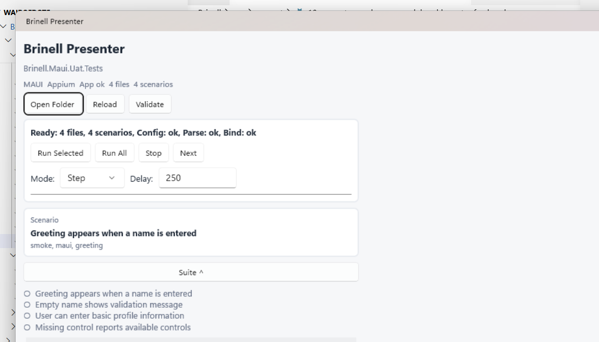

# Brinell Presenter Workspace Model And Layout Refresh

This document captures the next product slice for `Brinell.Presenter`: make the loaded workspace explicit, then refine the UI so it feels like an execution console instead of a raw control stack.

## Current Screenshot

Current Presenter capture after the workspace model and status-icon implementation:



What the current screen already proves:

- Presenter can load a UAT workspace.
- Presenter can validate parse and binding state.
- Presenter can run the selected sample UAT through the sample MAUI app.
- Presenter can show scenarios, steps, and diagnostics.

What should improve:

- The workspace identity is too small compared with the command controls.
- The status line is useful, but it mixes readiness, parse state, bind state, and execution state into one sentence.
- Scenario list and selected scenario details repeat each other.
- Technical panels are present, but they do not yet feel like a deliberate investigation area.
- The left-side laptop layout is right, but the visual grouping needs to become calmer and more scannable.

## Next Product Ideas

The next slice should remove the remaining magic from execution.

Add explicit runtime fields to `uat.config.md`:

```md
| Field | Value |
| --- | --- |
| Target | MAUI |
| Fixture | Appium |
| AppPath | ../../samples/Brinell.Samples.Maui.App/bin/Debug/net10.0-windows10.0.19041.0/win-x64/Brinell.Samples.Maui.App.exe |
| WorkingDirectory | ../../ |
```

Presenter should resolve relative paths from the workspace folder and show config diagnostics before the user presses Run.

Important validation checks:

- `uat.config.md` exists.
- `Target` is supported.
- `Fixture` is present.
- `AppPath` exists for local execution.
- Registered assemblies can be found.
- Fixture type can be created.
- Page objects and control objects are discoverable.
- Command catalog can bind every scenario step.

## Better Layout Direction

The Presenter should keep the narrow form factor because the expected working mode is:

```text
+-------------------------+ +--------------------------------+
| Brinell Presenter       | | Application Under Test          |
| UAT control surface     | | live MAUI app / other AUT later |
+-------------------------+ +--------------------------------+
```

The first viewport should emphasize:

- Workspace and target.
- Current run state.
- Primary execution controls.
- Selected scenario and step progress.

Detailed files, diagnostics, discovery, and command catalog should stay available but collapsed by default.

## Icon Direction

Use icons where they reduce scanning effort, but keep short text labels on primary commands. Presenter is an execution tool, so buttons such as Run, Stop, Validate, and Next should not become icon-only unless the UI also provides tooltips and accessible names.

Preferred icon meanings:

- Open workspace: folder open.
- Reload: refresh.
- Validate: check circle.
- Run selected: play.
- Run all: list play.
- Stop: square.
- Next step: step forward.
- Workspace config: settings.
- Files: file text.
- Diagnostics: alert triangle.
- Discovery: search.
- Command catalog: list checks.

Execution states should use icons first because the same words repeat many times in the step and suite lists:

- `pass`: check circle.
- `run`: spinner or play circle.
- `wait`: clock.
- `fail`: x circle.
- `skip`: minus circle or skip forward.
- `cancel`: ban or stop circle.

Keep an accessible text value behind every status icon. The visible row does not need the repeated `pass`, `run`, or `wait` text; tooltips and automation names should expose the full meaning.

## Proposed MarkUI

```markui
+--- Brinell Presenter --------------------------------------+
| Workspace                                                   |
| Brinell.Maui.Uat.Tests                                      |
| MAUI  Appium  4 files  4 scenarios                          |
| [#1 Open] [#2 Reload] [#3 Validate]                         |
|                                                            |
| +--- Run --------------------------------------------------+ |
| | Ready                                                    | |
| | Parse ok   Bind ok   App ok                              | |
| | [#4 Run Selected] [#5 Run All] [#6 Stop] [#7 Next]       | |
| | Mode <Auto v>   Delay [- 250 +] ms                       | |
| | [=======...]  3 / 7 steps                                | |
| +----------------------------------------------------------+ |
|                                                            |
| [Scenario ^]                                                |
| #8  Greeting appears when a name is entered                 |
| @smoke @maui @greeting                                      |
|                                                            |
| [Steps ^]                                                   |
| #8  Given I am on the Main page                             |
| #8  When I clear Name                                       |
| #9  And I enter "Alice" into Name                           |
| #10 And I tap Greet                                         |
| #10 Then Greeting should contain "Hello, Alice!"            |
|                                                            |
| [Suite ^]                                                   |
| #10 Empty name shows validation message                     |
| #10 User can enter basic profile information                |
| #10 Missing control reports available controls              |
|                                                            |
| [Workspace Config v]                                        |
| [Files v]                                                   |
| [Diagnostics v]                                             |
| [Discovery v]                                               |
| [Command Catalog v]                                         |
+------------------------------------------------------------+
```

Icon legend for the MarkUI block:

- `#1`: folder open.
- `#2`: refresh.
- `#3`: check circle.
- `#4`: play.
- `#5`: list play.
- `#6`: stop square.
- `#7`: step forward.
- `#8`: check circle, passed.
- `#9`: spinner or play circle, running.
- `#10`: clock, waiting.

Additional status icons for failure paths:

- `#11`: x circle, failed.
- `#12`: minus circle, skipped.
- `#13`: ban or stop circle, canceled.

## Layout Notes

Use a small top workspace band instead of a large title area. The user already knows they are in Presenter; the important question is what workspace is loaded.

Use icon plus text for primary actions. Use icon-only buttons only for compact secondary tools once tooltips and automation names exist.

For repeated execution rows, use the status icon only:

```text
#8 Given I am on the Main page
#9 When I tap Save
#10 Then Result should contain "Saved"
#11 Then Error should be visible
```

Split state into badges or short labels:

```text
Parse ok   Bind ok   App ok
```

Keep the selected scenario separate from the suite list. The selected scenario should read like the current task, while the suite list is navigation.

Make the run panel visually stable. The buttons, mode, delay, and progress should not shift when status text changes.

Keep collapsed technical panels at the bottom:

- `Workspace Config`
- `Files`
- `Diagnostics`
- `Discovery`
- `Command Catalog`

## Implementation Slice

Recommended next coding order:

1. Add `AppPath` and `WorkingDirectory` support to `uat.config.md`.
2. Move config validation into a reusable Presenter workspace model.
3. Show a workspace summary line with target, fixture, file count, and scenario count.
4. Replace the duplicated scenario list text with a focused selected-scenario header.
5. Add a collapsed `Workspace Config` panel.
6. Update Presenter UATs to verify explicit app path diagnostics and successful execution.

## Acceptance

The slice is done when:

- Presenter no longer needs to infer the sample app path.
- A missing app path is visible before execution.
- The selected scenario and step progress are easier to scan.
- Presenter UAT still proves the recursive loop: Presenter runs a sample UAT while Presenter itself is tested.
