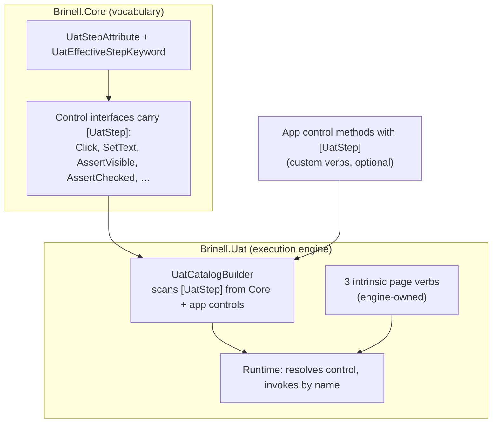

# 04 — Implementation plan

Status: Plan / ready to execute
Date: 2026-09-20
Area: `srcnew/Brinell.Core` (vocabulary), `srcnew/Brinell.Uat` (execution engine)
Builds on: [README.md](README.md), [01-grammar.md](01-grammar.md),
[02-attribute-catalog.md](02-attribute-catalog.md), [03-migration.md](03-migration.md)

The goal is the one the proposal set out and nothing less: **delete every
hand-written phrase table.** The built-in vocabulary becomes attributes at the
point of definition, and `Brinell.Uat` stops owning a catalog of phrases — it
becomes purely the **execution engine** that discovers the vocabulary and runs
it. Moving the attribute types down into `Brinell.Core` is expected and fine.

---

## 0. What the code actually does (verified)

1. **The engine invokes control methods *by name*, via reflection.**
   `InvokeControlMethodAsync(ctx, inv, "control", "SetText", "value")` resolves
   the control from the current page and calls the method by string name. A
   `[UatStep]` attribute therefore only has to supply the *phrase → (keyword,
   method name, value-param, literal)* mapping; it never needs the concrete
   control to be visible to the engine.
   ([UatReflectionRuntime.cs](../../../srcnew/Brinell.Uat/UatReflectionRuntime.cs).)

2. **11 of the 13 control verbs are hand-written methods on `Brinell.Core`
   interfaces** — the natural home for the attribute:

   | Phrase | Keyword | Core interface method | Literal |
   | --- | --- | --- | --- |
   | `I tap {control}` | When | `IClickableControlObject.Click` | — |
   | `I enter {value} into {control}` | When | `IEditableTextControlObject.Enter` | — |
   | `I set {control} to {value}` | When | `IEditableTextControlObject.SetText` | — |
   | `I clear {control}` | When | `IEditableTextControlObject.Clear` | — |
   | `I check {control}` | When | `IToggleControlObject.Check` | — |
   | `I uncheck {control}` | When | `IToggleControlObject.Uncheck` | — |
   | `I select {value} from {control}` | When | `ISelectorControlObject.SelectByText` | — |
   | `{control} should be visible` | Then | `IElementObject.AssertVisible` | `true` |
   | `{control} should not be visible` | Then | `IElementObject.AssertVisible` | `false` |
   | `{control} should be enabled` | Then | `IElementObject.AssertEnabled` | `true` |
   | `{control} should be checked` | Then | `IToggleControlObject.AssertChecked` | `true` |
   | `{control} should be unchecked` | Then | `IToggleControlObject.AssertChecked` | `false` |
   | `{control} should have selected {value}` | Then | `ISelectorControlObject.AssertSelectedText` | — |

3. **The remaining 2 verbs are generated, not on an interface.**
   `AssertText` (`{control} should equal {value}`) and `AssertTextContains`
   (`{control} should contain {value}`) are emitted by the generator from
   `[GenerateComparisons(Comparison.Equals | Comparison.Contains …)]` over a
   `GetTextCore`. MAUI text controls (e.g. `Label<TScope> : ViewBase<TScope>`)
   do **not** implement `ITextControlObject`; they just have the methods by name.
   Because invocation is name-based, we still declare these two phrases in Core
   (see §2.2) and the engine invokes `AssertText`/`AssertTextContains` by name on
   whatever control is resolved — no generator change required.

4. **There are already three drifting copies of the table**, which is the whole
   problem: `UatReflectionRuntime.CreateCommandCatalog()`,
   `UatSpecCommandCatalog.RegisterDefault()`, and a third in
   `Brinell.Presenter/Services/UatWorkspaceService.cs`. All three die here.

5. **The 3 page/global verbs have no control-method home.** `I am on the {page}
   page`, `I should be on the {page} page`, `I should see {text}` operate on the
   **page graph the engine owns**, not on a control. They stay defined **once**
   in the engine as its intrinsic grammar. This is not "the table" — it is the
   execution engine's own three operations, defined a single time.

---

## 1. Target architecture



- **Vocabulary lives in `Brinell.Core`** as `[UatStep]` on control interfaces.
- **`Brinell.Uat` is the execution engine**: it discovers the vocabulary (from
  the Core assembly and from discovered app controls), owns the 3 page verbs,
  resolves controls, and invokes by name. It holds **no phrase list**.
- **The runtime catalog and the spec/binding catalog are the same discovery
  pass** — one with handlers, one without.

---

## 2. The moves

### 2.1 Move the attribute vocabulary to `Brinell.Core`

- [ ] Move `UatEffectiveStepKeyword` from
      [UatModels.cs](../../../srcnew/Brinell.Uat/UatModels.cs) to `Brinell.Core`
      (e.g. `Brinell.Core/Testing/UatEffectiveStepKeyword.cs`, namespace
      `Brinell.Core.Testing`). `UatStepKeyword` (the raw parser keyword) stays in
      `Brinell.Uat` — only the *effective* keyword is part of the vocabulary.
- [ ] Add `UatStepAttribute` in `Brinell.Core` (schema from
      [02-attribute-catalog.md](02-attribute-catalog.md) §1): `(keyword, phrase)`
      ctor, `bool? Literal`, `string? CommandId`, `AllowMultiple = true`,
      `AttributeTargets.Method`.
- [ ] `Brinell.Uat` adds `using Brinell.Core.Testing;` where it references the
      enum. Pure namespace relocation, no behaviour change.

> Only the enum and the new attribute move. `[UatPhrase]`, `[UatName]`,
> `[UatIgnore]`, `UatPhraseClassBase` stay in `Brinell.Uat` — they decorate app
> code, which already references `Brinell.Uat`. Keep the move minimal.

### 2.2 Decorate the Core interfaces

- [ ] Put `[UatStep]` on the 11 interface methods in the §0.2 table
      (`IClickableControlObject`, `IEditableTextControlObject`,
      `IToggleControlObject`, `ISelectorControlObject`, `IElementObject`). Example:

      ```csharp
      [UatStep(UatEffectiveStepKeyword.When, "I set {control} to {value}")]
      TScope SetText(string? text, int? timeoutMs = null);

      [UatStep(UatEffectiveStepKeyword.Then, "{control} should be visible", Literal = true)]
      [UatStep(UatEffectiveStepKeyword.Then, "{control} should not be visible", Literal = false)]
      TScope AssertVisible(bool? expected, string? message = null, int? timeoutMs = null);
      ```

- [ ] Add the two text-value assertions to `ITextControlObject` **as the
      phrase-carrying declarations** and decorate them:

      ```csharp
      [UatStep(UatEffectiveStepKeyword.Then, "{control} should equal {value}")]
      TScope AssertText(string? expected, string? message = null, int? timeoutMs = null);

      [UatStep(UatEffectiveStepKeyword.Then, "{control} should contain {value}")]
      TScope AssertTextContains(string? expected, string? message = null, int? timeoutMs = null);
      ```

      The engine reads the phrase from the interface and invokes by name; a
      concrete control need not implement `ITextControlObject` for this to run
      (MAUI's generated controls have the methods by name). The one existing
      formal implementer, `AndroidText<TScope>`, must provide both — it already
      has `AssertText`; add `AssertTextContains` if missing.

      *Fallback if changing the interface contract is unwanted:* teach the
      generator to emit `[UatStep]` on the `Equals`/`Contains` comparison methods
      it already generates, driven by a comparison→phrase rule. Same result, more
      code. Prefer the interface declaration.

### 2.3 Value-placeholder → parameter binding

The interface methods name their value parameter `text`/`expected`, but the
phrase placeholder is `{value}`. Bind **positionally**: the single non-`{control}`
capture fills the method's first non-optional (or first non-`bool?`) value
parameter, converted with the existing `ConvertArgument`. `Literal` fills the
leading `bool?` parameter for the visible/enabled/checked variants. This needs no
extra attribute surface and covers all 13 verbs; do not add a `Value = "…"`
naming knob speculatively.

---

## 3. The execution engine (`Brinell.Uat`)

### 3.1 `UatCatalogBuilder` — one discovery pass, two projections

```csharp
internal static class UatCatalogBuilder
{
    // Built-in control verbs: [UatStep] on Brinell.Core interfaces.
    // Custom verbs: [UatStep] on discovered app control types.
    public static void RegisterControlVerbs(
        UatCommandCatalog catalog,
        IEnumerable<Type> stepTypes,           // Core interfaces + discovered control types
        Func<UatStepBinding, UatCommandHandler?>? handlerFactory);
}
```

- The **built-in** step types are `typeof(IControlObject<>).Assembly.GetTypes()`
  filtered to `[UatStep]`-bearing methods — a *scan of `Brinell.Core`*, not a
  list. The **custom** step types are the discovered app control types.
- `handlerFactory` builds the handler the runtime builds today: resolve
  `{control}` → invoke `binding.MethodName` by name with the value capture and/or
  `binding.Literal` (§2.3).
- **Dedup on `(keyword, phrase)`** exactly as `RegisterRootPhrases` already does,
  so a verb inherited through several interfaces registers once.

### 3.2 `CreateCommandCatalog()` shrinks to the engine's own grammar

```csharp
public UatCommandCatalog CreateCommandCatalog()
{
    var catalog = new UatCommandCatalog();

    // The engine's three intrinsic page-graph verbs — defined once, here.
    catalog.Register(Given, "I am on the {page} page",        "Builtin.Page.Open",        handler: OpenPageAsync);
    catalog.Register(Then,  "I should be on the {page} page", "Builtin.Page.AssertOpen",  handler: AssertPageAsync);
    catalog.Register(Then,  "I should see {text}",            "Builtin.Page.AssertTextVisible", handler: AssertAnyControlTextContainsAsync);

    // Everything control-shaped comes from [UatStep] discovery (Core + app controls).
    UatCatalogBuilder.RegisterControlVerbs(catalog, BuiltinAndDiscoveredControlTypes(), ControlHandlerFactory);

    // Unchanged: app-authored phrases.
    RegisterPhraseClassPhrases(catalog, _phraseClasses, …);
    RegisterRootPhrases(catalog);
    return catalog;
}
```

The 15 `catalog.Register(...)` control lines are gone; only the 3 engine verbs
and the discovery call remain.

### 3.3 The spec/binding catalog stops being a second table

- [ ] Replace the body of `UatSpecCommandCatalog.RegisterDefault()` with: the
      same 3 page verbs (phrases only, `Spec.Page.*` ids) plus
      `UatCatalogBuilder.RegisterControlVerbs(catalog, BuiltinControlStepTypes(),
      handlerFactory: null)` scanning only the `Brinell.Core` interfaces.
- The runtime and spec catalogs now register an identical `(keyword, phrase)`
  set by construction — a test asserts it (§5).

### 3.4 The Presenter's third copy

- [ ] Replace the hand-written `catalog.Register(...)` block in
      `Brinell.Presenter/Services/UatWorkspaceService.cs` with
      `UatSpecCommandCatalog.RegisterDefault(catalog)` (or the builder directly).
      No third table survives.

---

## 4. Custom app control verbs (shipped, not deferred)

Because discovery already scans the app's control types, a team adds a verb by
writing it once, next to the method:

```csharp
[UatStep(UatEffectiveStepKeyword.When, "I long-press {control}")]
public void LongPress() { … }
```

No engine edit, no id, no second table. This falls out of §3.1 for free.

---

## 5. Tests (in `Brinell.Uat.Tests`)

- [ ] **Snapshot (oracle):** before any change, snapshot the current runtime and
      spec catalogs as ordered `(keyword, phrase, commandId)` triples — the
      behaviour-identical oracle for every later stage.
- [ ] **Discovered-equals-snapshot:** after §2–§3, the discovered runtime catalog
      equals the snapshot. Where a test pins a specific id, set it via
      `[UatStep(..., CommandId = "Builtin.Control.SetText")]`.
- [ ] **Two-projections-agree:** runtime and spec catalogs register the same
      `(keyword, phrase)` set.
- [ ] **Core is the source:** scanning `typeof(IControlObject<>).Assembly` for
      `[UatStep]` finds all 13 built-in control phrases (guards a verb losing its
      attribute).
- [ ] **Custom verb discovery:** a fake control type with
      `[UatStep("I long-press {control}")]` appears in the catalog and invokes.
- [ ] **End-to-end:** one MAUI UAT scenario (Todo "needs a title") on the
      smallest UI tier proves the discovered catalog drives a real app — not the
      full suite (per AGENTS.md).

---

## 6. Staged order (each stage green before the next)

1. **Stage 0** — add the snapshot oracle test. No production change.
2. **Stage 1** — move `UatEffectiveStepKeyword` + add `UatStepAttribute` to
   `Brinell.Core` (§2.1). Build green.
3. **Stage 2** — decorate the Core interfaces (§2.2). Add `AssertText`/
   `AssertTextContains` to `ITextControlObject`; fix `AndroidText`. Build green.
4. **Stage 3** — add `UatCatalogBuilder` (§3.1) and switch the runtime catalog
   (§3.2). Snapshot test green.
5. **Stage 4** — switch the spec catalog (§3.3) and the Presenter copy (§3.4).
   Two-projections test green.
6. **Stage 5** — custom-verb test (§4) and the end-to-end scenario (§5).
7. **Stage 6** — record the decision (§8).

---

## 7. Risks and mitigations

| Risk | Mitigation |
| --- | --- |
| Adding members to `ITextControlObject` breaks a non-generated implementer | Only `AndroidText` implements it; give it both methods. Per user preference, no back-compat shim. Fallback: generator-emitted `[UatStep]` instead of the interface change. |
| Value placeholder name (`{value}`) ≠ parameter name (`expected`) | Bind positionally (§2.3): the single non-`{control}` capture fills the first value parameter. Covers all 13 verbs. |
| Command-id churn breaks a test pinning `Builtin.*`/`Spec.*` | Default id = `Type.Method`; where a test pins the old string, set `CommandId` on the attribute. Snapshot catches drift. |
| A verb inherited through several interfaces double-registers | Dedup on `(keyword, phrase)`, same guard `RegisterRootPhrases` uses. |
| Literal variants (`visible`/`not visible`) bind ambiguously | Specificity ranking already disambiguates; existing binder tests cover it. |
| Trimming/AOT reflects over attributed interface methods | Same trust boundary as today's property reflection; annotate control interfaces with `[DynamicallyAccessedMembers]` only if a trimmed head is targeted. |
| `Brinell.Core` gains a testing concept | One attribute + one enum, both pure metadata with no dependencies — appropriate for the shared contract layer (contracts live in Core; that is why the platform-neutral rule exists). |

---

## 8. Decision to record (`.docs/`, per the decision-record skill)

> The built-in UAT step vocabulary is declared by `[UatStep]` attributes on
> `Brinell.Core` control-interface methods and discovered into the catalog by the
> `Brinell.Uat` execution engine. There is **no** hand-written phrase table:
> `UatReflectionRuntime`, `UatSpecCommandCatalog`, and the Presenter all project
> from the same attribute scan. The engine owns only the three page-graph verbs
> (`{page}`, `I should see`). Custom control verbs are `[UatStep]` on app control
> methods; app/root phrases use `[UatPhrase]`. Control invocation is name-based
> reflection, so the engine references no platform control assembly.

That closes the door on re-growing a hand-written phrase table.

---

## 9. Files touched

| File | Stage | Change |
| --- | --- | --- |
| `srcnew/Brinell.Core/Testing/UatEffectiveStepKeyword.cs` | 1 | moved from `UatModels.cs` |
| `srcnew/Brinell.Core/Testing/UatStepAttribute.cs` | 1 | new attribute |
| `srcnew/Brinell.Core/Interfaces/*.cs` | 2 | `[UatStep]` on the 13 control verbs; +2 members on `ITextControlObject` |
| `srcnew/Brinell.NativeAndroid/Controls/Display/AndroidText.cs` | 2 | add `AssertTextContains` if missing |
| `srcnew/Brinell.Uat/UatModels.cs` | 1 | remove the moved enum; `using Brinell.Core.Testing;` |
| `srcnew/Brinell.Uat/UatCatalogBuilder.cs` | 3 | new — the discovery pass |
| `srcnew/Brinell.Uat/UatReflectionRuntime.cs` | 3 | `CreateCommandCatalog` = 3 page verbs + discovery |
| `srcnew/Brinell.Uat/UatSpecCommandCatalog.cs` | 4 | body → 3 page verbs + discovery (no handlers) |
| `srcnew/Brinell.Presenter/Services/UatWorkspaceService.cs` | 4 | use the shared projection, delete the third table |
| `testsnew/Brinell.Uat.Tests/*` | 0,3,4,5 | snapshot, discovered-equals, two-projections, Core-is-source, custom verb |
| `.docs/` | 6 | decision record |

---

## 10. Verification (from the Brinell root)

```powershell
dotnet build srcnew\Brinell.sln -v:minimal /nr:false
dotnet test testsnew\Brinell.Uat.Tests\Brinell.Uat.Tests.csproj -v:minimal /nr:false
```

Then one end-to-end scenario on the smallest UI tier (Stage 5), per AGENTS.md —
not the full UI suite.
