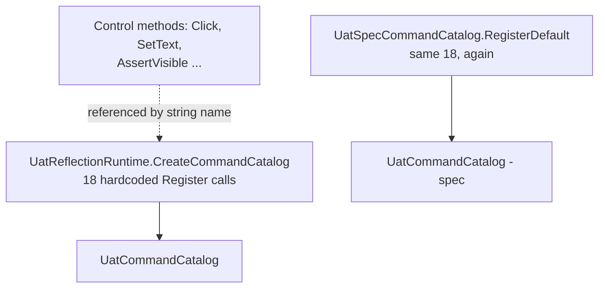
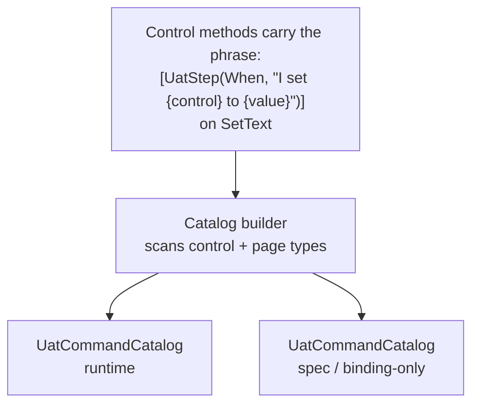

# Attribute-driven UAT catalog + a formal Gherkin language

Status: Proposal / discussion draft
Date: 2026-09-20
Area: `srcnew/Brinell.Uat`
Related:

- [Rethinking UAT](../rethinking-uat.md)
- [UAT phrases and flows](../../../docs/guides/uat-phrases-and-flows.md)
- Current engine: [UatReflectionRuntime.cs](../../../srcnew/Brinell.Uat/UatReflectionRuntime.cs),
  [UatSpecCommandCatalog.cs](../../../srcnew/Brinell.Uat/UatSpecCommandCatalog.cs)

---

## Why this folder exists

Today the UAT step vocabulary lives in **two hand-written tables** that must be
kept in lockstep by hand:

- `UatReflectionRuntime.CreateCommandCatalog()` — the *runtime* table: 18
  `catalog.Register(...)` calls, each wiring a phrase like `I set {control} to
  {value}` to a control-method call (`SetText`, `AssertVisible`, ...).
- `UatSpecCommandCatalog.RegisterDefault()` — the *spec/binding-only* table: the
  same 18 phrases again, wired to string command ids for format tests.

Every new interaction verb means editing both tables, matching the phrase text
character for character, and inventing a command id. The phrase text, the
keyword (`When`/`Then`), and the target method are all decided in one central
file that knows about every control — the opposite of where that knowledge
belongs.

This proposal does two things the request asked for:

1. **Formalise the Gherkin language** the parser already accepts, as an explicit
   grammar, so the "language" is a spec and not an accident of the parser
   ([01-grammar.md](01-grammar.md)).
2. **Move the phrase table onto attributes** on the control methods and page
   members themselves, so the catalog is *discovered*, not *typed twice*
   ([02-attribute-catalog.md](02-attribute-catalog.md)).

[03-migration.md](03-migration.md) is the staged rollout that keeps every
existing `.uat.md` green while the tables are deleted.

---

## The idea in one picture

Today:

Proposed:

One source of truth (the attribute next to the method), two catalogs projected
from it. The keyword and the phrase text are *parsed from the attribute*, and
the user-facing control/page names keep coming from `[UatName]` /
`UatNameInference` — now formalised as part of the same discovery pass.

---

## What changes, concretely

| Concern | Today | Proposed |
| --- | --- | --- |
| Built-in phrase list | 18 lines in `CreateCommandCatalog`, 18 more in `RegisterDefault` | `[UatStep]` attributes on the control methods; zero central lines |
| Keyword (`When`/`Then`) | Passed as the first arg of each `Register` | First arg of the `[UatStep]` attribute, parsed at discovery |
| `{control}` binding | Hardcoded string `"control"` + method name `"SetText"` | Implicit: the receiver is the control; the method *is* the target |
| Literal variants (visible / not visible) | Two `Register` calls with `literalArgument: true/false` | Two `[UatStep]` attributes, each with `Literal = true/false` |
| Custom user phrases | `[UatPhrase]` on root/phrase-class methods (already attribute-driven) | Unchanged — folded into the same discovery model |
| Control / page names | `[UatName]` or inference | Unchanged — documented as part of the grammar's *lexicon* |

Nothing in the `.uat.md` files changes. The phrases a scenario author writes are
identical; only *where the phrase is declared in code* moves.

---

## Read next

1. [01-grammar.md](01-grammar.md) — the Gherkin dialect as EBNF, plus the phrase
   mini-language and how a step is matched.
2. [02-attribute-catalog.md](02-attribute-catalog.md) — the attribute schema,
   the discovery algorithm, worked examples, and how both catalogs are built.
3. [03-migration.md](03-migration.md) — staged rollout, back-compat, tests, risks.
