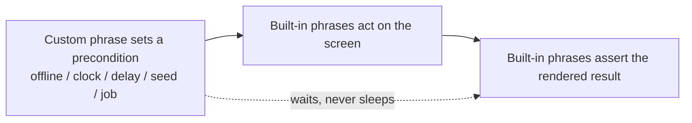

# 04 — Other complex tests

The remaining "complex" needs share the same shape: a **precondition the screen
cannot set** (a dropped network, a pinned clock, a slow server, a table of
inputs), driven by a custom phrase, then a **screen assertion** with built-in
phrases. This doc collects the ones that come up most.

---

## Offline and back online

The app cannot be made to lose its network by tapping a control. Brinell's
[NetworkStateFile](../../../srcnew/Brinell.Mocking/NetworkStateFile.cs) is a file
holding `online` / `offline` that a test/debug build of the app reads instead of
the real connectivity. The fixture creates it and tells the app its path; a phrase
flips it mid-scenario (`TOD.08.8`).

```gherkin
Given I am on the Todo List page
When I go offline
Then Last Sync should contain "Offline"
And Sync should not be enabled
When I create the todo "Write later"
And I go online
And I tap Sync
Then that todo should no longer be pending
```

```csharp
[UatPhraseClass]
public sealed class NetworkPhrases : UatPhraseClassBase
{
    private readonly NetworkStateFile _network;
    public NetworkPhrases(NetworkStateFile network) => _network = network;

    [UatPhrase(UatEffectiveStepKeyword.When, "I go offline")]
    public void GoOffline() => _network.SetOffline();

    [UatPhrase(UatEffectiveStepKeyword.When, "I go online")]
    public void GoOnline() => _network.SetOnline();
}
```

The assertions (`Offline`, `Sync should not be enabled`, pending marker gone) are
all read from controls — the flip is the only out-of-band step.

---

## A pinned clock

"Overdue" depends on *today* (`TOD.05.2`, `TOD.05.3`). A test that relies on the
real clock passes or fails by the calendar. The fixture launches the app with a
fixed now (`LaunchSettings.FixedNow`, an environment variable the app reads in a
test build — the Todo host does exactly this). The clock is a **launch-time**
fact, so it is set by the fixture/tag, not usually flipped mid-scenario.

```gherkin
# Requires: FixedNow=2026-09-20
Given I am on the Todo List page
And the server has an overdue todo "Tax return" due "2026-09-10"
When I tap Sync
Then the "Tax return" row should show Overdue
```

If a scenario needs the clock to *move* (e.g. a todo becomes overdue while the
app is open), expose an `advance the clock to {date}` phrase over the same test
clock — but prefer pinning at launch; a moving clock is a sharper tool than most
scenarios need.

---

## Slow servers and async waits (no sleeps)

A slow backend must show Loading, then content (`TOD.08.3`). Stub the delay, then
**wait for the state**, never for the delay's duration.

```gherkin
Given the server takes 3 seconds to answer the next sync
When I tap Sync
Then State should contain "Loading"
And I should see "Buy milk"
```

```csharp
[UatPhrase(UatEffectiveStepKeyword.Given, "the server takes {seconds} seconds to answer the next sync")]
public void StubDelay(int seconds)
    // AtPriority(1) makes this delayed answer win over the default list stub for the next sync;
    // mirrors SyncTests/ScenarioJourneyTests, which use the same AtPriority + WithDelay shape.
    => _backend.Get("/api/todos")
        .AtPriority(1)
        .WithDelay(TimeSpan.FromSeconds(seconds))
        .ReturnsJson(_world.CurrentServerList());
```

`And I should see "Buy milk"` is a built-in assertion that polls until the content
arrives. The 3 seconds is the *stub's* behaviour, not a `Thread.Sleep` in the
test — the assertion's own wait absorbs it.

---

## Data-driven scenarios (Scenario Outline)

When the same flow must run over many inputs — title validation boundaries, each
status in the cycle — do not copy the scenario. Use a **Scenario Outline** with an
`### Examples` table; the parser expands one scenario per row and substitutes
`<column>` placeholders (see
[docs/guides/uat-template-guide.md](../../../docs/guides/uat-template-guide.md)).

```gherkin
## Scenario Outline: Title validation

Given I am on the Todo List page
When I tap Add
And I set Title to "<title>"
And I tap Save
Then Title Error should contain "<error>"

### Examples

| title | error |
| --- | --- |
|                  | Title is required |
| (101 characters) | Title is too long |
```

Keep the *exhaustive* matrix (every boundary, every permutation) in a `[Theory]`
**unit** test; a Scenario Outline is for the handful of rows that must be seen to
render through the screen, not for re-checking a rule table slowly.

---

## Concurrency and conflict

Two edits to one todo where the newer `UpdatedAt` wins (`TOD.07.6`) is a **merge
rule** — a unit test's job. UAT's contribution is narrow: seed the conflicting
server edit, sync, and assert the *rendered* outcome (the resolved value on
screen, or a conflict banner).

```gherkin
Given I open the todo "Budget"
And the server has a newer edit of "Budget" titled "Budget v2"
When I go back
And I tap Sync
And I open the todo "Budget v2"
Then Title should contain "Budget v2"
```

The seed is a backend phrase (see [01-multi-user.md](01-multi-user.md)); the
resolution logic is not re-tested here, only its visible result.

---

## Background jobs

Where a platform runs work outside the app (Android WorkManager, iOS BGTasks), a
sync may be triggered by a job rather than a tap. On a DevFlow-capable head these
can be listed and run (`maui_jobs_list` / `maui_jobs_run`), wrapped as a phrase:

```gherkin
When the background sync job runs
Then I should see "Review PR"
```

Treat this as advanced and platform-specific; most sync UATs drive `I tap Sync`
directly, which is deterministic on every head.

---

## Artifacts as evidence, not as the assertion

A scenario can be marked to capture a screenshot per screen (`Evidence:
screenshot` in metadata, `ScreenshotOnFailure` in the config). Use these as
**evidence** for a human reviewer, never as the pass/fail check — pixel diffing is
brittle across DPI and theme (this is the guidance in
[../rethinking-uat.md](../rethinking-uat.md) §2). The assertion is still a control
read; the screenshot just proves what it looked like.

---

## The pattern under all of these



- Out-of-band setup and out-of-band checks are **custom phrases**.
- Acting and asserting on the screen are **built-in phrases**.
- Every wait is for a concrete state — a request, a control, a value — not a clock.
- If nothing on the screen is asserted, it is not a UAT; push it down a tier.
