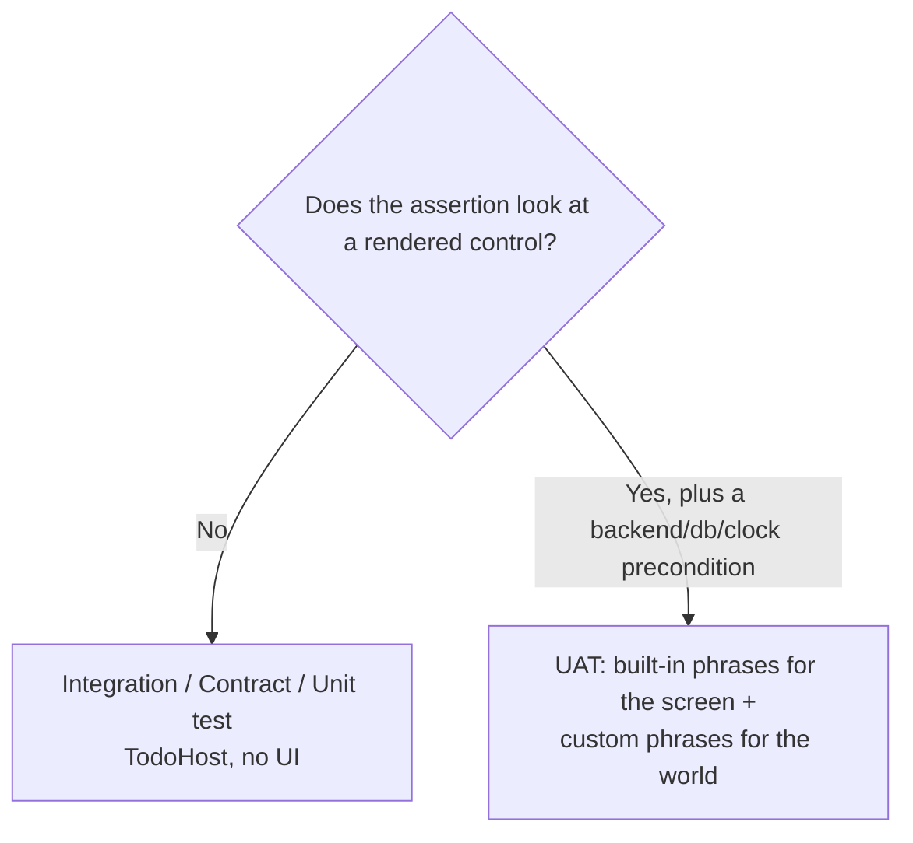

# UAT for complex things

Status: Guidance / discussion draft
Date: 2026-09-20
Area: `srcnew/Brinell.Uat`, `srcnew/Brinell.Mocking`

Built-in phrases drive one screen and one control at a time — tap, enter,
assert visible. Real systems are more than that: two users touching the same
data, a backend that must be *called correctly*, a database that must actually
hold what the screen implies, a clock that must be pinned, a network that drops.

None of that fits the 18 built-in phrases, and it should not. This folder shows
how to reach it **without** abandoning the readable-Markdown model: every complex
check is a **custom phrase** ([UatPhrase] / [UatPhraseClass]) that does the hard
part in C# and reports pass/fail, so the scenario stays a list of sentences.

---

## The one principle

> **Drive through the UI; verify out of band.**

A UAT step either *acts on the screen* (built-in phrases) or *reaches past the
screen to set up or check the world* (custom phrases over the backend, the
database, the clock, the network). The two mix freely in one scenario:

```gherkin
Given the server has a todo "Buy milk" for user "alice"   # custom: seed backend
When I am on the Todo List page                            # built-in-ish: navigate
And I tap Sync                                              # built-in
Then a GET to "/api/todos" should have been sent           # custom: assert the call
And I should see "Buy milk"                                 # built-in
And the database should hold 1 todo                        # custom: assert persistence
```

The custom phrases are backed by the infrastructure Brinell already ships:

| Need | Backing type | Doc |
| --- | --- | --- |
| Simulate a second user / seed the backend | [MockApiServer](../../../srcnew/Brinell.Mocking/MockApiServer.cs) | [01-multi-user.md](01-multi-user.md) |
| Assert the app called the service correctly | [MockApiServer.WaitForRequest](../../../srcnew/Brinell.Mocking/MockApiServer.cs), [RecordedRequest](../../../srcnew/Brinell.Mocking/RecordedRequest.cs) | [02-service-validations.md](02-service-validations.md) |
| Assert what was actually persisted | the app's `DatabasePath`, a read-only connection | [03-database-checks.md](03-database-checks.md) |
| Offline, time, concurrency, retries, data-driven, artifacts | [NetworkStateFile](../../../srcnew/Brinell.Mocking/NetworkStateFile.cs), pinned clock, Scenario Outline | [04-other-complex-tests.md](04-other-complex-tests.md) |

---

## Before you write a UAT for it: is it the right tier?

The Todo backbone ([samples/Todo/journeys.md](../../../samples/Todo/journeys.md))
puts each behaviour at the **lowest tier that gives confidence**. Most "complex"
logic — merge rules, validation matrices, sync ordering, idempotence, conflict
resolution — belongs in **Unit** or **Integration** tests, which are faster and
more direct than driving a screen. The
[integration host](../../../samples/Todo/tests/Brinell.Samples.Todo.IntegrationTests/TodoHost.cs)
exercises the real composition, real SQLite and a WireMock backend with **no UI**
and is the right home for a wire-order or tombstone check.

Lift a complex behaviour to UAT only when **the screen is part of what is under
test** — the pending marker renders, the Error state with Retry appears, the two
users' changes are *seen* to reconcile on the page. If the assertion never looks
at a control, it is an integration test wearing a UAT costume; write it as the
former.



---

## How the custom phrases get their power

A `[UatPhraseClass]` is resolved from the scenario's **DI scope**, so it can take
the very services the app uses — or test-only helpers — in its constructor. This
is the hook that lets a sentence reach the backend or the database:

```csharp
[UatPhraseClass]
public sealed class TodoWorldPhrases : UatPhraseClassBase
{
    private readonly MockApiServer _backend;      // the fake server the app talks to
    private readonly TodoWorld _world;            // per-scenario state (users, db path)

    public TodoWorldPhrases(MockApiServer backend, TodoWorld world)
    {
        _backend = backend;
        _world = world;
    }

    [UatPhrase(UatEffectiveStepKeyword.Given, "the server has a todo {title} for user {user}")]
    public void SeedServerTodo(string title, string user) => _world.SeedServerTodo(user, title);
}
```

A phrase method may also take `UatExecutionContext`, `CancellationToken`,
`TestSettings`, or a typed `[TestSettingsSection]` class — see
[docs/guides/uat-phrases-and-flows.md](../../../docs/guides/uat-phrases-and-flows.md#custom-root-phrases).
Each topic doc below shows the phrase *and* the C# that backs it.

---

## Read next

1. [01-multi-user.md](01-multi-user.md) — two users over one app, via the backend.
2. [02-service-validations.md](02-service-validations.md) — assert the calls, headers, bodies, and error handling.
3. [03-database-checks.md](03-database-checks.md) — assert what was persisted.
4. [04-other-complex-tests.md](04-other-complex-tests.md) — offline, time, concurrency, retries, data-driven, artifacts.
