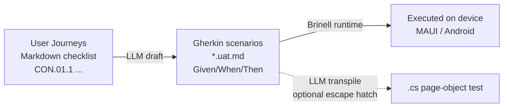
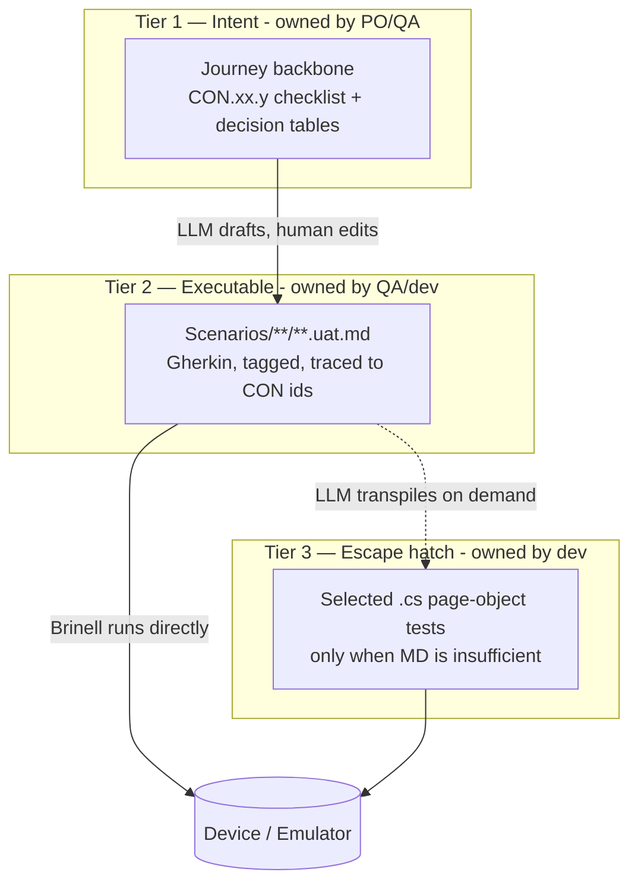

# Rethinking UAT: From User Journeys to Executable Tests

Status: Discussion Draft
Date: 2026-09-20
Target: Construction (.NET MAUI) — QA, Engineering, Product
Related:

- [Specification formats discussion](../testpyramide/specification-formats-discussion.md)
- [Test pyramid discussion](../testpyramide/test-pyramid-discussion.md)
- [Contacts journey backbone](../testpyramide/Contacts/03-journey-backbone.md)
- [Brinell UAT template guide](../../Brinell/docs/guides/uat-template-guide.md)

---

## 0. TL;DR

Your instinct in step 5 is right, but with one correction: **we already have a
Markdown-executed UAT engine** (Brinell parses `*.uat.md` scenarios and runs
them — no `.cs` needed). So the interesting question is not "MD or code?" but
**"where does the LLM add leverage, and what is the source of truth?"**

Recommended pipeline:



- **Source of truth = the journeys + the `*.uat.md` Gherkin.** Both are
  human-readable, both are versioned, both are reviewable by non-developers.
- **LLM step 1** (Journeys → Gherkin): high value, drafts the tedious part.
- **LLM step 2** (Gherkin → `.cs`): keep as an *optional* escape hatch, not the
  default. Brinell already executes the Markdown directly, so transpiling to
  `.cs` is only needed when a scenario outgrows the phrase vocabulary.

The rest of this doc explains why.

---

## 1. What we already have (don't rebuild it)

Before designing something new, three assets already exist and constrain the
design:

1. **Journey backbones** — e.g. [Contacts CON.01–CON.14](../testpyramide/Contacts/03-journey-backbone.md),
   107 numbered subtasks with decision tables. These are the *stakeholder-facing*
   contract of what the app does.
2. **The 3-tier specification** — Journeys (Tier 1) → Rule Tables (Tier 2) →
   Gherkin (Tier 3), already argued in the
   [specification formats discussion](../testpyramide/specification-formats-discussion.md).
3. **Brinell's Markdown UAT runner** — `*.uat.md` files with
   `Given/When/Then` steps are parsed and executed against the running app via
   page objects, with screenshots on failure, tags, scenario outlines, and
   example tables. See the [UAT template guide](../../Brinell/docs/guides/uat-template-guide.md).

**Implication:** idea #4 ("test cases written in MD and then executed") is not a
future wish — it is the current Brinell design. The rethink is about the
*authoring pipeline that feeds it*, not the runner.

---

## 2. Evaluating your five ideas

### #1 — Start from User Journeys ✅ keep as the root

Journeys are the right entry point: they are short (5–10 min to read),
user-centric, and already pinned per module (`CON.*`, `PRJ.*`). They are the
*intent*. Everything downstream should be traceable back to a journey ID.

**Weakness:** journeys are not directly executable — they describe *what*, not
*with which data / which assertion*. That gap is exactly what the next step
fills.

### #2 — Gherkin ✅ keep as the executable middle layer

Gherkin (`Given/When/Then`) is the sweet spot between prose and code:

- Concrete enough to execute (Brinell already runs it).
- Readable enough for a Product Owner to sign off.
- Traceable: one journey → 1–2 key scenarios (happy path + critical edge).

**Weakness:** combinatorial explosion if you write a scenario per permutation.
Mitigation: push exhaustive permutations *down* into Tier-2 rule tables + unit
tests, and keep Gherkin for the few flows that need shared clarity. This is the
existing pyramid guidance — reuse it, don't fight it.

### #3 — "Other ideas?" — the honest menu

| Approach | What it is | Verdict for us |
|---|---|---|
| **Decision / rule tables** | Compact input→outcome matrices | ✅ Already Tier 2. Best for rights, validation, state. Not a *UAT* format — it belongs in unit tests. |
| **Keyword-driven (Robot Framework style)** | Steps map to reusable keywords | ➖ Brinell phrases already give us this; no need for a second engine. |
| **Screenshot / visual snapshot** | Golden-image diffing | ➖ Brittle on MAUI across DPI/themes; use targeted screenshots as *evidence*, not the assertion. |
| **Property-based / model-based** | Generate flows from a state model | 🔬 Powerful for async screen states (Loading/Empty/Error), but high skill cost. Park it. |
| **Pure exploratory + charter** | Human-led, time-boxed sessions | ✅ Keep for genuinely new features; automation can't replace discovery. |

Nothing here beats "Journeys → Gherkin" as the *backbone*. They are
complements, not replacements.

### #4 — MD test cases, executed ✅ already real via Brinell

Two ways to "execute Markdown". This is the core architectural fork:

**Model A — Interpret MD at runtime (current Brinell).**
The `*.uat.md` file *is* the test. A parser reads steps and dispatches to page
objects. No generated code.

**Model B — Transpile MD → `.cs` (your idea #5).**
An LLM (or a generator) converts the Markdown into a real `[Test]` method with
page-object calls, which is then compiled and run.

They are not equivalent — see §3.

### #5 — Journeys → Gherkin → code, two LLM steps 🟡 right shape, wrong default

The pipeline shape is correct. The correction: **don't make "→ code" the
default output.** Because Brinell already executes the Gherkin, generating `.cs`
adds a compile step, a second artifact that can drift from the Markdown, and a
review burden — for no runtime benefit in the common case.

Make `.cs` generation the **escape hatch**, used only when:

- a scenario needs logic the phrase vocabulary can't express, or
- you want to debug/step through a flow in the IDE, or
- the flow becomes a permanent regression test worth "freezing" into code.

---

## 3. The key decision: interpret vs. transpile

| Dimension | Model A: Interpret MD (Brinell today) | Model B: LLM transpile MD → `.cs` |
|---|---|---|
| **Source of truth** | The `.uat.md` file (single artifact) | Ambiguous: MD *or* the generated `.cs`? Drift risk. |
| **Who can author** | PO / QA / dev (plain Markdown) | Author in MD, but the runnable thing is code |
| **Determinism** | Fully deterministic (parser) | LLM output varies run-to-run unless pinned & committed |
| **Review** | Review the MD once | Review MD *and* diff the generated code |
| **Debuggability** | Runtime trace + screenshots | Full IDE breakpoints, stack traces |
| **New capability** | Add a phrase → all scenarios benefit | Regenerate affected files |
| **Failure blast radius** | Bad phrase = clear parser error | Bad generation = subtle wrong test that passes |
| **CI cost** | Parse + run | LLM call (non-hermetic!) or pre-committed codegen |

### The trap in "MD → .cs by an LLM"

The seductive part of idea #5 is "the MD is translated to `.cs` by an LLM."
The danger is **non-determinism and silent drift**:

- If the LLM runs *in CI*, tests are no longer reproducible and you've coupled
  your pipeline to a model endpoint. ❌ Do not do this.
- If the LLM runs *at authoring time* and you **commit** the `.cs`, then the
  `.cs` — not the MD — is what actually runs. Now you have two artifacts that
  can disagree, and a reviewer must trust that the code still matches the intent
  of the Markdown. A wrong-but-green test is the worst outcome in testing.

**Conclusion:** prefer Model A (deterministic interpretation) as the default.
Use Model B only as a committed, human-reviewed escape hatch — and when you do,
treat the generated `.cs` as the source of truth for *that* scenario and delete
its `.uat.md`, so there's never two masters.

---

## 4. Recommended design

### 4.1 Artifacts and ownership



### 4.2 The two LLM steps — scoped

**LLM Step 1 — Journeys → Gherkin (high leverage, keep).**
Feed a journey (e.g. `CON.03 Multi-Term Search` plus its rule table) and have
the LLM draft `*.uat.md` scenarios. Human edits and commits. The LLM is a
*drafting accelerator*, not the runtime.

Guardrails:
- Every generated scenario must carry a `Traces: CON.03.x` metadata field.
- The LLM may only use phrases from the Brinell vocabulary
  ([uat-phrases-and-flows.md](../../Brinell/docs/guides/uat-phrases-and-flows.md));
  if it needs a new phrase, that's a signal to add a phrase, not to hand-roll code.
- Prefer one happy path + the critical edge per journey; push permutations to
  Tier-2 tables/unit tests.

**LLM Step 2 — Gherkin → `.cs` (optional, on demand).**
Only when a scenario can't be expressed in phrases. The LLM emits a page-object
test; a human reviews it like any code; it's committed; the corresponding
`.uat.md` is removed to avoid dual masters.

### 4.3 Traceability

The whole point is a chain you can audit:

```
CON.03.2  (journey)  →  search-partial-term.uat.md  (executable)  →  green/red on device
```

A coverage report can then answer: *which journey subtasks have an executable
scenario, and which are still manual?* That's the real deliverable — not "we
have tests," but "we can see, per journey, what is proven."

---

## 5. Why not just generate everything to code?

Because the value of UAT is **stakeholder trust**, and trust comes from a
reviewable artifact in language the stakeholder understands. Generated `.cs` is
not that artifact. Markdown Gherkin is. Generating code by default:

- moves the source of truth into a form POs can't review,
- introduces non-determinism if the generator is in the loop,
- and doubles the maintenance surface.

Keep the human-readable, deterministic Markdown as the master. Use the LLM to
*author faster*, and only fall back to code for the rare scenario that earns it.

---

## 6. Open questions

- **Phrase vocabulary coverage** — how many Construction journeys are already
  expressible with existing Brinell phrases? A gap analysis would tell us how
  often the `.cs` escape hatch is really needed.
- **Where do Tier-2 rule tables execute?** — likely unit/integration, not UAT.
  Confirm the boundary so UAT stays thin.
- **Data setup** — do scenarios seed via WireMock / fixtures, or against a real
  backend? (See the
  [WireMock vs real backend proposal](../uitests/brinell-wiremock-and-real-backend-proposal.md).)
- **Coverage reporting** — do we build the journey→scenario traceability report
  as a Brinell artifact?

---

## 7. Recommendation in one line

Keep **User Journeys** as intent and **Markdown Gherkin** as the executable,
deterministic source of truth that Brinell runs directly; use an **LLM to draft
the Gherkin** from journeys; and treat **LLM-generated `.cs` as a reviewed
escape hatch**, never as the default and never inside CI.
