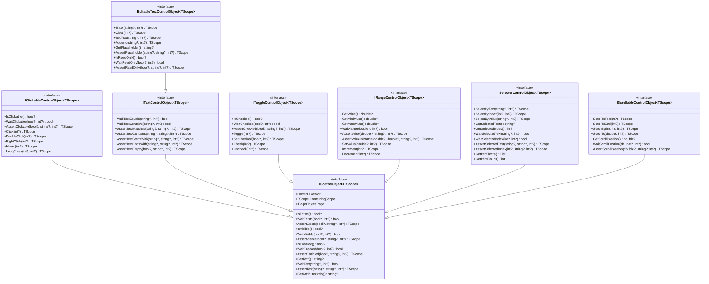
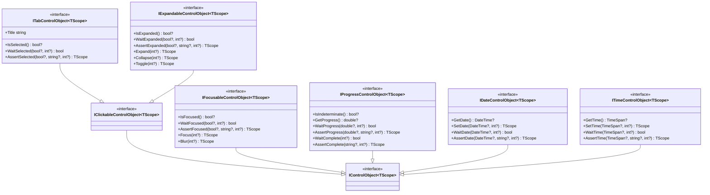
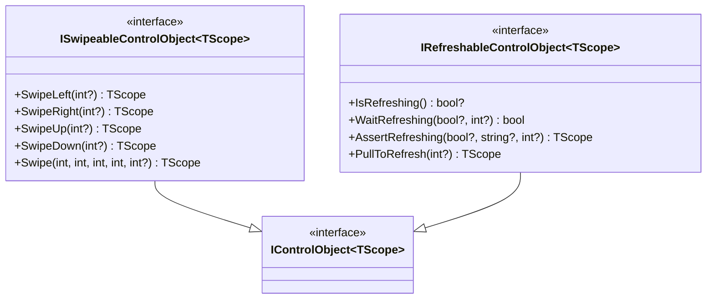

# Design Document: Interface Hierarchy Consolidation

## Overview

This design consolidates the Brinell interface hierarchy based on analysis of:
- Current interfaces in `srcnew/Brinell.Core/Interfaces/` (8 interfaces)
- Legacy interfaces in `src/Brinell.Core/ControlObject6/Interfaces/` (29 interfaces)
- MAUI control implementations in `srcnew/Brinell.Maui/Controls/`
- Framework patterns (TScope fluent chaining, Is/Wait/Assert pattern)

The goal is to establish a comprehensive, consistent interface design that supports both existing MAUI implementations and future Blazor/WPF/WinForms platforms.

## Steering Document Alignment

### Technical Standards (tech.str.spx.md)

| Standard | How Design Follows |
|----------|-------------------|
| TScope generic pattern | All interfaces use `IXxxControlObject<TScope>` |
| Is/Wait/Assert pattern | Every state has Is*/Wait*/Assert* triplet |
| Nullable skip pattern | All Wait/Assert accept nullable expected |
| Fluent chaining | Action/Assert methods return TScope |
| Interface-based Core | All interfaces in `Brinell.Core.Interfaces` namespace |

### Project Structure (structure.str.spx.md)

| Convention | How Design Follows |
|------------|-------------------|
| Interface file naming | `I{ControlType}ControlObject.cs` |
| Namespace | `Brinell.Core.Interfaces` |
| Interface segregation | One capability per interface |
| Single responsibility | Each interface has focused purpose |

## Code Reuse Analysis

### Existing Components to Leverage

- **IControlObject<TScope>**: Current base interface, minimal changes needed
- **IClickableControlObject<TScope>**: Add Hover and LongPress methods
- **ITextControlObject<TScope>**: Add missing Assert methods
- **IEditableTextControlObject<TScope>**: Add Append method
- **IToggleControlObject<TScope>**: Complete, no changes needed
- **IRangeControlObject<TScope>**: Complete, no changes needed
- **ISelectorControlObject<TScope>**: Complete, no changes needed
- **IScrollableControlObject<TScope>**: Complete, no changes needed

### Integration Points

- **MauiControlBase<TScope>**: Will need to implement new interface methods
- **MauiButtonControl<TScope>**: Will implement Hover and LongPress
- **MauiEntryControl<TScope>**: Will implement new text assertion methods

## Architecture

### Interface Hierarchy Diagram



### New Specialized Interfaces



### Mobile-Specific Interfaces



## Components and Interfaces

### Component 1: Enhanced Core Interfaces

**Purpose:** Extend existing interfaces with missing methods

**Files to Modify:**
- `srcnew/Brinell.Core/Interfaces/IClickableControlObject.cs`
- `srcnew/Brinell.Core/Interfaces/ITextControlObject.cs`
- `srcnew/Brinell.Core/Interfaces/IEditableTextControlObject.cs`

**Changes:**

```csharp
// IClickableControlObject.cs - Add methods
TScope Hover(int? timeoutMs = null);
TScope LongPress(int? durationMs = null, int? timeoutMs = null);

// ITextControlObject.cs - Add methods
TScope AssertTextContains(string? expected, string? message = null, int? timeoutMs = null);
TScope AssertTextStartsWith(string? expected, string? message = null, int? timeoutMs = null);
TScope AssertTextEndsWith(string? expected, string? message = null, int? timeoutMs = null);
TScope AssertTextEmpty(bool? expected, string? message = null, int? timeoutMs = null);

// IEditableTextControlObject.cs - Add method
TScope Append(string? text, int? timeoutMs = null);
```

### Component 2: New Specialized Interfaces

**Purpose:** Add missing specialized control interfaces

**New Files:**
| File | Interface | Priority |
|------|-----------|----------|
| `IExpandableControlObject.cs` | Expanders, accordions | High |
| `IFocusableControlObject.cs` | Focus management | Medium |
| `IProgressControlObject.cs` | Progress indicators | Medium |
| `IDateControlObject.cs` | Date pickers | Medium |
| `ITimeControlObject.cs` | Time pickers | Medium |
| `ISwipeableControlObject.cs` | Mobile gestures | Medium |
| `IRefreshableControlObject.cs` | Pull-to-refresh | Medium |

### Component 3: Interface Relocation

**Purpose:** Move ITabControlObject to standard location

**Current Location:** `srcnew/Brinell.Core/Abstractions/Controls/ITabControlObject.cs`
**Target Location:** `srcnew/Brinell.Core/Interfaces/ITabControlObject.cs`

## Interface Specifications

### IExpandableControlObject<TScope>

```csharp
namespace Brinell.Core.Interfaces;

/// <summary>
/// Interface for controls that can be expanded and collapsed.
/// Used for expanders, accordions, tree nodes, and collapsible sections.
/// </summary>
public interface IExpandableControlObject<TScope> : IClickableControlObject<TScope>
{
    /// <summary>
    /// Checks if the control is currently expanded.
    /// </summary>
    bool? IsExpanded();
    
    /// <summary>
    /// Waits for the control to be expanded or collapsed.
    /// </summary>
    bool WaitExpanded(bool? expected, int? timeoutMs = null);
    
    /// <summary>
    /// Asserts the control's expanded state.
    /// </summary>
    TScope AssertExpanded(bool? expected, string? message = null, int? timeoutMs = null);
    
    /// <summary>
    /// Expands the control. No-op if already expanded.
    /// </summary>
    TScope Expand(int? timeoutMs = null);
    
    /// <summary>
    /// Collapses the control. No-op if already collapsed.
    /// </summary>
    TScope Collapse(int? timeoutMs = null);
    
    /// <summary>
    /// Toggles the expanded state.
    /// </summary>
    TScope ToggleExpanded(int? timeoutMs = null);
}
```

### IFocusableControlObject<TScope>

```csharp
namespace Brinell.Core.Interfaces;

/// <summary>
/// Interface for controls that can receive keyboard focus.
/// </summary>
public interface IFocusableControlObject<TScope> : IControlObject<TScope>
{
    /// <summary>
    /// Checks if the control currently has focus.
    /// </summary>
    bool? IsFocused();
    
    /// <summary>
    /// Waits for the control to have or lose focus.
    /// </summary>
    bool WaitFocused(bool? expected, int? timeoutMs = null);
    
    /// <summary>
    /// Asserts the control's focus state.
    /// </summary>
    TScope AssertFocused(bool? expected, string? message = null, int? timeoutMs = null);
    
    /// <summary>
    /// Sets focus to the control.
    /// </summary>
    TScope Focus(int? timeoutMs = null);
    
    /// <summary>
    /// Removes focus from the control.
    /// </summary>
    TScope Blur(int? timeoutMs = null);
}
```

### IProgressControlObject<TScope>

```csharp
namespace Brinell.Core.Interfaces;

/// <summary>
/// Interface for progress indicator controls.
/// </summary>
public interface IProgressControlObject<TScope> : IControlObject<TScope>
{
    /// <summary>
    /// Checks if the progress is indeterminate (unknown duration).
    /// </summary>
    bool? IsIndeterminate();
    
    /// <summary>
    /// Gets the current progress value (0.0 to 1.0).
    /// </summary>
    double? GetProgress();
    
    /// <summary>
    /// Waits for progress to reach a specific value.
    /// </summary>
    bool WaitProgress(double? expected, int? timeoutMs = null);
    
    /// <summary>
    /// Asserts the current progress value.
    /// </summary>
    TScope AssertProgress(double? expected, string? message = null, int? timeoutMs = null);
    
    /// <summary>
    /// Waits for progress to complete (reach 1.0 or disappear).
    /// </summary>
    bool WaitComplete(int? timeoutMs = null);
    
    /// <summary>
    /// Asserts progress is complete.
    /// </summary>
    TScope AssertComplete(string? message = null, int? timeoutMs = null);
}
```

### IDateControlObject<TScope>

```csharp
namespace Brinell.Core.Interfaces;

/// <summary>
/// Interface for date picker controls.
/// </summary>
public interface IDateControlObject<TScope> : IControlObject<TScope>
{
    /// <summary>
    /// Gets the currently selected date.
    /// </summary>
    DateTime? GetDate();
    
    /// <summary>
    /// Sets the date value. Skip if null.
    /// </summary>
    TScope SetDate(DateTime? date, int? timeoutMs = null);
    
    /// <summary>
    /// Waits for the date to match expected value.
    /// </summary>
    bool WaitDate(DateTime? expected, int? timeoutMs = null);
    
    /// <summary>
    /// Asserts the current date value.
    /// </summary>
    TScope AssertDate(DateTime? expected, string? message = null, int? timeoutMs = null);
}
```

### ITimeControlObject<TScope>

```csharp
namespace Brinell.Core.Interfaces;

/// <summary>
/// Interface for time picker controls.
/// </summary>
public interface ITimeControlObject<TScope> : IControlObject<TScope>
{
    /// <summary>
    /// Gets the currently selected time.
    /// </summary>
    TimeSpan? GetTime();
    
    /// <summary>
    /// Sets the time value. Skip if null.
    /// </summary>
    TScope SetTime(TimeSpan? time, int? timeoutMs = null);
    
    /// <summary>
    /// Waits for the time to match expected value.
    /// </summary>
    bool WaitTime(TimeSpan? expected, int? timeoutMs = null);
    
    /// <summary>
    /// Asserts the current time value.
    /// </summary>
    TScope AssertTime(TimeSpan? expected, string? message = null, int? timeoutMs = null);
}
```

### ISwipeableControlObject<TScope>

```csharp
namespace Brinell.Core.Interfaces;

/// <summary>
/// Interface for controls that support swipe gestures.
/// Primarily for mobile platforms.
/// </summary>
public interface ISwipeableControlObject<TScope> : IControlObject<TScope>
{
    /// <summary>
    /// Performs a swipe left gesture.
    /// </summary>
    TScope SwipeLeft(int? timeoutMs = null);
    
    /// <summary>
    /// Performs a swipe right gesture.
    /// </summary>
    TScope SwipeRight(int? timeoutMs = null);
    
    /// <summary>
    /// Performs a swipe up gesture.
    /// </summary>
    TScope SwipeUp(int? timeoutMs = null);
    
    /// <summary>
    /// Performs a swipe down gesture.
    /// </summary>
    TScope SwipeDown(int? timeoutMs = null);
    
    /// <summary>
    /// Performs a swipe from one point to another.
    /// </summary>
    TScope Swipe(int startX, int startY, int endX, int endY, int? timeoutMs = null);
}
```

### IRefreshableControlObject<TScope>

```csharp
namespace Brinell.Core.Interfaces;

/// <summary>
/// Interface for controls that support pull-to-refresh.
/// Primarily for mobile platforms.
/// </summary>
public interface IRefreshableControlObject<TScope> : IControlObject<TScope>
{
    /// <summary>
    /// Checks if the control is currently refreshing.
    /// </summary>
    bool? IsRefreshing();
    
    /// <summary>
    /// Waits for refresh state to match expected.
    /// </summary>
    bool WaitRefreshing(bool? expected, int? timeoutMs = null);
    
    /// <summary>
    /// Asserts the refresh state.
    /// </summary>
    TScope AssertRefreshing(bool? expected, string? message = null, int? timeoutMs = null);
    
    /// <summary>
    /// Performs a pull-to-refresh gesture.
    /// </summary>
    TScope PullToRefresh(int? timeoutMs = null);
}
```

## Error Handling

### Error Scenarios

1. **Element Not Found**
   - **Handling:** Is* methods return null, Wait* methods return false after timeout, Assert* methods throw ElementNotFoundException
   - **User Impact:** Clear error message with Locator information

2. **Timeout Exceeded**
   - **Handling:** Wait* returns false, Assert* throws TimeoutException with expected vs actual state
   - **User Impact:** Message includes timeout duration, expected state, and current state

3. **Invalid Operation**
   - **Handling:** Throw InvalidOperationException (e.g., SetDate on read-only control)
   - **User Impact:** Clear message explaining why operation failed

## Testing Strategy

### Unit Testing

- Each new interface method needs unit tests
- Test null skip behavior for all Wait/Assert methods
- Test return type (TScope) for fluent chaining
- Mock element states to verify Is*/Wait*/Assert* logic

### Integration Testing

- Test interface implementations in MAUI controls
- Verify fluent chaining works end-to-end
- Test timeout behavior with real delays

### Platform Compatibility Matrix

| Interface | MAUI | Blazor | WPF | HTML |
|-----------|------|--------|-----|------|
| IControlObject | ✓ | ✓ | ✓ | ✓ |
| IClickableControlObject | ✓ | ✓ | ✓ | ✓ |
| ITextControlObject | ✓ | ✓ | ✓ | ✓ |
| IEditableTextControlObject | ✓ | ✓ | ✓ | ✓ |
| IToggleControlObject | ✓ | ✓ | ✓ | ✓ |
| IRangeControlObject | ✓ | ✓ | ✓ | ✓ |
| ISelectorControlObject | ✓ | ✓ | ✓ | ✓ |
| IScrollableControlObject | ✓ | ✓ | ✓ | ✓ |
| ITabControlObject | ✓ | ✓ | ✓ | ✓ |
| IExpandableControlObject | ✓ | ✓ | ✓ | ✓ |
| IFocusableControlObject | ✓ | ✓ | ✓ | ✓ |
| IProgressControlObject | ✓ | ✓ | ✓ | ✓ |
| IDateControlObject | ✓ | ✓ | ✓ | ✓ |
| ITimeControlObject | ✓ | ✓ | ✓ | ✓ |
| ISwipeableControlObject | ✓ | - | - | - |
| IRefreshableControlObject | ✓ | - | - | - |

## Implementation Order

### Phase 1: Core Interface Enhancements (Priority: High)

1. Add Hover/LongPress to IClickableControlObject
2. Add text assertion methods to ITextControlObject  
3. Add Append to IEditableTextControlObject
4. Move ITabControlObject to standard location

### Phase 2: Common Specialized Interfaces (Priority: Medium)

5. Create IExpandableControlObject
6. Create IFocusableControlObject
7. Create IProgressControlObject

### Phase 3: Date/Time Interfaces (Priority: Medium)

8. Create IDateControlObject
9. Create ITimeControlObject

### Phase 4: Mobile-Specific Interfaces (Priority: Low)

10. Create ISwipeableControlObject
11. Create IRefreshableControlObject

---

**Document Version:** 1.0  
**Created:** January 19, 2026  
**Spec ID:** 003  
**Status:** Draft  
**Workflow:** spec_workflow/design
