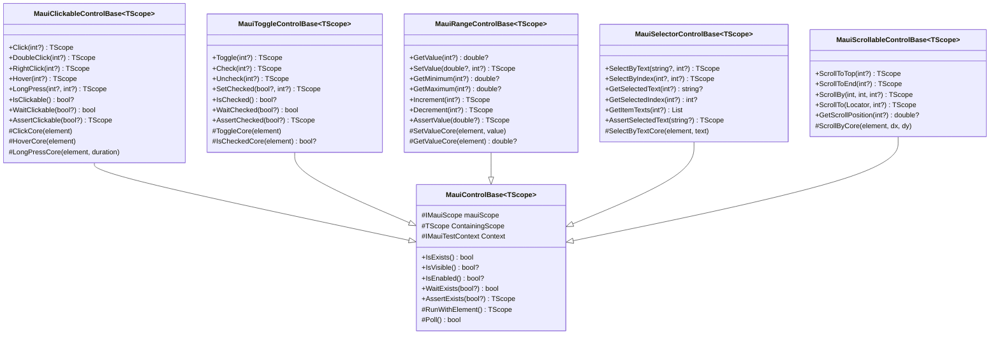
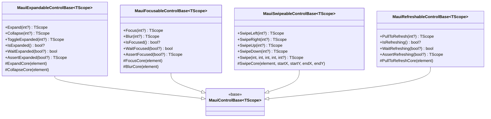
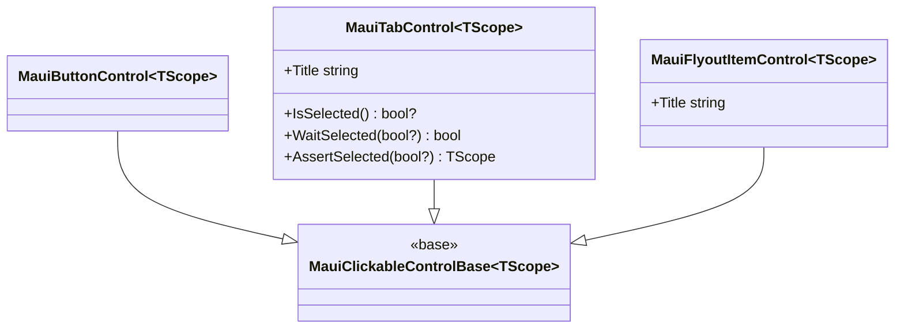

# Design Document: MAUI Base Control Hierarchy

## Overview

This design defines a set of intermediate base classes for MAUI controls, each implementing one capability interface from `Brinell.Core.Interfaces`. The hierarchy reduces code duplication by consolidating common implementations (Click, Toggle, Scroll, etc.) into reusable base classes.

**Scope:**
- Single-capability base classes only
- Refactoring of existing simple controls
- Composite controls (ListView, TabControl) deferred to future spec

**Out of Scope:**
- Composite/collection controls
- Item factory patterns
- Complex container hierarchies

## Steering Document Alignment

### Technical Standards (tech.md)

| Standard | How Design Follows |
|----------|-------------------|
| Is/Wait/Assert Pattern | All base classes implement Is*, Wait*, Assert* methods |
| Nullable Skip Pattern | All Wait/Assert accept nullable expected; null = skip |
| TScope Fluent Chaining | All action methods return TScope for chaining |
| RunWithElement Pattern | All public methods use RunWithElement for logging |
| Core Method Pattern | Internal methods (ClickCore, etc.) do work without logging |
| Platform-Native | Uses Appium Actions API directly for gestures |

### Project Structure (structure.md)

| Convention | Implementation |
|------------|----------------|
| File Location | `srcnew/Brinell.Maui/Controls/` |
| Naming | `Maui{Capability}ControlBase.cs` |
| Namespace | `Brinell.Maui.Controls` |
| Interface Reference | `Brinell.Core.Interfaces` |

## Code Reuse Analysis

### Existing Components to Leverage

| Component | How It Will Be Used |
|-----------|-------------------|
| `MauiControlBase<TScope>` | Parent of all capability base classes |
| `RunWithElement` | Logging wrapper for all public methods |
| `Poll` / `PollWithElement` | Waiting for state changes |
| `RunAssert` | Assertion execution with logging |
| `FindElementWithWait` | Element discovery with timeout |
| `Context.Driver.UnwrapDriver()` | Access to Appium driver for Actions API |
| `IMauiElement.UnwrapElement()` | Access to AppiumElement for gestures |

### Integration Points

| Existing Code | Integration Approach |
|---------------|---------------------|
| `MauiButtonControl` | Will inherit from `MauiClickableControlBase` |
| `MauiTabControl` | Will inherit from `MauiClickableControlBase` |
| `MauiFlyoutItemControl` | Will inherit from `MauiClickableControlBase` |
| `MauiEntryControl` | Keeps current inheritance (uses editable text) |
| `IControlObject<TScope>` | Already implemented by MauiControlBase |

## Architecture

### Class Hierarchy Diagram



### Additional Base Classes



### Concrete Control Inheritance



## Components and Interfaces

### MauiClickableControlBase

- **Purpose:** Implements IClickableControlObject with Click, DoubleClick, RightClick, Hover, LongPress
- **Interfaces:** `IClickableControlObject<TScope>`
- **Dependencies:** MauiControlBase, Appium Actions API
- **Reuses:** RunWithElement, IsVisibleCore, IsEnabledCore, PollWithElement

**Key Methods:**
```csharp
public abstract class MauiClickableControlBase<TScope> : MauiControlBase<TScope>, IClickableControlObject<TScope>
    where TScope : IMauiScope<TScope>
{
    public TScope Click(int? timeoutMs = null)
        => RunWithElement(nameof(Click), timeoutMs, element => ClickCore(element));
    
    protected virtual void ClickCore(IMauiElement element)
    {
        CheckClickableCore(element);
        element.Click();
    }
    
    protected void HoverCore(IMauiElement element)
    {
        var actions = new Actions(Context.Driver.UnwrapDriver());
        actions.MoveToElement(element.UnwrapElement()).Perform();
    }
    
    protected void LongPressCore(IMauiElement element, int durationMs)
    {
        var actions = new Actions(Context.Driver.UnwrapDriver());
        actions.ClickAndHold(element.UnwrapElement())
               .Pause(TimeSpan.FromMilliseconds(durationMs))
               .Release()
               .Perform();
    }
}
```

### MauiToggleControlBase

- **Purpose:** Implements IToggleControlObject with Toggle, Check, Uncheck, SetChecked
- **Interfaces:** `IToggleControlObject<TScope>`
- **Dependencies:** MauiControlBase
- **Reuses:** RunWithElement, Poll, RunAssert

**Key Methods:**
```csharp
public abstract class MauiToggleControlBase<TScope> : MauiControlBase<TScope>, IToggleControlObject<TScope>
    where TScope : IMauiScope<TScope>
{
    public TScope Toggle(int? timeoutMs = null)
        => RunWithElement(nameof(Toggle), timeoutMs, element => ToggleCore(element));
    
    protected virtual void ToggleCore(IMauiElement element)
    {
        element.Click();
    }
    
    protected virtual bool? IsCheckedCore(IMauiElement? element)
    {
        if (element == null) return null;
        var state = element.GetAttribute("Toggle.ToggleState") 
                ?? element.GetAttribute("IsChecked")
                ?? element.GetAttribute("Checked");
        return state?.Equals("1", StringComparison.OrdinalIgnoreCase) == true
            || state?.Equals("true", StringComparison.OrdinalIgnoreCase) == true;
    }
    
    public TScope Check(int? timeoutMs = null)
        => SetChecked(true, timeoutMs);
    
    public TScope Uncheck(int? timeoutMs = null)
        => SetChecked(false, timeoutMs);
    
    public TScope SetChecked(bool? @checked, int? timeoutMs = null)
    {
        if (@checked == null) return ContainingScope;
        return RunWithElement(nameof(SetChecked), @checked, timeoutMs, element =>
        {
            if (IsCheckedCore(element) != @checked.Value)
                ToggleCore(element);
        });
    }
}
```

### MauiRangeControlBase

- **Purpose:** Implements IRangeControlObject with GetValue, SetValue, Increment, Decrement
- **Interfaces:** `IRangeControlObject<TScope>`
- **Dependencies:** MauiControlBase
- **Reuses:** RunWithElement, GetAttribute, Poll

**Key Methods:**
```csharp
public abstract class MauiRangeControlBase<TScope> : MauiControlBase<TScope>, IRangeControlObject<TScope>
    where TScope : IMauiScope<TScope>
{
    protected virtual double? GetValueCore(IMauiElement? element)
    {
        if (element == null) return null;
        var value = element.GetAttribute("RangeValue.Value") 
                 ?? element.GetAttribute("Value");
        return double.TryParse(value, out var result) ? result : null;
    }
    
    protected virtual void SetValueCore(IMauiElement element, double value)
    {
        // Platform-specific: Use JavaScript, sendKeys, or slider drag
        // Implementation varies by control type
    }
    
    public TScope AssertValue(double? expected, double tolerance = 0.001, 
        string? message = null, int? timeoutMs = null)
    {
        if (expected == null) return ContainingScope;
        return RunAssert(nameof(AssertValue), expected, () =>
        {
            Poll(() => Math.Abs((GetValue() ?? double.NaN) - expected.Value) <= tolerance, 
                 timeoutMs ?? DefaultTimeoutMs);
            return GetValue();
        }, (actual, exp) => actual.HasValue && Math.Abs(actual.Value - exp.Value) <= tolerance,
           message);
    }
}
```

### MauiScrollableControlBase

- **Purpose:** Implements IScrollableControlObject with scroll operations
- **Interfaces:** `IScrollableControlObject<TScope>`
- **Dependencies:** MauiControlBase, Appium Actions API
- **Reuses:** RunWithElement, element bounds calculation

**Key Methods:**
```csharp
public abstract class MauiScrollableControlBase<TScope> : MauiControlBase<TScope>, IScrollableControlObject<TScope>
    where TScope : IMauiScope<TScope>
{
    protected virtual void ScrollByCore(IMauiElement element, int deltaX, int deltaY)
    {
        var unwrapped = element.UnwrapElement();
        var driver = Context.Driver.UnwrapDriver();
        var location = unwrapped.Location;
        var size = unwrapped.Size;
        
        var centerX = location.X + size.Width / 2;
        var centerY = location.Y + size.Height / 2;
        
        var actions = new Actions(driver);
        actions.MoveToLocation(centerX, centerY)
               .ClickAndHold()
               .MoveByOffset(-deltaX, -deltaY)
               .Release()
               .Perform();
    }
    
    public TScope ScrollToTop(int? timeoutMs = null)
        => RunWithElement(nameof(ScrollToTop), timeoutMs, element =>
        {
            // Swipe down multiple times until at top
            for (int i = 0; i < 10; i++)
            {
                if (GetScrollPositionCore(element) <= 0) break;
                ScrollByCore(element, 0, -500);
                Thread.Sleep(100);
            }
        });
}
```

### MauiSwipeableControlBase

- **Purpose:** Implements ISwipeableControlObject with swipe gestures
- **Interfaces:** `ISwipeableControlObject<TScope>`
- **Dependencies:** MauiControlBase, Appium Actions API
- **Reuses:** element bounds, Actions API

**Key Methods:**
```csharp
public abstract class MauiSwipeableControlBase<TScope> : MauiControlBase<TScope>, ISwipeableControlObject<TScope>
    where TScope : IMauiScope<TScope>
{
    protected virtual void SwipeCore(IMauiElement element, int startX, int startY, int endX, int endY)
    {
        var unwrapped = element.UnwrapElement();
        var driver = Context.Driver.UnwrapDriver();
        var location = unwrapped.Location;
        
        var actions = new Actions(driver);
        actions.MoveToLocation(location.X + startX, location.Y + startY)
               .ClickAndHold()
               .MoveToLocation(location.X + endX, location.Y + endY)
               .Release()
               .Perform();
    }
    
    public TScope SwipeLeft(int? timeoutMs = null)
        => RunWithElement(nameof(SwipeLeft), timeoutMs, element =>
        {
            var size = element.UnwrapElement().Size;
            SwipeCore(element, size.Width - 20, size.Height / 2, 20, size.Height / 2);
        });
}
```

## Data Models

### No New Data Models

This design introduces base classes, not data models. The existing types are reused:
- `Locator` - Element location strategy
- `IMauiElement` - Element wrapper
- `IMauiTestContext` - Test context with driver and timeouts

## Error Handling

### Error Scenarios

| Scenario | Handling | Exception |
|----------|----------|-----------|
| Element not found within timeout | FindElementWithWait throws | `ElementNotFoundException` |
| Element not clickable (disabled) | CheckClickableCore waits then throws | `TimeoutException` |
| Toggle state cannot be determined | IsCheckedCore returns null | No exception (nullable return) |
| Scroll fails (no scroll support) | Swallow exception, continue | No exception (best effort) |
| Assertion fails | RunAssert throws with context | `AssertionException` |
| Value out of range | SetValueCore clamps or throws | Platform-dependent |

### Error Messages

All error messages include:
- Locator used to find element
- Expected vs actual state (for assertions)
- Timeout value used
- Control type and action attempted

## Testing Strategy

### Unit Testing

- **Mock IMauiElement** to test Core methods in isolation
- **Test Is* methods** return correct values for mocked attributes
- **Test Wait* methods** poll correctly with mock timing
- **Test Assert* methods** throw correct exceptions on failure
- **Test nullable skip** - null expected values skip operation

### Integration Testing

- **Test with real Appium** against sample MAUI app
- **Verify Click/Toggle/Scroll** actually affect UI state
- **Test fluent chaining** returns correct scope
- **Verify logging** captures entry/exit/assertions

### Refactoring Tests

- **Before/After comparison** - existing tests must pass unchanged
- **MauiButtonControl** behavior identical after refactor
- **MauiTabControl** behavior identical after refactor
- **MauiFlyoutItemControl** behavior identical after refactor

---

**Document Version:** 1.0  
**Created:** January 19, 2026  
**Spec ID:** 004  
**Status:** Draft  
**Workflow:** spec_workflow/design
