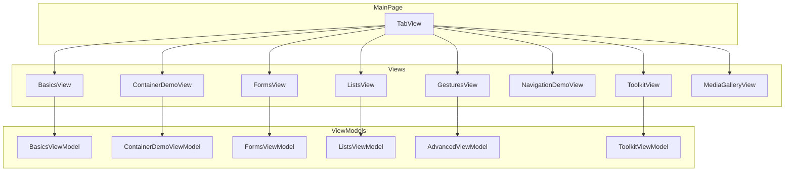

# Design Document: MAUI Sample App Tab Navigation

## Overview

This design transforms the Brinell MAUI sample app from a button-based tab system to a proper CommunityToolkit.Maui TabView navigation structure. The redesign introduces 8 main tabs organizing all existing pages plus new demo views for ListView, TableView, Expander, TreeView-like hierarchy, and popup controls.

**Key Design Goals:**
- Use CommunityToolkit.Maui TabView as the primary navigation
- Modular ContentView architecture for each tab's content
- Consistent AutomationId patterns across all controls
- Lazy-loading tab content for performance

---

## Steering Document Alignment

### Technical Standards
- **MVVM Pattern**: All new views use CommunityToolkit.Mvvm with ObservableObject and RelayCommand
- **Fluent API**: Sample app controls demonstrate testable patterns for Brinell
- **AutomationId Convention**: All interactive controls have AutomationIds following `{Type}{Purpose}` pattern

### Project Structure
- **Views**: New ContentViews go in `Views/` folder
- **ViewModels**: Supporting ViewModels go in `ViewModels/` folder
- **Pages**: Existing pages remain in `Pages/` folder, embedded as ContentViews where needed

---

## Code Reuse Analysis

### Existing Components to Leverage

| Component | Current Location | Reuse Strategy |
|-----------|-----------------|----------------|
| ContainerDemoView | Views/ContainerDemoView.xaml | Embed directly in Containers tab |
| AdvancedPage content | Pages/AdvancedPage.xaml | Extract content to GesturesView.xaml |
| DataGridPage content | Pages/DataGridPage.xaml | Extract content to ListsView.xaml |
| UserFormPage content | Pages/UserFormPage.xaml | Embed in Forms tab |
| ValidationPage content | Pages/ValidationPage.xaml | Embed in Forms tab |
| ContainerDemoViewModel | ViewModels/ | Reuse as-is |
| DataGridViewModel | ViewModels/ | Reuse as-is |
| AdvancedViewModel | ViewModels/ | Reuse as-is |

### Integration Points

- **CommunityToolkit.Maui**: Already referenced; use TabView, Expander, Popup
- **AutomationContainer control**: Existing custom control for scoped testing
- **Brinell.Maui.CommunityToolkit.Controls.TabViewControl**: Framework control to test

---

## Architecture

### Tab Structure

```
MainPage (ContentPage)
└── TabView (CommunityToolkit.Maui)
    ├── TabViewItem: Basics (BasicsTab)
    │   └── BasicsView.xaml (extracted from current MainPage content)
    │
    ├── TabViewItem: Containers (ContainersTab)
    │   └── ContainerDemoView.xaml (existing)
    │
    ├── TabViewItem: Forms (FormsTab)
    │   └── FormsView.xaml (combines UserForm + Validation + TableView)
    │
    ├── TabViewItem: Lists (ListsTab)
    │   └── ListsView.xaml (ListView, CollectionView, TreeView-like)
    │
    ├── TabViewItem: Gestures (GesturesTab)
    │   └── GesturesView.xaml (extracted from AdvancedPage)
    │
    ├── TabViewItem: Navigation (NavigationTab)
    │   └── NavigationDemoView.xaml (extracted from NavigationDemoPage)
    │
    ├── TabViewItem: Toolkit (ToolkitTab)
    │   └── ToolkitView.xaml (Expander, nested TabView, Popup triggers)
    │
    └── TabViewItem: Media (MediaTab)
        └── MediaGalleryView.xaml (extracted from MediaGalleryPage)
```

### Component Diagram



---

## Components and Interfaces

### Component 1: MainPage (Redesigned)

**Purpose:** Host the CommunityToolkit TabView as the main navigation container

**XAML Structure:**
```xml
<ContentPage xmlns:toolkit="http://schemas.microsoft.com/dotnet/2022/maui/toolkit">
    <toolkit:TabView AutomationId="MainTabView" TabStripPlacement="Top">
        <toolkit:TabViewItem AutomationId="BasicsTab" Header="Basics">
            <views:BasicsView />
        </toolkit:TabViewItem>
        <!-- Additional tabs... -->
    </toolkit:TabView>
</ContentPage>
```

**Key Properties:**
- `TabStripPlacement="Top"` - Tabs at top for desktop-style navigation
- Each TabViewItem has unique AutomationId
- Content views are embedded directly (not lazy-loaded initially)

---

### Component 2: BasicsView

**Purpose:** Counter, Entry, Toggle, Slider, Picker demos (current MainPage content)

**File:** `Views/BasicsView.xaml`

**AutomationIds:**
| Control | AutomationId |
|---------|--------------|
| ScrollView | BasicsScrollView |
| Counter Label | CounterLabel |
| Increment Button | IncrementButton |
| Decrement Button | DecrementButton |
| Reset Button | ResetButton |
| Name Entry | NameEntry |
| Email Entry | EmailEntry |
| Greet Button | GreetButton |
| Volume Slider | VolumeSlider |
| Color Picker | ColorPicker |

**Dependencies:** BasicsViewModel (new, extracted from MainPage.xaml.cs)

---

### Component 3: FormsView

**Purpose:** Combine validation, user forms, and TableView demos

**File:** `Views/FormsView.xaml`

**Sections:**
1. **User Form Section** - Name, email, phone with validation
2. **Validation Demo Section** - Error states, validation messages
3. **TableView Section** - Settings-style UI

**TableView Structure:**
```xml
<TableView AutomationId="SettingsTableView">
    <TableRoot>
        <TableSection Title="Account" AutomationId="AccountSection">
            <EntryCell Label="Username" AutomationId="UsernameCell" />
            <SwitchCell Text="Notifications" AutomationId="NotificationsSwitchCell" />
            <TextCell Text="Version" Detail="1.0.0" AutomationId="VersionCell" />
        </TableSection>
        <TableSection Title="Preferences" AutomationId="PreferencesSection">
            <SwitchCell Text="Dark Mode" AutomationId="DarkModeSwitchCell" />
            <ViewCell AutomationId="CustomSettingCell">
                <!-- Custom content -->
            </ViewCell>
        </TableSection>
    </TableRoot>
</TableView>
```

---

### Component 4: ListsView

**Purpose:** ListView, CollectionView, CarouselView, and TreeView-like demos

**File:** `Views/ListsView.xaml`

**Sections:**

#### 4.1 Classic ListView
```xml
<ListView AutomationId="ClassicListView" 
          IsPullToRefreshEnabled="True"
          ItemsSource="{Binding SimpleItems}">
    <ListView.ItemTemplate>
        <DataTemplate>
            <TextCell Text="{Binding Name}" 
                      Detail="{Binding Description}"
                      AutomationId="{Binding Id, StringFormat='ListItem_{0}'}" />
        </DataTemplate>
    </ListView.ItemTemplate>
</ListView>
```

#### 4.2 TreeView-like Hierarchy (Using Nested Expanders)
```xml
<VerticalStackLayout AutomationId="TreeViewDemo">
    <toolkit:Expander AutomationId="Node_1">
        <toolkit:Expander.Header>
            <Label Text="Parent Node 1" AutomationId="Node_1_Header" />
        </toolkit:Expander.Header>
        <VerticalStackLayout Padding="20,0,0,0">
            <toolkit:Expander AutomationId="Node_1_1">
                <toolkit:Expander.Header>
                    <Label Text="Child Node 1.1" AutomationId="Node_1_1_Header" />
                </toolkit:Expander.Header>
                <VerticalStackLayout Padding="20,0,0,0">
                    <Label Text="Leaf 1.1.1" AutomationId="Node_1_1_1" />
                    <Label Text="Leaf 1.1.2" AutomationId="Node_1_1_2" />
                </VerticalStackLayout>
            </toolkit:Expander>
            <Label Text="Child Node 1.2" AutomationId="Node_1_2" />
        </VerticalStackLayout>
    </toolkit:Expander>
</VerticalStackLayout>
```

**Dependencies:** ListsViewModel (combines DataGridViewModel patterns)

---

### Component 5: ToolkitView

**Purpose:** CommunityToolkit control demos (Expander, nested TabView, Popup)

**File:** `Views/ToolkitView.xaml`

**Sections:**

#### 5.1 Expander Demo
```xml
<toolkit:Expander AutomationId="SimpleExpander" IsExpanded="False">
    <toolkit:Expander.Header>
        <Frame AutomationId="SimpleExpanderHeader">
            <Label Text="Click to Expand" />
        </Frame>
    </toolkit:Expander.Header>
    <Frame AutomationId="SimpleExpanderContent">
        <Label Text="Expanded content here" />
    </Frame>
</toolkit:Expander>
```

#### 5.2 Nested TabView Demo
```xml
<toolkit:TabView AutomationId="NestedTabView" HeightRequest="200">
    <toolkit:TabViewItem AutomationId="InnerTab1" Header="Inner 1">
        <Label Text="Inner tab 1 content" AutomationId="InnerTab1Content" />
    </toolkit:TabViewItem>
    <toolkit:TabViewItem AutomationId="InnerTab2" Header="Inner 2">
        <Label Text="Inner tab 2 content" AutomationId="InnerTab2Content" />
    </toolkit:TabViewItem>
</toolkit:TabView>
```

#### 5.3 Popup Triggers
```xml
<Button AutomationId="ShowPopupButton" Text="Show Popup" Command="{Binding ShowPopupCommand}" />
<Button AutomationId="ShowSnackbarButton" Text="Show Snackbar" Command="{Binding ShowSnackbarCommand}" />
```

**Dependencies:** ToolkitViewModel (handles popup/snackbar commands)

---

### Component 6: GesturesView

**Purpose:** Extract gesture demos from AdvancedPage

**File:** `Views/GesturesView.xaml`

**Strategy:** Move content from `Pages/AdvancedPage.xaml` to this ContentView, keeping the same AdvancedViewModel.

---

## Data Models

### TreeNode Model (for TreeView-like demo)
```csharp
public class TreeNode : ObservableObject
{
    public string Id { get; set; }           // e.g., "1", "1_1", "1_1_2"
    public string Name { get; set; }
    public bool IsExpanded { get; set; }
    public ObservableCollection<TreeNode> Children { get; set; }
}
```

### ListItem Model (for ListView demo)
```csharp
public class ListItem
{
    public int Id { get; set; }
    public string Name { get; set; }
    public string Description { get; set; }
    public string ImageUrl { get; set; }
}
```

---

## File Structure

```
samples/Brinell.Samples.Maui.App/
├── MainPage.xaml              # Redesigned: TabView host
├── MainPage.xaml.cs           # Simplified: just InitializeComponent
├── Views/
│   ├── BasicsView.xaml        # NEW: Counter, Entry, Toggle, etc.
│   ├── BasicsView.xaml.cs
│   ├── ContainerDemoView.xaml # EXISTING
│   ├── FormsView.xaml         # NEW: Forms + TableView
│   ├── FormsView.xaml.cs
│   ├── ListsView.xaml         # NEW: ListView, TreeView-like
│   ├── ListsView.xaml.cs
│   ├── GesturesView.xaml      # NEW: Extracted from AdvancedPage
│   ├── GesturesView.xaml.cs
│   ├── ToolkitView.xaml       # NEW: Expander, nested TabView, Popup
│   ├── ToolkitView.xaml.cs
│   ├── NavigationDemoView.xaml # NEW: Extracted from NavigationDemoPage
│   └── MediaGalleryView.xaml  # NEW: Extracted from MediaGalleryPage
├── ViewModels/
│   ├── BasicsViewModel.cs     # NEW: Extracted from MainPage.xaml.cs
│   ├── FormsViewModel.cs      # NEW: Validation + TableView logic
│   ├── ListsViewModel.cs      # NEW: ListView + TreeView data
│   ├── ToolkitViewModel.cs    # NEW: Popup/Snackbar commands
│   ├── ContainerDemoViewModel.cs # EXISTING
│   ├── AdvancedViewModel.cs   # EXISTING (reused by GesturesView)
│   └── DataGridViewModel.cs   # EXISTING (may merge into ListsViewModel)
└── Pages/
    └── (existing pages remain for reference/backward compatibility)
```

---

## Error Handling

### Error Scenarios

1. **TabView fails to render**
   - **Handling:** Fallback to simple StackLayout with buttons (current pattern)
   - **User Impact:** Degraded but functional navigation

2. **ViewModel binding fails**
   - **Handling:** Use FallbackValue in bindings, log to Debug
   - **User Impact:** Empty or default values displayed

3. **Popup fails to show**
   - **Handling:** Try/catch in ShowPopupCommand, show error in label
   - **User Impact:** Button click logs error, no crash

---

## Testing Strategy

### UI Tests (Brinell.Maui.UITests)

#### Tab Navigation Tests
```csharp
[Fact]
public void MainTabView_TabItems_AllAccessible()
{
    var tabView = Page.CreateControl<TabViewControl>("MainTabView");
    
    // Test each tab is clickable and selectable
    Page.CreateControl<TabViewControl>("BasicsTab").Click().AssertSelected(true);
    Page.CreateControl<TabViewControl>("ContainersTab").Click().AssertSelected(true);
    // ... all 8 tabs
}
```

#### ListView Tests
```csharp
[Fact]
public void ClassicListView_Items_HaveIndexedIds()
{
    var listItem0 = Page.CreateControl<MauiControlBase>("ListItem_0");
    listItem0.AssertExists();
    
    var listItem1 = Page.CreateControl<MauiControlBase>("ListItem_1");
    listItem1.AssertExists();
}
```

#### Expander Tests
```csharp
[Fact]
public void SimpleExpander_ExpandCollapse_Works()
{
    var expander = Page.CreateControl<ExpanderControl>("SimpleExpander");
    
    expander.AssertExpanded(false);
    expander.Expand();
    expander.AssertExpanded(true);
    expander.Collapse();
    expander.AssertExpanded(false);
}
```

#### TreeView-like Tests
```csharp
[Fact]
public void TreeView_NestedNodes_Accessible()
{
    var node1 = Page.CreateControl<ExpanderControl>("Node_1");
    node1.Expand();
    
    var node1_1 = Page.CreateControl<ExpanderControl>("Node_1_1");
    node1_1.AssertExists();
    node1_1.Expand();
    
    var leaf = Page.CreateControl<MauiLabelControl>("Node_1_1_1");
    leaf.AssertExists();
}
```

### Manual Testing Checklist

- [ ] App launches with TabView visible
- [ ] All 8 tabs are visible (scrollable if needed)
- [ ] Each tab displays correct content
- [ ] Tab selection state is visible
- [ ] ListView pull-to-refresh works
- [ ] TableView cells are interactable
- [ ] Expanders expand/collapse smoothly
- [ ] Nested TabView works independently
- [ ] Popup displays and dismisses correctly
- [ ] Snackbar appears and auto-dismisses

---

## Implementation Order

1. **Phase 1: Core Structure**
   - Create BasicsView (extract from MainPage)
   - Redesign MainPage with TabView
   - Wire up existing ContainerDemoView

2. **Phase 2: Extract Existing Pages**
   - Create GesturesView from AdvancedPage
   - Create NavigationDemoView from NavigationDemoPage
   - Create MediaGalleryView from MediaGalleryPage

3. **Phase 3: New Controls**
   - Create FormsView with TableView
   - Create ListsView with ListView + TreeView-like
   - Create ToolkitView with Expander + Popup

4. **Phase 4: Polish**
   - Ensure all AutomationIds are set
   - Test all tabs work correctly
   - Update UI tests to use new structure
