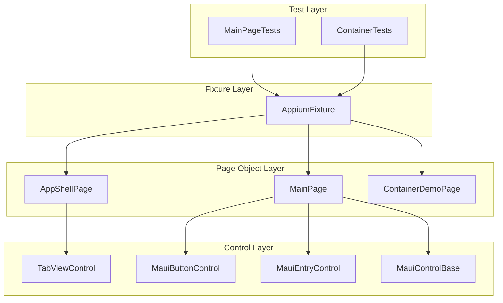

# Design Document

## Overview

Update the `Brinell.Maui.UITests` test project to align with the new TabbedPage-based sample app structure. The sample app now uses native MAUI `TabbedPage` with 8 tabs instead of Shell navigation. This design documents the changes needed to page objects, fixtures, and tests.

## Steering Document Alignment

### Technical Standards
- Use existing Brinell.Maui control wrappers (MauiButtonControl, MauiEntryControl, etc.)
- Follow established page object pattern from MauiPageObjectBase
- Use ITabControlObject interface for tab controls
- Leverage TabViewControl for TabbedPage tabs (works with both Shell and TabbedPage)

### Project Structure
- Page objects in `Pages/` folder
- Test classes in `Tests/` folder
- Shared fixture in `AppiumFixture.cs`
- Follow existing naming conventions (`*Page.cs`, `*Tests.cs`)

## Code Reuse Analysis

### Existing Components to Leverage
- **MauiPageObjectBase<T>**: Base class for all page objects - no changes needed
- **TabViewControl<T>**: Tab control wrapper - works with TabbedPage tabs via AutomationId
- **MauiButtonControl<T>**: Button wrapper - reuse for all button controls
- **MauiEntryControl<T>**: Entry wrapper - reuse for text input controls
- **MauiTestFixtureBase**: Base fixture - provides driver and context management

### Integration Points
- **MainPage.xaml**: TabbedPage with 8 ContentPage children, each with AutomationId
- **BasicsView.xaml**: Content for Basics tab with all control AutomationIds
- **ContainerDemoView.xaml**: Existing container demo content (unchanged)

## Architecture

The test project uses a layered architecture separating navigation (AppShellPage) from content page objects (MainPage, ContainerDemoPage).



## Components and Interfaces

### Component 1: AppShellPage (Update)

- **Purpose:** Provides tab navigation for TabbedPage-based app
- **Location:** `testsnew/Brinell.Maui.UITests/Pages/AppShellPage.cs`
- **Changes:**
  - Rename `MainTab` → `BasicsTab`
  - Remove obsolete tabs: `DashboardTab`, `DataTab`, `ValidationTab`, `AdvancedTab`
  - Add new tabs: `ListsTab`, `GesturesTab`, `ToolkitTab`
  - Update `IsLoaded()` to check `BasicsTab`

**Updated Interface:**
```csharp
public class AppShellPage : MauiPageObjectBase<AppShellPage>
{
    // 8 tabs matching MainPage.xaml TabbedPage children
    public ITabControlObject<AppShellPage> BasicsTab { get; }      // AutomationId="BasicsTab"
    public ITabControlObject<AppShellPage> ContainersTab { get; }  // AutomationId="ContainersTab"
    public ITabControlObject<AppShellPage> FormsTab { get; }       // AutomationId="FormsTab"
    public ITabControlObject<AppShellPage> ListsTab { get; }       // AutomationId="ListsTab"
    public ITabControlObject<AppShellPage> GesturesTab { get; }    // AutomationId="GesturesTab"
    public ITabControlObject<AppShellPage> NavigationTab { get; }  // AutomationId="NavigationTab"
    public ITabControlObject<AppShellPage> ToolkitTab { get; }     // AutomationId="ToolkitTab"
    public ITabControlObject<AppShellPage> MediaTab { get; }       // AutomationId="MediaTab"
}
```

### Component 2: MainPage (Update)

- **Purpose:** Page object for BasicsView content (first tab)
- **Location:** `testsnew/Brinell.Maui.UITests/Pages/MainPage.cs`
- **Changes:**
  - Add new controls from BasicsView.xaml
  - Keep existing controls that still exist (TitleLabel, NameEntry, etc.)
  - Add VolumeSlider, ColorPicker, NotificationSwitch, etc.

**Updated Interface:**
```csharp
public class MainPage : MauiPageObjectBase<MainPage>
{
    // Labels (from BasicsView.xaml)
    public MauiControlBase<MainPage> TitleLabel { get; }
    public MauiControlBase<MainPage> SubtitleLabel { get; }
    public MauiControlBase<MainPage> CounterLabel { get; }
    public MauiControlBase<MainPage> GreetingLabel { get; }
    public MauiControlBase<MainPage> VolumeLabel { get; }
    public MauiControlBase<MainPage> NotificationLabel { get; }
    public MauiControlBase<MainPage> SelectedColorLabel { get; }
    
    // Buttons
    public MauiButtonControl<MainPage> IncrementButton { get; }
    public MauiButtonControl<MainPage> DecrementButton { get; }
    public MauiButtonControl<MainPage> ResetButton { get; }
    public MauiButtonControl<MainPage> GreetButton { get; }
    public MauiButtonControl<MainPage> ToggleLoadingButton { get; }
    
    // Text Input
    public MauiEntryControl<MainPage> NameEntry { get; }
    public MauiEntryControl<MainPage> EmailEntry { get; }
    public MauiControlBase<MainPage> MessageEditor { get; }  // Editor control
    
    // Toggle Controls
    public MauiControlBase<MainPage> NotificationSwitch { get; }
    public MauiControlBase<MainPage> AgreeCheckBox { get; }
    
    // Slider & Progress
    public MauiControlBase<MainPage> VolumeSlider { get; }
    public MauiControlBase<MainPage> VolumeProgress { get; }
    
    // Pickers
    public MauiControlBase<MainPage> ColorPicker { get; }
    public MauiControlBase<MainPage> BirthDatePicker { get; }
    public MauiControlBase<MainPage> ReminderTimePicker { get; }
    
    // Activity Indicator
    public MauiControlBase<MainPage> LoadingIndicator { get; }
}
```

### Component 3: AppiumFixture (Update)

- **Purpose:** Test fixture providing driver, context, and navigation
- **Location:** `testsnew/Brinell.Maui.UITests/AppiumFixture.cs`
- **Changes:**
  - Update `NavigateToMain()` to use `BasicsTab`
  - Keep existing navigation methods

### Component 4: MainPageTests (Update)

- **Purpose:** Tests for BasicsView/MainPage functionality
- **Location:** `testsnew/Brinell.Maui.UITests/Tests/MainPageTests.cs`
- **Changes:**
  - Update tab navigation to use `BasicsTab`
  - Verify tests still work with existing control AutomationIds

## Data Models

No new data models required. Page objects use existing Brinell control interfaces.

## Error Handling

### Error Scenarios

1. **Tab Not Found:**
   - **Handling:** TabViewControl throws descriptive exception with AutomationId
   - **User Impact:** Clear error message identifying which tab is missing

2. **Control Not Found:**
   - **Handling:** MauiControlBase.AssertExists() throws with AutomationId
   - **User Impact:** Test fails with clear message about missing control

3. **Page Not Ready:**
   - **Handling:** WaitReady() returns false after timeout
   - **User Impact:** NavigateToX() throws InvalidOperationException with page name

## Testing Strategy

### Compilation Verification
- Build `Brinell.Maui.UITests` project to verify all changes compile
- Ensure no missing references or type errors

### Structural Verification
- Verify AutomationIds match between page objects and XAML files
- Verify all 8 tabs are properly defined in AppShellPage

### Runtime Verification (Manual)
- Run MainPageTests against sample app
- Verify tab navigation works
- Verify control interactions work

## File Changes Summary

| File | Change Type | Description |
|------|-------------|-------------|
| `Pages/AppShellPage.cs` | Modify | Update tabs to match new 8-tab structure |
| `Pages/MainPage.cs` | Modify | Add new controls from BasicsView.xaml |
| `AppiumFixture.cs` | Modify | Update NavigateToMain() to use BasicsTab |
| `Tests/MainPageTests.cs` | Modify | Update tab navigation references |
