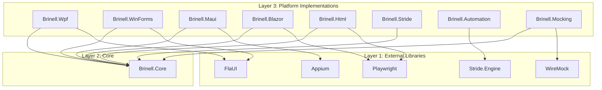

# Design Document: Solution Restructure

## Overview

This design document details the creation of a new solution structure in `srcNew/` with 9 projects following the four-layer architecture. The solution will use SDK-style projects with central package management and multi-targeting for .NET 8.0, 9.0, and 10.0.

## Steering Document Alignment

### Technical Standards (tech.md)

- **Four-Layer Architecture**: Core (interfaces) → Platform (implementations) → Tests → Applications
- **Self-Contained Platforms**: Each platform package has no dependencies on other platforms
- **Central Package Management**: Directory.Packages.props for version consistency
- **Multi-Targeting**: net8.0;net9.0;net10.0 for all projects

### Project Structure (structure.md)

- **Naming**: `Brinell.<Platform>` pattern
- **Folders**: Context/, Controls/, Pages/, Testing/ per platform
- **Namespaces**: Match folder structure (e.g., `Brinell.Maui.Controls`)

## Code Reuse Analysis

### Existing Components to Leverage

This is a greenfield implementation in `srcNew/`. However, we can reference patterns from:

- **src/Brinell.Core/Abstractions/**: Interface definitions to replicate
- **src/Brinell.Maui/ControlObject6/**: Modern control patterns
- **Directory.Build.props**: Build configuration patterns
- **Directory.Packages.props**: Package version management

### Integration Points

- No integration with existing `src/` code
- Clean start with ability to copy interfaces as needed

## Architecture



## Solution Structure

```
srcNew/
├── Brinell.sln
├── Directory.Build.props
├── Directory.Packages.props
│
├── Brinell.Core/
│   ├── Brinell.Core.csproj
│   ├── Abstractions/
│   │   ├── IControlObject.cs
│   │   ├── IPageObject.cs
│   │   ├── ITestContext.cs
│   │   └── Controls/
│   │       ├── IClickableControl.cs
│   │       ├── ITextControl.cs
│   │       └── ...
│   ├── Attributes/
│   ├── Exceptions/
│   ├── Locators/
│   └── Logging/
│
├── Brinell.Wpf/
│   ├── Brinell.Wpf.csproj
│   ├── Context/
│   ├── Controls/
│   ├── Pages/
│   └── Testing/
│
├── Brinell.WinForms/
│   ├── Brinell.WinForms.csproj
│   ├── Context/
│   ├── Controls/
│   ├── Pages/
│   └── Testing/
│
├── Brinell.Maui/
│   ├── Brinell.Maui.csproj
│   ├── Context/
│   ├── Controls/
│   ├── Pages/
│   ├── Gestures/
│   └── Testing/
│
├── Brinell.Blazor/
│   ├── Brinell.Blazor.csproj
│   ├── Context/
│   ├── Controls/
│   ├── Pages/
│   └── Testing/
│
├── Brinell.Html/
│   ├── Brinell.Html.csproj
│   ├── Context/
│   ├── Controls/
│   ├── Pages/
│   └── Testing/
│
├── Brinell.Stride/
│   ├── Brinell.Stride.csproj
│   ├── Context/
│   ├── Controls/
│   ├── Communication/
│   └── Testing/
│
├── Brinell.Automation/
│   ├── Brinell.Automation.csproj
│   ├── AutomationServer.cs
│   ├── AutomationGameSystem.cs
│   └── StrideUIHandler.cs
│
└── Brinell.Mocking/
    ├── Brinell.Mocking.csproj
    ├── MockApiServer.cs
    └── ApiStubBuilder.cs
```

## Components and Interfaces

### Directory.Build.props

- **Purpose**: Shared MSBuild properties for all projects
- **Contents**: LangVersion, Nullable, TreatWarningsAsErrors, Version, Package metadata

### Directory.Packages.props

- **Purpose**: Central package version management
- **Contents**: All NuGet package versions in one place

### Brinell.Core

- **Purpose**: Interface contracts and shared types
- **Interfaces**: IControlObject, IPageObject, ITestContext, capability interfaces
- **Dependencies**: None (pure interfaces)

### Platform Projects (Wpf, WinForms, Maui, Blazor, Html, Stride)

- **Purpose**: Platform-specific implementations
- **Pattern**: Each contains Context/, Controls/, Pages/, Testing/
- **Dependencies**: Brinell.Core + platform automation library

### Brinell.Automation

- **Purpose**: In-game automation hooks for Stride
- **Dependencies**: Stride.Engine, Stride.UI (no Brinell.Core)

### Brinell.Mocking

- **Purpose**: API mocking utilities
- **Dependencies**: Brinell.Core, WireMock.Net

## Project File Templates

### Standard Platform Project

```xml
<Project Sdk="Microsoft.NET.Sdk">
  <PropertyGroup>
    <TargetFrameworks>net8.0;net9.0;net10.0</TargetFrameworks>
    <RootNamespace>Brinell.{Platform}</RootNamespace>
    <ImplicitUsings>enable</ImplicitUsings>
    <Nullable>enable</Nullable>
  </PropertyGroup>
  
  <ItemGroup>
    <ProjectReference Include="..\Brinell.Core\Brinell.Core.csproj" />
  </ItemGroup>
  
  <ItemGroup>
    <!-- Platform-specific packages -->
  </ItemGroup>
</Project>
```

## Error Handling

### Build Errors

- **Scenario**: Missing package reference
- **Handling**: Central package management ensures consistency
- **Resolution**: Add to Directory.Packages.props

### Dependency Errors

- **Scenario**: Circular dependency between projects
- **Handling**: Architecture enforces one-way dependencies (Platform → Core)
- **Resolution**: Review and fix project references

## Testing Strategy

### Unit Testing (Future Spec)

- Test projects will mirror source structure
- `Brinell.Core.Tests`, `Brinell.Maui.Tests`, etc.

### Integration Testing (Future Spec)

- UI tests for each platform
- `Brinell.Maui.UITests`, `Brinell.Blazor.UITests`, etc.

---

**Document Version:** 1.0  
**Created:** January 13, 2026  
**Workflow:** spec_workflow/design
