# Design Document: TestsNew Projects

## Overview

This design document specifies the structure and implementation of test projects for the Brinell srcnew projects. The testsnew folder will contain 15 test projects: 9 unit test projects and 6 UI test projects, organized to mirror the source code structure.

## Steering Document Alignment

### Technical Standards (tech.md)

- **Testing Infrastructure**: Uses xunit, FluentAssertions, Moq, coverlet as specified
- **Target Framework**: net10.0 for all test projects
- **Code Quality**: TreatWarningsAsErrors, Nullable enabled
- **Central Package Management**: Uses Directory.Packages.props

### Project Structure (structure.md)

- **Naming Convention**: `Brinell.[Project].Tests` for unit tests, `Brinell.[Project].UITests` for UI tests
- **Folder Organization**: Mirrors source project structure (Context/, Controls/, etc.)
- **Test File Naming**: `[ClassName]Tests.cs` pattern
- **Namespace Pattern**: `Brinell.[Project].Tests` or `Brinell.[Project].UITests`

## Code Reuse Analysis

### Existing Components to Leverage

- **Existing test patterns**: `tests/Brinell.Core.Tests.ControlObject6` provides project structure template
- **GlobalUsings pattern**: Reuse common using statements from existing tests
- **Mock patterns**: `tests/Brinell.Maui.Tests.ControlObject6/Mocks/` provides mocking examples
- **Fixture patterns**: `tests/Brinell.Maui.Tests.ControlObject6/Fixtures/` provides fixture examples

### Integration Points

- **srcnew projects**: Each test project references corresponding srcnew project
- **Solution file**: Test projects integrate into `srcnew/Brinell.sln`
- **Directory.Packages.props**: Uses centralized package versions
- **Directory.Build.props**: Inherits shared build properties

## Architecture

### Test Project Organization

```mermaid
graph TD
    subgraph testsnew
        subgraph Unit["Unit Tests"]
            CT[Brinell.Core.Tests]
            WPT[Brinell.Wpf.Tests]
            WFT[Brinell.WinForms.Tests]
            MT[Brinell.Maui.Tests]
            BT[Brinell.Blazor.Tests]
            HT[Brinell.Html.Tests]
            ST[Brinell.Stride.Tests]
            AT[Brinell.Automation.Tests]
            MKT[Brinell.Mocking.Tests]
        end
        
        subgraph UI["UI Tests"]
            WPUT[Brinell.Wpf.UITests]
            WFUT[Brinell.WinForms.UITests]
            MUT[Brinell.Maui.UITests]
            BUT[Brinell.Blazor.UITests]
            HUT[Brinell.Html.UITests]
            SUT[Brinell.Stride.UITests]
        end
    end
    
    subgraph srcnew
        Core[Brinell.Core]
        Wpf[Brinell.Wpf]
        WinForms[Brinell.WinForms]
        Maui[Brinell.Maui]
        Blazor[Brinell.Blazor]
        Html[Brinell.Html]
        Stride[Brinell.Stride]
        Automation[Brinell.Automation]
        Mocking[Brinell.Mocking]
    end
    
    CT --> Core
    WPT --> Wpf
    WFT --> WinForms
    MT --> Maui
    BT --> Blazor
    HT --> Html
    ST --> Stride
    AT --> Automation
    MKT --> Mocking
    
    WPUT --> Wpf
    WFUT --> WinForms
    MUT --> Maui
    BUT --> Blazor
    HUT --> Html
    SUT --> Stride
```



### Modular Design Principles

- **Single File Responsibility**: Each test file tests one class/component
- **Test Isolation**: Tests use mocks to isolate from dependencies
- **Fixture Reuse**: Shared fixtures for common setup
- **Parallel Execution**: Unit tests designed for parallel execution

## Components and Interfaces

### Component: Unit Test Project Template

- **Purpose**: Provide consistent structure for all unit test projects
- **Files**:
  - `Brinell.[Project].Tests.csproj` - Project file
  - `GlobalUsings.cs` - Common using statements
  - `[Folder]/[Class]Tests.cs` - Test files mirroring source structure
  - `Mocks/Mock[Type].cs` - Mock implementations
  - `Fixtures/[Project]Fixture.cs` - Test fixtures
- **Dependencies**: Microsoft.NET.Test.Sdk, xunit, FluentAssertions, Moq, coverlet
- **Reuses**: Central package management, Directory.Build.props

### Component: UI Test Project Template

- **Purpose**: Provide consistent structure for all UI test projects
- **Files**:
  - `Brinell.[Project].UITests.csproj` - Project file
  - `GlobalUsings.cs` - Common using statements
  - `Pages/[Page]Page.cs` - Page objects for test app
  - `Controls/[Control]UITests.cs` - Control-specific UI tests
  - `Fixtures/AppFixture.cs` - Application startup fixture
- **Dependencies**: Platform-specific (FlaUI, Appium, Playwright via platform package)
- **Reuses**: Platform TestBase classes, Central package management

### Component: Directory.Build.props (testsnew)

- **Purpose**: Shared properties for all test projects
- **Configuration**:
  - IsPackable: false
  - IsTestProject: true
  - TreatWarningsAsErrors: true
- **Dependencies**: Inherits from root Directory.Build.props

## Data Models

### Unit Test Project Structure

```
Brinell.[Platform].Tests/
├── Brinell.[Platform].Tests.csproj
├── GlobalUsings.cs
├── Context/
│   └── [Platform]TestContextTests.cs
├── Controls/
│   ├── ButtonControlTests.cs
│   ├── TextBoxControlTests.cs
│   └── [Control]Tests.cs
├── Mocks/
│   ├── MockElement.cs
│   └── Mock[Platform]Driver.cs
└── Fixtures/
    └── [Platform]TestFixture.cs
```

### UI Test Project Structure

```
Brinell.[Platform].UITests/
├── Brinell.[Platform].UITests.csproj
├── GlobalUsings.cs
├── Pages/
│   ├── MainPage.cs
│   └── [Feature]Page.cs
├── Controls/
│   ├── ButtonControlUITests.cs
│   └── [Control]UITests.cs
└── Fixtures/
    ├── AppFixture.cs
    └── TestAppConfig.cs
```

## Error Handling

### Error Scenarios

1. **Missing srcnew project reference**
   - **Handling**: Build error with clear message about missing project
   - **User Impact**: Cannot build test project until srcnew project exists

2. **Test isolation failure (mocking)**
   - **Handling**: Use Moq.Strict to catch unmocked calls
   - **User Impact**: Clear test failure indicating missing mock setup

3. **UI test app not available**
   - **Handling**: Skip test with informative message
   - **User Impact**: Test marked as skipped, not failed

4. **Parallel test conflict**
   - **Handling**: Use xUnit collection fixtures for shared resources
   - **User Impact**: Tests run reliably in parallel

## Testing Strategy

### Unit Testing

- **Framework**: xUnit with FluentAssertions
- **Mocking**: Moq for all external dependencies
- **Coverage**: Target > 80% for Core, > 70% for platforms
- **Key Areas**:
  - Context initialization and configuration
  - Control state methods (Is*, Wait*, Check*, Assert*)
  - Locator building and parsing
  - Exception handling

### Integration Testing

- **Scope**: Component interactions within a project
- **Approach**: Real implementations with mocked external services
- **Key Areas**:
  - Context with mocked automation driver
  - Control hierarchy interactions
  - Page object navigation

### End-to-End Testing (UI Tests)

- **Framework**: xUnit with platform automation libraries
- **Setup**: Sample applications per platform
- **Key Scenarios**:
  - Control existence and visibility
  - User interactions (click, type, select)
  - Navigation between pages
  - Error state handling

## Solution Integration

### Solution Folders

```
Brinell.sln (srcnew)
├── Source/
│   ├── Brinell.Core
│   ├── Brinell.Wpf
│   └── ... (all srcnew projects)
├── Tests/
│   ├── Unit/
│   │   ├── Brinell.Core.Tests
│   │   ├── Brinell.Wpf.Tests
│   │   └── ... (all unit test projects)
│   └── UI/
│       ├── Brinell.Wpf.UITests
│       ├── Brinell.Maui.UITests
│       └── ... (all UI test projects)
```

### Build Configuration

- All test projects: Debug|Any CPU, Release|Any CPU
- Build order: Source projects first, then test projects
- Test execution: `dotnet test` runs all tests

---

**Document Version:** 1.0
**Created:** January 13, 2026
**Workflow:** spec_workflow/design
