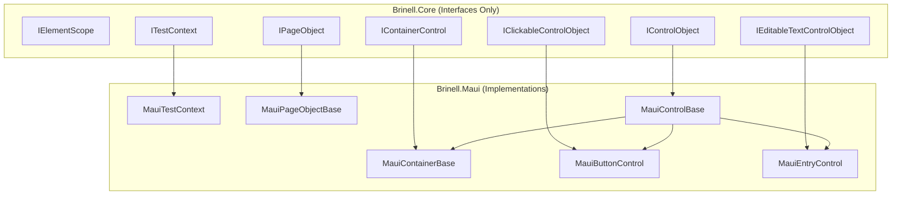
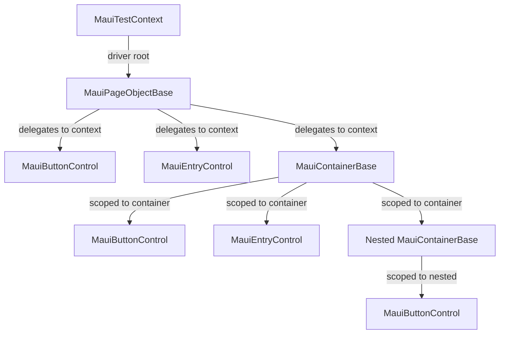

# Design Document

## Overview

This design implements the minimal interfaces and classes needed to support MAUI Button and Entry controls with proper scoping. The design leverages existing interfaces in `srcnew/Brinell.Core/Interfaces/` and adds MAUI-specific implementations.

**Key Design Decision**: Controls receive a **scope** (page, container, or list item) that handles element finding. This allows controls to work identically whether on a page or nested within containers.

## Steering Document Alignment

### Technical Standards (tech.md)

| Standard                               | Implementation                                                                  |
| -------------------------------------- | ------------------------------------------------------------------------------- |
| **Interface-Based Design**       | Core defines contracts (`IControlObject`, `IElementScope`), MAUI implements |
| **Self-Contained Platform**      | `Brinell.Maui` has its own base classes, no cross-platform dependencies       |
| **Native Library Access**        | Uses `AppiumElement` directly, no adapters                                    |
| **Is/Wait/Check/Assert Pattern** | All state methods follow this pattern consistently                              |

### Project Structure (structure.md)

| Convention                  | Implementation                                                     |
| --------------------------- | ------------------------------------------------------------------ |
| **Namespace Pattern** | `Brinell.Maui.Controls`, `Brinell.Maui.Pages`                  |
| **Interface Naming**  | `I{Capability}ControlObject` (e.g., `IClickableControlObject`) |
| **Class Naming**      | `Maui{Control}Control` (e.g., `MauiButtonControl`)             |
| **Base Class Naming** | `Maui{Type}Base` (e.g., `MauiControlBase`)                     |

## Code Reuse Analysis

### Existing Components to Leverage

| Component                            | Location                                                         | How Used                                |
| ------------------------------------ | ---------------------------------------------------------------- | --------------------------------------- |
| **IControlObject**             | `srcnew/Brinell.Core/Interfaces/IControlObject.cs`             | Base interface - already defined        |
| **IElementScope**              | `srcnew/Brinell.Core/Interfaces/IElementScope.cs`              | Scoping contract - already defined      |
| **IPageObject**                | `srcnew/Brinell.Core/Interfaces/IPageObject.cs`                | Page contract - already defined         |
| **IContainerControl**          | `srcnew/Brinell.Core/Interfaces/IContainerControl.cs`          | Container contract - already defined    |
| **IClickableControlObject**    | `srcnew/Brinell.Core/Interfaces/IClickableControlObject.cs`    | Click capability - already defined      |
| **IEditableTextControlObject** | `srcnew/Brinell.Core/Interfaces/IEditableTextControlObject.cs` | Text input - already defined            |
| **Locator**                    | `srcnew/Brinell.Core/Locators/Locator.cs`                      | Locator value object - already defined  |
| **TimeoutSettings**            | `srcnew/Brinell.Core/Configuration/`                           | Timeout configuration - already defined |
| **ITestLogger**                | `srcnew/Brinell.Core/Logging/`                                 | Logging interface - already defined     |

### Integration Points

| Integration                | How                                                     |
| -------------------------- | ------------------------------------------------------- |
| **ITestContext**     | MAUI context implements `ITestContext<AppiumElement>` |
| **Appium WebDriver** | `AppiumDriver` wrapped by `MauiTestContext`         |
| **Element Finding**  | Locator converted to Appium `By` via extension method |

## Architecture

The architecture follows a layered scope model where each scope level provides element finding within its bounds:



### Scope Hierarchy



### Modular Design Principles

- **Single File Responsibility**: Each control class in its own file
- **Component Isolation**: Base classes separate from concrete controls
- **Service Layer Separation**: Context handles driver, controls handle UI interaction
- **Utility Modularity**: `WaitHelper`, `LocatorExtensions` as separate utilities

## Components and Interfaces

### Component 1: IMauiElementScope

- **Purpose:** MAUI-specific element scope that provides access to context
- **Location:** `srcnew/Brinell.Maui/Interfaces/IMauiElementScope.cs`
- **Interfaces:**
  ```csharp
  public interface IMauiElementScope : IElementScope<AppiumElement>
  {
      IMauiTestContext Context { get; }
  }
  ```
- **Dependencies:** `IElementScope<AppiumElement>`, `IMauiTestContext`
- **Reuses:** `IElementScope<TElement>` from Core

### Component 2: IMauiTestContext

- **Purpose:** MAUI test context with Appium driver access
- **Location:** `srcnew/Brinell.Maui/Interfaces/IMauiTestContext.cs`
- **Interfaces:**
  ```csharp
  public interface IMauiTestContext : ITestContext<AppiumElement>, IMauiElementScope
  {
      AppiumDriver Driver { get; }
  }
  ```
- **Dependencies:** `ITestContext<AppiumElement>`, `AppiumDriver`
- **Reuses:** `ITestContext<TElement>` from Core

### Component 3: MauiTestContext

- **Purpose:** Concrete MAUI test context implementation
- **Location:** `srcnew/Brinell.Maui/Context/MauiTestContext.cs`
- **Interfaces:** Implements `IMauiTestContext`
- **Dependencies:** `AppiumDriver`, `TimeoutSettings`, `ITestLogger`
- **Key Methods:**
  - Constructor: Initialize driver connection
  - `TryFindElement()`: Find element from driver root
  - `NavigateTo()`: App navigation
  - `Dispose()`: Clean up driver

### Component 4: MauiControlBase

- **Purpose:** Base class for all MAUI controls
- **Location:** `srcnew/Brinell.Maui/Controls/MauiControlBase.cs`
- **Interfaces:** Implements `IControlObject`
- **Dependencies:** `IMauiElementScope`, `Locator`
- **Key Methods:**
  - `IsExists()`, `IsVisible()`, `IsEnabled()` - State queries
  - `WaitExists()`, `WaitVisible()`, `WaitEnabled()` - Wait methods
  - `AssertExists()`, `AssertVisible()`, `AssertEnabled()` - Assertions
  - `GetText()`, `GetAttribute()` - Value retrieval
- **Reuses:** `WaitHelper` for polling

### Component 5: MauiPageObjectBase

- **Purpose:** Base class for MAUI page objects
- **Location:** `srcnew/Brinell.Maui/Pages/MauiPageObjectBase.cs`
- **Interfaces:** Implements `IPageObject<AppiumElement>`, `IMauiElementScope`
- **Dependencies:** `IMauiTestContext`
- **Key Methods:**
  - `TryFindElement()`: Delegates to context (driver root search)
  - `IsLoaded()`: Override for page-specific load detection
  - `WaitLoaded()`, `AssertLoaded()`: Load state verification
- **Reuses:** Context's element finding

### Component 6: MauiContainerBase

- **Purpose:** Base class for container controls (views, panels)
- **Location:** `srcnew/Brinell.Maui/Controls/MauiContainerBase.cs`
- **Interfaces:** Implements `IContainerControl<AppiumElement>`, `IMauiElementScope`
- **Dependencies:** `IMauiElementScope`, `Locator`
- **Key Methods:**
  - `ContainerRoot`: Lazy-loaded root element
  - `TryFindElement()`: Scoped search within container
  - `InvalidateCache()`: Clear cached root
- **Reuses:** `MauiControlBase` as base

### Component 7: MauiButtonControl

- **Purpose:** MAUI Button control
- **Location:** `srcnew/Brinell.Maui/Controls/MauiButtonControl.cs`
- **Interfaces:** Implements `IClickableControlObject`
- **Dependencies:** `IMauiElementScope`, `Locator`
- **Key Methods:**
  - `Click()`: Waits for clickable, then clicks
  - `DoubleClick()`: Two clicks
  - `IsClickable()`: Visible AND enabled
- **Reuses:** `MauiControlBase`

### Component 8: MauiEntryControl

- **Purpose:** MAUI Entry control (text input)
- **Location:** `srcnew/Brinell.Maui/Controls/MauiEntryControl.cs`
- **Interfaces:** Implements `IEditableTextControlObject`
- **Dependencies:** `IMauiElementScope`, `Locator`
- **Key Methods:**
  - `Enter()`: SendKeys to element
  - `Clear()`: Clear element
  - `SetText()`: Clear + Enter
  - `GetPlaceholder()`: Get hint attribute
- **Reuses:** `MauiControlBase`

## Data Models

### Locator (Existing)

Already defined in `srcnew/Brinell.Core/Locators/Locator.cs`:

```csharp
public sealed class Locator
{
    public LocatorStrategy Strategy { get; }
    public string Value { get; }
    public Locator? Parent { get; }
}
```

### TimeoutSettings (Existing)

Already defined in `srcnew/Brinell.Core/Configuration/`:

```csharp
public class TimeoutSettings
{
    public int DefaultWait { get; set; } = 10000;
    public int PageLoad { get; set; } = 30000;
    public int ElementFind { get; set; } = 5000;
    public int PollingInterval { get; set; } = 100;
}
```

### MauiTestContextOptions (New)

```csharp
public class MauiTestContextOptions
{
    public Uri AppiumServerUri { get; set; }
    public AppiumOptions AppiumOptions { get; set; }
    public TimeoutSettings? Timeouts { get; set; }
    public ITestLogger? Logger { get; set; }
}
```

## Error Handling

### Error Scenarios

1. **Element Not Found**

   - **Handling:** `TryFindElement()` returns `null`, `FindElement()` throws `ElementNotFoundException`
   - **User Impact:** Test can check `IsExists()` first, or let assertion fail with clear message
2. **Stale Element Reference**

   - **Handling:** Re-find element on next access; containers have `InvalidateCache()`
   - **User Impact:** Transparent retry; if persistent, throws with locator info
3. **Timeout During Wait**

   - **Handling:** `Wait*()` returns `false`, `Assert*()` throws `AssertionException`
   - **User Impact:** Clear message with expected/actual values and timeout used
4. **Action on Disabled Element**

   - **Handling:** Click/Enter on disabled element does nothing (no exception)
   - **User Impact:** Test continues; use `AssertEnabled(true)` to catch if needed
5. **Container Root Not Found**

   - **Handling:** Throws `ElementNotFoundException` when accessing `ContainerRoot`
   - **User Impact:** Use `IsExists()` on container before accessing children

### Exception Types

| Exception                    | When Thrown                                                 |
| ---------------------------- | ----------------------------------------------------------- |
| `ElementNotFoundException` | `FindElement()` or `ContainerRoot` when element missing |
| `AssertionException`       | `Assert*()` methods when condition not met                |
| `TimeoutException`         | Action methods when element never becomes actionable        |
| `ObjectDisposedException`  | Any operation after context disposed                        |

## Testing Strategy

### Unit Testing

**Location:** `testsnew/Brinell.Maui.Tests/`

| Test Class                  | What It Tests                      |
| --------------------------- | ---------------------------------- |
| `MauiControlBaseTests`    | State methods with mocked elements |
| `MauiButtonControlTests`  | Click behavior with mocked Appium  |
| `MauiEntryControlTests`   | Text entry with mocked Appium      |
| `MauiContainerBaseTests`  | Scoped element finding             |
| `MauiPageObjectBaseTests` | Page load detection                |

**Approach:**

- Mock `IMauiElementScope` and `IMauiTestContext`
- Mock `AppiumElement` for state queries
- Verify method calls and return values
- Test nullable skip pattern

### Integration Testing

**Location:** `testsnew/Brinell.Maui.Tests.Integration/`

| Test Class                        | What It Tests                                   |
| --------------------------------- | ----------------------------------------------- |
| `ButtonControlIntegrationTests` | Real button clicks with sample app              |
| `EntryControlIntegrationTests`  | Real text entry with sample app                 |
| `ContainerScopingTests`         | Scoped element finding with multiple containers |

**Approach:**

- Use MAUI sample app with known controls
- Real Appium server connection
- Verify actual UI state changes

### End-to-End Testing

**Location:** `samples/Brinell.Samples.Maui.Tests/`

| Test Scenario               | What It Tests              |
| --------------------------- | -------------------------- |
| Login flow                  | Entry + Button interaction |
| Form with multiple sections | Container scoping          |
| List with item details      | List item scoping          |

**Approach:**

- Full user scenarios against sample app
- Page object pattern usage
- Validate framework usability

## File Structure

```
srcnew/Brinell.Maui/
├── Interfaces/
│   ├── IMauiElementScope.cs      # NEW
│   └── IMauiTestContext.cs       # NEW
├── Context/
│   ├── MauiTestContext.cs        # NEW (replace Placeholder.cs)
│   └── MauiTestContextOptions.cs # NEW
├── Controls/
│   ├── MauiControlBase.cs        # NEW (replace Placeholder.cs)
│   ├── MauiContainerBase.cs      # NEW
│   ├── MauiButtonControl.cs      # NEW
│   └── MauiEntryControl.cs       # NEW
├── Pages/
│   └── MauiPageObjectBase.cs     # NEW (replace Placeholder.cs)
└── Extensions/
    └── LocatorExtensions.cs      # NEW - Convert Locator to Appium By
```

## Requirements Traceability

| Requirement              | Components                                                           |
| ------------------------ | -------------------------------------------------------------------- |
| R1: Element Scope        | `IMauiElementScope`, `MauiPageObjectBase`, `MauiContainerBase` |
| R2: IControlObject       | `MauiControlBase`                                                  |
| R3: IClickableControl    | `MauiButtonControl`                                                |
| R4: IEditableTextControl | `MauiEntryControl`                                                 |
| R5: Container Scope      | `MauiContainerBase`                                                |
| R6: Page Scope           | `MauiPageObjectBase`                                               |
| R7: List Item Scope      | Deferred (container pattern applies)                                 |
| R8: Button Control       | `MauiButtonControl`                                                |
| R9: Entry Control        | `MauiEntryControl`                                                 |
