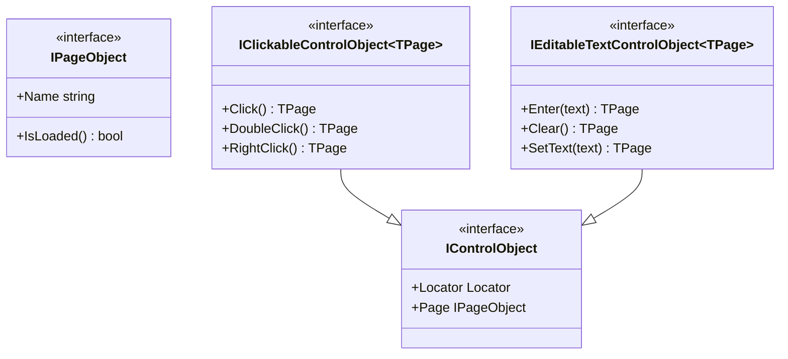
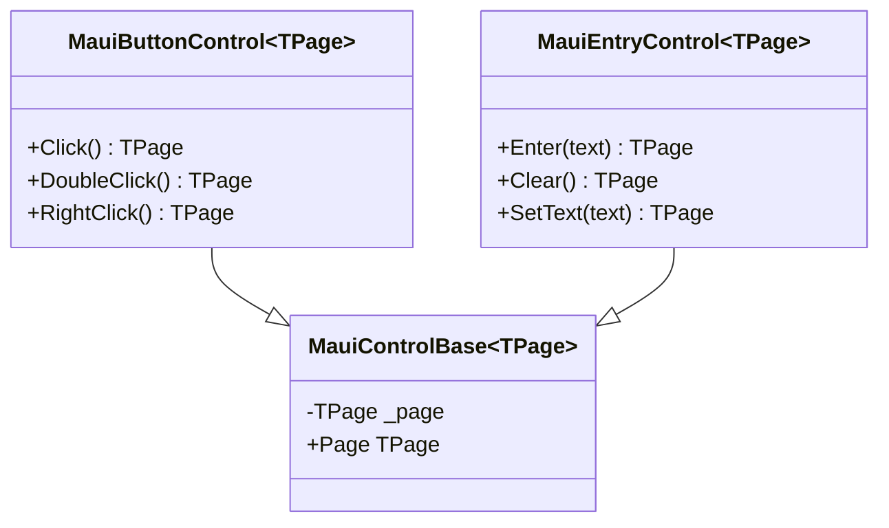

# SPX-010: Design Document - Fluent Method Chaining

**Status:** Design  
**Created:** 2025-01-14  
**Author:** Copilot  

---

## 1. Overview

This design enables fluent method chaining for action methods (`Click`, `Enter`, `Clear`, etc.) by making controls generic with a `TPage` type parameter. Action methods return the parent page, allowing chained test syntax:

```csharp
loginPage
    .Username.Enter("testuser")
    .Password.Enter("testpass")
    .LoginButton.Click();
```

---

## 2. Code Reuse Analysis

### Existing Components to Leverage

| Component | Location | Reuse Strategy |
|-----------|----------|----------------|
| `MauiControlBase` | `Brinell.Maui/Controls/` | Extend to `MauiControlBase<TPage>` |
| `MauiButtonControl` | `Brinell.Maui/Controls/` | Convert to `MauiButtonControl<TPage>` |
| `MauiEntryControl` | `Brinell.Maui/Controls/` | Convert to `MauiEntryControl<TPage>` |
| `MauiPageObjectBase` | `Brinell.Maui/Pages/` | Update factory methods to pass `this` |
| `IClickableControlObject` | `Brinell.Core/Interfaces/` | Make generic with `TPage` |
| `IEditableTextControlObject` | `Brinell.Core/Interfaces/` | Make generic with `TPage` |

### Integration Points

- **Page Factory Methods**: `Button()`, `Entry()` in `MauiPageObjectBase` must pass the page instance
- **Container Controls**: `MauiContainerBase` must propagate the page through to child controls

---

## 3. Architecture

### 3.1 Generic Type Flow



### 3.2 Implementation Hierarchy



---

## 4. Components and Interfaces

### 4.1 Core Interface: IClickableControlObject<TPage>

**File:** `srcnew/Brinell.Core/Interfaces/IClickableControlObject.cs`

```csharp
namespace Brinell.Core.Interfaces;

public interface IClickableControlObject<TPage> : IControlObject
    where TPage : IPageObject
{
    // Action methods - return TPage for fluent chaining
    TPage Click(int? timeoutMs = null);
    TPage DoubleClick(int? timeoutMs = null);
    TPage RightClick(int? timeoutMs = null);
    
    // State methods - unchanged (return bool?/void)
    bool? IsClickable();
    bool WaitClickable(bool? expected, int? timeoutMs = null);
    void AssertClickable(bool? expected, string? message = null, int? timeoutMs = null);
}
```

### 4.2 Core Interface: IEditableTextControlObject<TPage>

**File:** `srcnew/Brinell.Core/Interfaces/IEditableTextControlObject.cs`

```csharp
namespace Brinell.Core.Interfaces;

public interface IEditableTextControlObject<TPage> : ITextControlObject
    where TPage : IPageObject
{
    // Action methods - return TPage for fluent chaining
    TPage Enter(string? text, int? timeoutMs = null);
    TPage Clear(int? timeoutMs = null);
    TPage SetText(string? text, int? timeoutMs = null);
    
    // State methods - unchanged
    string? GetPlaceholder();
    bool WaitPlaceholder(string? expected, int? timeoutMs = null);
    void AssertPlaceholder(string? expected, string? message = null, int? timeoutMs = null);
    bool? IsReadOnly();
    bool WaitReadOnly(bool? expected, int? timeoutMs = null);
    void AssertReadOnly(bool? expected, string? message = null, int? timeoutMs = null);
}
```

### 4.3 MAUI Implementation: MauiControlBase<TPage>

**File:** `srcnew/Brinell.Maui/Controls/MauiControlBase.cs`

**Changes:**
- Add generic type parameter `TPage` with constraint `where TPage : IPageObject`
- Store `TPage _page` field passed via constructor
- Expose `TPage Page` property (strongly typed)

```csharp
public class MauiControlBase<TPage> : IControlObject
    where TPage : IPageObject
{
    private readonly IMauiElementScope _scope;
    private readonly Locator _locator;
    private readonly TPage _page;
    
    public MauiControlBase(TPage page, IMauiElementScope scope, Locator locator)
    {
        _page = page ?? throw new ArgumentNullException(nameof(page));
        _scope = scope ?? throw new ArgumentNullException(nameof(scope));
        _locator = locator ?? throw new ArgumentNullException(nameof(locator));
    }
    
    public TPage Page => _page;
    
    // IControlObject.Page for interface compatibility
    IPageObject? IControlObject.Page => _page;
    
    // ... rest unchanged
}
```

### 4.4 MAUI Implementation: MauiButtonControl<TPage>

**File:** `srcnew/Brinell.Maui/Controls/MauiButtonControl.cs`

```csharp
public class MauiButtonControl<TPage> : MauiControlBase<TPage>, IClickableControlObject<TPage>
    where TPage : IPageObject
{
    public MauiButtonControl(TPage page, IMauiElementScope scope, Locator locator)
        : base(page, scope, locator)
    {
    }
    
    public TPage Click(int? timeoutMs = null)
    {
        CheckClickable(timeoutMs);
        var element = FindElement();
        element.Click();
        return Page;
    }
    
    public TPage DoubleClick(int? timeoutMs = null)
    {
        CheckClickable(timeoutMs);
        var element = FindElement();
        element.Click();
        element.Click();
        return Page;
    }
    
    public TPage RightClick(int? timeoutMs = null)
    {
        CheckClickable(timeoutMs);
        var element = FindElement();
        var actions = new Actions(Context.Driver);
        actions.ContextClick(element).Perform();
        return Page;
    }
    
    // IsClickable, WaitClickable, AssertClickable unchanged
}
```

### 4.5 MAUI Implementation: MauiEntryControl<TPage>

**File:** `srcnew/Brinell.Maui/Controls/MauiEntryControl.cs`

```csharp
public class MauiEntryControl<TPage> : MauiControlBase<TPage>, IEditableTextControlObject<TPage>
    where TPage : IPageObject
{
    public MauiEntryControl(TPage page, IMauiElementScope scope, Locator locator)
        : base(page, scope, locator)
    {
    }
    
    public TPage Enter(string? text, int? timeoutMs = null)
    {
        if (text == null) return Page;
        
        CheckEnabled(timeoutMs);
        var element = FindElement();
        element.SendKeys(text);
        return Page;
    }
    
    public TPage Clear(int? timeoutMs = null)
    {
        CheckEnabled(timeoutMs);
        var element = FindElement();
        element.Clear();
        return Page;
    }
    
    public TPage SetText(string? text, int? timeoutMs = null)
    {
        if (text == null) return Page;
        
        Clear(timeoutMs);
        Enter(text, timeoutMs);
        return Page;
    }
    
    // Other methods unchanged
}
```

### 4.6 Page Factory Methods: MauiPageObjectBase

**File:** `srcnew/Brinell.Maui/Pages/MauiPageObjectBase.cs`

The page base needs to be generic to enable the factory methods to return correctly typed controls:

```csharp
public abstract class MauiPageObjectBase<TSelf> : IPageObject<AppiumElement>, IMauiElementScope
    where TSelf : MauiPageObjectBase<TSelf>
{
    // Factory methods pass 'this' as the page
    protected MauiButtonControl<TSelf> Button(Locator locator)
    {
        return new MauiButtonControl<TSelf>((TSelf)this, this, locator);
    }
    
    protected MauiEntryControl<TSelf> Entry(Locator locator)
    {
        return new MauiEntryControl<TSelf>((TSelf)this, this, locator);
    }
    
    protected MauiContainerBase<TSelf> Container(Locator locator)
    {
        return new MauiContainerBase<TSelf>((TSelf)this, this, locator);
    }
}
```

**Usage in concrete page:**

```csharp
public class LoginPage : MauiPageObjectBase<LoginPage>
{
    public LoginPage(IMauiTestContext context) : base(context) { }
    
    public override string Name => "Login";
    
    // Controls return LoginPage for chaining
    public MauiEntryControl<LoginPage> Username => Entry(Locator.ByAutomationId("Username"));
    public MauiEntryControl<LoginPage> Password => Entry(Locator.ByAutomationId("Password"));
    public MauiButtonControl<LoginPage> LoginButton => Button(Locator.ByAutomationId("LoginButton"));
    
    public override bool IsLoaded(int? timeoutMs = null) => Username.IsExists();
}
```

---

## 5. Container Scoping

Containers must also propagate the page type for consistent chaining:

### MauiContainerBase<TPage>

```csharp
public class MauiContainerBase<TPage> : MauiControlBase<TPage>, IContainerControl, IMauiElementScope
    where TPage : IPageObject
{
    public MauiContainerBase(TPage page, IMauiElementScope scope, Locator locator)
        : base(page, scope, locator)
    {
    }
    
    // Factory methods for controls within container
    public MauiButtonControl<TPage> Button(Locator locator)
    {
        return new MauiButtonControl<TPage>(Page, this, locator);
    }
    
    public MauiEntryControl<TPage> Entry(Locator locator)
    {
        return new MauiEntryControl<TPage>(Page, this, locator);
    }
}
```

**Chaining through containers:**

```csharp
// Controls in containers still return the page
page.Header.Container.SearchButton.Click()
    .SearchField.Enter("query");  // Returns page, not container
```

---

## 6. Error Handling

No changes to error handling - existing exceptions remain:
- `ElementNotFoundException` - Element not found within timeout
- `AssertionException` - Assertion failed
- `TimeoutException` - Action precondition not met (e.g., not clickable)
- `InvalidOperationException` - Invalid state for action

---

## 7. Testing Strategy

### Unit Testing
- Verify action methods return the page instance (`Assert.Same(page, result)`)
- Verify null skip pattern returns page without action
- Verify generic constraints compile correctly

### Integration Testing  
- Test fluent chains execute all actions in order
- Test chaining through containers returns page
- Test IntelliSense shows correct properties after chain

### Example Test
```csharp
[Test]
public void FluentChaining_ExecutesAllActions()
{
    var loginPage = new LoginPage(context);
    
    // Should compile and execute all actions
    var result = loginPage
        .Username.Enter("testuser")
        .Password.Enter("testpass")
        .LoginButton.Click();
    
    // Result is the same page instance
    Assert.Same(loginPage, result);
    
    // Verify actions occurred
    Assert.Equal("testuser", loginPage.Username.GetText());
}
```

---

## 8. File Changes Summary

| File | Change Type | Description |
|------|-------------|-------------|
| `IClickableControlObject.cs` | **Modify** | Add `<TPage>` parameter, change return types |
| `IEditableTextControlObject.cs` | **Modify** | Add `<TPage>` parameter, change return types |
| `MauiControlBase.cs` | **Modify** | Add `<TPage>` parameter, store page |
| `MauiButtonControl.cs` | **Modify** | Add `<TPage>` parameter, return `Page` |
| `MauiEntryControl.cs` | **Modify** | Add `<TPage>` parameter, return `Page` |
| `MauiContainerBase.cs` | **Modify** | Add `<TPage>` parameter, propagate page |
| `MauiPageObjectBase.cs` | **Modify** | Add `<TSelf>` CRTP pattern, update factories |

---

## 9. Traceability

| Requirement | Design Component |
|-------------|------------------|
| FR-1: Action methods return page | Section 4.4, 4.5 - Return `Page` property |
| FR-2: Controls track parent page | Section 4.3 - `_page` field |
| FR-3: Factory methods bind types | Section 4.6 - CRTP pattern |
| FR-4: Containers return page | Section 5 - Container propagation |
| FR-5: Concrete page type | Section 4.6 - `TSelf` constraint |
| TR-1: Generic interfaces | Section 4.1, 4.2 |
| TR-2: Return TPage not void | All action methods |
| TR-3: TPage : IPageObject | All generic constraints |
| TR-4: Generic MAUI controls | Section 4.3, 4.4, 4.5 |

---

## Next Steps

1. **Tasks Phase** - Break down into implementable work items
2. **Implement Phase** - Update interfaces and implementations
