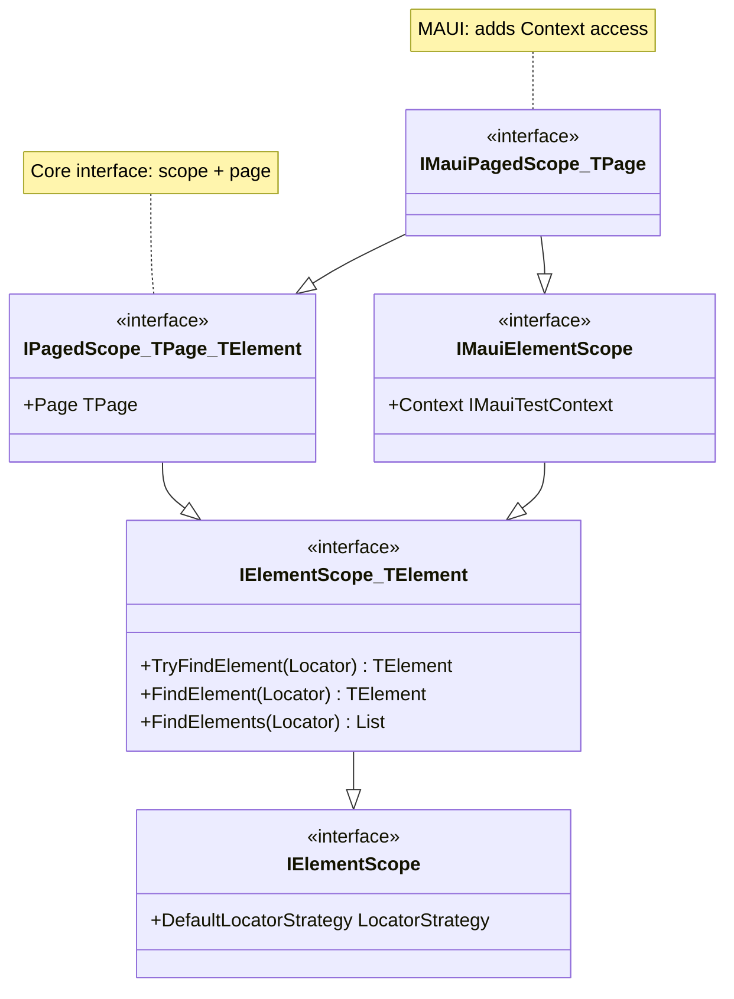
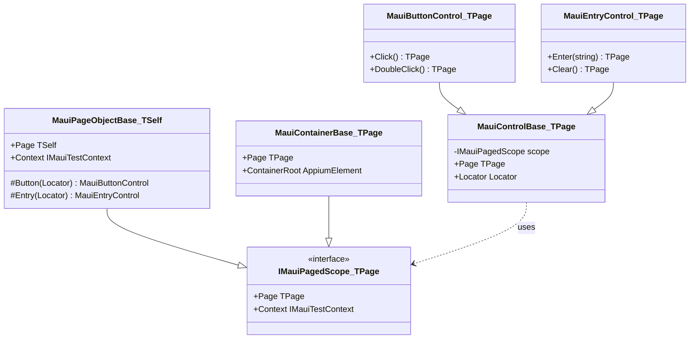

# SPX-011: Design Document - Element Scope and Page Object Merge

**Status:** Design  
**Created:** 2025-01-14  
**Author:** Copilot  
**Spec:** [requirements.spc.spx.md](requirements.spc.spx.md)

---

## 1. Overview

This design introduces `IPagedScope<TPage, TElement>` - a unified interface that combines element scope (for finding elements) with page access (for fluent chaining). This eliminates the redundant pattern of passing both `TPage` and `IMauiElementScope` to control constructors.

**Key Changes:**
1. New `IPagedScope<TPage, TElement>` interface in Brinell.Core
2. New `IMauiPagedScope<TPage>` interface in Brinell.Maui
3. Simplified control constructors accepting single `IMauiPagedScope<TPage>` parameter
4. Removal of all non-generic base classes

---

## 2. Steering Document Alignment

### Technical Standards
- Follows existing generic interface patterns (e.g., `IElementScope<TElement>`)
- Maintains CRTP pattern for `MauiPageObjectBase<TSelf>`
- Uses platform-specific interfaces (`IMauiPagedScope`) derived from core interfaces

### Project Structure
- Core interfaces in `Brinell.Core/Interfaces/`
- MAUI interfaces in `Brinell.Maui/Interfaces/`
- Implementation in existing control/page files (no new folders)

---

## 3. Code Reuse Analysis

### Existing Components to Leverage

| Component | Current Use | Change |
|-----------|-------------|--------|
| `IElementScope<TElement>` | Base for element finding | Extended by `IPagedScope` |
| `IMauiElementScope` | MAUI element finding + context | Extended by `IMauiPagedScope` |
| `MauiControlBase<TPage>` | Control base class | Constructor simplified |
| `MauiPageObjectBase<TSelf>` | Page base with CRTP | Implements `IMauiPagedScope<TSelf>` |
| `MauiContainerBase<TPage>` | Container scoping | Implements `IMauiPagedScope<TPage>` |

### Integration Points
- Control constructors change from `(TPage, IMauiElementScope, Locator)` to `(IMauiPagedScope<TPage>, Locator)`
- Factory methods on pages change from `new Control(this, this, locator)` to `new Control(this, locator)`

---

## 4. Architecture

### Interface Hierarchy



### Implementation Hierarchy



---

## 5. Interface Definitions

### 5.1 IPagedScope<TPage, TElement> (Brinell.Core)

```csharp
namespace Brinell.Core.Interfaces;

/// <summary>
/// Represents an element scope that provides access to its owning page.
/// Used by controls to get both element-finding capability and page for fluent chaining.
/// </summary>
/// <typeparam name="TPage">The page type for fluent returns.</typeparam>
/// <typeparam name="TElement">The platform's native element type.</typeparam>
public interface IPagedScope<TPage, TElement> : IElementScope<TElement>
    where TPage : IPageObject
{
    /// <summary>
    /// Gets the page that owns this scope.
    /// For pages: returns 'this' (the page itself).
    /// For containers: returns the parent page, not the container.
    /// </summary>
    TPage Page { get; }
}
```

**Key Design Decisions:**
- Extends `IElementScope<TElement>` - inherits all element finding methods
- `TPage` constrained to `IPageObject` - ensures type safety
- `Page` property is non-nullable - all scopes have an owning page
- Generic over both `TPage` and `TElement` for full type safety

### 5.2 IMauiPagedScope<TPage> (Brinell.Maui)

```csharp
namespace Brinell.Maui.Interfaces;

/// <summary>
/// MAUI-specific paged scope combining element scope, page access, and test context.
/// </summary>
/// <typeparam name="TPage">The page type for fluent returns.</typeparam>
public interface IMauiPagedScope<TPage> : IPagedScope<TPage, AppiumElement>, IMauiElementScope
    where TPage : IPageObject
{
    // Inherits:
    // - TPage Page { get; }                     from IPagedScope
    // - TryFindElement, FindElement, etc.       from IElementScope<AppiumElement>
    // - IMauiTestContext Context { get; }       from IMauiElementScope
    // - LocatorStrategy DefaultLocatorStrategy  from IElementScope
}
```

**Key Design Decisions:**
- Multiple inheritance: `IPagedScope<TPage, AppiumElement>` + `IMauiElementScope`
- Provides all needed capabilities: page access, element finding, test context
- No new members needed - combines existing interfaces

---

## 6. Class Changes

### 6.1 MauiControlBase<TPage>

**Current:**
```csharp
public class MauiControlBase<TPage> : IControlObject
    where TPage : IPageObject
{
    private readonly IMauiElementScope _scope;
    private readonly TPage _page;
    
    public MauiControlBase(TPage page, IMauiElementScope scope, Locator locator)
    {
        _page = page;
        _scope = scope;
        // ...
    }
    
    public TPage Page => _page;
    protected IMauiTestContext Context => _scope.Context;
}
```

**Proposed:**
```csharp
public class MauiControlBase<TPage> : IControlObject
    where TPage : IPageObject
{
    private readonly IMauiPagedScope<TPage> _scope;
    
    public MauiControlBase(IMauiPagedScope<TPage> scope, Locator locator)
    {
        _scope = scope ?? throw new ArgumentNullException(nameof(scope));
        Locator = locator ?? throw new ArgumentNullException(nameof(locator));
    }
    
    public TPage Page => _scope.Page;           // Derived from scope
    public Locator Locator { get; }
    public IElementScope Scope => _scope;
    protected IMauiTestContext Context => _scope.Context;
    
    protected AppiumElement? TryFindElement() => _scope.TryFindElement(Locator);
    protected AppiumElement FindElement() => _scope.FindElement(Locator);
}
```

**Changes:**
- Single `IMauiPagedScope<TPage>` parameter replaces `TPage` + `IMauiElementScope`
- `Page` property delegates to `_scope.Page`
- All other functionality unchanged

### 6.2 MauiButtonControl<TPage>

**Current:**
```csharp
public MauiButtonControl(TPage page, IMauiElementScope scope, Locator locator)
    : base(page, scope, locator)
```

**Proposed:**
```csharp
public MauiButtonControl(IMauiPagedScope<TPage> scope, Locator locator)
    : base(scope, locator)
```

### 6.3 MauiEntryControl<TPage>

**Current:**
```csharp
public MauiEntryControl(TPage page, IMauiElementScope scope, Locator locator)
    : base(page, scope, locator)
```

**Proposed:**
```csharp
public MauiEntryControl(IMauiPagedScope<TPage> scope, Locator locator)
    : base(scope, locator)
```

### 6.4 MauiContainerBase<TPage>

**Current:**
```csharp
public class MauiContainerBase<TPage> : MauiControlBase<TPage>, IMauiElementScope
{
    public MauiContainerBase(TPage page, IMauiElementScope scope, Locator locator)
        : base(page, scope, locator)
}
```

**Proposed:**
```csharp
public class MauiContainerBase<TPage> : MauiControlBase<TPage>, IMauiPagedScope<TPage>
    where TPage : IPageObject
{
    public MauiContainerBase(IMauiPagedScope<TPage> scope, Locator locator)
        : base(scope, locator)
    { }
    
    // IMauiPagedScope<TPage> implementation - forwards to parent page
    TPage IPagedScope<TPage, AppiumElement>.Page => Page;  // Uses base.Page which comes from scope
    
    // Child factory methods simplified:
    public MauiButtonControl<TPage> Button(Locator locator)
        => new MauiButtonControl<TPage>(this, locator);  // 'this' is IMauiPagedScope<TPage>
}
```

**Key Design Decision:**
- Container implements `IMauiPagedScope<TPage>` 
- When used as a scope, its `Page` property returns the parent page (not the container)
- Child controls created from container automatically get the correct `TPage`

### 6.5 MauiPageObjectBase<TSelf>

**Current:**
```csharp
public abstract class MauiPageObjectBase<TSelf> : IPageObject<AppiumElement>, IMauiElementScope
    where TSelf : MauiPageObjectBase<TSelf>
{
    protected MauiButtonControl<TSelf> Button(Locator locator)
        => new MauiButtonControl<TSelf>((TSelf)this, this, locator);
}
```

**Proposed:**
```csharp
public abstract class MauiPageObjectBase<TSelf> : IPageObject<AppiumElement>, IMauiPagedScope<TSelf>
    where TSelf : MauiPageObjectBase<TSelf>
{
    // IPagedScope<TSelf, AppiumElement>.Page implementation
    public TSelf Page => (TSelf)this;
    
    // Factory methods simplified - single 'this' parameter
    protected MauiButtonControl<TSelf> Button(Locator locator)
        => new MauiButtonControl<TSelf>(this, locator);
    
    protected MauiEntryControl<TSelf> Entry(Locator locator)
        => new MauiEntryControl<TSelf>(this, locator);
    
    protected MauiContainerBase<TSelf> Container(Locator locator)
        => new MauiContainerBase<TSelf>(this, locator);
}
```

**Key Design Decision:**
- Page implements `IMauiPagedScope<TSelf>` (CRTP pattern)
- `Page` property returns `(TSelf)this`
- Factory methods pass only `this` - page IS the scope AND the page

---

## 7. Usage Comparison

### Before (Current)

```csharp
// Page definition
public class LoginPage : MauiPageObjectBase<LoginPage>
{
    public MauiEntryControl<LoginPage> Username => Entry(Locator.ById("username"));
    public MauiButtonControl<LoginPage> Submit => Button(Locator.ById("submit"));
    
    // Factory creates: new MauiButtonControl<LoginPage>(this, this, locator)
    //                                                   ^^^^  ^^^^
    //                                                   page  scope (same object!)
}

// Test usage
loginPage
    .Username.Enter("user@test.com")  // returns LoginPage
    .Submit.Click();                   // returns LoginPage
```

### After (Proposed)

```csharp
// Page definition - UNCHANGED (factory methods simplified internally)
public class LoginPage : MauiPageObjectBase<LoginPage>
{
    public MauiEntryControl<LoginPage> Username => Entry(Locator.ById("username"));
    public MauiButtonControl<LoginPage> Submit => Button(Locator.ById("submit"));
    
    // Factory creates: new MauiButtonControl<LoginPage>(this, locator)
    //                                                   ^^^^
    //                                                   scope (provides both page + finding)
}

// Test usage - UNCHANGED
loginPage
    .Username.Enter("user@test.com")  // returns LoginPage
    .Submit.Click();                   // returns LoginPage
```

### Container Usage

```csharp
// Container with child controls
public class HeaderContainer : MauiContainerBase<MainPage>
{
    public MauiButtonControl<MainPage> Menu => Button(Locator.ById("menu"));
    
    // Container.Button() creates: new MauiButtonControl<MainPage>(this, locator)
    //                                                              ^^^^
    //                                                              container (its Page => MainPage)
}

// Test usage
mainPage
    .Header.Menu.Click()  // Click returns MainPage, not HeaderContainer
    .SomeOtherControl...  // Continues fluent chain on MainPage
```

---

## 8. Classes to Remove

The following non-generic classes will be deleted:

| Class | File | Reason |
|-------|------|--------|
| `MauiControlBase` | Controls/MauiControlBase.cs | Only `MauiControlBase<TPage>` needed |
| `MauiButtonControl` | Controls/MauiButtonControl.cs | Only `MauiButtonControl<TPage>` needed |
| `MauiEntryControl` | Controls/MauiEntryControl.cs | Only `MauiEntryControl<TPage>` needed |
| `MauiContainerBase` | Controls/MauiContainerBase.cs | Only `MauiContainerBase<TPage>` needed |
| `MauiPageObjectBase` | Pages/MauiPageObjectBase.cs | Only `MauiPageObjectBase<TSelf>` needed |

**Note:** If non-generic versions don't exist, no deletion needed. The goal is to ensure only generic versions remain.

---

## 9. Error Handling

### Error Scenarios

| Scenario | Handling | User Impact |
|----------|----------|-------------|
| Null scope passed to constructor | `ArgumentNullException` | Clear error at construction time |
| Scope.Page returns wrong type | Compile-time error | Cannot compile - type mismatch |
| Container scope with null page | Prevented by design | `Page` is non-nullable |

---

## 10. Testing Strategy

### Unit Tests

1. **Interface Implementation Tests**
   - `MauiPageObjectBase<TSelf>` implements `IMauiPagedScope<TSelf>`
   - `MauiContainerBase<TPage>` implements `IMauiPagedScope<TPage>`
   - `Page` property returns correct type

2. **Constructor Tests**
   - Controls accept `IMauiPagedScope<TPage>` parameter
   - Null scope throws `ArgumentNullException`
   - `Page` property returns scope's page

3. **Fluent Chaining Tests** (existing tests should pass)
   - `Click()` returns `TPage`
   - `Enter()` returns `TPage`
   - Chained operations execute in order

### Integration Tests

1. **Page → Control Flow**
   - Page creates control via factory
   - Control's `Page` property returns original page
   - Fluent actions return page

2. **Page → Container → Control Flow**
   - Page creates container via factory
   - Container creates child control
   - Child control's `Page` returns page (not container)
   - Fluent actions return page

---

## 11. Migration Checklist

| # | Task | Status |
|---|------|--------|
| 1 | Create `IPagedScope<TPage, TElement>` in Brinell.Core | ⬜ |
| 2 | Create `IMauiPagedScope<TPage>` in Brinell.Maui | ⬜ |
| 3 | Update `MauiPageObjectBase<TSelf>` to implement `IMauiPagedScope<TSelf>` | ⬜ |
| 4 | Update `MauiContainerBase<TPage>` to implement `IMauiPagedScope<TPage>` | ⬜ |
| 5 | Simplify `MauiControlBase<TPage>` constructor | ⬜ |
| 6 | Simplify `MauiButtonControl<TPage>` constructor | ⬜ |
| 7 | Simplify `MauiEntryControl<TPage>` constructor | ⬜ |
| 8 | Update factory methods in `MauiPageObjectBase<TSelf>` | ⬜ |
| 9 | Update factory methods in `MauiContainerBase<TPage>` | ⬜ |
| 10 | Remove non-generic base classes (if any exist) | ⬜ |
| 11 | Update/verify unit tests | ⬜ |
| 12 | Build and verify all targets | ⬜ |

---

## Next Steps

When you're ready to create the implementation tasks, say **'tasks'**.
