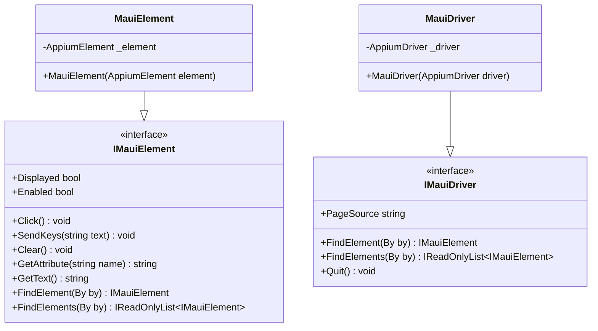
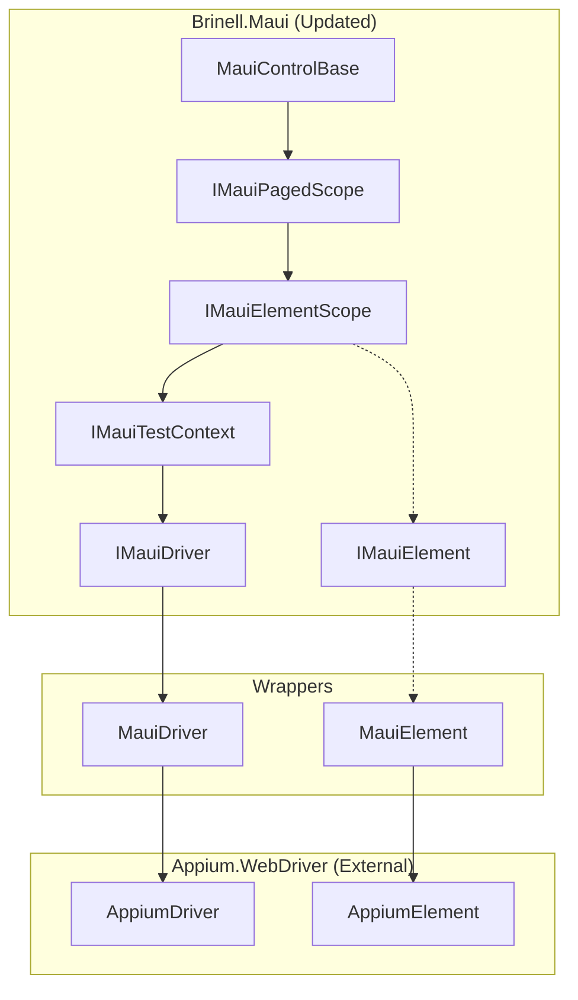

# Design Document: Appium Abstraction Layer

## Overview

This design introduces an abstraction layer over Appium's concrete classes (`AppiumDriver`, `AppiumElement`) to enable unit testing with Moq. The solution uses thin wrapper interfaces that delegate to the underlying Appium types in production, while being fully mockable for testing.

### Key Design Decision

**Keep `IElementScope<TElement>` platform-agnostic** - Rather than changing the core interface, we introduce MAUI-specific element wrapper interfaces that work alongside the existing architecture.

## Steering Document Alignment

### Technical Standards (tech.md)

| Standard | Alignment |
|----------|-----------|
| Interface-Based Design | New `IMauiElement` and `IMauiDriver` interfaces follow this pattern |
| Self-Contained Platforms | All changes confined to Brinell.Maui, no Core changes |
| Minimal External Dependencies | Wraps existing Appium dependency, no new packages |
| Direct Delegation | Wrapper implementations are thin, direct pass-through |

### Project Structure (structure.md)

| Convention | Application |
|------------|-------------|
| Interface naming | `IMauiElement`, `IMauiDriver` (I-prefix + Platform + Purpose) |
| Location | `srcnew/Brinell.Maui/Interfaces/` for interfaces |
| Implementation | `srcnew/Brinell.Maui/Wrappers/` for implementations |
| Test infrastructure | `testsnew/Brinell.Maui.Tests/` uses mocked interfaces |

## Code Reuse Analysis

### Existing Components to Leverage

- **`IMauiElementScope`**: Already abstracts element finding; will be updated to return `IMauiElement`
- **`IMauiTestContext`**: Already provides driver access; will expose `IMauiDriver` instead of raw `AppiumDriver`
- **`IElementScope<TElement>`**: Core interface unchanged; MAUI specializes with `TElement = IMauiElement`

### Integration Points

| Existing Component | Integration Approach |
|-------------------|---------------------|
| `MauiControlBase<TPage>` | Change `AppiumElement` usages to `IMauiElement` |
| `MauiPageObjectBase<TSelf>` | Update element finding to return wrapped elements |
| `MauiContainerBase<TPage>` | Same as above |
| `IMauiPagedScope<TPage>` | Update `IElementScope<AppiumElement>` to `IElementScope<IMauiElement>` |

## Architecture

The abstraction layer sits between Brinell.Maui code and the Appium library:



### Layer Integration



## Components and Interfaces

### Component 1: IMauiElement Interface

**Purpose:** Abstraction over `AppiumElement` for mockability

**File:** `srcnew/Brinell.Maui/Interfaces/IMauiElement.cs`

```csharp
public interface IMauiElement
{
    // State properties
    bool Displayed { get; }
    bool Enabled { get; }
    bool Selected { get; }
    string Text { get; }
    string TagName { get; }
    Point Location { get; }
    Size Size { get; }
    
    // Actions
    void Click();
    void SendKeys(string text);
    void Clear();
    void Submit();
    
    // Attribute access
    string GetAttribute(string attributeName);
    string GetDomAttribute(string attributeName);
    string GetDomProperty(string propertyName);
    string GetCssValue(string propertyName);
    
    // Child element finding
    IMauiElement FindElement(By by);
    IReadOnlyList<IMauiElement> FindElements(By by);
    
    // Escape hatch for advanced scenarios
    AppiumElement UnwrapElement();
}
```

**Dependencies:** OpenQA.Selenium (for `By`, `Point`, `Size`)

### Component 2: IMauiDriver Interface

**Purpose:** Abstraction over `AppiumDriver` for mockability

**File:** `srcnew/Brinell.Maui/Interfaces/IMauiDriver.cs`

```csharp
public interface IMauiDriver
{
    // Element finding at driver level
    IMauiElement FindElement(By by);
    IReadOnlyList<IMauiElement> FindElements(By by);
    
    // Driver state
    string PageSource { get; }
    string CurrentWindowHandle { get; }
    IReadOnlyCollection<string> WindowHandles { get; }
    
    // Session management
    void Quit();
    void Close();
    
    // Screenshots
    Screenshot GetScreenshot();
    
    // Context switching (for hybrid apps)
    string Context { get; set; }
    IReadOnlyCollection<string> Contexts { get; }
    
    // Escape hatch
    AppiumDriver UnwrapDriver();
}
```

**Dependencies:** OpenQA.Selenium (for `By`, `Screenshot`)

### Component 3: MauiElement Implementation

**Purpose:** Production wrapper that delegates to real `AppiumElement`

**File:** `srcnew/Brinell.Maui/Wrappers/MauiElement.cs`

```csharp
public sealed class MauiElement : IMauiElement
{
    private readonly AppiumElement _element;
    
    public MauiElement(AppiumElement element)
    {
        _element = element ?? throw new ArgumentNullException(nameof(element));
    }
    
    public bool Displayed => _element.Displayed;
    public bool Enabled => _element.Enabled;
    // ... all other properties delegate directly
    
    public void Click() => _element.Click();
    public void SendKeys(string text) => _element.SendKeys(text);
    // ... all other methods delegate directly
    
    public IMauiElement FindElement(By by) => new MauiElement(_element.FindElement(by));
    public IReadOnlyList<IMauiElement> FindElements(By by) 
        => _element.FindElements(by).Select(e => new MauiElement(e)).ToList();
    
    public AppiumElement UnwrapElement() => _element;
}
```

### Component 4: MauiDriver Implementation

**Purpose:** Production wrapper that delegates to real `AppiumDriver`

**File:** `srcnew/Brinell.Maui/Wrappers/MauiDriver.cs`

```csharp
public sealed class MauiDriver : IMauiDriver
{
    private readonly AppiumDriver _driver;
    
    public MauiDriver(AppiumDriver driver)
    {
        _driver = driver ?? throw new ArgumentNullException(nameof(driver));
    }
    
    public IMauiElement FindElement(By by) => new MauiElement(_driver.FindElement(by));
    // ... all other methods delegate directly
    
    public AppiumDriver UnwrapDriver() => _driver;
}
```

### Component 5: Updated IMauiTestContext

**Purpose:** Update existing interface to use abstractions

**File:** `srcnew/Brinell.Maui/Interfaces/IMauiTestContext.cs` (modified)

```csharp
public interface IMauiTestContext : ITestContext<IMauiElement>, IMauiElementScope
{
    /// <summary>
    /// Gets the wrapped Appium driver for operations.
    /// </summary>
    IMauiDriver Driver { get; }
    
    // ... existing members
}
```

### Component 6: Updated IMauiElementScope

**Purpose:** Update to use `IMauiElement` instead of `AppiumElement`

**File:** `srcnew/Brinell.Maui/Interfaces/IMauiElementScope.cs` (modified)

```csharp
public interface IMauiElementScope : IElementScope<IMauiElement>
{
    IMauiTestContext Context { get; }
}
```

## Data Models

No new data models required. The wrapper classes are simple delegating proxies without their own state.

## Error Handling

### Error Scenarios

1. **Null element passed to MauiElement constructor**
   - **Handling:** Throw `ArgumentNullException` immediately
   - **User Impact:** Clear stack trace showing where null originated

2. **Element becomes stale during operation**
   - **Handling:** `StaleElementReferenceException` propagates from underlying element
   - **User Impact:** Same behavior as before - exception indicates element is no longer in DOM

3. **Driver connection lost**
   - **Handling:** `WebDriverException` propagates from underlying driver
   - **User Impact:** Same behavior as before

4. **Unwrap called on mock during testing**
   - **Handling:** Mock should be configured to throw or return null
   - **User Impact:** Test failure with clear indication of improper usage

## Testing Strategy

### Unit Testing

With the abstraction layer, unit tests can now:

```csharp
[Fact]
public void Click_ReturnsPageInstance()
{
    // Arrange
    var mockElement = new Mock<IMauiElement>();
    mockElement.Setup(e => e.Displayed).Returns(true);
    mockElement.Setup(e => e.Enabled).Returns(true);
    
    var mockContext = new Mock<IMauiTestContext>();
    mockContext.Setup(c => c.FindElement(It.IsAny<Locator>()))
        .Returns(mockElement.Object);
    
    var page = new TestPage(mockContext.Object);
    
    // Act
    var result = page.TestButton.Click();
    
    // Assert
    Assert.Same(page, result);
    mockElement.Verify(e => e.Click(), Times.Once);
}
```

**Key test areas:**
- Control state methods (`IsExists`, `IsVisible`, `IsEnabled`)
- Control actions (`Click`, `Enter`, `Clear`)
- Fluent chaining return types
- Container scoping behavior

### Integration Testing

Integration tests continue to use real Appium connections:

```csharp
public class RealDeviceTests : IClassFixture<AppiumFixture>
{
    private readonly IMauiTestContext _context;
    
    public RealDeviceTests(AppiumFixture fixture)
    {
        // Fixture creates real MauiDriver wrapping AppiumDriver
        _context = fixture.CreateContext();
    }
    
    [Fact]
    public void Login_WithValidCredentials_NavigatesToHome()
    {
        var loginPage = new LoginPage(_context);
        var homePage = loginPage
            .Username.Enter("testuser")
            .Password.Enter("password")
            .LoginButton.Click()
            .AsPage<HomePage>();
            
        Assert.True(homePage.IsLoaded());
    }
}
```

### End-to-End Testing

No changes to E2E approach - they use real devices/emulators with the abstraction layer being transparent.

## Migration Path

### Phase 1: Add New Interfaces & Wrappers
1. Create `IMauiElement` interface
2. Create `IMauiDriver` interface
3. Create `MauiElement` wrapper
4. Create `MauiDriver` wrapper

### Phase 2: Update Existing Interfaces
1. Update `IMauiElementScope` to use `IMauiElement`
2. Update `IMauiTestContext` to use `IMauiDriver`
3. Update `IMauiPagedScope` accordingly

### Phase 3: Update Implementations
1. Update `MauiTestContext` to create and expose `MauiDriver`
2. Update element finding methods to wrap results in `MauiElement`
3. Update `MauiControlBase` to use `IMauiElement`
4. Update `MauiPageObjectBase` and `MauiContainerBase`

### Phase 4: Update Tests
1. Remove `StubAppiumElement` workaround
2. Update `FluentChainingTests` to mock `IMauiElement`
3. Verify all tests pass

## Files to Create/Modify

| Action | File | Description |
|--------|------|-------------|
| CREATE | `Interfaces/IMauiElement.cs` | Element wrapper interface |
| CREATE | `Interfaces/IMauiDriver.cs` | Driver wrapper interface |
| CREATE | `Wrappers/MauiElement.cs` | Element wrapper implementation |
| CREATE | `Wrappers/MauiDriver.cs` | Driver wrapper implementation |
| MODIFY | `Interfaces/IMauiElementScope.cs` | Change `AppiumElement` to `IMauiElement` |
| MODIFY | `Interfaces/IMauiTestContext.cs` | Change `AppiumDriver` to `IMauiDriver` |
| MODIFY | `Interfaces/IMauiPagedScope.cs` | Update base interface reference |
| MODIFY | `Controls/MauiControlBase.cs` | Use `IMauiElement` |
| MODIFY | `Pages/MauiPageObjectBase.cs` | Use `IMauiElement`, wrap finds |
| MODIFY | `Controls/MauiContainerBase.cs` | Use `IMauiElement`, wrap finds |
| MODIFY | Tests: `FluentChainingTests.cs` | Use mockable interfaces |
| DELETE | `TestInfrastructure/` folder | No longer needed |
