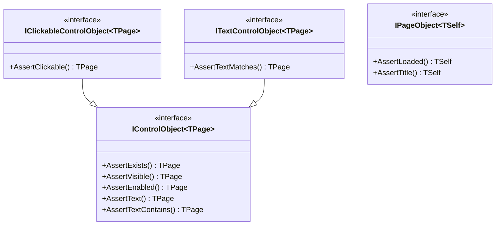

# Design Document: Framework Polish & Consistency

## Overview

This design addresses three consistency issues to improve the Brinell framework's architecture and API fluency:

1. **Centralize Exceptions** - Move 3 exception classes from platform-specific files to `Brinell.Core.Exceptions`
2. **Fluent Assert/Check Methods** - Change return types from `void` to `TPage` for method chaining
3. **Fix Dead Code** - Simplify `DefaultLocatorStrategy` property with identical ternary branches

## Steering Document Alignment

### Technical Standards (tech.md)

| Standard | Alignment |
|----------|-----------|
| Interface-Based Design | Core interfaces will define `TPage` return types for assertions |
| Is/Wait/Check/Assert Pattern | Assert methods returning `TPage` enables chaining within this pattern |
| Self-Contained Platforms | Exceptions move to Core; platforms reference them |

### Project Structure (structure.md)

| Convention | Application |
|------------|-------------|
| Namespace structure | `Brinell.Core.Exceptions` for exception classes |
| File naming | `ElementNotFoundException.cs`, `AssertionException.cs`, `PageLoadException.cs` |
| Folder organization | New `srcnew/Brinell.Core/Exceptions/` folder |

## Code Reuse Analysis

### Existing Components to Leverage

- **Exception definitions** already exist in platform code - just move them
- **Interface method signatures** in `IControlObject`, `IPageObject`, etc. - update return types
- **Implementation patterns** in `MauiControlBase`, `MauiPageObjectBase` - add `return Page;`

### Integration Points

| Existing Component | Integration Approach |
|-------------------|---------------------|
| `Brinell.Core.Interfaces` | Update all `void Assert*` to return generic type |
| `Brinell.Maui.Controls` | Remove local exception defs, import from Core |
| `Brinell.Maui.Pages` | Remove local exception defs, import from Core |
| `Brinell.Maui.Context` | Remove local exception defs, import from Core |

## Architecture

### Change 1: Exception Centralization

```
Before:
  MauiTestContext.cs      → defines ElementNotFoundException
  MauiControlBase.cs      → defines AssertionException  
  MauiPageObjectBase.cs   → defines PageLoadException

After:
  Brinell.Core/Exceptions/
    ├── ElementNotFoundException.cs
    ├── AssertionException.cs
    └── PageLoadException.cs
  
  All platform files → using Brinell.Core.Exceptions;
```

### Change 2: Fluent Assert Methods

The key insight is that interfaces use a generic `TPage` type parameter. Methods can return `TPage` to enable chaining.

```csharp
// Before (IControlObject)
void AssertExists(bool? expected, string? message = null, int? timeoutMs = null);

// After (IControlObject<TPage>)
TPage AssertExists(bool? expected, string? message = null, int? timeoutMs = null);
```

**Interface Hierarchy Impact:**



### Change 3: DefaultLocatorStrategy Fix

```csharp
// Before (dead code)
public LocatorStrategy DefaultLocatorStrategy => Context.Timeouts != null 
    ? LocatorStrategy.AutomationId 
    : LocatorStrategy.AutomationId;

// After (simplified)
public LocatorStrategy DefaultLocatorStrategy => LocatorStrategy.AutomationId;
```

## Components and Interfaces

### Component 1: Exception Classes (New in Core)

**Files to create:**
- `srcnew/Brinell.Core/Exceptions/ElementNotFoundException.cs`
- `srcnew/Brinell.Core/Exceptions/AssertionException.cs`
- `srcnew/Brinell.Core/Exceptions/PageLoadException.cs`

**Structure:**
```csharp
namespace Brinell.Core.Exceptions;

/// <summary>
/// Thrown when an element cannot be found within the expected time.
/// </summary>
public class ElementNotFoundException : Exception
{
    public ElementNotFoundException(string message) : base(message) { }
    public ElementNotFoundException(string message, Exception innerException) 
        : base(message, innerException) { }
}
```

### Component 2: Interface Updates (Core)

**Files to update:**

| Interface File | Methods to Update |
|----------------|-------------------|
| `IControlObject.cs` | `AssertExists`, `AssertVisible`, `AssertEnabled`, `AssertText`, `AssertTextContains` |
| `IClickableControlObject.cs` | `AssertClickable` |
| `ITextControlObject.cs` | `AssertTextMatches` |
| `IEditableTextControlObject.cs` | `AssertPlaceholder`, `AssertReadOnly` |
| `IToggleControlObject.cs` | `Check`, `AssertChecked` |
| `IRangeControlObject.cs` | `AssertValue` |
| `IScrollableControlObject.cs` | `AssertScrollPosition` |
| `ISelectorControlObject.cs` | `AssertSelectedText`, `AssertSelectedIndex`, `AssertItemCount` |
| `IPageObject.cs` | `AssertLoaded`, `AssertTitle` |

**Note:** Interfaces with `TPage` type parameter use `TPage` as return. `IPageObject<TSelf>` uses `TSelf`.

### Component 3: Implementation Updates (MAUI)

**Files to update:**

| File | Changes |
|------|---------|
| `MauiControlBase.cs` | Remove `AssertionException` class, add `return Page;` to asserts |
| `MauiButtonControl.cs` | Add `return Page;` to `AssertClickable` |
| `MauiEntryControl.cs` | Add `return Page;` to text assertion methods |
| `MauiPageObjectBase.cs` | Remove `PageLoadException`, add `return (TSelf)this;` |
| `MauiTestContext.cs` | Remove `ElementNotFoundException` |
| `MauiContainerBase.cs` | Simplify `DefaultLocatorStrategy` |

## Data Models

No new data models required. Exception classes are standard .NET exception patterns.

## Error Handling

### Error Scenarios

1. **Missing using directive after move**
   - **Handling:** Add `using Brinell.Core.Exceptions;` to affected files
   - **Detection:** Build errors will immediately show missing references

2. **Interface/Implementation mismatch**
   - **Handling:** Update implementations to match new interface signatures
   - **Detection:** Build errors for interface implementation mismatches

## Testing Strategy

### Unit Testing

- Existing tests continue to work (return values can be ignored)
- Add new tests verifying assertion methods return correct page type:
  ```csharp
  [Fact]
  public void AssertExists_ReturnsPage_ForChaining()
  {
      SetupMockElement("TestButton");
      var result = _testPage.TestButton.AssertExists(true);
      Assert.Same(_testPage, result);
  }
  ```

### Integration Testing

- Build verification across all target frameworks (net8.0, net9.0, net10.0)
- Ensure exception types resolve correctly from platform projects

### Verification

Run full test suite after changes:
```bash
dotnet build srcnew/Brinell.Core/Brinell.Core.csproj
dotnet build srcnew/Brinell.Maui/Brinell.Maui.csproj
dotnet test testsnew/Brinell.Maui.Tests/Brinell.Maui.Tests.csproj
```

## Implementation Order

1. **Create exception classes in Core** (no breaking changes yet)
2. **Update Core interfaces** (changes return types)
3. **Update MAUI implementations** (add returns, remove local exceptions, fix dead code)
4. **Update tests** (add chaining verification tests)
5. **Build and verify**
