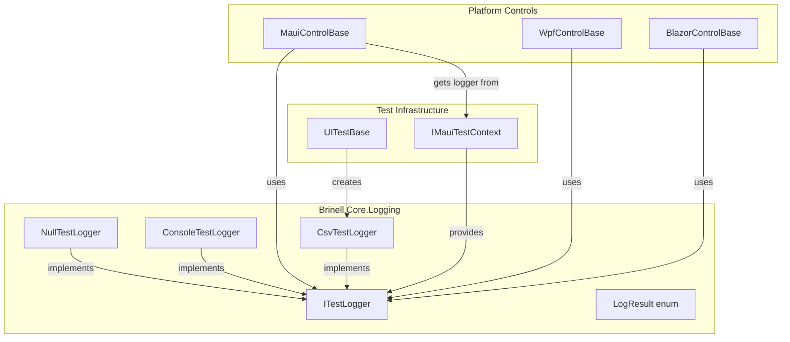
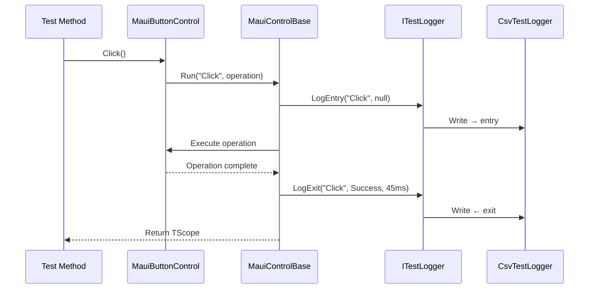
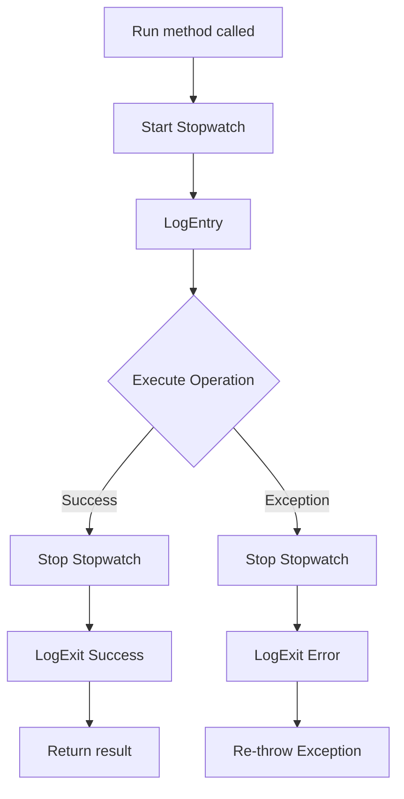

# Design Document: Test Logging and Diagnostics

## Overview

The Test Logging system provides a unified interface for recording all test operations, assertions, and errors in the Brinell framework. It follows an entry/exit pattern that captures operation timing, parameters, and results, outputting to CSV format for analysis.

This design builds upon the existing `ITestLogger` interface in `Brinell.Core.Logging` and extends it with:
- Entry/exit logging pattern with direction indicators
- Duration tracking for all operations
- `CsvTestLogger` implementation for file output
- `Run` and `RunAssert` helper methods for control base classes

## Steering Document Alignment

### Technical Standards (tech.md)

| Standard | Implementation |
|----------|----------------|
| **Interface-based design** | `ITestLogger` interface with multiple implementations |
| **Self-contained platforms** | Each platform uses the same logging interface from Core |
| **Layer separation** | Interface in Brinell.Core, implementations can be platform-specific |
| **Multi-targeting** | Logging uses standard .NET APIs, works on all targets |

### Project Structure (structure.md)

| Convention | Application |
|------------|-------------|
| **Namespace** | `Brinell.Core.Logging` for interface and implementations |
| **Interface naming** | `ITestLogger` (existing) |
| **Class naming** | `CsvTestLogger`, `NullTestLogger` (existing), `ConsoleTestLogger` (existing) |
| **File organization** | `srcnew/Brinell.Core/Logging/` directory |

## Code Reuse Analysis

### Existing Components to Replace

- **`ITestLogger`** (existing): Will be **replaced** with spec-compliant interface
- **`NullTestLogger`** (existing): Will be **rewritten** to implement new interface
- **`ConsoleTestLogger`** (existing): Will be **rewritten** to implement new interface
- **`MauiControlBase<TScope>`**: Control base class where `Run`/`RunAssert` methods will be added

### Integration Points

- **IMauiTestContext**: Provides logger access via `Context.Logger`
- **Control base classes**: All `MauiControlBase`, `MauiButtonControl`, etc. will use `Run` pattern
- **Test base classes**: Will configure logger per test session

### Breaking Changes

| Component | Change |
|-----------|--------|
| `ITestLogger` | Complete interface replacement - all methods change |
| `NullTestLogger` | Rewrite to implement new interface |
| `ConsoleTestLogger` | Rewrite to implement new interface |
| Any custom loggers | Must implement new interface |

## Architecture

### Component Diagram



### Logging Flow Diagram



## Components and Interfaces

### Component 1: LogResult Enumeration

- **Purpose**: Categorize log entry results
- **Location**: `Brinell.Core/Logging/LogResult.cs`

```csharp
public enum LogResult
{
    Success,    // Operation completed successfully
    Fail,       // Assertion/condition not met
    Error,      // Exception occurred
    Info,       // Informational message
    Warning     // Potential issue detected
}
```

### Component 2: ITestLogger Interface (Replacement)

- **Purpose**: Define complete logging contract with entry/exit pattern
- **Location**: `Brinell.Core/Logging/ITestLogger.cs`
- **Action**: **Replace existing interface entirely**

```csharp
public interface ITestLogger : IDisposable
{
    // Core log method - all others delegate to this
    void Log(
        string testName,
        string pageName,
        string controlId,
        string action,
        string? value,
        string? expectedValue,
        LogResult result,
        string? message);
    
    // Entry logging (before operation)
    void LogEntry(
        string testName,
        string pageName,
        string controlId,
        string action,
        string? value);
    
    // Exit logging (after operation)
    void LogExit(
        string testName,
        string pageName,
        string controlId,
        string action,
        LogResult result,
        int durationMs,
        string? message = null);
    
    // Assertion exit logging (includes expected/actual)
    void LogAssertExit(
        string testName,
        string pageName,
        string controlId,
        string assertType,
        string? actualValue,
        string? expectedValue,
        LogResult result,
        int durationMs,
        string? message = null);
    
    // Convenience methods (delegate to Log)
    void LogAction(string testName, string pageName, string controlId, string action, string? value = null);
    void LogAssertPass(string testName, string pageName, string controlId, string assertType, string? actualValue, string? expectedValue);
    void LogAssertFail(string testName, string pageName, string controlId, string assertType, string? actualValue, string? expectedValue, string? message = null);
    void LogWait(string testName, string pageName, string controlId, string waitType, bool success, int elapsedMs);
    void LogNavigation(string testName, string sourcePage, string targetPage);
    void LogInfo(string testName, string pageName, string message);
    void LogError(string testName, string pageName, string controlId, string action, Exception ex);
    
    // Flush to disk
    void Flush();
}
```

### Component 3: CsvTestLogger Implementation

- **Purpose**: Write structured log entries to CSV file
- **Location**: `Brinell.Core/Logging/CsvTestLogger.cs`
- **Dependencies**: System.IO, LogResult enum

**Key characteristics:**
- Thread-safe using lock object
- Creates output directory if not exists
- Writes header on first entry
- Semicolon delimiter (European CSV standard)
- ISO 8601 timestamps
- Direction indicators (→ for entry, ← for exit)

### Component 4: Run/RunAssert Helper Methods

- **Purpose**: Wrap operations with automatic entry/exit logging
- **Location**: Added to each platform's control base class
- **Pattern**: Template method with stopwatch timing

**Run overloads:**
```csharp
// No value parameter
protected void Run(string action, Action operation)

// With typed value
protected void Run<T>(string action, T? value, Action operation)

// Returns result
protected TResult Run<TResult>(string action, Func<TResult> operation)

// With value, returns result
protected TResult Run<TValue, TResult>(string action, TValue? value, Func<TResult> operation)
```

**RunAssert overloads:**
```csharp
// Default equality comparison
protected void RunAssert<T>(string assertType, T? expected, Func<T?> getActual, string? message = null)

// Custom comparison function
protected void RunAssert<T>(string assertType, T? expected, Func<T?> getActual, 
    Func<T?, T?, bool> compare, string? message = null)
```

## Data Models

### CSV Log Entry Schema

```
Column          | Type      | Description
----------------|-----------|----------------------------------
Timestamp       | string    | ISO 8601 format (2026-01-14T15:30:45.123)
Direction       | string    | → (entry) or ← (exit)
TestName        | string    | Current test method name
PageName        | string    | Current page object name
ControlId       | string    | Control's AutomationId or locator
Action          | string    | Operation name (Click, Enter, AssertText)
Value           | string?   | Input value or actual value
Expected        | string?   | Expected value (assertions only)
Result          | string?   | Success, Fail, Error, Info, Warning
DurationMs      | int?      | Operation duration (exit only)
Message         | string?   | Additional context or error message
```

### Example CSV Output

```csv
Timestamp;Direction;TestName;PageName;ControlId;Action;Value;Expected;Result;DurationMs;Message
2026-01-14T15:30:45.100;→;LoginTest;LoginPage;UsernameEntry;Enter;john.doe;;;;
2026-01-14T15:30:45.150;←;LoginTest;LoginPage;UsernameEntry;Enter;;;Success;50;
2026-01-14T15:30:45.200;→;LoginTest;LoginPage;PasswordEntry;Enter;****;;;;
2026-01-14T15:30:45.250;←;LoginTest;LoginPage;PasswordEntry;Enter;;;Success;50;
2026-01-14T15:30:45.300;→;LoginTest;LoginPage;LoginButton;Click;;;;;
2026-01-14T15:30:45.400;←;LoginTest;LoginPage;LoginButton;Click;;;Success;100;
2026-01-14T15:30:48.000;→;LoginTest;HomePage;WelcomeLabel;AssertTextEquals;;Hello, John;;;
2026-01-14T15:30:48.050;←;LoginTest;HomePage;WelcomeLabel;AssertTextEquals;Hello, John;Hello, John;Success;50;
```

## Error Handling

### Error Scenarios

1. **File system write failure**
   - **Handling**: Catch IOException, log to console as fallback, don't fail test
   - **User Impact**: Test continues, warning message shown

2. **Directory creation failure**
   - **Handling**: Try to create directory, throw if cannot
   - **User Impact**: Test fails early with clear error message

3. **Operation throws exception**
   - **Handling**: `Run` method catches, logs with Error result, re-throws
   - **User Impact**: Exception preserved, but logged before propagation

4. **Null logger reference**
   - **Handling**: Use `NullTestLogger.Instance` as default
   - **User Impact**: No impact - operations proceed without logging

5. **Invalid timestamp format**
   - **Handling**: Use `DateTime.Now.ToString("O")` for ISO 8601
   - **User Impact**: None - format is deterministic

### Exception Flow in Run Method



## Testing Strategy

### Unit Testing

**Target: `CsvTestLogger`**
- Test header written on first entry only
- Test CSV escaping (semicolons, quotes, newlines)
- Test thread safety with concurrent writes
- Test flush and dispose behavior
- Test directory creation

**Target: `Run` methods**
- Test entry/exit logging called correctly
- Test duration measurement accuracy
- Test exception logging and re-throw
- Test with mock logger

**Target: `RunAssert` methods**
- Test pass case logs Success
- Test fail case logs Fail and throws
- Test custom comparison function
- Test nullable expected values

### Integration Testing

**Target: Control + Logger integration**
- Test `MauiButtonControl.Click()` logs correctly
- Test `MauiEntryControl.Enter()` logs value
- Test assertion methods log expected/actual
- Test wait methods log elapsed time

**Target: File output**
- Test CSV file created at expected path
- Test file readable and parseable
- Test multiple tests write to same file correctly

### End-to-End Testing

**Target: Complete test execution**
- Run sample test suite with logging enabled
- Verify CSV output contains all operations
- Verify timestamps are chronological
- Verify duration values are reasonable
- Parse CSV and verify filtering works

## Implementation Notes

### No Backward Compatibility

The existing `ITestLogger` interface will be **completely replaced**. All implementations must be rewritten:
- `NullTestLogger` - Empty implementations for all methods
- `ConsoleTestLogger` - Console-formatted output for all methods
- `CsvTestLogger` - New implementation per spec

Any external code using the old interface will need to be updated.

### Performance Considerations

- Use `StringBuilder` for CSV line construction
- Lock only during actual file write, not during string building
- Consider `StreamWriter` buffering vs. immediate flush trade-off
- Default: buffer, flush on test completion or every N entries

### Thread Safety Pattern

```csharp
private readonly object _lock = new();

public void LogEntry(...)
{
    var line = BuildCsvLine(...);  // Outside lock
    lock (_lock)
    {
        _writer.WriteLine(line);   // Inside lock
    }
}
```

## Traceability Matrix

| Requirement | Design Component |
|-------------|------------------|
| REQ-LOG-001 | Extended `ITestLogger` interface |
| REQ-LOG-002 | `CsvTestLogger` CSV format |
| REQ-LOG-003 | `LogEntry`/`LogExit` methods, Direction column |
| REQ-LOG-004 | `Run` methods in control base |
| REQ-LOG-005 | `RunAssert` methods in control base |
| REQ-LOG-006 | `LogResult` enumeration |
| REQ-LOG-007 | Convenience methods in `ITestLogger` |
| REQ-LOG-008 | Test base class integration (future task) |
