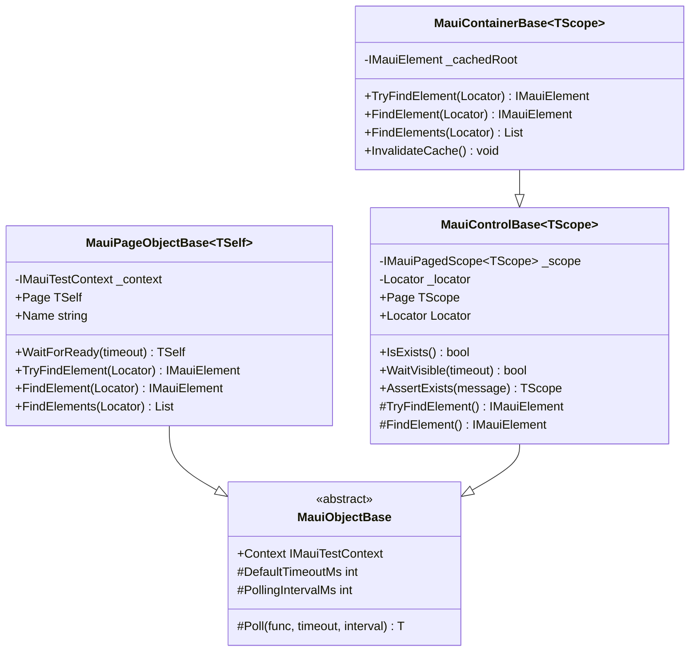

# Design Document v2: Scope Control Refactor

## Overview

This design introduces `MauiObjectBase` as a common base class providing shared utilities (Context access, Poll helper, timeout settings) that both `MauiPageObjectBase` and `MauiControlBase` inherit from. The factory methods (`Button()`, `Entry()`, `Container()`) are removed from the base classes - test writers define their own control properties.

**Key Change from v1:** Instead of trying to share scope behavior (which differs between page/container), we share the common utilities that all MAUI objects need.

## Class Hierarchy

```
MauiObjectBase (abstract)
├── Abstract: IMauiTestContext Context
├── Protected: Poll(func, timeout, interval)
├── Protected: DefaultTimeoutMs, PollingIntervalMs
│
├── MauiPageObjectBase<TSelf> : MauiObjectBase, IPageObject, IMauiPagedScope<TSelf>
│   ├── Override: Context (owns the context)
│   ├── Implements: IMauiPagedScope (TryFindElement delegates to context)
│   └── Implements: IPageObject (Name, WaitForReady, TakeScreenshot)
│
└── MauiControlBase<TScope> : MauiObjectBase, IControlObject
    ├── Override: Context (from scope)
    ├── Has: IMauiPagedScope<TScope> _scope
    ├── Has: Locator _locator
    ├── Implements: IControlObject (IsExists, WaitVisible, etc.)
    │
    └── MauiContainerBase<TScope> : MauiControlBase<TScope>, IMauiPagedScope<TScope>
        ├── Implements: IMauiPagedScope (TryFindElement searches within container root)
        └── Has: Container root caching
```

## Architecture Diagram



## Components

### Component 1: MauiObjectBase (New)

**Purpose:** Abstract base class providing shared utilities for all MAUI objects (pages and controls).

**Location:** `srcnew/Brinell.Maui/MauiObjectBase.cs`

```csharp
namespace Brinell.Maui;

/// <summary>
/// Base class for all MAUI objects providing shared utilities.
/// </summary>
public abstract class MauiObjectBase
{
    /// <summary>
    /// Gets the MAUI test context.
    /// </summary>
    protected abstract IMauiTestContext Context { get; }
    
    /// <summary>
    /// Gets the default timeout in milliseconds.
    /// </summary>
    protected int DefaultTimeoutMs => Context.Timeouts.DefaultWait;
    
    /// <summary>
    /// Gets the polling interval in milliseconds.
    /// </summary>
    protected int PollingIntervalMs => Context.Timeouts.PollingInterval;
    
    /// <summary>
    /// Polls a function until it returns a non-default value or timeout.
    /// </summary>
    protected T? Poll<T>(Func<T?> func, int? timeoutMs = null, int? intervalMs = null)
    {
        var timeout = timeoutMs ?? DefaultTimeoutMs;
        var interval = intervalMs ?? PollingIntervalMs;
        var stopwatch = Stopwatch.StartNew();
        
        while (stopwatch.ElapsedMilliseconds < timeout)
        {
            var result = func();
            if (!EqualityComparer<T>.Default.Equals(result, default))
            {
                return result;
            }
            Thread.Sleep(interval);
        }
        
        return default;
    }
}
```

### Component 2: MauiPageObjectBase Updates

**Changes:**
- Inherits from `MauiObjectBase`
- Overrides `Context` property (owns the context)
- **Removes** factory methods (`Button()`, `Entry()`, `Container()`, `Control<T>()`)
- Keeps `IMauiPagedScope<TSelf>` implementation

```csharp
public abstract class MauiPageObjectBase<TSelf> : MauiObjectBase, IPageObject<IMauiElement>, IMauiPagedScope<TSelf>
    where TSelf : MauiPageObjectBase<TSelf>
{
    private readonly IMauiTestContext _context;
    
    protected MauiPageObjectBase(IMauiTestContext context)
    {
        _context = context ?? throw new ArgumentNullException(nameof(context));
    }
    
    /// <inheritdoc />
    protected override IMauiTestContext Context => _context;
    
    // ... rest of IPageObject and IMauiPagedScope implementation
    // Factory methods REMOVED
}
```

### Component 3: MauiControlBase Updates

**Changes:**
- Inherits from `MauiObjectBase`
- Overrides `Context` property (gets from scope)
- `Poll()` method removed (inherited from base)

```csharp
public class MauiControlBase<TScope> : MauiObjectBase, IControlObject
    where TScope : IPageObject
{
    private readonly IMauiPagedScope<TScope> _scope;
    private readonly Locator _locator;
    
    public MauiControlBase(IMauiPagedScope<TScope> scope, Locator locator)
    {
        _scope = scope ?? throw new ArgumentNullException(nameof(scope));
        _locator = locator ?? throw new ArgumentNullException(nameof(locator));
    }
    
    /// <inheritdoc />
    protected override IMauiTestContext Context => _scope.Context;
    
    // ... rest of IControlObject implementation
}
```

### Component 4: MauiContainerBase Updates

**Changes:**
- **Removes** factory methods (`Button()`, `Entry()`, `Container()`, `Control<T>()`)
- Keeps `IMauiPagedScope<TScope>` implementation with container-scoped search

```csharp
public class MauiContainerBase<TScope> : MauiControlBase<TScope>, IContainerControl<IMauiElement>, IMauiPagedScope<TScope>
    where TScope : IPageObject
{
    // Container root caching unchanged
    // IMauiPagedScope implementation unchanged
    // Factory methods REMOVED
}
```

## What Gets Removed

### From MauiPageObjectBase
```csharp
// REMOVED - test writers define their own control properties
protected MauiButtonControl<TSelf> Button(Locator locator) { ... }
protected MauiEntryControl<TSelf> Entry(Locator locator) { ... }
protected MauiContainerBase<TSelf> Container(Locator locator) { ... }
protected TControl Control<TControl>(Locator locator) where TControl : MauiControlBase<TSelf> { ... }
```

### From MauiContainerBase
```csharp
// REMOVED - test writers define their own control properties
public MauiButtonControl<TScope> Button(Locator locator) { ... }
public MauiEntryControl<TScope> Entry(Locator locator) { ... }
public MauiContainerBase<TScope> Container(Locator locator) { ... }
public TControl Control<TControl>(Locator locator) where TControl : MauiControlBase<TScope> { ... }
```

## What Gets Shared (via MauiObjectBase)

| Member | Type | Purpose |
|--------|------|---------|
| `Context` | abstract property | Access to test context |
| `DefaultTimeoutMs` | property | Timeout from settings |
| `PollingIntervalMs` | property | Polling interval from settings |
| `Poll<T>()` | method | Polling helper for Wait methods |

## What Stays Different (IMauiElementScope)

The `TryFindElement(Locator)`, `FindElement(Locator)`, and `FindElements(Locator)` methods **cannot** be shared because they have fundamentally different implementations:

| Class | Scope Search Behavior |
|-------|----------------------|
| `MauiPageObjectBase` | Delegates to `_context.TryFindElement(locator)` → searches from **driver root** (whole screen) |
| `MauiContainerBase` | Searches within `_cachedRoot.FindElement(by)` → scoped to **container element** only |

Both implement `IMauiPagedScope<T>` but with different search scopes:

```csharp
// MauiPageObjectBase - searches entire screen
public IMauiElement? TryFindElement(Locator locator)
{
    return _context.TryFindElement(locator);  // Driver root
}

// MauiContainerBase - searches within container
public IMauiElement? TryFindElement(Locator locator)
{
    var rootElement = TryGetContainerRoot();
    if (rootElement == null) return null;
    return rootElement.FindElement(locator.ToBy());  // Container root
}
```

**Note:** `MauiControlBase` does NOT implement `IMauiElementScope` - it only has `protected TryFindElement()` (no parameter) that uses its own `_locator`.

## Usage Pattern After Refactor

Test writers define their own controls as properties:

```csharp
public class LoginPage : MauiPageObjectBase<LoginPage>
{
    public LoginPage(IMauiTestContext context) : base(context) { }
    
    public override string Name => "Login Page";
    
    // Test writers define controls explicitly
    public MauiEntryControl<LoginPage> UsernameEntry 
        => new(this, Locator.AutomationId("UsernameEntry"));
    
    public MauiEntryControl<LoginPage> PasswordEntry 
        => new(this, Locator.AutomationId("PasswordEntry"));
    
    public MauiButtonControl<LoginPage> LoginButton 
        => new(this, Locator.AutomationId("LoginButton"));
}

// Usage
loginPage
    .UsernameEntry.Enter("user@example.com")
    .PasswordEntry.Enter("password123")
    .LoginButton.Click();
```

## Testing Strategy

### Unit Tests
- `MauiObjectBase`: Test `Poll()` helper with various scenarios
- Verify `Context`, `DefaultTimeoutMs`, `PollingIntervalMs` work correctly

### Integration Tests
- Existing tests should pass after removing factory method calls
- Tests need to update to use explicit control properties

## Implementation Tasks

1. Create `MauiObjectBase` abstract base class
2. Update `MauiPageObjectBase` to inherit from `MauiObjectBase` and remove factory methods
3. Update `MauiControlBase` to inherit from `MauiObjectBase`
4. Update `MauiContainerBase` to remove factory methods
5. Update any test/sample code that uses the removed factory methods
6. Build and run tests
