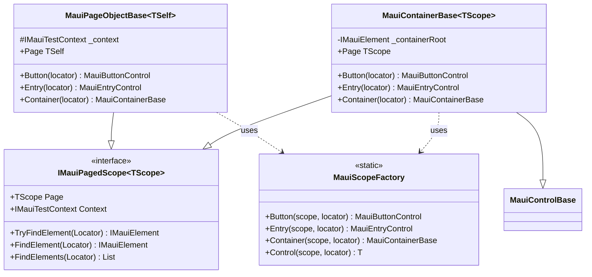

# Design Document: Scope Control Refactor

## Overview

This refactor introduces `MauiScopeBase<TScope>` as a common base class for `MauiPageObjectBase` and `MauiContainerBase`. Both classes implement `IMauiPagedScope<T>` and share identical factory methods for creating child controls. By extracting this into a base class, we eliminate duplication and enable more flexible scoping patterns.

**Key Insight**: The generic parameter on controls should represent "the scope I return to" not "the page I belong to". This allows:
- Page controls → return to page (current behavior)
- Container controls → return to container (new capability)

## Steering Document Alignment

### Technical Standards (tech.md)
- **Interface-Based Design**: Maintains existing interface contracts (`IMauiPagedScope<T>`)
- **Control Object Pattern**: Controls continue to use typed scope for fluent chaining
- **Self-Contained Platforms**: Changes are isolated to Brinell.Maui

### Project Structure (structure.md)
- **Base Classes**: Following naming convention with `Base` suffix → `MauiScopeBase`
- **Namespace**: `Brinell.Maui.Scopes` for the new base class
- **File Location**: `srcnew/Brinell.Maui/Scopes/MauiScopeBase.cs`

## Code Reuse Analysis

### Existing Components to Leverage
- **`IMauiPagedScope<TPage>`**: No changes needed - already defines the scope contract
- **`MauiControlBase<TPage>`**: No interface changes - just consumes any `IMauiPagedScope<TPage>`
- **Factory method patterns**: Extract and make virtual

### Current Duplication Between Classes

| Method/Property | MauiPageObjectBase | MauiContainerBase |
|-----------------|-------------------|-------------------|
| `Button(Locator)` | ✅ | ✅ |
| `Entry(Locator)` | ✅ | ✅ |
| `Container(Locator)` | ✅ | ✅ |
| `Control<T>(Locator)` | ✅ | ✅ |
| `Poll(Func, int, int)` | ✅ (in ControlBase) | via inheritance |
| `IMauiElementScope` implementation | ✅ | ✅ |

## Architecture

### Current Class Hierarchy

```
IPageObject<TElement>                    IContainerControl<TElement>
         ↑                                         ↑
MauiPageObjectBase<TSelf> ←── IMauiPagedScope<TSelf>    MauiControlBase<TPage>
                                                              ↑
                              IMauiPagedScope<TPage> ←── MauiContainerBase<TPage>
```

**Problems:**
1. No shared base between page and container
2. Factory methods duplicated
3. `TPage` constraint means containers always return page, not themselves

### New Class Hierarchy

```
                            MauiScopeBase<TScope>
                       (abstract, implements IMauiPagedScope<TScope>)
                       (factory methods: Button, Entry, Container, Control)
                                    ↑
               ┌────────────────────┴────────────────────┐
               ↓                                         ↓
MauiPageObjectBase<TSelf>                    MauiContainerBase<TScope>
(adds: Context property, IPageObject)        (adds: ControlBase behavior, caching)
(inherits: MauiScopeBase<TSelf>)             (inherits: MauiScopeBase<TScope> + MauiControlBase)
```

### Design Decision: Composition over Complex Inheritance

Since C# doesn't support multiple inheritance, `MauiContainerBase` cannot directly extend both `MauiScopeBase` and `MauiControlBase`. 

**Option A: Duplicate control behavior in scope base** ❌
- Moves control code into scope, inappropriate

**Option B: Container implements scope interface directly** ← Current design
- Container extends `MauiControlBase` (it's a control)
- Container implements `IMauiPagedScope` (it's a scope)
- Duplicates factory methods

**Option C (Selected): Extract factory methods to extension/helper** ✅
- Create `MauiScopeFactory` static class with factory methods
- Both page and container delegate to factory
- Single source of truth for control creation

### Final Architecture



## Components and Interfaces

### Component 1: MauiScopeFactory (New)
- **Purpose**: Centralized factory for creating controls within any scope
- **Location**: `srcnew/Brinell.Maui/Scopes/MauiScopeFactory.cs`
- **Interfaces**: Static methods for each control type
- **Dependencies**: Control constructors, `IMauiPagedScope<TScope>`

```csharp
namespace Brinell.Maui.Scopes;

/// <summary>
/// Factory methods for creating controls within a scope.
/// Centralizes control creation logic used by pages and containers.
/// </summary>
public static class MauiScopeFactory
{
    public static MauiButtonControl<TScope> Button<TScope>(
        IMauiPagedScope<TScope> scope, 
        Locator locator)
        where TScope : IPageObject
        => new(scope, locator);

    public static MauiEntryControl<TScope> Entry<TScope>(
        IMauiPagedScope<TScope> scope, 
        Locator locator)
        where TScope : IPageObject
        => new(scope, locator);

    public static MauiContainerBase<TScope> Container<TScope>(
        IMauiPagedScope<TScope> scope, 
        Locator locator)
        where TScope : IPageObject
        => new(scope, locator);

    public static TControl Control<TScope, TControl>(
        IMauiPagedScope<TScope> scope, 
        Locator locator)
        where TScope : IPageObject
        where TControl : MauiControlBase<TScope>
        => (TControl)Activator.CreateInstance(typeof(TControl), scope, locator)!;
}
```

### Component 2: MauiPageObjectBase Updates
- **Purpose**: Base class for page objects using CRTP
- **Changes**: Delegate factory methods to `MauiScopeFactory`
- **Virtual Methods**: `Button()`, `Entry()`, `Container()` become virtual

```csharp
// Updated implementation - delegates to factory
public virtual MauiButtonControl<TSelf> Button(Locator locator)
    => MauiScopeFactory.Button(this, locator);

public virtual MauiEntryControl<TSelf> Entry(Locator locator)
    => MauiScopeFactory.Entry(this, locator);

public virtual MauiContainerBase<TSelf> Container(Locator locator)
    => MauiScopeFactory.Container(this, locator);
```

### Component 3: MauiContainerBase Updates
- **Purpose**: Container control that also acts as a scope
- **Changes**: 
  - Generic parameter renamed from `TPage` to `TScope` (clearer intent)
  - Delegate factory methods to `MauiScopeFactory`
  - Factory methods become virtual

```csharp
// Generic parameter change
public class MauiContainerBase<TScope> : MauiControlBase<TScope>, 
    IContainerControl<IMauiElement>, 
    IMauiPagedScope<TScope>
    where TScope : IPageObject
```

### Component 4: MauiControlBase Consideration
- **Current**: `MauiControlBase<TPage>` where `TPage : IPageObject`
- **Change**: Rename to `TScope` for clarity (optional, semantic only)
- **Behavior**: Unchanged - controls still accept any scope implementing `IMauiPagedScope`

## Self-Scoped Containers (Future Enhancement)

With this design, we can later support self-scoped containers:

```csharp
// Current: Container returns page
var page = myPage.Container("form").Button("submit").Click();
// page is TPage (the original page)

// Future: Self-scoped container (inherits from MauiContainerBase)
public class MyFormContainer : MauiContainerBase<MyFormContainer>
{
    // Child controls return MyFormContainer, not the page
}

var container = myPage.MyForm.Button("submit").Click();
// container is MyFormContainer
```

This requires:
1. Containers use CRTP pattern like pages
2. A way to create self-referential container scopes
3. Navigation back to parent scope when needed

**Out of scope for this spec** - documented for future reference.

## Error Handling

### Error Scenarios
1. **Factory creates wrong control type**
   - **Handling**: `Activator.CreateInstance` throws if constructor signature mismatch
   - **User Impact**: Clear exception with type names

2. **Scope cast fails**
   - **Handling**: Explicit cast throws `InvalidCastException`
   - **User Impact**: Clear exception message

## Testing Strategy

### Unit Testing
- **MauiScopeFactory**: Test each factory method creates correct control type
- **Virtual method overrides**: Test that subclasses can override factory methods

### Integration Testing
- **Page controls**: Verify page-scoped controls still work (regression)
- **Container controls**: Verify container-scoped controls work
- **Nested scopes**: Test page → container → nested control chains

### End-to-End Testing
- Existing tests should pass unchanged (backward compatibility)
- No new E2E tests required for this refactor

## Implementation Tasks

1. Create `MauiScopeFactory` static class with factory methods
2. Update `MauiPageObjectBase` to use factory and make methods virtual
3. Update `MauiContainerBase` to use factory and make methods virtual
4. Add unit tests for factory methods
5. Run existing tests to verify backward compatibility
