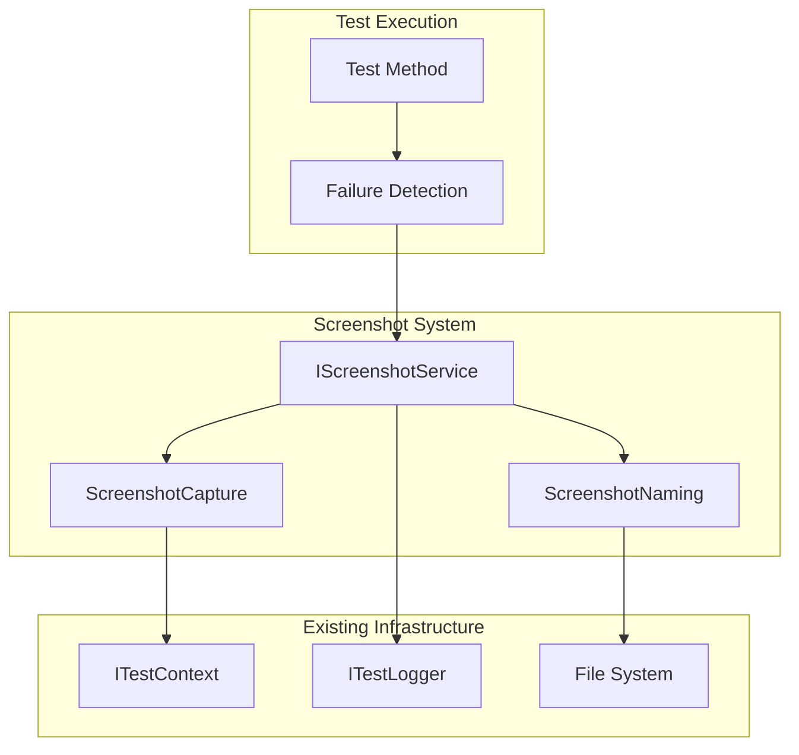
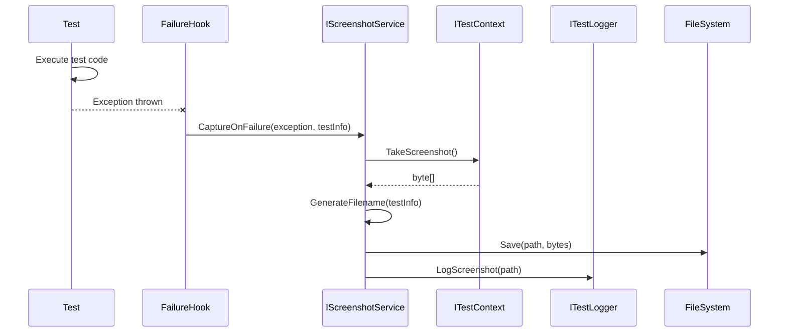

# SPEC-016: Screenshot Evidence on Failure - Design Document

**Spec ID:** 016  
**Phase:** Design  
**Created:** 2025-01-20  
**Status:** Design Complete  

---

## 1. Overview

This design adds automatic screenshot capture when tests fail, eliminating the need for manual screenshot placement in test code. The implementation leverages xUnit's test lifecycle hooks and extends existing screenshot infrastructure with configuration options and standardized naming.

**Key Design Goals:**
- Zero test code changes required for automatic capture
- Configurable behavior via settings
- Consistent file naming for easy debugging
- Integration with existing `ITestLogger` and `ITestContext`

---

## 2. Steering Document Alignment

### Technical Standards (tech.str.spx.md)
- **Interface-based design**: New `IScreenshotService` abstraction
- **Four-layer architecture**: Core interface → Platform implementation
- **Configuration pattern**: Extends existing settings approach
- **xUnit integration**: Uses `IAsyncLifetime` or `BeforeAfterTestAttribute`

### Project Structure (structure.str.spx.md)
- **Naming conventions**: Is/Wait/Check/Assert pattern respected (screenshot is action, not state)
- **File organization**: Interface in Core, implementation in platform projects
- **Dependency direction**: Core → no dependencies, Platform → Core

---

## 3. Code Reuse Analysis

### Existing Components to Leverage

| Component | Location | Usage |
|-----------|----------|-------|
| `ITestContext.TakeScreenshot()` | `Brinell.Core.Interfaces` | Already returns `byte[]` - reuse as core capture |
| `ITestContext.SaveScreenshot()` | `Brinell.Core.Interfaces` | Already saves to path - extend with naming |
| `MauiTestContext` | `Brinell.Maui.Context` | Implements via `_rawDriver.GetScreenshot()` |
| `ITestLogger` | `Brinell.Core.Logging` | Add `LogScreenshot()` method for traceability |
| `TimeoutSettings` | `Brinell.Core.Configuration` | Pattern to follow for new settings class |
| `AppiumFixture` | `testsnew/Brinell.Maui.UITests` | Integration point for failure hooks |

### Integration Points
- **xUnit lifecycle**: `BeforeAfterTestAttribute` or wrapper around test execution
- **FluentAssertions**: Exception interception for assertion failures
- **ITestLogger**: Log screenshot capture events
- **File system**: Standard `System.IO` for directory creation and file save

---

## 4. Architecture

### High-Level Design



### Component Interaction



---

## 5. Components and Interfaces

### 5.1 ScreenshotSettings (New)

**Location:** `Brinell.Core/Configuration/ScreenshotSettings.cs`

```csharp
public class ScreenshotSettings
{
    /// <summary>Output directory for screenshots.</summary>
    public string OutputDirectory { get; set; } = "./TestResults/Screenshots";
    
    /// <summary>Screenshot image format.</summary>
    public ScreenshotFormat Format { get; set; } = ScreenshotFormat.Png;
    
    /// <summary>JPEG quality (1-100) when Format is Jpeg.</summary>
    public int JpegQuality { get; set; } = 85;
    
    /// <summary>Whether to capture screenshots on test failure.</summary>
    public bool CaptureOnFailure { get; set; } = true;
    
    /// <summary>Whether to include timestamp in filename.</summary>
    public bool IncludeTimestamp { get; set; } = true;
    
    /// <summary>Default settings.</summary>
    public static ScreenshotSettings Default => new();
}

public enum ScreenshotFormat
{
    Png,
    Jpeg
}
```

### 5.2 IScreenshotService (New)

**Location:** `Brinell.Core/Interfaces/IScreenshotService.cs`

```csharp
public interface IScreenshotService
{
    /// <summary>Capture and save a screenshot with auto-generated name.</summary>
    string Capture(string? description = null);
    
    /// <summary>Capture and save a screenshot with specific name.</summary>
    string Capture(string testClass, string testMethod, string description);
    
    /// <summary>Capture screenshot on test failure.</summary>
    string CaptureOnFailure(string testClass, string testMethod, Exception exception);
    
    /// <summary>Current screenshot settings.</summary>
    ScreenshotSettings Settings { get; }
}
```

### 5.3 ScreenshotService (New)

**Location:** `Brinell.Core/Services/ScreenshotService.cs`

```csharp
public class ScreenshotService : IScreenshotService
{
    private readonly ITestContext _context;
    private readonly ITestLogger _logger;
    private readonly ScreenshotSettings _settings;
    
    public ScreenshotService(
        ITestContext context, 
        ITestLogger logger,
        ScreenshotSettings? settings = null)
    {
        _context = context;
        _logger = logger;
        _settings = settings ?? ScreenshotSettings.Default;
    }
    
    public string Capture(string? description = null)
    {
        var filename = GenerateFilename("Manual", "Capture", description ?? "screenshot");
        return CaptureAndSave(filename);
    }
    
    public string Capture(string testClass, string testMethod, string description)
    {
        var filename = GenerateFilename(testClass, testMethod, description);
        return CaptureAndSave(filename);
    }
    
    public string CaptureOnFailure(string testClass, string testMethod, Exception exception)
    {
        if (!_settings.CaptureOnFailure) return string.Empty;
        
        var description = GetFailureDescription(exception);
        var filename = GenerateFilename(testClass, testMethod, description);
        return CaptureAndSave(filename);
    }
    
    private string GenerateFilename(string testClass, string testMethod, string description)
    {
        var timestamp = _settings.IncludeTimestamp 
            ? $"_{DateTime.Now:yyyyMMdd_HHmmss}" 
            : "";
        var ext = _settings.Format == ScreenshotFormat.Png ? "png" : "jpg";
        return $"{testClass}_{testMethod}{timestamp}_{description}.{ext}";
    }
    
    private string CaptureAndSave(string filename)
    {
        EnsureDirectoryExists();
        var path = Path.Combine(_settings.OutputDirectory, filename);
        _context.SaveScreenshot(path);
        _logger.LogInfo("", "", $"Screenshot saved: {path}");
        return path;
    }
    
    private static string GetFailureDescription(Exception ex) => ex switch
    {
        AssertionException => "assertion_failure",
        ElementNotFoundException => "element_not_found",
        TimeoutException => "timeout",
        _ => "exception"
    };
}
```

### 5.4 ScreenshotTestAttribute (New - xUnit Hook)

**Location:** `Brinell.Core/Testing/ScreenshotTestAttribute.cs`

```csharp
/// <summary>
/// xUnit attribute that captures screenshots on test failure.
/// Apply to test class or method.
/// </summary>
public class ScreenshotTestAttribute : BeforeAfterTestAttribute
{
    private static AsyncLocal<IScreenshotService?> _screenshotService = new();
    private static AsyncLocal<string?> _currentTestClass = new();
    private static AsyncLocal<string?> _currentTestMethod = new();
    
    public static void SetService(IScreenshotService service) 
        => _screenshotService.Value = service;
    
    public override void Before(MethodInfo methodUnderTest)
    {
        _currentTestClass.Value = methodUnderTest.DeclaringType?.Name;
        _currentTestMethod.Value = methodUnderTest.Name;
    }
    
    public override void After(MethodInfo methodUnderTest)
    {
        // Screenshot captured in exception handler, not here
        _currentTestClass.Value = null;
        _currentTestMethod.Value = null;
    }
    
    /// <summary>
    /// Call from test fixture to capture screenshot on any exception.
    /// </summary>
    public static void CaptureIfFailed(Exception? exception)
    {
        if (exception == null || _screenshotService.Value == null) return;
        
        _screenshotService.Value.CaptureOnFailure(
            _currentTestClass.Value ?? "Unknown",
            _currentTestMethod.Value ?? "Unknown",
            exception);
    }
}
```

### 5.5 ITestLogger Extension

**Location:** `Brinell.Core/Logging/ITestLogger.cs` (extend existing)

```csharp
// Add to ITestLogger interface:

/// <summary>
/// Log a screenshot capture event.
/// </summary>
void LogScreenshot(
    string testName,
    string pageName,
    string screenshotPath,
    ScreenshotReason reason);

public enum ScreenshotReason
{
    Manual,
    AssertionFailure,
    Exception,
    Timeout,
    ElementNotFound
}
```

---

## 6. Data Models

### ScreenshotInfo

```csharp
public record ScreenshotInfo
{
    public string FilePath { get; init; } = "";
    public string TestClass { get; init; } = "";
    public string TestMethod { get; init; } = "";
    public DateTime Timestamp { get; init; }
    public ScreenshotReason Reason { get; init; }
    public string? ExceptionMessage { get; init; }
}
```

### File Naming Pattern

```
{TestClass}_{TestMethod}_{Timestamp}_{Description}.{ext}
```

Examples:
- `MainPageTests_ValidateGreeting_20250120_143022_assertion_failure.png`
- `ButtonControlTests_CheckClick_20250120_143025_element_not_found.png`
- `EntryControlTests_EnterText_20250120_143030_manual.png`

---

## 7. Error Handling

### Error Scenarios

| Scenario | Handling | User Impact |
|----------|----------|-------------|
| Screenshot fails (driver issue) | Log warning, continue test teardown | Test failure shown, no screenshot |
| Directory creation fails | Log error, use temp directory | Screenshot in alternate location |
| Disk full | Log error, skip screenshot | Test failure shown, no screenshot |
| Invalid filename chars | Sanitize filename | Screenshot saved with safe name |

### Implementation

```csharp
private string CaptureAndSave(string filename)
{
    try
    {
        EnsureDirectoryExists();
        var safeName = SanitizeFilename(filename);
        var path = Path.Combine(_settings.OutputDirectory, safeName);
        _context.SaveScreenshot(path);
        return path;
    }
    catch (Exception ex)
    {
        _logger.LogError("", "", "", "CaptureScreenshot", ex);
        return string.Empty; // Don't throw - screenshot is best-effort
    }
}

private static string SanitizeFilename(string filename)
{
    var invalid = Path.GetInvalidFileNameChars();
    return string.Concat(filename.Select(c => invalid.Contains(c) ? '_' : c));
}
```

---

## 8. Testing Strategy

### Unit Testing

| Component | Test Focus |
|-----------|------------|
| `ScreenshotSettings` | Default values, property setters |
| `ScreenshotService.GenerateFilename()` | Naming pattern, timestamp format |
| `ScreenshotService.GetFailureDescription()` | Exception type mapping |
| `SanitizeFilename()` | Invalid character handling |

### Integration Testing

| Test | Description |
|------|-------------|
| `CaptureOnFailure_SavesFile` | Verify file created on disk |
| `CaptureOnFailure_UsesCorrectFormat` | PNG vs JPEG based on settings |
| `CaptureOnFailure_CreatesDirectory` | Auto-create output folder |
| `CaptureOnFailure_LogsPath` | Logger receives screenshot path |

### End-to-End Testing

| Scenario | Validation |
|----------|------------|
| Test with assertion failure | Screenshot appears in TestResults |
| Test with element not found | Screenshot shows UI state |
| Manual screenshot call | File created with custom name |
| Disabled feature | No screenshots when `CaptureOnFailure = false` |

---

## 9. Implementation Order

1. **Phase 1: Core Infrastructure**
   - Add `ScreenshotSettings` to Configuration
   - Add `ScreenshotReason` enum to Logging
   - Extend `ITestLogger` with `LogScreenshot()`

2. **Phase 2: Screenshot Service**
   - Create `IScreenshotService` interface
   - Implement `ScreenshotService` class
   - Add filename generation and sanitization

3. **Phase 3: xUnit Integration**
   - Create `ScreenshotTestAttribute`
   - Update `AppiumFixture` to wire up service
   - Add failure hook to test base class or fixture

4. **Phase 4: Testing & Documentation**
   - Unit tests for service
   - Integration tests for file output
   - Update test documentation

---

## 10. File Changes Summary

| File | Action | Description |
|------|--------|-------------|
| `Brinell.Core/Configuration/ScreenshotSettings.cs` | Create | New settings class |
| `Brinell.Core/Logging/ScreenshotReason.cs` | Create | New enum |
| `Brinell.Core/Logging/ITestLogger.cs` | Modify | Add LogScreenshot method |
| `Brinell.Core/Interfaces/IScreenshotService.cs` | Create | New interface |
| `Brinell.Core/Services/ScreenshotService.cs` | Create | New service |
| `Brinell.Core/Testing/ScreenshotTestAttribute.cs` | Create | xUnit hook |
| `Brinell.Maui.UITests/AppiumFixture.cs` | Modify | Wire up screenshot service |

---

**Next Phase:** Tasks (say "tasks" to continue)
