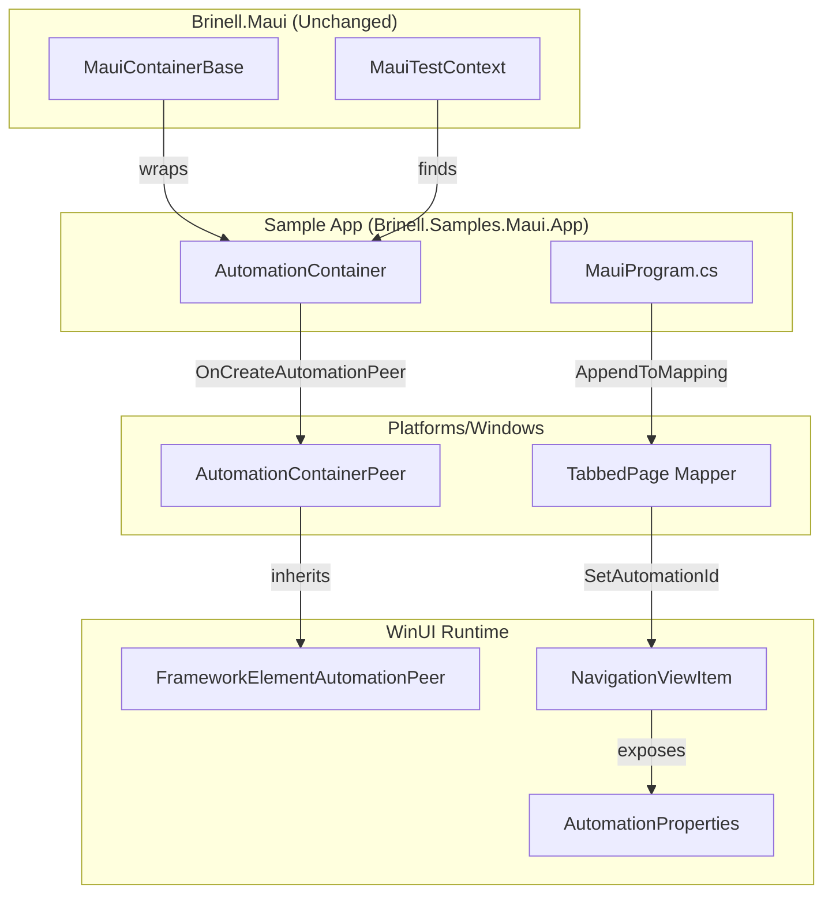
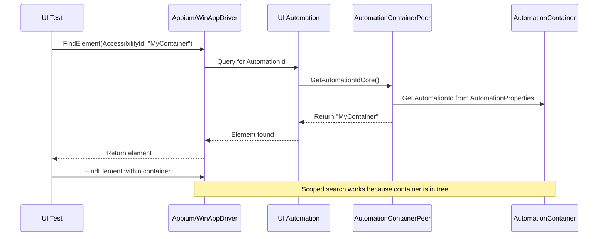

# Design Document: Container and Navigation AutomationPeer for UI Test Automation

## Overview

This design addresses two fundamental MAUI platform limitations that prevent reliable UI test automation:

1. **Layout containers** (Grid, StackLayout, Frame, Border, ContentView) don't expose AutomationId to UI Automation because they lack AutomationPeers on Windows.

2. **TabbedPage/Shell tabs** don't pass AutomationId to the underlying WinUI NavigationViewItem elements.

The solution provides:
- A custom `AutomationContainer` control with a proper AutomationPeer for container scoping
- Handler mapper customization for TabbedPage/Shell to map AutomationId to tab elements
- Integration with existing Brinell MAUI control patterns

## Steering Document Alignment

### Technical Standards (tech.md)

| Standard | How This Design Aligns |
|----------|----------------------|
| **Self-Contained Platforms** | All code lives in `Brinell.Samples.Maui.App` (sample) and `Brinell.Maui` (optional helpers) |
| **Native Library Access** | Uses WinUI AutomationPeer APIs directly, no abstraction layers |
| **Is/Wait/Check/Assert Pattern** | Container controls work with existing pattern unchanged |
| **No Core Changes** | `Brinell.Core` remains unchanged; new code is platform-specific |
| **Platform Isolation** | Windows-specific code in `Platforms/Windows/` folder |

### Project Structure (structure.md)

| Convention | Application |
|------------|-------------|
| **File Naming** | `AutomationContainer.cs`, `AutomationContainerPeer.cs` |
| **Namespace** | `Brinell.Samples.Maui.App.Controls` (sample), `Brinell.Maui.Controls` (if promoted) |
| **Platform Code** | `Platforms/Windows/Controls/AutomationContainerPeer.cs` |
| **Documentation** | XML documentation on all public members |

## Code Reuse Analysis

### Existing Components to Leverage

| Component | How It Will Be Used |
|-----------|---------------------|
| `MauiContainerBase<TParent, TSelf>` | Brinell wrapper will use this base class unchanged |
| `MauiControlBase<TScope>` | Container inherits control behavior |
| `Locator` and `LocatorStrategy` | Container located by AutomationId as before |
| `MauiTestContext` | No changes needed to test context |
| `IMauiScope<T>` interface | Container implements scope for child searching |

### Integration Points

| Integration Point | How New Components Connect |
|-------------------|---------------------------|
| **MauiProgram.cs** | Register handler customization for TabbedPage |
| **XAML Pages** | Replace Grid/Border with AutomationContainer |
| **ContainerScopingTests** | Tests use existing `MauiContainerBase` pattern |
| **Appium/WinAppDriver** | AutomationId exposed via standard AccessibilityId |

## Architecture

### Design Approach

The solution uses a **two-pronged approach**:

1. **Custom Control + AutomationPeer** for containers
2. **Handler Mapper Customization** for TabbedPage/Shell tabs

Both approaches use native WinUI APIs without requiring changes to MAUI internals.

### Modular Design Principles

- **Single File Responsibility**: Each component in its own file
- **Platform Isolation**: WinUI-specific code in `Platforms/Windows/`
- **Minimal Footprint**: Only add what's needed to fix the problem
- **Backward Compatible**: Existing tests work unchanged

### Architecture Diagram



### Component Flow



## Components and Interfaces

### Component 1: AutomationContainer Control

**Purpose:** A ContentView-like container that exposes AutomationId via a custom AutomationPeer.

**Location:** `samples/Brinell.Samples.Maui.App/Controls/AutomationContainer.cs`

**Interfaces:**
```csharp
namespace Brinell.Samples.Maui.App.Controls;

/// <summary>
/// A container control that exposes AutomationId to UI Automation.
/// Use this instead of Grid, Border, or ContentView when you need
/// the container to be discoverable by automation tools.
/// </summary>
public class AutomationContainer : ContentView
{
    // Uses standard AutomationId from VisualElement
    // The magic is in the AutomationPeer, not here
}
```

**Dependencies:**
- `Microsoft.Maui.Controls.ContentView`
- Platform-specific: `AutomationContainerPeer` (Windows only)

**Reuses:**
- Standard MAUI ContentView behavior
- AutomationProperties attached properties

### Component 2: AutomationContainerPeer (Windows)

**Purpose:** Exposes the AutomationContainer to UI Automation on Windows.

**Location:** `samples/Brinell.Samples.Maui.App/Platforms/Windows/Controls/AutomationContainerPeer.cs`

**Interfaces:**
```csharp
namespace Brinell.Samples.Maui.App.Platforms.Windows.Controls;

/// <summary>
/// AutomationPeer for AutomationContainer.
/// Exposes the container to UI Automation with proper AutomationId.
/// </summary>
public class AutomationContainerPeer : FrameworkElementAutomationPeer
{
    public AutomationContainerPeer(FrameworkElement owner) : base(owner) { }
    
    protected override string GetClassNameCore() => "AutomationContainer";
    protected override AutomationControlType GetAutomationControlTypeCore() 
        => AutomationControlType.Group;
}
```

**Dependencies:**
- `Microsoft.UI.Xaml.Automation.Peers.FrameworkElementAutomationPeer`
- `Microsoft.UI.Xaml.FrameworkElement`

**Reuses:**
- WinUI AutomationPeer infrastructure
- AutomationProperties.AutomationId (inherited from base class)

### Component 3: AutomationContainerHandler (Windows)

**Purpose:** Handler that connects the MAUI AutomationContainer to its WinUI AutomationPeer.

**Location:** `samples/Brinell.Samples.Maui.App/Platforms/Windows/Controls/AutomationContainerHandler.cs`

**Interfaces:**
```csharp
namespace Brinell.Samples.Maui.App.Platforms.Windows.Controls;

/// <summary>
/// Windows handler for AutomationContainer.
/// Overrides OnCreateAutomationPeer to return our custom peer.
/// </summary>
public class AutomationContainerHandler : ContentViewHandler
{
    protected override ContentPanel CreatePlatformView()
    {
        // Return a panel that creates our AutomationPeer
        return new AutomationContentPanel();
    }
}

/// <summary>
/// Custom ContentPanel that provides an AutomationPeer.
/// </summary>
public class AutomationContentPanel : ContentPanel
{
    protected override AutomationPeer OnCreateAutomationPeer()
        => new AutomationContainerPeer(this);
}
```

**Dependencies:**
- `Microsoft.Maui.Handlers.ContentViewHandler`
- `Microsoft.Maui.Platform.ContentPanel`

### Component 4: TabbedPage Handler Mapper

**Purpose:** Maps ContentPage.AutomationId to NavigationViewItem on Windows.

**Location:** `samples/Brinell.Samples.Maui.App/Platforms/Windows/Handlers/TabbedPageAutomationMapper.cs`

**Interfaces:**
```csharp
namespace Brinell.Samples.Maui.App.Platforms.Windows.Handlers;

/// <summary>
/// Configures TabbedPage to properly map AutomationId to tab elements.
/// </summary>
public static class TabbedPageAutomationMapper
{
    /// <summary>
    /// Registers the handler customization. Call from MauiProgram.cs.
    /// </summary>
    public static void Configure()
    {
        TabbedPageHandler.Mapper.AppendToMapping("AutomationIdFix", MapAutomationId);
    }
    
    private static void MapAutomationId(ITabbedPageHandler handler, ITabbedPage tabbedPage)
    {
        // Implementation maps AutomationId from ContentPage to NavigationViewItem
    }
}
```

**Dependencies:**
- `Microsoft.Maui.Handlers.TabbedPageHandler`
- `Microsoft.UI.Xaml.Controls.NavigationView`
- `Microsoft.UI.Xaml.Automation.AutomationProperties`

**Reuses:**
- MAUI handler mapper infrastructure
- Standard TabbedPageHandler behavior

### Component 5: Shell Tab Automation Mapper

**Purpose:** Maps Tab/ShellContent AutomationId to Shell tab elements on Windows.

**Location:** `samples/Brinell.Samples.Maui.App/Platforms/Windows/Handlers/ShellAutomationMapper.cs`

**Interfaces:**
```csharp
namespace Brinell.Samples.Maui.App.Platforms.Windows.Handlers;

/// <summary>
/// Configures Shell to properly map AutomationId to tab bar elements.
/// </summary>
public static class ShellAutomationMapper
{
    /// <summary>
    /// Registers the handler customization. Call from MauiProgram.cs.
    /// </summary>
    public static void Configure()
    {
        ShellHandler.Mapper.AppendToMapping("AutomationIdFix", MapTabAutomationId);
    }
    
    private static void MapTabAutomationId(IShellHandler handler, IShell shell)
    {
        // Implementation maps AutomationId from Tab/ShellContent to tab elements
    }
}
```

**Dependencies:**
- `Microsoft.Maui.Handlers.ShellHandler`
- Shell tab bar native elements

## Data Models

### No New Data Models Required

This design doesn't introduce new data models. All components use:

- Standard MAUI `AutomationId` property (string)
- WinUI `AutomationProperties.AutomationId` attached property
- Existing Brinell `Locator` and `LocatorStrategy` types

## Error Handling

### Error Scenario 1: AutomationPeer Not Created

**Description:** On non-Windows platforms, the custom AutomationPeer won't be created.

**Handling:** 
- The control still works visually
- Automation testing falls back to platform-native behavior
- Document platform-specific limitations

**User Impact:**
- Container scoping may not work on Android/iOS (document this)
- Test writers know to use Windows for container scoping tests

### Error Scenario 2: Handler Mapper Registration Fails

**Description:** TabbedPage mapper not registered, tabs don't have AutomationId.

**Handling:**
- Verify registration order in MauiProgram.cs
- Log warning if mapping doesn't find expected elements
- Fall back to title-based tab selection (with warning)

**User Impact:**
- Tab navigation tests fail with clear "AutomationId not found" error
- Documentation explains required setup

### Error Scenario 3: NavigationViewItem Not Accessible

**Description:** WinUI NavigationView structure changes in future MAUI version.

**Handling:**
- Wrap native element access in try-catch
- Log actual element structure for debugging
- Handler gracefully degrades to no-op

**User Impact:**
- Tab automation stops working after MAUI update
- Clear error message indicates handler needs update

### Error Scenario 4: AutomationContainer Not Found by Appium

**Description:** Container is created but Appium can't find it.

**Handling:**
- Verify AutomationId is set correctly
- Check AutomationPeer is actually returning the ID
- Provide debugging guidance in documentation

**User Impact:**
- Test fails with NoSuchElementException
- Error message includes expected AutomationId

## Testing Strategy

### Unit Testing

**Approach:** Limited unit testing possible - AutomationPeer requires WinUI runtime.

**What Can Be Unit Tested:**
- AutomationContainer XAML creation
- Handler registration logic (mock handlers)
- Locator construction and strategy

**What Cannot Be Unit Tested:**
- AutomationPeer behavior (requires WinUI)
- Actual UI Automation queries

### Integration Testing

**Approach:** Existing ContainerScopingTests serve as integration tests.

**Key Test Scenarios:**

| Test | Description | Validates |
|------|-------------|-----------|
| `ContainerExists` | Find AutomationContainer by AutomationId | AutomationPeer exposes ID |
| `ScopedSearchFindsCorrectElement` | Element in container A found, not container B | Scoping works |
| `NestedContainers` | Both parent and child containers discoverable | Nesting works |
| `TabbedPageTabClick` | Click tab by AutomationId | Tab automation works |
| `ShellTabNavigation` | Navigate between Shell tabs by AutomationId | Shell handler works |

**Test Files:**
- `samples/Brinell.Samples.Maui.UITests/Tests/ContainerScopingTests.cs` (existing)
- `samples/Brinell.Samples.Maui.UITests/Tests/TabbedPageTests.cs` (new)

### End-to-End Testing

**Approach:** Full Appium tests against sample app.

**Test Environment:**
- Windows 10/11 with WinAppDriver
- Appium 3.x
- Sample MAUI app built for Windows

**User Scenarios to Test:**

1. **Container Scoping (R1-R5)**
   - Multiple containers with identical child structure
   - Scoped search finds correct element
   - No fallback to global search

2. **Tab Navigation (R6-R7)**
   - TabbedPage with 3+ tabs
   - Navigate by AutomationId
   - Verify correct page content displayed

3. **Mixed Scenario**
   - Tab navigation to page with containers
   - Container scoping within tabbed content

## Implementation Plan

### Phase 1: AutomationContainer Control

**Files to Create:**

1. `samples/Brinell.Samples.Maui.App/Controls/AutomationContainer.cs`
   - Simple ContentView subclass
   - Cross-platform, handler does the work

2. `samples/Brinell.Samples.Maui.App/Platforms/Windows/Controls/AutomationContentPanel.cs`
   - ContentPanel that overrides OnCreateAutomationPeer

3. `samples/Brinell.Samples.Maui.App/Platforms/Windows/Controls/AutomationContainerPeer.cs`
   - FrameworkElementAutomationPeer implementation

4. `samples/Brinell.Samples.Maui.App/Platforms/Windows/Controls/AutomationContainerHandler.cs`
   - Handler that uses AutomationContentPanel

**Registration in MauiProgram.cs:**
```csharp
builder.ConfigureMauiHandlers(handlers =>
{
#if WINDOWS
    handlers.AddHandler<AutomationContainer, AutomationContainerHandler>();
#endif
});
```

### Phase 2: TabbedPage Handler Mapper

**Files to Create:**

1. `samples/Brinell.Samples.Maui.App/Platforms/Windows/Handlers/TabbedPageAutomationMapper.cs`
   - Static mapper configuration class
   - Handler mapper that sets AutomationId on NavigationViewItem

**Registration in MauiProgram.cs:**
```csharp
#if WINDOWS
    TabbedPageAutomationMapper.Configure();
#endif
```

### Phase 3: Sample App Updates

**Files to Modify:**

1. `samples/Brinell.Samples.Maui.App/MainPage.xaml`
   - Replace Grid/Border with AutomationContainer for container tests
   
2. Add TabbedPage demo page with AutomationId on tabs

### Phase 4: Test Validation

**Files to Modify:**

1. `samples/Brinell.Samples.Maui.UITests/Tests/ContainerScopingTests.cs`
   - Update to use new container control
   - Verify all 9 tests pass

2. Create `TabbedPageTests.cs`
   - New tests for tab navigation

## File Manifest

| File | Action | Purpose |
|------|--------|---------|
| `Controls/AutomationContainer.cs` | Create | Cross-platform container control |
| `Platforms/Windows/Controls/AutomationContentPanel.cs` | Create | WinUI panel with AutomationPeer |
| `Platforms/Windows/Controls/AutomationContainerPeer.cs` | Create | AutomationPeer implementation |
| `Platforms/Windows/Controls/AutomationContainerHandler.cs` | Create | MAUI handler for Windows |
| `Platforms/Windows/Handlers/TabbedPageAutomationMapper.cs` | Create | TabbedPage AutomationId fix |
| `Platforms/Windows/Handlers/ShellAutomationMapper.cs` | Create | Shell AutomationId fix |
| `MauiProgram.cs` | Modify | Register handlers and mappers |
| `MainPage.xaml` | Modify | Use AutomationContainer |

## Traceability Matrix

| Requirement | Component | Test |
|-------------|-----------|------|
| R1: Container with AutomationPeer | AutomationContainer, AutomationContainerPeer | ContainerExists |
| R2: Scoped Searching | MauiContainerBase (unchanged) | ScopedSearchFindsCorrectElement |
| R3: Visual Compatibility | AutomationContainer extends ContentView | Visual comparison |
| R4: Cross-Platform | Conditional compilation | Document limitations |
| R5: Developer Experience | Same API as before | All existing tests pass |
| R6: TabbedPage Tab AutomationId | TabbedPageAutomationMapper | TabbedPageTabClick |
| R7: Custom TabbedPage Handler | TabbedPageAutomationMapper | Tab navigation tests |

## Risks and Mitigations

| Risk | Likelihood | Impact | Mitigation |
|------|------------|--------|------------|
| WinUI API changes in future MAUI | Low | Medium | Pin to specific MAUI version, add version checks |
| Handler override doesn't work | Medium | High | Prototype early, test with actual Appium |
| Performance impact | Low | Low | Lazy AutomationPeer creation (default behavior) |
| Android/iOS gaps | Medium | Medium | Document as out of scope, future work |
| MAUI fixes issue natively | Low | Low | Code becomes no-op, easy to remove |

## Open Questions

1. **Shell TabBar Implementation**: Need to investigate exact native element structure for Shell tabs on Windows. May require additional research during implementation.

2. **Promotion to Brinell.Maui**: Should these helpers be included in the main Brinell.Maui package? Decision can be made after validation.

3. **Other Platforms**: Android/iOS implementation is out of scope. Document clearly which platforms are supported.

---

**Document Version:** 1.0  
**Created:** January 19, 2026  
**Workflow:** spec_workflow/design  
**Spec ID:** 017-container-automation-peer  
**Status:** Draft
