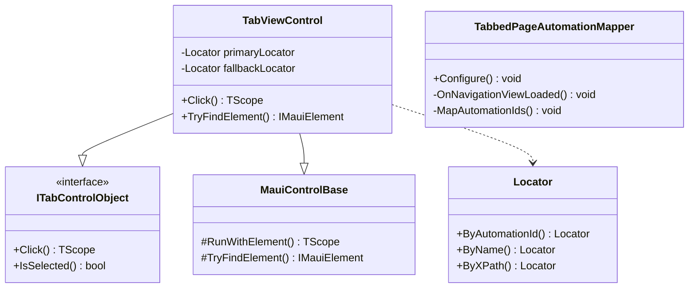

# Design: SPEC-023 TabbedPage Automation Testing

**Spec:** SPEC-023-TabbedPage-Automation-Testing  
**Status:** ✅ IMPLEMENTED (2026-01-19)  
**Created:** 2026-01-24

---

## 0. Implementation Notes (Added Post-Implementation)

### Key Discovery

The GitHub issue dotnet/maui#3996 mentions `NavigationViewItem` elements, but **actual Appium page source analysis reveals tabs render as `TabItem` elements** (the `LocalizedControlType` is "tab item" while `ClassName` is `Microsoft.UI.Xaml.Controls.NavigationViewItem`).

**Correct XPath Pattern:**
```xpath
//TabItem[@Name='Containers']  ← WORKS
//NavigationViewItem[@Name='Containers']  ← DOES NOT WORK
```

### Final Solution

- **XPath Fallback:** `//TabItem[@Name='{tabTitle}']` 
- **Location:** `TabViewControl<TScope>.TryFindElement()` override
- **Test Results:** 6 TabbedPage tests pass, 14 container tests pass

---

## 1. Overview

This design document addresses the TabbedPage tab automation testing issue where NavigationViewItem tabs in Windows MAUI apps don't expose AutomationId for Appium to locate. The solution enables reliable tab navigation in UI tests using a multi-pronged approach.

### Problem Summary

- **Root Cause:** MAUI TabbedPage renders as WinUI NavigationView, but AutomationId from child ContentPages doesn't propagate to NavigationViewItem elements
- **Impact:** 24+ UI tests blocked (ContainerScopingTests, SingleContainerTests, IndexedContainerTests, ListContainerTests, NestedContainerTests)
- **Known Issue:** dotnet/maui#3996 (open since 2022)

### Solution Summary

1. **Phase 1 (Immediate):** XPath fallback using tab title Name property
2. **Phase 2 (Medium-term):** Enhanced TabbedPageAutomationMapper with proper event timing
3. **Phase 3 (Future):** Framework-level Locator.ByName() first-class support

---

## 2. Steering Document Alignment

### Technology Stack (tech.str.spx.md)

| Requirement | Compliance |
|-------------|------------|
| **Is/Wait/Assert Pattern** | ✅ Tab controls use existing pattern |
| **No arbitrary waits** | ✅ Uses WaitReady() with conditions |
| **Native library access** | ✅ Direct Appium API usage |
| **Self-contained platforms** | ✅ Changes isolated to MAUI platform |
| **Fluent chaining** | ✅ Tab Click() returns TScope |

### Project Structure (structure.str.spx.md)

| Requirement | Compliance |
|-------------|------------|
| **Control naming** | ✅ TabViewControl existing pattern |
| **Test fixture pattern** | ✅ AppiumFixture.NavigateToContainerDemo() |
| **Page object pattern** | ✅ AppShellPage with tab controls |
| **Locator infrastructure** | ✅ Extends existing Locator/LocatorStrategy |

---

## 3. Code Reuse Analysis

### Existing Components to Leverage

| Component | Location | Reuse Strategy |
|-----------|----------|----------------|
| `Locator.ByName()` | `Brinell.Core/Locators/Locator.cs` | Already exists - factory method ready |
| `LocatorStrategy.Name` | `Brinell.Core/Locators/LocatorStrategy.cs` | Already exists - supported |
| `LocatorExtensions.ToBy()` | `Brinell.Maui/Extensions/LocatorExtensions.cs` | Already maps Name → `By.Name()` |
| `TabViewControl<TScope>` | `Brinell.Maui.CommunityToolkit/Controls/` | Extend or subclass for fallback |
| `TabbedPageAutomationMapper` | `samples/.../Handlers/` | Fix timing issues |
| `MauiControlBase<TScope>` | `Brinell.Maui/Controls/` | Base class for new controls |

### Components Requiring Modification

| Component | Change Required |
|-----------|-----------------|
| `TabViewControl` | Add Name-based fallback locator strategy |
| `TabbedPageAutomationMapper` | Fix timing with Loaded event / DispatcherQueue |
| `AppShellPage` | Update tab control instantiation if needed |

### New Components

| Component | Purpose |
|-----------|---------|
| `NavigationViewItemControl` | Optional: Specialized control for WinUI NavigationViewItem |

---

## 4. Architecture

### Component Diagram



### Element Finding Flow

```
Test Code → TabViewControl.Click()
    ↓
TryFindElement(primaryLocator: AutomationId)
    ↓ (Element not found)
TryFindElement(fallbackLocator: Name or XPath)
    ↓ (Element found)
Return element → Execute Click → Return TScope
```

---

## 5. Components and Interfaces

### 5.1 TabViewControl Enhancement

**Location:** `srcnew/Brinell.Maui.CommunityToolkit/Controls/TabViewControl.cs`

**Current Behavior:**
```csharp
public TabViewControl(IMauiScope<TScope> scope, string locatorValue)
    : base(scope, Locator.ByAutomationId(locatorValue)) { }
```

**Enhanced Behavior:**
```csharp
public class TabViewControl<TScope> : MauiControlBase<TScope>, ITabControlObject<TScope>
{
    private readonly Locator _primaryLocator;
    private readonly Locator? _fallbackLocator;
    
    public TabViewControl(IMauiScope<TScope> scope, string automationId, string? tabTitle = null)
        : base(scope, Locator.ByAutomationId(automationId))
    {
        _primaryLocator = Locator.ByAutomationId(automationId);
        
        // Fallback: Use XPath with Name property (tab title)
        if (!string.IsNullOrEmpty(tabTitle))
        {
            _fallbackLocator = Locator.ByXPath(
                $"//NavigationViewItem[@Name='{tabTitle}']");
        }
    }
    
    protected override IMauiElement? TryFindElement()
    {
        // Try primary locator (AutomationId)
        var element = base.TryFindElement();
        if (element != null) return element;
        
        // Fallback to Name-based XPath
        if (_fallbackLocator != null)
        {
            return Scope.TryFindElement(_fallbackLocator);
        }
        
        return null;
    }
}
```

### 5.2 TabbedPageAutomationMapper Fix

**Location:** `samples/Brinell.Samples.Maui.App/Platforms/Windows/Handlers/TabbedPageAutomationMapper.cs`

**Issue:** MapAutomationIds runs before NavigationView.MenuItems is populated.

**Fix Strategy:**
1. Subscribe to NavigationView.Loaded event
2. Use DispatcherQueue.TryEnqueue for timing
3. Add retry logic for MenuItems population

```csharp
private static void MapAutomationIds(ITabbedViewHandler handler, ITabbedView tabbedView)
{
    if (handler.PlatformView is not NavigationView navigationView)
        return;
    if (tabbedView is not TabbedPage tabbedPage)
        return;
    
    // Wait for NavigationView to be fully loaded
    if (!navigationView.IsLoaded)
    {
        navigationView.Loaded += (s, e) => SetAutomationIds(navigationView, tabbedPage);
    }
    else
    {
        // Use DispatcherQueue to ensure MenuItems are populated
        navigationView.DispatcherQueue.TryEnqueue(
            Microsoft.UI.Dispatching.DispatcherQueuePriority.Low,
            () => SetAutomationIds(navigationView, tabbedPage));
    }
}

private static void SetAutomationIds(NavigationView navigationView, TabbedPage tabbedPage)
{
    var menuItems = navigationView.MenuItems;
    var children = tabbedPage.Children;
    
    for (int i = 0; i < children.Count && i < menuItems.Count; i++)
    {
        if (menuItems[i] is NavigationViewItem navItem 
            && !string.IsNullOrEmpty(children[i].AutomationId))
        {
            WinUIAutomation.AutomationProperties.SetAutomationId(
                navItem, children[i].AutomationId);
        }
    }
}
```

### 5.3 AppShellPage Update

**Location:** `testsnew/Brinell.Maui.UITests/Pages/AppShellPage.cs`

**Option A - Use Fallback Locators:**
```csharp
// Pass both AutomationId and Title for fallback
BasicsTab = new TabViewControl<AppShellPage>(this, "BasicsTab", "Basics");
ContainersTab = new TabViewControl<AppShellPage>(this, "ContainersTab", "Containers");
```

**Option B - Keep Simple (if mapper fix works):**
```csharp
// If mapper fix works, no changes needed
BasicsTab = new TabViewControl<AppShellPage>(this, "BasicsTab");
```

---

## 6. Data Models

No new data models required. Uses existing:

- `Locator` - Immutable locator value object
- `LocatorStrategy` - Enum of strategies (AutomationId, Name, XPath, etc.)
- `IMauiElement` - Appium element wrapper

---

## 7. Error Handling

### Fallback Strategy

```
Primary: Locator.ByAutomationId("ContainersTab")
    ↓ (fails)
Fallback 1: Locator.ByName("Containers") 
    ↓ (fails)
Fallback 2: Locator.ByXPath("//NavigationViewItem[@Name='Containers']")
    ↓ (fails)
Exception: ElementNotFoundException with diagnostic message
```

### Diagnostic Improvements

When tab element not found, include:
- Available NavigationViewItem elements and their properties
- Automation tree snippet for debugging
- Suggestion to check tab titles match

```csharp
throw new ElementNotFoundException(
    $"Tab '{automationId}' not found. " +
    $"Tried: AutomationId='{automationId}', Name='{tabTitle}'. " +
    $"Available tabs: {string.Join(", ", availableTabs)}");
```

### Timeout Handling

- Tab click operations use configurable timeout (default 30s)
- WaitReady() after navigation polls for page content
- No Thread.Sleep or arbitrary waits

---

## 8. Testing Strategy

### Unit Tests

| Test | Purpose |
|------|---------|
| `TabViewControl_WithFallback_UsesFallbackWhenPrimaryFails` | Verify fallback locator works |
| `TabViewControl_WithoutFallback_ThrowsOnNotFound` | Verify clean exception |
| `Locator_ByName_CreatesCorrectStrategy` | Verify Locator factory |

### Integration Tests (UI)

| Test | Location | Purpose |
|------|----------|---------|
| `TabbedPage_NavigateToContainersTab_Success` | `TabbedPageTests.cs` | Verify tab navigation works |
| `TabbedPage_AllTabs_Accessible` | `TabbedPageTests.cs` | Verify all 8 tabs clickable |
| `ContainerScopingTests` (unblock) | `ContainerScopingTests.cs` | Remove Skip, verify passing |

### Diagnostic Tests

```csharp
[Fact]
[Trait("Category", "Diagnostic")]
public void TabbedPage_DumpTabElements_ForDebugging()
{
    // Dump all NavigationViewItem elements and their properties
    var navItems = Driver.FindElements(By.ClassName("Microsoft.UI.Xaml.Controls.NavigationViewItem"));
    foreach (var item in navItems)
    {
        _output.WriteLine($"Tab: Name='{item.GetAttribute("Name")}', " +
            $"AutomationId='{item.GetAttribute("AutomationId")}'");
    }
}
```

### Verification Checklist

- [ ] ContainersTab.Click() navigates to Container Demo page
- [ ] All 8 tabs in MainPage.xaml are accessible
- [ ] ContainerScopingTests pass without Skip
- [ ] SingleContainerTests pass without Skip
- [ ] IndexedContainerTests pass without Skip
- [ ] ListContainerTests pass without Skip
- [ ] NestedContainerTests pass without Skip

---

## 9. Implementation Phases

### Phase 1: XPath Fallback (2 hours)

1. Update `TabViewControl` to accept optional tabTitle parameter
2. Implement fallback locator logic in TryFindElement()
3. Update `AppShellPage` to pass tab titles
4. Test navigation to ContainersTab

### Phase 2: Enhanced Mapper (4 hours)

1. Fix timing in `TabbedPageAutomationMapper`
2. Add Loaded event subscription
3. Use DispatcherQueue for proper timing
4. Verify AutomationId appears on tabs
5. Remove fallback locators if mapper works

### Phase 3: Framework Support (4 hours)

1. Document Name-based locator pattern
2. Add `Control()` factory overload for Name strategy
3. Update best practices documentation

---

## 10. Decision Log

| Decision | Rationale | Trade-offs |
|----------|-----------|------------|
| XPath fallback first | Fastest path to unblock tests | Fragile if titles change |
| Fix mapper vs. Shell | Mapper simpler, matches existing approach | Shell would require app restructure |
| Name not AutomationId | Name property contains Title reliably | Name less stable than AutomationId |
| Dual locator strategy | Belt and suspenders reliability | Slightly more complex control |

---

**Document Version:** 1.0  
**Next Step:** `tasks` to break into implementation tasks
