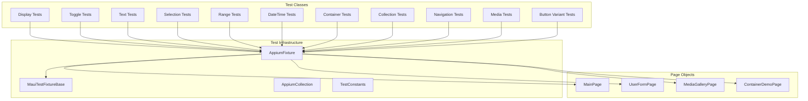

# SPEC-025: MAUI Control UI Tests - Design

**Spec ID:** 025  
**Feature:** maui-control-uitests  
**Status:** Draft  
**Created:** January 19, 2026  
**Related:** SPEC-024 (MAUI Control Objects)

---

## Overview

This design document describes the architecture for comprehensive UI tests covering all 24 MAUI control objects created in SPEC-024. The tests will validate control functionality against the Brinell.Samples.Maui.App sample application using Appium automation.

The design follows existing patterns from `ButtonControlTests.cs` and `EntryControlTests.cs`, extending the test suite with organized test files per control category.

---

## Steering Document Alignment

### Technical Standards

- **Test Pattern**: Follow existing xUnit + Appium pattern with `[Collection("Appium")]`
- **Fluent API**: Demonstrate scope-aware fluent chaining in all tests
- **Trait Organization**: Use `[Trait("Control", "ControlName")]` and `[Trait("Method", "MethodName")]`
- **Page Object Pattern**: Extend page objects to expose new controls with strongly-typed accessors

### Project Structure

- **Test Location**: `testsnew/Brinell.Maui.UITests/Tests/` with subdirectories per category
- **Page Objects**: `testsnew/Brinell.Maui.UITests/Pages/` with page objects for sample app pages
- **Sample App**: `samples/Brinell.Samples.Maui.App/` with controls exposed via AutomationId

---

## Code Reuse Analysis

### Existing Components to Leverage

- **AppiumFixture**: Base test fixture with Context, navigation helpers, Appium session management
- **MauiTestFixtureBase**: Platform configuration, app path resolution, driver setup
- **MainPage**: Existing page object pattern to extend for new controls
- **TestConstants**: Timeout constants for consistent test behavior
- **AppiumCollection**: xUnit collection definition for test isolation

### Existing Test Patterns

```csharp
// Pattern from ButtonControlTests.cs
[Collection("Appium")]
[Trait("Category", "UITest")]
[Trait("Control", "Button")]
public class ButtonControlTests
{
    private readonly AppiumFixture _fixture;
    private MainPage Page => _fixture.MainPage;

    public ButtonControlTests(AppiumFixture fixture)
    {
        _fixture = fixture;
    }
}
```

### Integration Points

- **AppiumFixture**: Add new page objects for UserFormPage, MediaGalleryPage
- **Sample App Pages**: UserFormPage.xaml already has most controls with AutomationIds
- **Control Factory Methods**: `Button()`, `Entry()`, `Control()` pattern in page objects

---

## Architecture

### Test Hierarchy



### Test Organization Strategy

| Category | Test File | Page Object | Sample App Page |
|----------|-----------|-------------|-----------------|
| Display | LabelControlTests.cs, etc. | MainPage | BasicsView.xaml |
| Toggle | CheckBoxControlTests.cs, etc. | UserFormPage | UserFormPage.xaml |
| Text | EditorControlTests.cs, etc. | UserFormPage | UserFormPage.xaml |
| Selection | PickerControlTests.cs | UserFormPage | UserFormPage.xaml |
| Range | SliderControlTests.cs, etc. | UserFormPage | UserFormPage.xaml |
| DateTime | DatePickerControlTests.cs, etc. | UserFormPage | UserFormPage.xaml |
| Container | ScrollViewControlTests.cs, etc. | ContainerDemoPage | ContainerDemoPage.xaml |
| Collection | CollectionViewControlTests.cs | MediaGalleryPage | MediaGalleryPage.xaml |
| Navigation | MenuControlTests.cs, etc. | NavigationPage | NavigationDemoPage.xaml |
| Media | WebViewControlTests.cs, etc. | MediaGalleryPage | MediaGalleryPage.xaml |
| Buttons | ImageButtonControlTests.cs | ControlShowcasePage | New page needed |

---

## Components and Interfaces

### Component 1: New Page Objects

**Purpose:** Expose controls from additional sample app pages for testing

**UserFormPage.cs**
```csharp
public class UserFormPage : MauiPageObjectBase<UserFormPage>
{
    // Text Controls
    public MauiEditorControl<UserFormPage> BioEditor => Editor("BioEditor");
    public MauiSearchBarControl<UserFormPage> UserSearchBar => SearchBar("UserSearchBar");
    
    // Toggle Controls
    public MauiSwitchControl<UserFormPage> NewsletterSwitch => Switch("NewsletterSwitch");
    public MauiCheckBoxControl<UserFormPage> TermsCheckBox => CheckBox("TermsCheckBox");
    public MauiRadioButtonControl<UserFormPage> BasicRadio => RadioButton("BasicRadio");
    
    // Selection Controls
    public MauiPickerControl<UserFormPage> CountryPicker => Picker("CountryPicker");
    public MauiDatePickerControl<UserFormPage> BirthDatePicker => DatePicker("BirthDatePicker");
    public MauiTimePickerControl<UserFormPage> PreferredTimePicker => TimePicker("PreferredTimePicker");
    
    // Range Controls
    public MauiSliderControl<UserFormPage> FontSizeSlider => Slider("FontSizeSlider");
    public MauiStepperControl<UserFormPage> QuantityStepper => Stepper("QuantityStepper");
}
```

**MediaGalleryPage.cs**
```csharp
public class MediaGalleryPage : MauiPageObjectBase<MediaGalleryPage>
{
    // Display Controls
    public MauiImageControl<MediaGalleryPage> MainImage => Image("MainImage");
    public MauiActivityIndicatorControl<MediaGalleryPage> WebLoadingIndicator 
        => ActivityIndicator("WebLoadingIndicator");
    
    // Media Controls
    public MauiWebViewControl<MediaGalleryPage> ContentWebView => WebView("ContentWebView");
    
    // Collection Controls
    public MauiCollectionViewControl<MediaGalleryPage, ThumbnailItem> ThumbnailCollection 
        => CollectionView("ThumbnailCollection", "Thumbnail_", CreateThumbnailItem);
}
```

### Component 2: Control Factory Methods

**Purpose:** Add factory methods to MauiPageObjectBase for new control types

```csharp
// Extensions to MauiPageObjectBase<TPage>
protected MauiEditorControl<TPage> Editor(string automationId) 
    => new(this, automationId);

protected MauiSearchBarControl<TPage> SearchBar(string automationId) 
    => new(this, automationId);

protected MauiSwitchControl<TPage> Switch(string automationId) 
    => new(this, automationId);

protected MauiCheckBoxControl<TPage> CheckBox(string automationId) 
    => new(this, automationId);

protected MauiRadioButtonControl<TPage> RadioButton(string automationId) 
    => new(this, automationId);

protected MauiPickerControl<TPage> Picker(string automationId) 
    => new(this, automationId);

protected MauiDatePickerControl<TPage> DatePicker(string automationId) 
    => new(this, automationId);

protected MauiTimePickerControl<TPage> TimePicker(string automationId) 
    => new(this, automationId);

protected MauiSliderControl<TPage> Slider(string automationId) 
    => new(this, automationId);

protected MauiStepperControl<TPage> Stepper(string automationId) 
    => new(this, automationId);

protected MauiImageControl<TPage> Image(string automationId) 
    => new(this, automationId);

protected MauiActivityIndicatorControl<TPage> ActivityIndicator(string automationId) 
    => new(this, automationId);

protected MauiProgressBarControl<TPage> ProgressBar(string automationId) 
    => new(this, automationId);

protected MauiWebViewControl<TPage> WebView(string automationId) 
    => new(this, automationId);

protected MauiScrollViewControl<TPage> ScrollView(string automationId) 
    => new(this, automationId);
```

### Component 3: Test File Templates

**Purpose:** Consistent test structure for each control type

```csharp
/// <summary>
/// UI tests for {ControlName} control.
/// Tests run against Brinell.Samples.Maui.App.
/// </summary>
[Collection("Appium")]
[Trait("Category", "UITest")]
[Trait("Control", "{ControlName}")]
public class {ControlName}ControlTests
{
    private readonly AppiumFixture _fixture;
    private {PageName} Page => _fixture.{PageProperty};

    public {ControlName}ControlTests(AppiumFixture fixture)
    {
        _fixture = fixture;
        _fixture.NavigateTo{PageName}();
    }

    #region State Tests
    
    [Fact(Timeout = TestConstants.DefaultTestTimeoutMs)]
    [Trait("Method", "IsExists")]
    public Task {ControlName}_IsExists_ReturnsTrue()
    {
        Assert.True(Page.{ControlProperty}.IsExists());
        return Task.CompletedTask;
    }

    #endregion

    #region Interaction Tests

    // Control-specific interaction tests

    #endregion

    #region Assertion Tests

    // Control-specific assertion tests

    #endregion

    #region Fluent Chaining Tests

    [Fact(Timeout = TestConstants.DefaultTestTimeoutMs)]
    [Trait("Pattern", "FluentChaining")]
    public Task {ControlName}_FluentChaining_WorksCorrectly()
    {
        // Demonstrate fluent chaining pattern
        return Task.CompletedTask;
    }

    #endregion
}
```

---

## Data Models

### Test Configuration

```csharp
public static class TestConstants
{
    public const int DefaultTestTimeoutMs = 30000;      // 30 seconds
    public const int ShortTimeoutMs = 5000;             // 5 seconds
    public const int LongTimeoutMs = 60000;             // 1 minute
    public const int AnimationDelayMs = 500;            // Animation wait
}
```

### Page Navigation Enum

```csharp
public enum SampleAppPage
{
    Main,           // BasicsView (default)
    UserForm,       // UserFormPage
    MediaGallery,   // MediaGalleryPage
    ContainerDemo,  // ContainerDemoPage
    NavigationDemo, // NavigationDemoPage
    ControlShowcase // New page for missing controls
}
```

---

## Error Handling

### Error Scenarios

1. **Element Not Found**
   - **Handling:** Tests use `IsExists()` checks before interactions; `Wait*` methods with timeouts
   - **User Impact:** Clear error message: "Element '{automationId}' not found within {timeout}ms"

2. **Navigation Failure**
   - **Handling:** `NavigateTo*` methods throw with descriptive message if page not ready
   - **User Impact:** Test fails fast with navigation context

3. **Assertion Failure**
   - **Handling:** Framework throws `AssertionException` with expected/actual values
   - **User Impact:** Clear message: "Expected '{expected}' but was '{actual}'"

4. **Appium Session Failure**
   - **Handling:** Fixture throws during construction; xUnit skips all collection tests
   - **User Impact:** Tests marked as skipped with connection error

---

## Testing Strategy

### Unit Testing (Not in Scope)

Control object unit tests are in `testsnew/Brinell.Maui.Tests/` - separate from UI tests.

### Integration Testing (This Spec)

UI integration tests verify controls work with real MAUI applications:

- **Per-Control Tests**: Each control type has dedicated test file
- **State Verification**: Is/Wait/Assert pattern coverage
- **Interaction Tests**: Click, Enter, Toggle, Select, etc.
- **Chaining Tests**: Fluent API demonstration

### Test Categories by Priority

**P1 - Core Controls (High Value)**
- LabelControlTests, ProgressBarControlTests
- CheckBoxControlTests, SwitchControlTests, RadioButtonControlTests
- EditorControlTests, SearchBarControlTests
- SliderControlTests, StepperControlTests

**P2 - Selection & DateTime**
- PickerControlTests
- DatePickerControlTests, TimePickerControlTests

**P3 - Container & Collection**
- ScrollViewControlTests, ExpanderControlTests
- CollectionViewControlTests, ListViewControlTests

**P4 - Specialized**
- WebViewControlTests, MediaElementControlTests
- ImageButtonControlTests, LinkControlTests
- MenuControlTests, ToolbarControlTests

---

## Implementation Phases

### Phase 1: Infrastructure Setup

1. Add factory methods to `MauiPageObjectBase` for new control types
2. Create `UserFormPage.cs` page object
3. Create `MediaGalleryPage.cs` page object
4. Update `AppiumFixture` with new pages and navigation

### Phase 2: P1 Core Control Tests

1. Display: LabelControlTests, ProgressBarControlTests, ActivityIndicatorControlTests, ImageControlTests
2. Toggle: CheckBoxControlTests, SwitchControlTests, RadioButtonControlTests
3. Text: EditorControlTests, SearchBarControlTests
4. Range: SliderControlTests, StepperControlTests

### Phase 3: P2 Selection & DateTime Tests

1. Selection: PickerControlTests
2. DateTime: DatePickerControlTests, TimePickerControlTests

### Phase 4: P3 Container & Collection Tests

1. Container: ScrollViewControlTests, ExpanderControlTests, RefreshViewControlTests, SwipeViewControlTests
2. Collection: ListViewControlTests, CollectionViewControlTests

### Phase 5: P4 Specialized Tests

1. Navigation: MenuControlTests, ToolbarControlTests
2. Media: WebViewControlTests, MediaElementControlTests
3. Buttons: ImageButtonControlTests, LinkControlTests

### Phase 6: Sample App Updates

1. Add ControlShowcasePage with missing controls (Expander, SwipeView, ImageButton, Link)
2. Update navigation to include new page

---

## File Structure

```
testsnew/Brinell.Maui.UITests/
├── Tests/
│   ├── Display/
│   │   ├── LabelControlTests.cs
│   │   ├── ProgressBarControlTests.cs
│   │   ├── ActivityIndicatorControlTests.cs
│   │   └── ImageControlTests.cs
│   ├── Toggle/
│   │   ├── CheckBoxControlTests.cs
│   │   ├── SwitchControlTests.cs
│   │   └── RadioButtonControlTests.cs
│   ├── Text/
│   │   ├── EditorControlTests.cs
│   │   └── SearchBarControlTests.cs
│   ├── Selection/
│   │   └── PickerControlTests.cs
│   ├── Range/
│   │   ├── SliderControlTests.cs
│   │   └── StepperControlTests.cs
│   ├── DateTime/
│   │   ├── DatePickerControlTests.cs
│   │   └── TimePickerControlTests.cs
│   ├── Container/
│   │   ├── ScrollViewControlTests.cs
│   │   ├── ExpanderControlTests.cs
│   │   ├── RefreshViewControlTests.cs
│   │   └── SwipeViewControlTests.cs
│   ├── Collection/
│   │   ├── ListViewControlTests.cs
│   │   └── CollectionViewControlTests.cs
│   ├── Navigation/
│   │   ├── MenuControlTests.cs
│   │   └── ToolbarControlTests.cs
│   ├── Media/
│   │   ├── WebViewControlTests.cs
│   │   └── MediaElementControlTests.cs
│   └── Buttons/
│       ├── ImageButtonControlTests.cs
│       └── LinkControlTests.cs
├── Pages/
│   ├── MainPage.cs (existing)
│   ├── AppShellPage.cs (existing)
│   ├── ContainerDemoPage.cs (existing)
│   ├── UserFormPage.cs (new)
│   ├── MediaGalleryPage.cs (new)
│   └── ControlShowcasePage.cs (new, if needed)
└── AppiumFixture.cs (update with new pages)
```

---

## Dependencies

- SPEC-024: MAUI Control Objects (completed)
- Brinell.Samples.Maui.App with proper AutomationIds
- Appium server and WinAppDriver for Windows testing
- xUnit test framework
