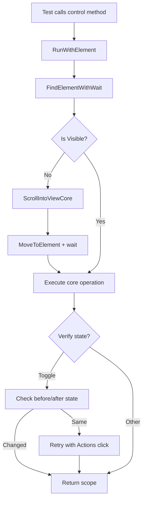

# Design Document

## Overview

This design addresses 66 failing UI tests by implementing automatic scroll-into-view, position-based slider value setting, and verified toggle operations. The solution integrates into the existing `MauiControlBase` architecture with minimal API changes.

## Steering Document Alignment

### Technical Standards (tech.md)

- **Is/Wait/Assert Pattern**: All new methods follow the established pattern
- **Fluent Chaining**: `ScrollIntoView()` returns `TScope` for chaining
- **Core Method Pattern**: New `*Core` methods for testability and override capability
- **Logging Integration**: Uses existing `Run()` and `RunWithElement()` infrastructure

### Project Structure (structure.md)

- Changes isolated to `srcnew/Brinell.Maui/Controls/`
- No new files needed - extending existing control classes
- Follows established inheritance hierarchy: `MauiControlBase` → `MauiToggleControlBase` → specific controls

## Code Reuse Analysis

### Existing Components to Leverage

- **MauiControlBase.RunWithElement()**: Will be extended to include auto-scroll
- **MauiControlBase.IsVisibleCore()**: Used to determine if scroll is needed
- **Context.Driver**: Appium driver provides Actions API for scroll/click
- **MauiToggleControlBase.IsCheckedCore()**: Used for toggle state verification

### Integration Points

- **IMauiElement.Location/Size**: Element positioning for click calculations
- **OpenQA.Selenium.Interactions.Actions**: Used for move-to-element and positioned clicks
- **MauiRangeControlBase.GetMinimumCore/GetMaximumCore**: Range values for slider positioning

## Architecture

The design modifies the existing control interaction flow to include visibility checks and improved interaction strategies.



## Components and Interfaces

### Component 1: ScrollIntoView (MauiControlBase)

- **Purpose:** Ensures element is in visible viewport before interaction
- **Interfaces:**
  - `public TScope ScrollIntoView(int? timeoutMs = null)` - Explicit scroll
  - `protected void EnsureVisible(IMauiElement element)` - Auto-scroll helper
  - `protected virtual void ScrollIntoViewCore(IMauiElement element)` - Core implementation
- **Dependencies:** Actions API, IMauiElement.Displayed
- **Reuses:** IsVisibleCore(), Context.Driver

### Component 2: Position-Based Slider (MauiSliderControl)

- **Purpose:** Sets slider value by clicking at calculated track position
- **Interfaces:**
  - `protected override void SetValueCore(IMauiElement element, double value)` - Override
- **Dependencies:** GetMinimumCore, GetMaximumCore, element.Location, element.Size
- **Reuses:** MauiRangeControlBase range methods

### Component 3: Verified Toggle (MauiToggleControlBase)

- **Purpose:** Ensures toggle operation actually changed state
- **Interfaces:**
  - `protected override void ToggleCore(IMauiElement element)` - Modified base
- **Dependencies:** IsCheckedCore, Actions API
- **Reuses:** Existing IsCheckedCore state detection

### Component 4: Button-Based Stepper (MauiStepperControl)

- **Purpose:** Increments/decrements via child button clicks
- **Interfaces:**
  - `protected override void IncrementCore(IMauiElement element)` - Find + click button
  - `protected override void DecrementCore(IMauiElement element)` - Find + click button
  - `protected override void SetValueCore(IMauiElement element, double value)` - Repeated clicks
- **Dependencies:** Context.FindElements for child RepeatButtons
- **Reuses:** MauiRangeControlBase patterns

## Data Models

No new data models required. All changes operate on existing element and scope types.

## Error Handling

### Error Scenarios

1. **Element not scrollable**
   - **Handling:** Swallow exception in ScrollIntoViewCore (best effort)
   - **User Impact:** Interaction may fail with element not visible error

2. **Invalid slider range (max <= min)**
   - **Handling:** Throw InvalidOperationException with range values
   - **User Impact:** Clear error message for test debugging

3. **Toggle state unchanged after retry**
   - **Handling:** Continue without error (control may be disabled/readonly)
   - **User Impact:** Test assertion will catch the issue

4. **Stepper buttons not found**
   - **Handling:** Fall back to base implementation (keyboard input)
   - **User Impact:** May not work but won't crash

## Testing Strategy

### Unit Testing

No new unit tests required - existing UI tests validate the behavior.

### Integration Testing

Run existing failing tests after each phase:

```powershell
# Phase 1 validation
dotnet test testsnew/Brinell.Maui.UITests --filter "FullyQualifiedName~MainPageTests" --no-build

# Phase 2 validation
dotnet test testsnew/Brinell.Maui.UITests --filter "FullyQualifiedName~SliderControlTests" --no-build

# Phase 3 validation
dotnet test testsnew/Brinell.Maui.UITests --filter "FullyQualifiedName~SwitchControlTests|CheckBoxControlTests" --no-build
```

### End-to-End Testing

Full test suite run after all phases:

```powershell
dotnet test testsnew/Brinell.Maui.UITests --no-build
```

Target: 200+ passed (90%+), <22 failed (10%)

## Implementation Details

### ScrollIntoView Implementation

```csharp
// Add to MauiControlBase.cs

public TScope ScrollIntoView(int? timeoutMs = null)
{
    return RunWithElement(nameof(ScrollIntoView), timeoutMs, element =>
    {
        ScrollIntoViewCore(element);
    });
}

protected virtual void ScrollIntoViewCore(IMauiElement element)
{
    if (IsVisibleCore(element) == true) return;
    
    try
    {
        var actions = new OpenQA.Selenium.Interactions.Actions(Context.Driver);
        actions.MoveToElement(element.WrappedElement);
        actions.Perform();
        Thread.Sleep(100); // Scroll animation
    }
    catch { /* Best effort */ }
}

protected void EnsureVisible(IMauiElement element)
{
    if (IsVisibleCore(element) != true)
    {
        ScrollIntoViewCore(element);
    }
}
```

### Modified RunWithElement

```csharp
// Modify existing in MauiControlBase.cs

protected TScope RunWithElement(string action, int? timeoutMs, Action<IMauiElement> coreOperation)
{
    Run(action, () =>
    {
        var element = FindElementWithWait(timeoutMs ?? DefaultTimeoutMs);
        EnsureVisible(element);  // NEW: Auto-scroll
        coreOperation(element);
    });
    return ContainingScope;
}
```

### Slider SetValueCore Override

```csharp
// Override in MauiSliderControl.cs

protected override void SetValueCore(IMauiElement element, double value)
{
    var min = GetMinimumCore(element) ?? 0;
    var max = GetMaximumCore(element) ?? 100;
    var range = max - min;
    
    if (range <= 0)
        throw new InvalidOperationException($"Invalid slider range: min={min}, max={max}");
    
    value = Math.Clamp(value, min, max);
    var percentage = (value - min) / range;
    
    var location = element.Location;
    var size = element.Size;
    var padding = (int)(size.Width * 0.05);
    var usableWidth = size.Width - (2 * padding);
    var targetX = location.X + padding + (int)(usableWidth * percentage);
    var centerY = location.Y + (size.Height / 2);
    
    var actions = new OpenQA.Selenium.Interactions.Actions(Context.Driver);
    actions.MoveToLocation(targetX, centerY);
    actions.Click();
    actions.Perform();
    Thread.Sleep(50);
}
```

### Toggle State Verification

```csharp
// Modify in MauiToggleControlBase.cs

protected override void ToggleCore(IMauiElement element)
{
    var beforeState = IsCheckedCore(element);
    element.Click();
    Thread.Sleep(100);
    
    var afterState = IsCheckedCore(element);
    if (afterState == beforeState)
    {
        // Retry with Actions
        var actions = new OpenQA.Selenium.Interactions.Actions(Context.Driver);
        actions.MoveToElement(element.WrappedElement);
        actions.Click();
        actions.Perform();
    }
}
```
