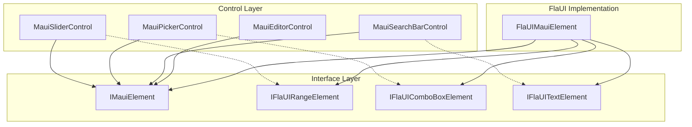

# Design Document: FlaUI Windows Driver Fixes

## Overview

This design addresses four categories of FlaUI driver issues affecting Windows MAUI UI test automation:

1. **Slider/Stepper RangeValue Pattern** - Direct value manipulation via UI Automation patterns
2. **Picker ComboBox Expansion** - Item enumeration through ExpandCollapse pattern
3. **SearchBar Text Retrieval** - Nested TextBox element discovery
4. **Editor Clear Operation** - Robust clear with fallback approaches

The solution extends `FlaUIMauiElement` with new methods and adds FlaUI-specific extension interfaces that control classes can detect and use.

## Steering Document Alignment

### Technical Standards

- **Pattern-First Approach**: Use UI Automation patterns when available, fallback to keyboard/mouse
- **Defensive Programming**: All pattern access uses `IsSupported` check and safe property access
- **Interface Segregation**: New capabilities exposed through extension interfaces

### Project Structure

- FlaUI-specific code stays in `srcnew/Brinell.Maui.FlaUI/`
- Control classes in `srcnew/Brinell.Maui/Controls/` detect driver type via interface
- No Appium code changes required

## Code Reuse Analysis

### Existing Components to Leverage

| Component | Location | Reuse |
|-----------|----------|-------|
| `FlaUIMauiElement` | Brinell.Maui.FlaUI | Extend with new pattern methods |
| `FlaUIMauiDriver` | Brinell.Maui.FlaUI | Add helper methods for element creation |
| `MauiRangeControlBase` | Brinell.Maui/Controls | Override `GetValueCore`/`SetValueCore` |
| `MauiSelectorControlBase` | Brinell.Maui/Controls | Override item enumeration |
| `MauiSearchBarControl` | Brinell.Maui/Controls/Text | Override text retrieval |

### Integration Points

- `IMauiElement` interface - add optional pattern detection
- Control base classes - check for FlaUI-specific capabilities at runtime
- `MauiTestContext` - provides driver type information

## Architecture

The design uses a capability detection pattern where control classes check if the underlying element supports specific operations.



## Components and Interfaces

### Component 1: FlaUI Extension Interfaces

**Purpose:** Define FlaUI-specific capabilities that controls can detect at runtime

**Location:** `srcnew/Brinell.Maui.FlaUI/Interfaces/`

```csharp
/// <summary>
/// FlaUI-specific range value operations for sliders and steppers.
/// </summary>
public interface IFlaUIRangeElement
{
    /// <summary>Gets whether RangeValue pattern is supported.</summary>
    bool SupportsRangeValue { get; }
    
    /// <summary>Sets value directly via RangeValue pattern.</summary>
    void SetRangeValue(double value);
    
    /// <summary>Gets current value from RangeValue pattern.</summary>
    double? GetRangeValue();
    
    /// <summary>Gets minimum from RangeValue pattern.</summary>
    double? GetRangeMinimum();
    
    /// <summary>Gets maximum from RangeValue pattern.</summary>
    double? GetRangeMaximum();
    
    /// <summary>Gets small change (step) from RangeValue pattern.</summary>
    double? GetRangeSmallChange();
}

/// <summary>
/// FlaUI-specific ComboBox operations for pickers.
/// </summary>
public interface IFlaUIComboBoxElement
{
    /// <summary>Gets whether ExpandCollapse pattern is supported.</summary>
    bool SupportsExpandCollapse { get; }
    
    /// <summary>Expands the ComboBox to show items.</summary>
    void Expand();
    
    /// <summary>Collapses the ComboBox.</summary>
    void Collapse();
    
    /// <summary>Gets items after expanding.</summary>
    IReadOnlyList<IMauiElement> GetExpandedItems();
    
    /// <summary>Gets current expand/collapse state.</summary>
    bool IsExpanded { get; }
}

/// <summary>
/// FlaUI-specific text operations for complex text controls.
/// </summary>
public interface IFlaUITextElement
{
    /// <summary>Finds nested TextBox element.</summary>
    IMauiElement? FindNestedTextBox();
    
    /// <summary>Gets text from nested TextBox if available.</summary>
    string? GetNestedText();
    
    /// <summary>Clears text with focus and keyboard fallback.</summary>
    void ClearWithFallback();
}
```

### Component 2: FlaUIMauiElement Extensions

**Purpose:** Implement the extension interfaces in FlaUIMauiElement

**Location:** `srcnew/Brinell.Maui.FlaUI/FlaUIMauiElement.cs`

**Changes:**

```csharp
public sealed class FlaUIMauiElement : IMauiElement, 
    IFlaUIRangeElement, 
    IFlaUIComboBoxElement, 
    IFlaUITextElement
{
    #region IFlaUIRangeElement Implementation
    
    public bool SupportsRangeValue => _element.Patterns.RangeValue.IsSupported;
    
    public void SetRangeValue(double value)
    {
        if (!SupportsRangeValue)
            throw new NotSupportedException("RangeValue pattern not supported");
            
        var pattern = _element.Patterns.RangeValue.Pattern;
        var min = pattern.Minimum.Value;
        var max = pattern.Maximum.Value;
        value = Math.Clamp(value, min, max);
        pattern.SetValue(value);
    }
    
    public double? GetRangeValue()
    {
        if (!SupportsRangeValue) return null;
        return _element.Patterns.RangeValue.Pattern.Value.Value;
    }
    
    public double? GetRangeMinimum()
    {
        if (!SupportsRangeValue) return null;
        return _element.Patterns.RangeValue.Pattern.Minimum.Value;
    }
    
    public double? GetRangeMaximum()
    {
        if (!SupportsRangeValue) return null;
        return _element.Patterns.RangeValue.Pattern.Maximum.Value;
    }
    
    public double? GetRangeSmallChange()
    {
        if (!SupportsRangeValue) return null;
        return _element.Patterns.RangeValue.Pattern.SmallChange.Value;
    }
    
    #endregion
    
    #region IFlaUIComboBoxElement Implementation
    
    public bool SupportsExpandCollapse => _element.Patterns.ExpandCollapse.IsSupported;
    
    public bool IsExpanded => SupportsExpandCollapse && 
        _element.Patterns.ExpandCollapse.Pattern.ExpandCollapseState.Value == 
        ExpandCollapseState.Expanded;
    
    public void Expand()
    {
        if (!SupportsExpandCollapse) return;
        if (!IsExpanded)
        {
            _element.Patterns.ExpandCollapse.Pattern.Expand();
            Thread.Sleep(100); // Allow items to render
        }
    }
    
    public void Collapse()
    {
        if (!SupportsExpandCollapse) return;
        if (IsExpanded)
        {
            _element.Patterns.ExpandCollapse.Pattern.Collapse();
        }
    }
    
    public IReadOnlyList<IMauiElement> GetExpandedItems()
    {
        var wasExpanded = IsExpanded;
        if (!wasExpanded) Expand();
        
        try
        {
            // Find ListItem children
            var items = _element.FindAllDescendants(cf => 
                cf.ByControlType(ControlType.ListItem));
            return items.Select(e => new FlaUIMauiElement(e, _driver)).ToList();
        }
        finally
        {
            if (!wasExpanded) Collapse();
        }
    }
    
    #endregion
    
    #region IFlaUITextElement Implementation
    
    public IMauiElement? FindNestedTextBox()
    {
        // MAUI SearchBar uses AutoSuggestBox which has nested TextBox
        var textBox = _element.FindFirstDescendant(cf => 
            cf.ByControlType(ControlType.Edit));
        
        if (textBox != null)
            return new FlaUIMauiElement(textBox, _driver);
            
        return null;
    }
    
    public string? GetNestedText()
    {
        // Try direct Value pattern first
        if (_element.Patterns.Value.IsSupported)
        {
            var value = _element.Patterns.Value.Pattern.Value.Value;
            if (!string.IsNullOrEmpty(value))
                return value;
        }
        
        // Try nested TextBox
        var textBox = FindNestedTextBox();
        if (textBox != null)
        {
            return textBox.Text;
        }
        
        return _element.Properties.Name.ValueOrDefault;
    }
    
    public void ClearWithFallback()
    {
        _element.Focus();
        Thread.Sleep(50);
        
        // Try Value pattern first
        if (_element.Patterns.Value.IsSupported)
        {
            try
            {
                if (!_element.Patterns.Value.Pattern.IsReadOnly.Value)
                {
                    _element.Patterns.Value.Pattern.SetValue(string.Empty);
                    return;
                }
            }
            catch { /* Fall through to keyboard */ }
        }
        
        // Keyboard fallback: Ctrl+A, Delete
        Keyboard.TypeSimultaneously(VirtualKeyShort.CONTROL, VirtualKeyShort.KEY_A);
        Thread.Sleep(50);
        Keyboard.Type(VirtualKeyShort.DELETE);
    }
    
    #endregion
}
```

### Component 3: Control Class Updates

**Purpose:** Update control classes to use FlaUI-specific interfaces when available

#### MauiRangeControlBase Updates

**Location:** `srcnew/Brinell.Maui/Controls/MauiRangeControlBase.cs`

```csharp
protected virtual double? GetValueCore(IMauiElement? element)
{
    if (element == null) return null;
    
    // Check for FlaUI range support
    if (element is IFlaUIRangeElement rangeElement && rangeElement.SupportsRangeValue)
    {
        return rangeElement.GetRangeValue();
    }
    
    // Existing fallback logic...
}

protected virtual void SetValueCore(IMauiElement element, double value)
{
    // Check for FlaUI range support
    if (element is IFlaUIRangeElement rangeElement && rangeElement.SupportsRangeValue)
    {
        rangeElement.SetRangeValue(value);
        return;
    }
    
    // Existing fallback logic...
}

protected virtual double? GetMinimumCore(IMauiElement? element)
{
    if (element == null) return null;
    
    if (element is IFlaUIRangeElement rangeElement && rangeElement.SupportsRangeValue)
    {
        return rangeElement.GetRangeMinimum();
    }
    
    // Existing fallback...
}

protected virtual double? GetMaximumCore(IMauiElement? element)
{
    if (element == null) return null;
    
    if (element is IFlaUIRangeElement rangeElement && rangeElement.SupportsRangeValue)
    {
        return rangeElement.GetRangeMaximum();
    }
    
    // Existing fallback...
}

protected virtual double? GetStepCore(IMauiElement? element)
{
    if (element == null) return null;
    
    if (element is IFlaUIRangeElement rangeElement && rangeElement.SupportsRangeValue)
    {
        return rangeElement.GetRangeSmallChange();
    }
    
    // Existing fallback...
}
```

#### MauiSelectorControlBase Updates

**Location:** `srcnew/Brinell.Maui/Controls/MauiSelectorControlBase.cs`

```csharp
protected virtual IReadOnlyList<IMauiElement>? GetItemElementsCore(IMauiElement? element)
{
    if (element == null) return null;
    
    // Check for FlaUI ComboBox support
    if (element is IFlaUIComboBoxElement comboBox && comboBox.SupportsExpandCollapse)
    {
        return comboBox.GetExpandedItems();
    }
    
    // Existing fallback: return null
    return null;
}
```

#### MauiSearchBarControl Updates

**Location:** `srcnew/Brinell.Maui/Controls/Text/MauiSearchBarControl.cs`

Override `GetTextCore` to use nested text retrieval:

```csharp
protected override string? GetTextCore(IMauiElement? element)
{
    if (element == null) return null;
    
    // Check for FlaUI nested text support
    if (element is IFlaUITextElement textElement)
    {
        return textElement.GetNestedText();
    }
    
    return base.GetTextCore(element);
}
```

#### MauiEditorControl Updates

**Location:** `srcnew/Brinell.Maui/Controls/Text/MauiEditorControl.cs`

Override `ClearCore` to use robust clear:

```csharp
protected override void ClearCore(IMauiElement element)
{
    // Check for FlaUI clear with fallback
    if (element is IFlaUITextElement textElement)
    {
        textElement.ClearWithFallback();
        return;
    }
    
    base.ClearCore(element);
}
```

## Data Models

No new data models required. The design uses existing:
- `IMauiElement` - element abstraction
- `Locator` - element finding
- `MauiPlatform` - platform detection

## Error Handling

### Error Scenarios

| Scenario | Handling | User Impact |
|----------|----------|-------------|
| RangeValue not supported | Fall back to keyboard approach | Slight delay, same result |
| ComboBox items empty after expand | Return empty list with warning log | Test may fail on assertion |
| Nested TextBox not found | Return Name property | May get wrong text value |
| Clear fails (read-only) | Throw `InvalidOperationException` | Test fails with clear message |
| Pattern access throws | Catch and use fallback | Transparent to user |

### Error Handling Pattern

```csharp
public void SetRangeValue(double value)
{
    try
    {
        if (!SupportsRangeValue)
            throw new NotSupportedException("RangeValue pattern not supported on this element");
        
        var pattern = _element.Patterns.RangeValue.Pattern;
        var min = pattern.Minimum.Value;
        var max = pattern.Maximum.Value;
        
        if (value < min || value > max)
            value = Math.Clamp(value, min, max);
        
        pattern.SetValue(value);
    }
    catch (Exception ex) when (ex is not NotSupportedException)
    {
        throw new InvalidOperationException(
            $"Failed to set range value to {value}. Element may not support this operation.", ex);
    }
}
```

## Testing Strategy

### Unit Testing

| Test Category | Focus | Location |
|---------------|-------|----------|
| RangeValue tests | SetValue, GetValue, Min/Max | `SliderControlTests.cs` |
| ComboBox tests | Expand, GetItems, Select | `PickerControlTests.cs` |
| SearchBar tests | GetText after entry | `SearchBarControlTests.cs` |
| Editor tests | Clear operation | `EditorControlTests.cs` |

### Integration Testing

Run existing test suite and verify:
- Slider tests pass (target: 19/19)
- Selection tests pass (target: 8/8)
- Text tests pass (target: 14/14)
- No regression in passing tests

### Test Execution

```powershell
# Run all Windows tests
dotnet test testsnew/Brinell.Maui.UITests --filter "Category!=Skip"

# Run specific control tests
dotnet test --filter "FullyQualifiedName~Slider"
dotnet test --filter "FullyQualifiedName~Picker"
dotnet test --filter "FullyQualifiedName~SearchBar"
dotnet test --filter "FullyQualifiedName~Editor"
```

## Implementation Order

1. **Phase 1: Interfaces** - Create extension interfaces in FlaUI project
2. **Phase 2: FlaUIMauiElement** - Implement interfaces in FlaUIMauiElement
3. **Phase 3: Range Controls** - Update MauiRangeControlBase, test Slider
4. **Phase 4: Selector Controls** - Update MauiSelectorControlBase, test Picker
5. **Phase 5: Text Controls** - Update SearchBar and Editor, test both
6. **Phase 6: Validation** - Run full test suite, document results

## File Changes Summary

| File | Change Type | Description |
|------|-------------|-------------|
| `IFlaUIRangeElement.cs` | New | Range value interface |
| `IFlaUIComboBoxElement.cs` | New | ComboBox interface |
| `IFlaUITextElement.cs` | New | Nested text interface |
| `FlaUIMauiElement.cs` | Modify | Implement 3 new interfaces |
| `MauiRangeControlBase.cs` | Modify | Use IFlaUIRangeElement |
| `MauiSelectorControlBase.cs` | Modify | Use IFlaUIComboBoxElement |
| `MauiSearchBarControl.cs` | Modify | Override GetTextCore |
| `MauiEditorControl.cs` | Modify | Override ClearCore |
| `WINDOWS-TEST-RESULTS.md` | Modify | Update with new results |

## Success Metrics

| Metric | Before | Target |
|--------|--------|--------|
| Overall pass rate | 65.5% | 85%+ |
| Slider tests | 13/19 | 19/19 |
| Selection tests | 3/8 | 8/8 |
| Text tests | 8/14 | 14/14 |
| Regression | N/A | 0 |
