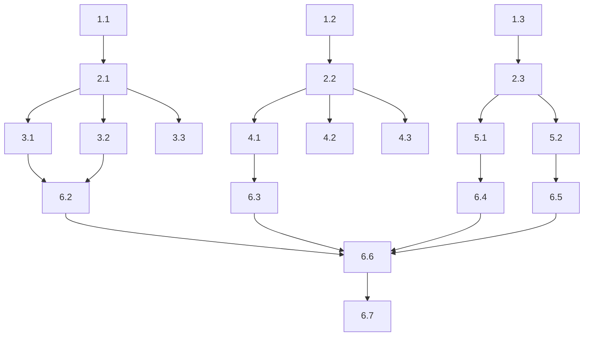

# Tasks Document: SPEC-029 FlaUI Windows Driver Fixes

## Task Format

- `[ ]` = Pending, `[-]` = In-progress, `[x]` = Completed
- Each task includes File path, Purpose, _Leverage, _Requirements, and _Prompt fields

---

## Phase 1: Extension Interfaces

### [x] 1. Create FlaUI extension interfaces

> **Note:** Interfaces were created in `srcnew/Brinell.Maui/Interfaces/` instead of `srcnew/Brinell.Maui.FlaUI/Interfaces/` for proper cross-platform abstraction. Names differ slightly from original design.

#### [x] 1.1 Create IFlaUIRangeElement interface
- **File:** `srcnew/Brinell.Maui/Interfaces/IRangePatternElement.cs` ✅
- **Purpose:** Define RangeValue pattern operations for sliders and steppers
- _Leverage: `srcnew/Brinell.Maui/Interfaces/IMauiElement.cs`_
- _Requirements: R1 (Slider RangeValue Pattern)_
- _Prompt: Role: C# Interface Designer | Task: Create IFlaUIRangeElement interface with SupportsRangeValue, SetRangeValue, GetRangeValue, GetRangeMinimum, GetRangeMaximum, GetRangeSmallChange as specified in design.spc.spx.md Component 1 | Restrictions: Interface only, no implementation, use nullable returns for Get methods | Success: Interface compiles, defines all 6 members from design_

#### [x] 1.2 Create IFlaUIComboBoxElement interface
- **File:** `srcnew/Brinell.Maui/Interfaces/IExpandCollapsePatternElement.cs` ✅
- **Purpose:** Define ExpandCollapse pattern operations for pickers
- _Leverage: `srcnew/Brinell.Maui/Interfaces/IMauiElement.cs`_
- _Requirements: R2 (Picker ComboBox)_
- _Prompt: Role: C# Interface Designer | Task: Create IFlaUIComboBoxElement interface with SupportsExpandCollapse, IsExpanded, Expand, Collapse, GetExpandedItems as specified in design.spc.spx.md Component 1 | Restrictions: Interface only, GetExpandedItems returns IReadOnlyList<IMauiElement> | Success: Interface compiles, defines all 5 members from design_

#### [x] 1.3 Create IFlaUITextElement interface
- **File:** `srcnew/Brinell.Maui/Interfaces/INestedTextElement.cs` ✅
- **Purpose:** Define nested text operations for SearchBar and Editor
- _Leverage: `srcnew/Brinell.Maui/Interfaces/IMauiElement.cs`_
- _Requirements: R3 (SearchBar), R4 (Editor)_
- _Prompt: Role: C# Interface Designer | Task: Create IFlaUITextElement interface with FindNestedTextBox, GetNestedText, ClearWithFallback as specified in design.spc.spx.md Component 1 | Restrictions: Interface only, FindNestedTextBox returns IMauiElement? | Success: Interface compiles, defines all 3 members from design_

---

## Phase 2: FlaUIMauiElement Implementation

### [x] 2. Implement extension interfaces in FlaUIMauiElement

#### [x] 2.1 Implement IFlaUIRangeElement
- **File:** `srcnew/Brinell.Maui.FlaUI/FlaUIMauiElement.cs` ✅
- **Purpose:** Add RangeValue pattern support to FlaUIMauiElement
- _Leverage: `FlaUI.Core.Patterns.RangeValue`, existing pattern access in FlaUIMauiElement_
- _Requirements: R1.1-R1.6_
- _Prompt: Role: FlaUI Developer | Task: Add IFlaUIRangeElement implementation to FlaUIMauiElement class. Implement SupportsRangeValue using _element.Patterns.RangeValue.IsSupported, SetRangeValue with value clamping, GetRangeValue/Min/Max/SmallChange with null returns when not supported | Restrictions: All pattern access must be wrapped in try-catch, use safe property access | Success: All 6 interface members implemented, builds without errors_

#### [x] 2.2 Implement IFlaUIComboBoxElement
- **File:** `srcnew/Brinell.Maui.FlaUI/FlaUIMauiElement.cs` ✅
- **Purpose:** Add ExpandCollapse pattern support for ComboBox/Picker
- _Leverage: `FlaUI.Core.Patterns.ExpandCollapse`, `FlaUI.Core.Definitions.ControlType.ListItem`_
- _Requirements: R2.1-R2.7_
- _Prompt: Role: FlaUI Developer | Task: Add IFlaUIComboBoxElement implementation to FlaUIMauiElement. Implement Expand/Collapse with Thread.Sleep(100) for items to render, GetExpandedItems to find ListItem descendants, IsExpanded to check ExpandCollapseState | Restrictions: Restore original expand state after GetExpandedItems, handle pattern not supported | Success: All 5 interface members implemented, ComboBox items enumerable after expand_

#### [x] 2.3 Implement IFlaUITextElement
- **File:** `srcnew/Brinell.Maui.FlaUI/FlaUIMauiElement.cs` ✅
- **Purpose:** Add nested TextBox discovery for SearchBar/Editor
- _Leverage: `FlaUI.Core.Definitions.ControlType.Edit`, existing Value pattern access_
- _Requirements: R3.1-R3.6, R4.1-R4.5_
- _Prompt: Role: FlaUI Developer | Task: Add IFlaUITextElement implementation. FindNestedTextBox searches for ControlType.Edit descendants, GetNestedText tries Value pattern then nested TextBox, ClearWithFallback uses SetValue("") or Ctrl+A Delete | Restrictions: Focus element before clear, handle read-only controls | Success: All 3 interface members implemented, nested text retrievable_

#### [x] 2.4 Update class declaration
- **File:** `srcnew/Brinell.Maui.FlaUI/FlaUIMauiElement.cs` ✅
- **Purpose:** Add interface implementations to class signature
- _Leverage: Existing class structure_
- _Requirements: All_
- _Prompt: Role: C# Developer | Task: Update FlaUIMauiElement class declaration to implement IFlaUIRangeElement, IFlaUIComboBoxElement, IFlaUITextElement | Restrictions: Keep existing IMauiElement implementation | Success: Class compiles with all 4 interfaces_

---

## Phase 3: Range Control Updates

### [x] 3. Update MauiRangeControlBase for FlaUI support

#### [x] 3.1 Update GetValueCore to use IFlaUIRangeElement
- **File:** `srcnew/Brinell.Maui/Controls/MauiRangeControlBase.cs` ✅
- **Purpose:** Use RangeValue pattern when available
- _Leverage: IFlaUIRangeElement interface from Phase 1_
- _Requirements: R1.5_
- _Prompt: Role: C# Developer | Task: In GetValueCore, check if element is IFlaUIRangeElement and SupportsRangeValue, if so use GetRangeValue(), else fall through to existing logic | Restrictions: Keep existing fallback logic intact, add check at start of method | Success: GetValueCore returns RangeValue when available_

#### [x] 3.2 Update SetValueCore to use IFlaUIRangeElement
- **File:** `srcnew/Brinell.Maui/Controls/MauiRangeControlBase.cs` ✅
- **Purpose:** Use RangeValue.SetValue when available
- _Leverage: IFlaUIRangeElement.SetRangeValue_
- _Requirements: R1.2, R1.3, R1.4_
- _Prompt: Role: C# Developer | Task: In SetValueCore, check if element is IFlaUIRangeElement and SupportsRangeValue, if so use SetRangeValue(value), else fall through to existing logic | Restrictions: Keep existing SendKeys fallback, add check at start | Success: SetValueCore uses pattern-based approach on Windows_

#### [x] 3.3 Update GetMinimumCore/GetMaximumCore/GetStepCore
- **File:** `srcnew/Brinell.Maui/Controls/MauiRangeControlBase.cs` ✅
- **Purpose:** Use RangeValue pattern for range properties
- _Leverage: IFlaUIRangeElement.GetRangeMinimum/Maximum/SmallChange_
- _Requirements: R1.6_
- _Prompt: Role: C# Developer | Task: In each Core method, check if element is IFlaUIRangeElement and SupportsRangeValue, use GetRangeMinimum/Maximum/SmallChange respectively | Restrictions: Keep existing attribute fallbacks | Success: All 3 methods use RangeValue pattern when available_

---

## Phase 4: Selector Control Updates

### [x] 4. Update MauiSelectorControlBase for FlaUI support

#### [x] 4.1 Update GetItemElementsCore
- **File:** `srcnew/Brinell.Maui/Controls/MauiSelectorControlBase.cs` ✅
- **Purpose:** Use ComboBox expand/enumerate pattern
- _Leverage: IFlaUIComboBoxElement.GetExpandedItems_
- _Requirements: R2.1-R2.3_
- _Prompt: Role: C# Developer | Task: In GetItemElementsCore, check if element is IFlaUIComboBoxElement and SupportsExpandCollapse, if so return GetExpandedItems(), else return null | Restrictions: Let interface handle expand/collapse lifecycle | Success: Picker items enumerable on Windows_

#### [x] 4.2 Update SelectByTextCore for ComboBox
- **File:** `srcnew/Brinell.Maui/Controls/MauiSelectorControlBase.cs` ✅
- **Purpose:** Properly expand ComboBox before selection
- _Leverage: IFlaUIComboBoxElement.Expand, GetExpandedItems_
- _Requirements: R2.4_
- _Prompt: Role: C# Developer | Task: In SelectByTextCore, if element is IFlaUIComboBoxElement, call Expand first, then find and click item | Restrictions: Click auto-collapses, no need to manually collapse | Success: SelectByText works on Windows Picker_

#### [x] 4.3 Update SelectByIndexCore for ComboBox
- **File:** `srcnew/Brinell.Maui/Controls/MauiSelectorControlBase.cs` ✅
- **Purpose:** Properly expand ComboBox before index selection
- _Leverage: IFlaUIComboBoxElement.Expand, GetExpandedItems_
- _Requirements: R2.5_
- _Prompt: Role: C# Developer | Task: In SelectByIndexCore, if element is IFlaUIComboBoxElement, call Expand first, then get items and click by index | Restrictions: Validate index bounds | Success: SelectByIndex works on Windows Picker_

---

## Phase 5: Text Control Updates

### [x] 5. Update text controls for FlaUI support

#### [x] 5.1 Add GetTextCore override to MauiSearchBarControl
- **File:** `srcnew/Brinell.Maui/Controls/Text/MauiSearchBarControl.cs` ✅
- **Purpose:** Use nested TextBox for text retrieval
- _Leverage: IFlaUITextElement.GetNestedText_
- _Requirements: R3.1-R3.4_
- _Prompt: Role: C# Developer | Task: Override GetTextCore in MauiSearchBarControl, check if element is IFlaUITextElement and use GetNestedText(), else call base | Restrictions: MauiSearchBarControl extends MauiEntryControl, need to add GetTextCore if not present | Success: SearchBar.GetText() returns entered text on Windows_

#### [x] 5.2 Create/Update MauiEditorControl with ClearCore override
- **File:** `srcnew/Brinell.Maui/Controls/Text/MauiEditorControl.cs` ✅
- **Purpose:** Use robust clear with fallback
- _Leverage: IFlaUITextElement.ClearWithFallback_
- _Requirements: R4.1-R4.5_
- _Prompt: Role: C# Developer | Task: Create MauiEditorControl if not exists, or add ClearCore override that checks for IFlaUITextElement and uses ClearWithFallback(), else call base.ClearCore | Restrictions: Ensure control exists and inherits from MauiEntryControl or appropriate base | Success: Editor.Clear() works on Windows_

---

## Phase 6: Testing and Validation

### [ ] 6. Run tests and validate fixes

#### [ ] 6.1 Build solution
- **File:** All modified files
- **Purpose:** Verify compilation
- _Leverage: dotnet build_
- _Requirements: All_
- _Prompt: Role: Build Engineer | Task: Run dotnet build on solution, fix any compilation errors | Restrictions: Do not modify interface contracts to fix errors | Success: Solution builds with 0 errors_

#### [ ] 6.2 Run Slider tests
- **File:** `testsnew/Brinell.Maui.UITests/Tests/Range/SliderControlTests.cs`
- **Purpose:** Validate R1 implementation
- _Leverage: dotnet test --filter "FullyQualifiedName~Slider"_
- _Requirements: R1_
- _Prompt: Role: QA Engineer | Task: Run Slider tests, document results, identify any remaining failures | Restrictions: Do not modify tests to pass | Success: 19/19 Slider tests pass (up from 13/19)_

#### [ ] 6.3 Run Picker tests
- **File:** `testsnew/Brinell.Maui.UITests/Tests/Selection/`
- **Purpose:** Validate R2 implementation
- _Leverage: dotnet test --filter "FullyQualifiedName~Picker"_
- _Requirements: R2_
- _Prompt: Role: QA Engineer | Task: Run Picker tests, document results | Restrictions: None | Success: 8/8 Selection tests pass (up from 3/8)_

#### [ ] 6.4 Run SearchBar tests
- **File:** `testsnew/Brinell.Maui.UITests/Tests/Text/SearchBarControlTests.cs`
- **Purpose:** Validate R3 implementation
- _Leverage: dotnet test --filter "FullyQualifiedName~SearchBar"_
- _Requirements: R3_
- _Prompt: Role: QA Engineer | Task: Run SearchBar tests, document results | Restrictions: None | Success: SearchBar text retrieval tests pass_

#### [ ] 6.5 Run Editor tests
- **File:** `testsnew/Brinell.Maui.UITests/Tests/Text/`
- **Purpose:** Validate R4 implementation
- _Leverage: dotnet test --filter "FullyQualifiedName~Editor"_
- _Requirements: R4_
- _Prompt: Role: QA Engineer | Task: Run Editor tests, document results | Restrictions: None | Success: Editor Clear tests pass_

#### [ ] 6.6 Run full test suite
- **File:** All test files
- **Purpose:** Validate no regressions
- _Leverage: dotnet test testsnew/Brinell.Maui.UITests_
- _Requirements: All_
- _Prompt: Role: QA Engineer | Task: Run full test suite, compare to baseline (152 passed), document improvements | Restrictions: None | Success: Pass rate > 85%, no regression in previously passing tests_

#### [ ] 6.7 Update documentation
- **File:** `docs/run/WINDOWS-TEST-RESULTS.md`
- **Purpose:** Document final results
- _Leverage: Existing document structure_
- _Requirements: All_
- _Prompt: Role: Technical Writer | Task: Update WINDOWS-TEST-RESULTS.md with new pass rate, mark issues as fixed, update known issues section | Restrictions: Keep existing format | Success: Document reflects current state_

---

## Task Summary

| Phase | Tasks | Status | Est. Time |
|-------|-------|--------|-----------|
| 1. Interfaces | 3 | ✅ Complete | 30 min |
| 2. FlaUIMauiElement | 4 | ✅ Complete | 60 min |
| 3. Range Controls | 3 | ✅ Complete | 30 min |
| 4. Selector Controls | 3 | ✅ Complete | 30 min |
| 5. Text Controls | 2 | ✅ Complete | 30 min |
| 6. Testing | 7 | ⏳ Pending | 60 min |
| **Total** | **22** | **15/22 Complete** | **~4 hours** |

## Dependencies

## Success Criteria

| Metric | Baseline | Target |
|--------|----------|--------|
| Overall pass rate | 65.5% (152/232) | 85%+ (197/232) |
| Slider tests | 13/19 | 19/19 |
| Selection tests | 3/8 | 8/8 |
| Text tests | 8/14 | 14/14 |
| Regressions | N/A | 0 |
