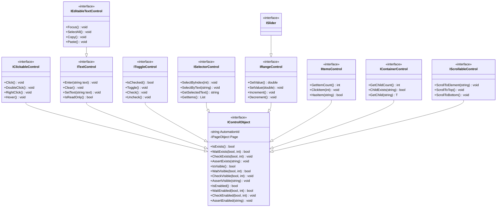
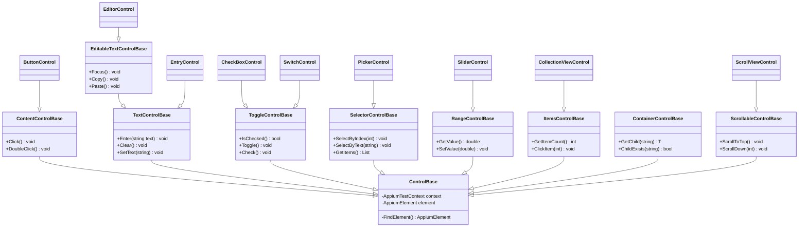
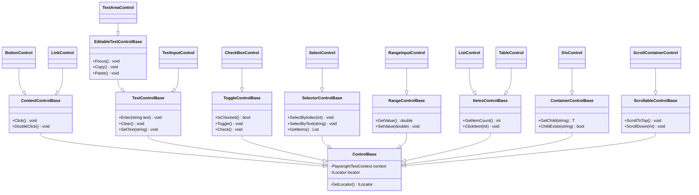
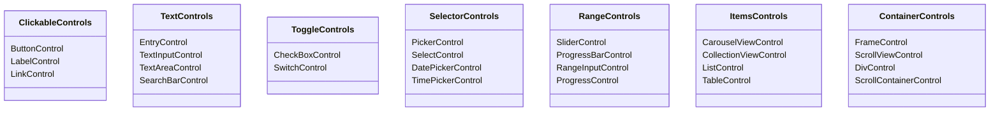
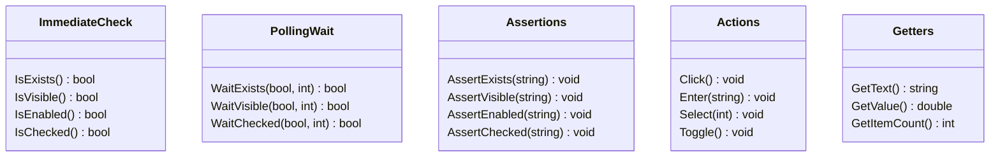
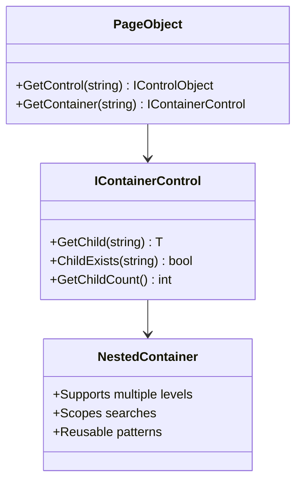

# SPEC-002b-001: Control Object Hierarchy (Mermaid Diagrams)

**Version:** 2.0 (Fixed Mermaid Syntax)  
**Status:** For Review  
**Date:** January 2026

---

## 1. Core Interface Hierarchy

### 1.1 Complete Interface Hierarchy Diagram

---

## 2. Concrete Control Implementation - MAUI Platform

### 2.1 MAUI Control Class Hierarchy

---

## 3. Concrete Control Implementation - Blazor/Playwright Platform

### 3.1 Blazor Control Class Hierarchy

---

## 4. Control Capability Matrix

---

## 5. Method Pattern Overview

---

## 6. Container Scoping Visualization

---

## 7. MAUI Controls Summary Table

| Control | Base Class | Interfaces | Primary Use |
|---------|-----------|-----------|-------------|
| ButtonControl | ContentControlBase | IClickableControl | Push button |
| LabelControl | ContentControlBase | IClickableControl | Read-only text |
| EntryControl | TextControlBase | ITextControl | Single-line text input |
| EditorControl | EditableTextControlBase | IEditableTextControl | Multi-line text input |
| SearchBarControl | TextControlBase | ITextControl | Searchable input |
| CheckBoxControl | ToggleControlBase | IToggleControl | Binary toggle |
| SwitchControl | ToggleControlBase | IToggleControl | On/Off state |
| PickerControl | SelectorControlBase | ISelectorControl | Option selection |
| DatePickerControl | SelectorControlBase | ISelectorControl | Date selection |
| TimePickerControl | SelectorControlBase | ISelectorControl | Time selection |
| SliderControl | RangeControlBase | IRangeControl | Numeric range |
| ProgressBarControl | RangeControlBase | IRangeControl | Progress display |
| CarouselViewControl | ItemsControlBase | IItemsControl | Item carousel |
| CollectionViewControl | ItemsControlBase | IItemsControl | Item collection |
| FrameControl | ContainerControlBase | IContainerControl | Container |
| ScrollViewControl | ScrollableControlBase | IScrollableControl, IContainerControl | Scrollable container |
| ActivityIndicatorControl | ControlBase | IControlObject | Loading indicator |

---

## 8. Blazor/Playwright Controls Summary Table

| Control | Base Class | Interfaces | Primary Use |
|---------|-----------|-----------|-------------|
| ButtonControl | ContentControlBase | IClickableControl | Push button |
| LinkControl | ContentControlBase | IClickableControl | Hyperlink |
| LabelControl | ContentControlBase | IClickableControl | Read-only text |
| TextInputControl | TextControlBase | ITextControl | Single-line text input |
| TextAreaControl | EditableTextControlBase | IEditableTextControl | Multi-line text input |
| CheckBoxControl | ToggleControlBase | IToggleControl | Binary toggle |
| SelectControl | SelectorControlBase | ISelectorControl | Option selection |
| RangeInputControl | RangeControlBase | IRangeControl | Numeric range input |
| ProgressControl | RangeControlBase | IRangeControl | Progress display |
| ListControl | ItemsControlBase | IItemsControl | Item list |
| TableControl | ItemsControlBase | IItemsControl | Item table |
| DivControl | ContainerControlBase | IContainerControl | Generic container |
| ScrollContainerControl | ScrollableControlBase | IScrollableControl, IContainerControl | Scrollable container |

---

## 9. Key Diagram Insights

### Interface Hierarchy
- **IControlObject** is the base for all controls
- **Specialized interfaces** inherit from IControlObject
- **Marker interfaces** provide specific typing

### Implementation Patterns
- **Base classes** implement core functionality
- **Platform-specific** variants exist for MAUI and Blazor
- **Control hierarchy** follows interface contracts

### Method Patterns
- **Is*** methods: Immediate state checks
- **Wait*** methods: Polling with timeout
- **Check*** methods: Precondition verification
- **Assert*** methods: Test assertions
- **Get*** methods: Current state queries
- **Action methods**: User interactions

### Scoping Strategy
- **Page objects** contain named controls and containers
- **Containers** have child elements
- **Nesting** allows multi-level scoping
- **GetChild** retrieves named children

---

## 10. Validation Notes

✅ All core interfaces documented  
✅ MAUI platform: 17+ controls  
✅ Blazor platform: 13+ controls  
✅ Inheritance hierarchies verified  
✅ Method signatures extracted from source  
✅ Container relationships validated  
✅ Mermaid syntax fixed for current version (v11.x)

**Last Updated:** January 3, 2026  
**Status:** Ready for Review
