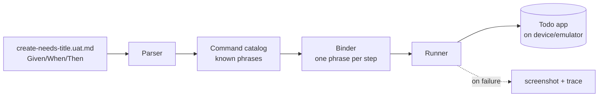

# One Todo UAT, end to end

This walks through **a single UAT** for the Todo sample so you can see how a
plain-Markdown scenario becomes something Brinell actually runs against the app.

The scenario we follow is **TOD.02.3 — "A todo needs a title"** from
[journeys.md](journeys.md). In words: on an empty list, adding a todo with a
blank title must show *"Title is required"* and must not save.

---

## 1. The shape of a UAT

A UAT is not code. It is two Markdown files:

| File | Job |
| --- | --- |
| `uat.config.md` | Where the app is, which assemblies hold the pages/controls/phrases, how to report. One per test project. |
| `Scenarios/*.uat.md` | The executable scenarios themselves, in `Given / When / Then`. |

Brinell reads the scenario, matches each line to a **phrase**, and calls the
matching **page object** method against the running app. Nothing is generated to
`.cs`; the Markdown *is* the test.



---

## 2. The scenario file

`Scenarios/create-needs-title.uat.md`:

```markdown
# UAT: A new todo needs a title

## Metadata

| Field | Value |
| --- | --- |
| App | Brinell.Samples.Todo.App |
| Area | Create a todo |
| Target | MAUI |
| Tags | smoke, todo, validation |
| Mode | Automated |
| Requires | Deterministic |
| Priority | Smoke |
| Evidence | none |

@smoke @todo @validation @automated @deterministic
## Scenario: Saving with a blank title is refused

Given I am on the Todo List page
When I tap Add
And I clear Title
And I tap Save
Then Title Error should contain "Title is required"
And Title Error should be visible
```

Notes on why each part is there:

- **`# UAT: <title>`** — exactly one per file; it names the scenario.
- **`## Metadata`** — the traceable header. `Tags` feeds the `@tag` gate line;
  `Area` and `App` are documentation. Keeping `Journey: TOD.02.3` here (or as a
  tag) is what lets the coverage report tie this file back to the journey.
- **`@smoke @todo ...`** — tag line. It must sit **immediately above**
  `## Scenario:`. These drive filtering and the skip rules in the config.
- **The steps** — each starts with `Given/When/Then/And/But`. `And` inherits the
  previous keyword (so `And I clear Title` is still a *When*).

---

## 3. How each step binds

Every step matches exactly one built-in phrase. The phrase decides which page
object method runs:

| Step | Phrase | What runs |
| --- | --- | --- |
| `Given I am on the Todo List page` | `I am on the {page} page` | Opens/asserts the page, sets it current |
| `When I tap Add` | `I tap {control}` | `AddButton.Click()` |
| `And I clear Title` | `I clear {control}` | `Title.Clear()` |
| `And I tap Save` | `I tap {control}` | `SaveButton.Click()` |
| `Then Title Error should contain "Title is required"` | `{control} should contain {value}` | `TitleError.AssertTextContains(...)` |
| `Then Title Error should be visible` | `{control} should be visible` | `TitleError.AssertVisible(true)` |

The important idea: **"Add", "Title", "Save", "Title Error"** are not string
lookups against the screen. They are *names of members on the page object*. The
runtime already has a `TodoListPage` and `TodoEditPage` (in
[tests/Brinell.Samples.Todo.UITests/Pages](tests/Brinell.Samples.Todo.UITests/Pages)),
and their members provide the names:

```csharp
// TodoListPage.cs — the Add toolbar button
public ToolbarButton<AppRoot> AddButton => new(_appRoot, Locator.ByAccessibilityId("TodoList_Add"));

// TodoEditPage.cs — the title and its error label
public Entry<SectionCard<TodoEditPage>> Title      => BasicsCard.Entry("TodoEdit_Title");
public Label<SectionCard<TodoEditPage>> TitleError => BasicsCard.Label("TodoEdit_TitleError");
```

With `AllowNameInference` on, `AddButton` → **Add**, `Title` → **Title**,
`TitleError` → **Title Error**, `TodoListPage` → **Todo List**. If you want the
name in the scenario to differ from the code, pin it explicitly:

```csharp
[UatName("Title Error")]
public Label<SectionCard<TodoEditPage>> TitleError => BasicsCard.Label("TodoEdit_TitleError");
```

So the chain for one step is:

```text
"Then Title Error should contain \"Title is required\""
   -> phrase   {control} should contain {value}
   -> control  "Title Error"  == TodoEditPage.TitleError
   -> id       TodoEdit_TitleError  (from the XAML)
   -> call     AssertTextContains("Title is required")
```

The AutomationIds (`TodoEdit_Title`, `TodoEdit_TitleError`) come from the app
XAML in
[src/Brinell.Samples.Todo.App/Pages/TodoEditPage.xaml](src/Brinell.Samples.Todo.App/Pages/TodoEditPage.xaml).
That is the anchor that survives rebuilds — the page object binds to the id, the
scenario binds to the page object's name.

---

## 4. The config that points at the Todo app

`uat.config.md` for a Todo UAT project mirrors the existing MAUI one
([testsnew/Brinell.Maui.Uat.Tests/uat.config.md](../../testsnew/Brinell.Maui.Uat.Tests/uat.config.md)),
just pointing at the Todo binaries:

```markdown
# UAT Config

## Runtime

| Field | Value |
| --- | --- |
| Target | MAUI |
| Fixture | Appium |
| AppPath | ../src/Brinell.Samples.Todo.App/bin/Debug/net10.0-windows10.0.19041.0/win-x64/Brinell.Samples.Todo.App.exe |
| WorkingDirectory | .. |

## Assemblies

| Kind | Assembly |
| --- | --- |
| Pages | ../tests/Brinell.Samples.Todo.UITests/bin/Debug/net10.0-windows7.0/Brinell.Samples.Todo.UITests.dll |
| Controls | ../../../srcnew/Brinell.Maui/bin/Debug/net10.0/Brinell.Maui.dll |
| Commands | ../../../srcnew/Brinell.Uat/bin/Debug/net10.0/Brinell.Uat.dll |

## Discovery

| Field | Value |
| --- | --- |
| RequireExplicitUatAttributes | false |
| AllowNameInference | true |

## Reporting

| Field | Value |
| --- | --- |
| ScreenshotOnFailure | true |
| IncludeRuntimeTrace | true |

## Skip Rules

| Tag | EnvironmentVariable |
| --- | --- |
| live-api | BRINELL_UAT_LIVE_API |
```

- **`AppPath`** launches the real Todo app.
- **`Pages`** is the assembly that carries `TodoListPage` / `TodoEditPage` — the
  source of the control names.
- **`Commands`** carries the phrase catalog (`Brinell.Uat`).
- **`AllowNameInference = true`** is why `AddButton` works as **Add** with no
  attribute.

---

## 5. What happens when it runs

1. The runner launches `Brinell.Samples.Todo.App.exe` via Appium.
2. `Given I am on the Todo List page` waits for the list to be on screen (the
   page object's own readiness gate), not a fixed sleep.
3. `When I tap Add` clicks the toolbar Add; the edit page opens.
4. `And I clear Title` empties the title entry.
5. `And I tap Save` presses Save. Validation refuses it and shows the error.
6. `Then Title Error should contain "Title is required"` asserts the label text.
7. `And Title Error should be visible` asserts it is on screen.

If any *Then* fails, the runner stops that scenario, captures a screenshot and a
runtime trace (because `ScreenshotOnFailure` / `IncludeRuntimeTrace` are on), and
reports the failing step.

---

## 6. Why this is worth it

- A product owner can read `create-needs-title.uat.md` and sign off on it —
  there is no C# to understand.
- It runs deterministically against the real app; no LLM in the loop at run time.
- It stays traceable: `TOD.02.3` in the journey → this `.uat.md` → green/red on a
  device.

When a scenario outgrows the phrase vocabulary (needs data seeding, a custom
assertion, IDE debugging), that one scenario can drop to a `.cs` page-object test
— the escape hatch described in
[.my/uat/rethinking-uat.md](../../.my/uat/rethinking-uat.md). Everything else
stays as readable Markdown.

---

## Reference

- Journey backbone: [journeys.md](journeys.md)
- Config and file shape: [docs/guides/uat-template-guide.md](../../docs/guides/uat-template-guide.md)
- Phrase catalog and binding: [docs/guides/uat-phrases-and-flows.md](../../docs/guides/uat-phrases-and-flows.md)
- Todo page objects: [tests/Brinell.Samples.Todo.UITests/Pages](tests/Brinell.Samples.Todo.UITests/Pages)
