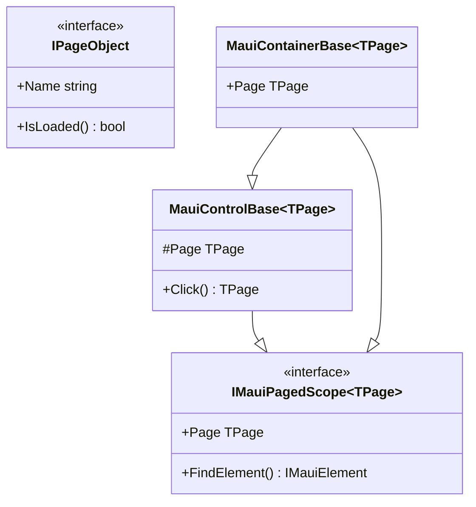
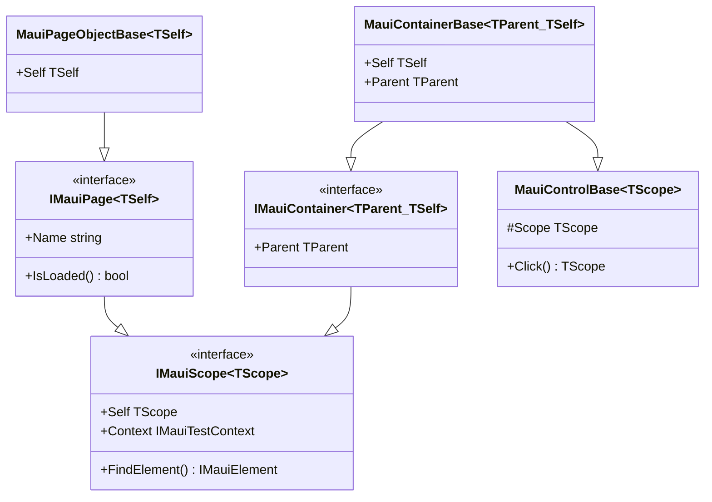

# SPX-015: Design Document - Scope-Aware Fluent Chaining

**Status:** Design  
**Created:** 2025-01-14  
**Author:** Copilot  
**Requirements:** SPX-015 Requirements Document

---

## 1. Overview

This design implements scope-aware fluent chaining where controls return their containing scope (page or container) rather than always returning the page. This enables natural fluent chaining within container boundaries while providing navigation up via `.Parent`.

**Key Insight:** A container only needs to know its **parent scope**. The parent can be a page OR another container - both are scopes. No need for a separate `TPage` type parameter.

**Key Change:**
```csharp
// Before: TPage is always the page
MauiButtonControl<TPage> where TPage : IPageObject

// After: TScope is the containing scope (page OR container)
MauiButtonControl<TScope> where TScope : IMauiScope<TScope>

// Before: Container needs both TPage and TSelf (and TParent for nesting)
MauiContainerBase<TPage, TSelf>
MauiContainerBase<TPage, TSelf, TParent>

// After: Container only needs TParent and TSelf
MauiContainerBase<TParent, TSelf>  // TParent can be page OR container
```

---

## 2. Architecture

### 2.1 Current Class Hierarchy



**Problem:** `TPage` constraint means all controls return page, even when inside containers.

### 2.2 New Class Hierarchy (Simplified)



**Solution:** 
- `TScope` is self-referencing, so pages return themselves and containers return themselves
- Only ONE container interface/class needed: `IMauiContainer<TParent, TSelf>`
- `TParent` can be any scope (page or container)
- Navigate up via `.Parent` - chain as needed to reach page

---

## 3. Interface Definitions

### 3.1 IMauiScope<TScope> - Base Scope Interface

```csharp
namespace Brinell.Maui.Interfaces;

/// <summary>
/// Base scope interface for element finding with self-referencing fluent return.
/// Both pages and containers implement this interface.
/// </summary>
/// <typeparam name="TScope">The scope type itself (self-referencing for fluent returns).</typeparam>
public interface IMauiScope<TScope> : IMauiElementScope
    where TScope : IMauiScope<TScope>
{
    /// <summary>
    /// Gets this scope for fluent chaining.
    /// Pages return themselves. Containers return themselves.
    /// </summary>
    TScope Self { get; }
}
```

### 3.2 IMauiPage<TSelf> - Page Interface

```csharp
namespace Brinell.Maui.Interfaces;

/// <summary>
/// Page interface extending scope. Pages are scopes that return themselves.
/// Pages are root scopes - they have no Parent property.
/// </summary>
/// <typeparam name="TSelf">The page type itself (self-referencing).</typeparam>
public interface IMauiPage<TSelf> : IMauiScope<TSelf>, IPageObject
    where TSelf : IMauiPage<TSelf>
{
    // Inherits:
    // - TSelf Self { get; }        from IMauiScope<TSelf>
    // - Element finding            from IMauiElementScope
    // - Page operations            from IPageObject
    // NO Parent property - pages are the root of the hierarchy
}
```

### 3.3 IMauiContainer<TParent, TSelf> - Container Interface

```csharp
namespace Brinell.Maui.Interfaces;

/// <summary>
/// Container interface. Containers are scopes that return themselves,
/// with access to their parent scope (page or another container).
/// </summary>
/// <typeparam name="TParent">The parent scope type (page or container).</typeparam>
/// <typeparam name="TSelf">The container type itself (self-referencing).</typeparam>
public interface IMauiContainer<TParent, TSelf> : IMauiScope<TSelf>, IContainerControl
    where TParent : IMauiScope<TParent>
    where TSelf : IMauiContainer<TParent, TSelf>
{
    /// <summary>
    /// Gets the parent scope (page or container).
    /// Navigate up the scope hierarchy by calling Parent.
    /// Chain .Parent.Parent... to reach the root page.
    /// </summary>
    TParent Parent { get; }
}
```

### 3.4 Scope Hierarchy Diagram

```
┌─────────────────────────────────────────────────────────────────┐
│ IMauiScope<TScope>                                              │
│   └── Self: TScope (returns this for fluent chaining)           │
└─────────────────────────────────────────────────────────────────┘
            │                              │
            ▼                              ▼
┌─────────────────────┐     ┌─────────────────────────────────────┐
│ IMauiPage<TSelf>    │     │ IMauiContainer<TParent, TSelf>      │
│   └── Self: TSelf   │     │   ├── Self: TSelf                   │
│   └── NO Parent     │     │   └── Parent: TParent               │
│       (root scope)  │     │       (page or container)           │
└─────────────────────┘     └─────────────────────────────────────┘

Navigation:
- Page has no Parent (it's the root)
- Container.Parent → parent scope (page or container)
- Container.Parent.Parent → grandparent scope
- Eventually reaches the page (root)
```

---

## 4. Class Implementations

### 4.1 MauiControlBase<TScope>

```csharp
namespace Brinell.Maui.Controls;

/// <summary>
/// Base class for all MAUI controls with scope-aware fluent chaining.
/// TScope can be either a page or a container.
/// </summary>
/// <typeparam name="TScope">The containing scope type for fluent returns.</typeparam>
public class MauiControlBase<TScope> : MauiObjectBase, IControlObject
    where TScope : IMauiScope<TScope>
{
    private readonly IMauiScope<TScope> _scope;
    private readonly Locator _locator;
    
    public MauiControlBase(IMauiScope<TScope> scope, Locator locator)
    {
        _scope = scope ?? throw new ArgumentNullException(nameof(scope));
        _locator = locator ?? throw new ArgumentNullException(nameof(locator));
    }
    
    /// <summary>
    /// Gets the containing scope for fluent chaining.
    /// </summary>
    protected TScope Scope => _scope.Self;
    
    /// <inheritdoc />
    public Locator Locator => _locator;
    
    /// <inheritdoc />
    IElementScope IControlObject.Scope => _scope;
    
    /// <inheritdoc />
    public override IMauiTestContext Context => _scope.Context;
    
    // ... rest of implementation
}
```

### 4.2 MauiButtonControl<TScope>

```csharp
namespace Brinell.Maui.Controls;

/// <summary>
/// MAUI Button control with scope-aware fluent chaining.
/// </summary>
/// <typeparam name="TScope">The containing scope type for fluent returns.</typeparam>
public class MauiButtonControl<TScope> : MauiControlBase<TScope>, IClickableControlObject<TScope>
    where TScope : IMauiScope<TScope>
{
    public MauiButtonControl(IMauiScope<TScope> scope, Locator locator)
        : base(scope, locator)
    {
    }
    
    /// <inheritdoc />
    public TScope Click(int? timeoutMs = null)
    {
        CheckClickable();
        var element = FindElement();
        element.Click();
        return Scope;  // Returns the containing scope
    }
    
    /// <inheritdoc />
    public TScope DoubleClick(int? timeoutMs = null)
    {
        CheckClickable(timeoutMs);
        var element = FindElement();
        element.Click();
        element.Click();
        return Scope;  // Returns the containing scope
    }
    
    // ... rest of implementation
}
```

### 4.3 MauiPageObjectBase<TSelf>

```csharp
namespace Brinell.Maui.Pages;

/// <summary>
/// Base class for MAUI pages. Pages are scopes that return themselves.
/// </summary>
/// <typeparam name="TSelf">The page type itself (self-referencing).</typeparam>
public abstract class MauiPageObjectBase<TSelf> : MauiObjectBase, IMauiPage<TSelf>
    where TSelf : MauiPageObjectBase<TSelf>
{
    private readonly IMauiTestContext _context;
    
    protected MauiPageObjectBase(IMauiTestContext context)
    {
        _context = context ?? throw new ArgumentNullException(nameof(context));
    }
    
    /// <inheritdoc />
    public TSelf Self => (TSelf)this;
    
    /// <inheritdoc />
    public override IMauiTestContext Context => _context;
    
    // Factory methods create controls with TSelf as scope
    
    /// <summary>
    /// Creates a button control within this page scope.
    /// </summary>
    protected MauiButtonControl<TSelf> Button(Locator locator)
        => new MauiButtonControl<TSelf>(this, locator);
    
    protected MauiButtonControl<TSelf> Button(string automationId)
        => Button(Locator.ById(automationId));
    
    /// <summary>
    /// Creates an entry control within this page scope.
    /// </summary>
    protected MauiEntryControl<TSelf> Entry(Locator locator)
        => new MauiEntryControl<TSelf>(this, locator);
    
    protected MauiEntryControl<TSelf> Entry(string automationId)
        => Entry(Locator.ById(automationId));
    
    /// <summary>
    /// Creates a container within this page scope.
    /// </summary>
    protected TContainer Container<TContainer>(Locator locator)
        where TContainer : IMauiContainer<TSelf, TContainer>
        => // Create via reflection or factory
    
    // ... rest of implementation
}
```

### 4.4 MauiContainerBase<TParent, TSelf>

```csharp
namespace Brinell.Maui.Controls;

/// <summary>
/// Base class for container controls with scope-aware fluent chaining.
/// Containers are both controls (can be interacted with) and scopes (contain child controls).
/// TParent can be a page or another container - both are scopes.
/// </summary>
/// <typeparam name="TParent">The parent scope type (page or container).</typeparam>
/// <typeparam name="TSelf">The container type itself (self-referencing).</typeparam>
public abstract class MauiContainerBase<TParent, TSelf> : MauiControlBase<TParent>, IMauiContainer<TParent, TSelf>
    where TParent : IMauiScope<TParent>
    where TSelf : MauiContainerBase<TParent, TSelf>
{
    private readonly TParent _parent;
    
    protected MauiContainerBase(IMauiScope<TParent> parentScope, Locator locator)
        : base(parentScope, locator)
    {
        // Store parent scope for Parent property
        _parent = parentScope.Self;
    }
    
    /// <inheritdoc />
    public TSelf Self => (TSelf)this;
    
    /// <inheritdoc />
    public TParent Parent => _parent;
    
    // Factory methods create controls with TSelf as scope (the container)
    
    /// <summary>
    /// Creates a button control within this container scope.
    /// </summary>
    protected MauiButtonControl<TSelf> Button(Locator locator)
        => new MauiButtonControl<TSelf>(this, locator);
    
    protected MauiButtonControl<TSelf> Button(string automationId)
        => Button(Locator.ById(automationId));
    
    /// <summary>
    /// Creates an entry control within this container scope.
    /// </summary>
    protected MauiEntryControl<TSelf> Entry(Locator locator)
        => new MauiEntryControl<TSelf>(this, locator);
    
    protected MauiEntryControl<TSelf> Entry(string automationId)
        => Entry(Locator.ById(automationId));
    
    /// <summary>
    /// Creates a nested container within this container scope.
    /// </summary>
    protected TContainer Container<TContainer>(Locator locator)
        where TContainer : IMauiContainer<TSelf, TContainer>
        => // Create via reflection or factory
    
    // Element finding is scoped to container root
    // ... implementation for TryFindElement, FindElement, FindElements
}
```

**Note:** There is only ONE `MauiContainerBase<TParent, TSelf>` class. The difference between "top-level" and "nested" containers is simply the `TParent` type:
- Top-level container: `TParent` is a page (e.g., `MauiContainerBase<LoginPage, LoginFormContainer>`)
- Nested container: `TParent` is another container (e.g., `MauiContainerBase<LoginFormContainer, SocialLoginSection>`)

---

## 5. Usage Examples

### 5.1 Page Definition

```csharp
public class LoginPage : MauiPageObjectBase<LoginPage>
{
    public LoginPage(IMauiTestContext context) : base(context) { }
    
    // Controls on page return LoginPage
    public MauiButtonControl<LoginPage> SubmitButton => Button("submit");
    public MauiButtonControl<LoginPage> ForgotPasswordLink => Button("forgot");
    
    // Container - its parent is this page
    public LoginFormContainer Form => Container<LoginFormContainer>("loginForm");
}
```

### 5.2 Container Definition (Parent is Page)

```csharp
// Container whose parent is a page
public class LoginFormContainer : MauiContainerBase<LoginPage, LoginFormContainer>
{
    public LoginFormContainer(IMauiScope<LoginPage> parentScope, Locator locator) 
        : base(parentScope, locator) { }
    
    // Controls in container return LoginFormContainer
    public MauiEntryControl<LoginFormContainer> UsernameEntry => Entry("username");
    public MauiEntryControl<LoginFormContainer> PasswordEntry => Entry("password");
    public MauiButtonControl<LoginFormContainer> CancelButton => Button("cancel");
    public MauiButtonControl<LoginFormContainer> SubmitButton => Button("submit");
    
    // Nested container
    public SocialLoginSection SocialLogin => Container<SocialLoginSection>("social");
    
    // Forward method to page (optional pattern)
    public LoginFormContainer AssertOnLoginPage()
    {
        Page.AssertLoaded(true);
        return this;
    }
}
```

### 5.3 Nested Container Definition

```csharp
// Nested container with TParent type parameter
public class SocialLoginSection : MauiContainerBase<LoginPage, SocialLoginSection, LoginFormContainer>
{
    public SocialLoginSection(IMauiContainer<LoginPage, LoginFormContainer> parentScope, Locator locator) 
        : base(parentScope, locator) { }
    
    // Controls in nested container return SocialLoginSection
    public MauiButtonControl<SocialLoginSection> GoogleButton => Button("google");
    public MauiButtonControl<SocialLoginSection> FacebookButton => Button("facebook");
    public MauiButtonControl<SocialLoginSection> AppleButton => Button("apple");
}
```

### 5.4 Test Examples

```csharp
[Test]
public void Login_FluentChainWithinContainer()
{
    var loginPage = new LoginPage(context);
    
    // Chain stays within container scope
    loginPage.Form                              // LoginFormContainer
        .UsernameEntry.Enter("user@test.com")   // Returns LoginFormContainer
        .PasswordEntry.Enter("password123")     // Returns LoginFormContainer
        .SubmitButton.Click()                   // Returns LoginFormContainer
        .Page                                   // Escape to LoginPage
        .AssertLoaded(false);                   // Page navigated away
}

[Test]
public void Container_CancelButton_StaysInContainer()
{
    var loginPage = new LoginPage(context);
    
    loginPage.Form
        .UsernameEntry.Enter("test")
        .CancelButton.Click()                   // Returns LoginFormContainer
        .UsernameEntry.AssertText("")           // Continue in container
        .PasswordEntry.AssertText("");          // Continue in container
}

[Test]
public void MixedScope_PageAndContainer()
{
    var loginPage = new LoginPage(context);
    
    loginPage
        .ForgotPasswordLink.Click()             // Returns LoginPage
        .Form                                   // Enter container
            .UsernameEntry.Enter("test")        // Returns LoginFormContainer
            .Parent                             // Navigate up to page
        .SubmitButton.Click();                  // Returns LoginPage
}
```

---

## 6. Nested Container Support

### 6.1 Nested Container Definition

```csharp
public class SettingsPage : MauiPageObjectBase<SettingsPage>
{
    public AccountSettingsContainer AccountSettings 
        => Container<AccountSettingsContainer>("account");
}

// Container whose parent is a page
public class AccountSettingsContainer : MauiContainerBase<SettingsPage, AccountSettingsContainer>
{
    // Nested container - its parent is this container
    public PasswordChangeForm PasswordForm 
        => Container<PasswordChangeForm>("passwordChange");
}

// Nested container whose parent is another container
public class PasswordChangeForm : MauiContainerBase<AccountSettingsContainer, PasswordChangeForm>
{
    public MauiEntryControl<PasswordChangeForm> CurrentPassword => Entry("current");
    public MauiEntryControl<PasswordChangeForm> NewPassword => Entry("new");
    public MauiButtonControl<PasswordChangeForm> ChangeButton => Button("change");
}
```

### 6.2 Nested Container Usage

```csharp
[Test]
public void NestedContainer_FluentChaining()
{
    var settings = new SettingsPage(context);
    
    settings.AccountSettings                    // AccountSettingsContainer
        .PasswordForm                           // PasswordChangeForm
            .CurrentPassword.Enter("old")       // Returns PasswordChangeForm
            .NewPassword.Enter("new")           // Returns PasswordChangeForm
            .ChangeButton.Click()               // Returns PasswordChangeForm
            .Parent                             // Navigate to AccountSettingsContainer
            .AssertVisible(true)                // Check parent container
            .Parent                             // Navigate to SettingsPage
        .AssertLoaded(true);
}

[Test]
public void NestedContainer_ChainParentCalls()
{
    var settings = new SettingsPage(context);
    
    // Chain .Parent calls to navigate up multiple levels
    settings.AccountSettings
        .PasswordForm
            .ChangeButton.Click()
            .Parent                             // AccountSettingsContainer
            .Parent                             // SettingsPage
        .AssertLoaded(true);
}

[Test]
public void NestedContainer_NavigateUpAndReenter()
{
    var settings = new SettingsPage(context);
    
    settings.AccountSettings
        .PasswordForm
            .CurrentPassword.Enter("old")
            .Parent                             // Go to AccountSettingsContainer
        .PasswordForm                           // Re-enter nested container
            .NewPassword.Enter("new")
            .ChangeButton.Click();
}
```

---

## 7. Interface Compatibility

### 7.1 IClickableControlObject<TScope>

Update existing interface to use `TScope`:

```csharp
namespace Brinell.Core.Interfaces;

/// <summary>
/// Click capability with scope-aware fluent returns.
/// </summary>
/// <typeparam name="TScope">The containing scope type for fluent chaining.</typeparam>
public interface IClickableControlObject<TScope> : IControlObject
    where TScope : class // Scope constraint handled at implementation level
{
    TScope Click(int? timeoutMs = null);
    TScope DoubleClick(int? timeoutMs = null);
    TScope RightClick(int? timeoutMs = null);
    TScope AssertClickable(bool? expected, string? message = null, int? timeoutMs = null);
    // ...
}
```

### 7.2 ITextControlObject<TScope>

```csharp
public interface ITextControlObject<TScope> : IControlObject
    where TScope : class
{
    TScope Enter(string text, int? timeoutMs = null);
    TScope Clear(int? timeoutMs = null);
    TScope AssertText(string? expected, string? message = null, int? timeoutMs = null);
    // ...
}
```

---

## 8. Migration Path

### 8.1 Breaking Changes

| Change | Impact |
|--------|--------|
| `MauiControlBase<TPage>` → `MauiControlBase<TScope>` | All control references |
| `MauiContainerBase<TPage>` → `MauiContainerBase<TParent, TSelf>` | All container classes |
| `IMauiPagedScope<TPage>` → `IMauiScope<TScope>` | Interface references |
| Control factory methods | Return type changes |

### 8.2 Migration Steps

1. **Create new interfaces** (`IMauiScope<TScope>`, `IMauiPage<TSelf>`, `IMauiContainer<TParent, TSelf>`)
2. **Update base classes** to use new interfaces
3. **Update control classes** to use `TScope` instead of `TPage`
4. **Update existing pages** (minimal changes - just inherit differently)
5. **Update existing containers** (change type parameters, add `Parent` property)
6. **Update tests** to use `.Parent` instead of `.Page` for navigation

---

## 9. Files to Create/Modify


### 9.1 New Files

| File | Purpose |
|------|---------|
| `Brinell.Maui/Interfaces/IMauiScope.cs` | Base scope interface |
| `Brinell.Maui/Interfaces/IMauiPage.cs` | Page interface |
| `Brinell.Maui/Interfaces/IMauiContainer.cs` | Container interface (single definition) |

### 9.2 Modified Files

| File | Changes |
|------|---------|
| `Brinell.Maui/Controls/MauiControlBase.cs` | `TPage` → `TScope`, use `Scope` property |
| `Brinell.Maui/Controls/MauiButtonControl.cs` | Return `Scope` instead of `Page` |
| `Brinell.Maui/Controls/MauiEntryControl.cs` | Return `Scope` instead of `Page` |
| `Brinell.Maui/Controls/MauiContainerBase.cs` | `<TPage>` → `<TParent, TSelf>`, add `Parent` property |
| `Brinell.Maui/Pages/MauiPageObjectBase.cs` | Implement `IMauiPage<TSelf>` |
| `Brinell.Core/Interfaces/IClickableControlObject.cs` | `TPage` → `TScope` |

### 9.3 Files to Remove

| File | Reason |
|------|--------|
| `Brinell.Maui/Interfaces/IMauiPagedScope.cs` | Replaced by `IMauiScope<TScope>` |

---

## 10. Design Decisions

| Question | Decision | Rationale |
|----------|----------|-----------|
| `Self` vs `Scope` property name | **`Self`** | Clearer that it returns the same object for chaining |
| Container type parameters | **`<TParent, TSelf>`** | Simpler - only ONE container class needed |
| Why no `.Page` property? | **Use `.Parent` chain** | Unified model - page is just the root parent scope |
| Parent scope access | **`.Parent` property** | Type-safe navigation up the scope hierarchy |
| Deep nesting (3+ levels) | **Supported** | Chain `.Parent.Parent.Parent...` to reach any level |
| Page has no Parent | **Correct** | Pages are root scopes - the hierarchy stops there |
| One or two container classes? | **ONE** | `TParent` can be page or container - same class handles both |
