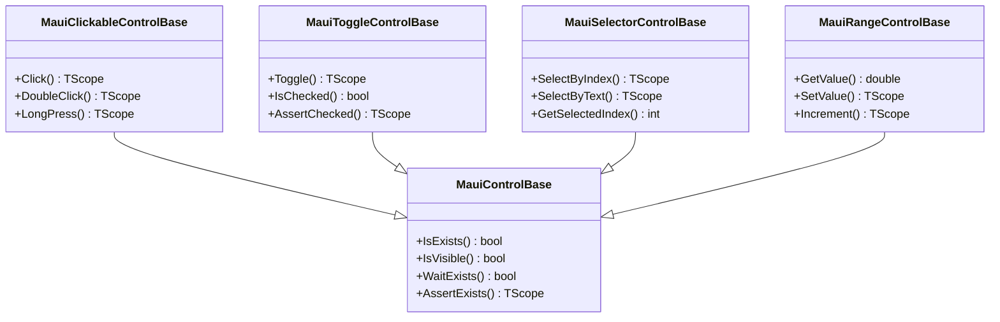
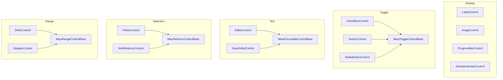

# SPEC-024: MAUI Control Objects - Design

**Spec ID:** 024  
**Feature:** maui-control-objects  
**Status:** Draft  
**Created:** January 19, 2026

---

## Overview

This design implements ~25 MAUI control objects for the Brinell framework, following the established patterns in `srcnew/Brinell.Maui`. All controls use the scope-aware fluent chaining pattern with `TScope` generic parameter.

### Design Goals

1. **Consistency** - All controls follow identical patterns
2. **Fluent API** - All actions return `TScope` for chaining
3. **Scope Awareness** - Controls work within containers/pages
4. **Virtual Methods** - Core operations are overridable
5. **Logging Integration** - All operations use `Run()` helpers

---

## Code Reuse Analysis

### Existing Base Classes to Leverage

| Base Class | Purpose | Controls That Will Inherit |
|------------|---------|---------------------------|
| `MauiControlBase<TScope>` | Core Is/Wait/Assert pattern | LabelControl, ImageControl, ProgressBarControl, ActivityIndicatorControl |
| `MauiClickableControlBase<TScope>` | Click/DoubleClick/Hover | ImageButtonControl, LinkControl |
| `MauiToggleControlBase<TScope>` | Toggle/Check/Uncheck | CheckBoxControl, SwitchControl, RadioButtonControl |
| `MauiSelectorControlBase<TScope>` | SelectByIndex/Text | PickerControl, MultiSelectorControl |
| `MauiRangeControlBase<TScope>` | GetValue/SetValue/Increment | SliderControl, StepperControl |
| `MauiScrollableControlBase<TScope>` | Scroll operations | ScrollViewControl, CollectionViewControl |
| `MauiExpandableControlBase<TScope>` | Expand/Collapse | ExpanderControl |
| `MauiRefreshableControlBase<TScope>` | Refresh/IsRefreshing | RefreshViewControl |
| `MauiSwipeableControlBase<TScope>` | SwipeLeft/Right | SwipeViewControl |

### Existing Patterns to Follow

From `MauiClickableControlBase.cs`:
```csharp
// Pattern 1: RunWithElement for actions
public TScope Click(int? timeoutMs = null)
{
    return RunWithElement(nameof(Click), timeoutMs, element =>
    {
        ClickCore(element, timeoutMs);
    });
}

// Pattern 2: Core methods are virtual, no logging
protected virtual void ClickCore(IMauiElement element, int? timeoutMs = null)
{
    CheckClickableCore(element, timeoutMs);
    element.Click();
}
```

From `MauiToggleControlBase.cs`:
```csharp
// Pattern 3: RunAssert for assertions
public TScope AssertChecked(bool? expected, string? message = null, int? timeoutMs = null)
{
    if (expected == null) return ContainingScope;
    
    return RunAssert(nameof(AssertChecked), expected, () =>
    {
        WaitChecked(expected, timeoutMs);
        return IsChecked();
    }, message);
}

// Pattern 4: Nullable skip pattern
if (expected == null) return ContainingScope;
```

---

## Architecture

### Control Hierarchy



### New Controls by Category



---

## Components and Interfaces

### 1. Display Controls

#### LabelControl
- **Purpose:** Read-only text display
- **Base:** `MauiControlBase<TScope>`
- **Interface:** `IControlObject<TScope>` (no additional interface)
- **Methods:** Uses inherited GetText(), AssertText(), AssertTextContains()

```csharp
public class MauiLabelControl<TScope> : MauiControlBase<TScope>
    where TScope : IMauiScope<TScope>
{
    public MauiLabelControl(IMauiScope<TScope> scope, string locatorValue)
        : base(scope, locatorValue) { }
        
    public MauiLabelControl(IMauiScope<TScope> scope, Locator locator)
        : base(scope, locator) { }
}
```

#### ImageControl
- **Purpose:** Image display with load state checking
- **Base:** `MauiControlBase<TScope>`
- **Interface:** `IImageControlObject<TScope>`
- **Additional Methods:** IsLoaded(), GetSource(), GetWidth(), GetHeight()

```csharp
public class MauiImageControl<TScope> : MauiControlBase<TScope>, IImageControlObject<TScope>
    where TScope : IMauiScope<TScope>
{
    public bool? IsLoaded() => IsLoadedCore(TryFindElement());
    public string? GetSource(int? timeoutMs = null) => ...;
    public int? GetWidth(int? timeoutMs = null) => ...;
    public int? GetHeight(int? timeoutMs = null) => ...;
    public TScope AssertLoaded(string? message = null, int? timeoutMs = null) => ...;
    
    protected virtual bool? IsLoadedCore(IMauiElement? element)
    {
        if (element == null) return null;
        // Check if image source is set and element has dimensions
        var source = element.GetAttribute("Source");
        return !string.IsNullOrEmpty(source);
    }
}
```

#### ProgressBarControl
- **Purpose:** Progress indicator with value retrieval
- **Base:** `MauiControlBase<TScope>`
- **Interface:** `IProgressControlObject<TScope>`
- **Methods:** GetProgress(), IsIndeterminate(), AssertProgress()

#### ActivityIndicatorControl
- **Purpose:** Loading spinner with running state
- **Base:** `MauiControlBase<TScope>`
- **Interface:** `IActivityIndicatorControlObject<TScope>`
- **Methods:** IsRunning(), WaitRunning(), AssertRunning()

---

### 2. Toggle Controls

All toggle controls inherit from `MauiToggleControlBase<TScope>`.

#### CheckBoxControl
```csharp
public class MauiCheckBoxControl<TScope> : MauiToggleControlBase<TScope>
    where TScope : IMauiScope<TScope>
{
    public MauiCheckBoxControl(IMauiScope<TScope> scope, string locatorValue)
        : base(scope, locatorValue) { }
        
    // Inherits Toggle(), Check(), Uncheck(), IsChecked(), AssertChecked()
}
```

#### SwitchControl
```csharp
public class MauiSwitchControl<TScope> : MauiToggleControlBase<TScope>
    where TScope : IMauiScope<TScope>
{
    public MauiSwitchControl(IMauiScope<TScope> scope, string locatorValue)
        : base(scope, locatorValue) { }
    
    // Alias methods for switch terminology
    public bool? IsOn() => IsChecked();
    public TScope TurnOn(int? timeoutMs = null) => Check(timeoutMs);
    public TScope TurnOff(int? timeoutMs = null) => Uncheck(timeoutMs);
}
```

#### RadioButtonControl
```csharp
public class MauiRadioButtonControl<TScope> : MauiToggleControlBase<TScope>
    where TScope : IMauiScope<TScope>
{
    public MauiRadioButtonControl(IMauiScope<TScope> scope, string locatorValue)
        : base(scope, locatorValue) { }
    
    // Alias methods for radio terminology
    public bool? IsSelected() => IsChecked();
    public TScope Select(int? timeoutMs = null) => Check(timeoutMs);
}
```

---

### 3. Text Input Controls

#### EditorControl
- **Purpose:** Multi-line text input
- **Base:** `MauiFocusableControlBase<TScope>` + `IEditableTextControlObject<TScope>`
- **Pattern:** Same as MauiEntryControl

```csharp
public class MauiEditorControl<TScope> : MauiControlBase<TScope>, IEditableTextControlObject<TScope>
    where TScope : IMauiScope<TScope>
{
    // Same pattern as MauiEntryControl
    public TScope Enter(string? text, int? timeoutMs = null) => ...;
    public TScope Clear(int? timeoutMs = null) => ...;
    public TScope ClearAndEnter(string? text, int? timeoutMs = null) => ...;
    public TScope Append(string? text, int? timeoutMs = null) => ...;
}
```

#### SearchBarControl
- **Purpose:** Search input with submit capability
- **Base:** Extends editor pattern
- **Additional:** Submit(), GetSearchText(), ClearSearch()

```csharp
public class MauiSearchBarControl<TScope> : MauiControlBase<TScope>, ISearchControlObject<TScope>
    where TScope : IMauiScope<TScope>
{
    public TScope Submit(int? timeoutMs = null)
    {
        return RunWithElement(nameof(Submit), timeoutMs, element =>
        {
            element.SendKeys("\n"); // Enter key to submit
        });
    }
    
    public string? GetSearchText(int? timeoutMs = null) => GetText(timeoutMs);
}
```

---

### 4. Selection Controls

#### PickerControl
- **Purpose:** Single-selection dropdown
- **Base:** `MauiSelectorControlBase<TScope>`

```csharp
public class MauiPickerControl<TScope> : MauiSelectorControlBase<TScope>
    where TScope : IMauiScope<TScope>
{
    public MauiPickerControl(IMauiScope<TScope> scope, string locatorValue)
        : base(scope, locatorValue) { }
    
    // Inherits SelectByIndex(), SelectByText(), GetSelectedIndex(), GetSelectedText()
    
    // Additional picker-specific methods
    public TScope Open(int? timeoutMs = null) => ...;
    public TScope Close(int? timeoutMs = null) => ...;
    public IReadOnlyList<string> GetItems(int? timeoutMs = null) => ...;
}
```

#### MultiSelectorControl
- **Purpose:** Multi-selection list
- **Base:** `MauiSelectorControlBase<TScope>`
- **Additional:** SelectMultiple(), GetSelectedItems(), ClearSelection()

---

### 5. Range Controls

#### SliderControl
```csharp
public class MauiSliderControl<TScope> : MauiRangeControlBase<TScope>
    where TScope : IMauiScope<TScope>
{
    public MauiSliderControl(IMauiScope<TScope> scope, string locatorValue)
        : base(scope, locatorValue) { }
    
    // Inherits GetValue(), SetValue(), Increment(), Decrement()
    // Inherits GetMinimum(), GetMaximum()
    
    // Slider uses drag gesture for SetValue
    protected override void SetValueCore(IMauiElement element, double value)
    {
        var min = GetMinimumCore(element);
        var max = GetMaximumCore(element);
        var current = GetValueCore(element);
        
        // Calculate drag distance based on value change
        var percentage = (value - min) / (max - min);
        var width = element.Size.Width;
        var targetX = (int)(width * percentage);
        
        // Perform drag gesture
        // ...
    }
}
```

#### StepperControl
```csharp
public class MauiStepperControl<TScope> : MauiRangeControlBase<TScope>
    where TScope : IMauiScope<TScope>
{
    public MauiStepperControl(IMauiScope<TScope> scope, string locatorValue)
        : base(scope, locatorValue) { }
    
    // Stepper has increment/decrement buttons
    // Override to click the appropriate button
    protected override void IncrementCore(IMauiElement element)
    {
        // Find and click the + button within the stepper
        var incrementButton = FindIncrementButton(element);
        incrementButton.Click();
    }
}
```

---

### 6. DateTime Controls

#### DatePickerControl
- **Purpose:** Date selection
- **Interface:** `IDateControlObject<TScope>`

```csharp
public class MauiDatePickerControl<TScope> : MauiControlBase<TScope>, IDateControlObject<TScope>
    where TScope : IMauiScope<TScope>
{
    public DateTime? GetDate(int? timeoutMs = null) => ...;
    public TScope SetDate(DateTime? date, int? timeoutMs = null) => ...;
    public TScope OpenPicker(int? timeoutMs = null) => ...;
    public TScope ClosePicker(int? timeoutMs = null) => ...;
    public TScope AssertDate(DateTime? expected, string? message = null, int? timeoutMs = null) => ...;
    
    protected virtual DateTime? GetDateCore(IMauiElement? element)
    {
        if (element == null) return null;
        var dateText = element.GetAttribute("Date") ?? element.Text;
        return DateTime.TryParse(dateText, out var date) ? date : null;
    }
}
```

#### TimePickerControl
- **Purpose:** Time selection
- **Interface:** `ITimeControlObject<TScope>`
- **Pattern:** Same as DatePickerControl but with TimeSpan

---

### 7. Collection Controls

#### ListViewControl
```csharp
public class MauiListViewControl<TScope, TItem> : MauiControlBase<TScope>
    where TScope : IMauiScope<TScope>
    where TItem : class
{
    private readonly Func<IMauiScope<TScope>, int, TItem> _itemFactory;
    
    public int GetItemCount(int? timeoutMs = null) => ...;
    public TItem GetItem(int index) => _itemFactory(MauiScope, index);
    public TScope ClickItem(int index, int? timeoutMs = null) => ...;
    public TScope SelectItem(int index, int? timeoutMs = null) => ...;
    public int? GetSelectedItemIndex(int? timeoutMs = null) => ...;
}
```

#### CollectionViewControl
- **Purpose:** Flexible collection display with scrolling
- **Base:** Combines list and scrollable
- **Additional:** ScrollToItem(), ScrollToTop(), ScrollToBottom()

---

### 8. Container Controls

#### ScrollViewControl
```csharp
public class MauiScrollViewControl<TScope> : MauiScrollableControlBase<TScope>
    where TScope : IMauiScope<TScope>
{
    public MauiScrollViewControl(IMauiScope<TScope> scope, string locatorValue)
        : base(scope, locatorValue) { }
    
    // Inherits ScrollUp(), ScrollDown(), ScrollLeft(), ScrollRight()
    // Inherits ScrollTo(), GetScrollOffset(), IsScrollable()
}
```

#### ExpanderControl
```csharp
public class MauiExpanderControl<TScope> : MauiExpandableControlBase<TScope>
    where TScope : IMauiScope<TScope>
{
    public MauiExpanderControl(IMauiScope<TScope> scope, string locatorValue)
        : base(scope, locatorValue) { }
    
    // Inherits Expand(), Collapse(), Toggle(), IsExpanded(), AssertExpanded()
}
```

#### RefreshViewControl / SwipeViewControl
- Follow same pattern, inherit from respective base classes

---

### 9. Navigation Controls

#### TabbedPageControl
- **Purpose:** Tab container navigation
- **Note:** Already have `MauiTabControl`, this wraps entire tabbed page

#### MenuControl
```csharp
public class MauiMenuControl<TScope> : MauiControlBase<TScope>, IMenuControlObject<TScope>
    where TScope : IMauiScope<TScope>
{
    public TScope Open(int? timeoutMs = null) => ...;
    public TScope Close(int? timeoutMs = null) => ...;
    public bool? IsOpen() => ...;
    public TScope ClickMenuItem(string menuItem, int? timeoutMs = null) => ...;
    public IReadOnlyList<string> GetMenuItems(int? timeoutMs = null) => ...;
}
```

#### ToolbarControl
- **Purpose:** Toolbar item access
- **Methods:** GetToolbarItems(), ClickToolbarItem()

---

### 10. Media Controls

#### MediaElementControl
```csharp
public class MauiMediaElementControl<TScope> : MauiControlBase<TScope>, IMediaControlObject<TScope>
    where TScope : IMauiScope<TScope>
{
    public TScope Play(int? timeoutMs = null) => ...;
    public TScope Pause(int? timeoutMs = null) => ...;
    public TScope Stop(int? timeoutMs = null) => ...;
    public TScope Seek(TimeSpan position, int? timeoutMs = null) => ...;
    public TimeSpan? GetDuration(int? timeoutMs = null) => ...;
    public TimeSpan? GetPosition(int? timeoutMs = null) => ...;
    public double? GetVolume(int? timeoutMs = null) => ...;
    public TScope SetVolume(double? volume, int? timeoutMs = null) => ...;
    public bool? IsPlaying() => ...;
}
```

#### WebViewControl
```csharp
public class MauiWebViewControl<TScope> : MauiControlBase<TScope>, IWebViewControlObject<TScope>
    where TScope : IMauiScope<TScope>
{
    public TScope Navigate(string url, int? timeoutMs = null) => ...;
    public TScope GoBack(int? timeoutMs = null) => ...;
    public TScope GoForward(int? timeoutMs = null) => ...;
    public TScope Reload(int? timeoutMs = null) => ...;
    public string? GetCurrentUrl(int? timeoutMs = null) => ...;
    public bool? CanGoBack() => ...;
    public bool? CanGoForward() => ...;
}
```

---

### 11. Button Variants

#### ImageButtonControl
```csharp
public class MauiImageButtonControl<TScope> : MauiClickableControlBase<TScope>
    where TScope : IMauiScope<TScope>
{
    public string? GetImageSource(int? timeoutMs = null)
    {
        var element = TryFindElement();
        return element?.GetAttribute("Source");
    }
}
```

#### LinkControl
```csharp
public class MauiLinkControl<TScope> : MauiClickableControlBase<TScope>
    where TScope : IMauiScope<TScope>
{
    public string? GetUrl(int? timeoutMs = null)
    {
        var element = TryFindElement();
        return element?.GetAttribute("Url") ?? element?.GetAttribute("NavigateUri");
    }
}
```

---

## File Structure

```
srcnew/Brinell.Maui/Controls/
├── Base Classes (existing)
│   ├── MauiControlBase.cs
│   ├── MauiClickableControlBase.cs
│   ├── MauiToggleControlBase.cs
│   ├── MauiSelectorControlBase.cs
│   ├── MauiRangeControlBase.cs
│   ├── MauiScrollableControlBase.cs
│   ├── MauiExpandableControlBase.cs
│   ├── MauiRefreshableControlBase.cs
│   └── MauiSwipeableControlBase.cs
│
├── Display/
│   ├── MauiLabelControl.cs
│   ├── MauiImageControl.cs
│   ├── MauiProgressBarControl.cs
│   └── MauiActivityIndicatorControl.cs
│
├── Toggle/
│   ├── MauiCheckBoxControl.cs
│   ├── MauiSwitchControl.cs
│   └── MauiRadioButtonControl.cs
│
├── Text/
│   ├── MauiEditorControl.cs
│   └── MauiSearchBarControl.cs
│
├── Selection/
│   ├── MauiPickerControl.cs
│   └── MauiMultiSelectorControl.cs
│
├── Range/
│   ├── MauiSliderControl.cs
│   └── MauiStepperControl.cs
│
├── DateTime/
│   ├── MauiDatePickerControl.cs
│   └── MauiTimePickerControl.cs
│
├── Collection/
│   ├── MauiListViewControl.cs
│   ├── MauiCollectionViewControl.cs
│   └── MauiGroupedListViewControl.cs
│
├── Container/
│   ├── MauiScrollViewControl.cs
│   ├── MauiExpanderControl.cs
│   ├── MauiRefreshViewControl.cs
│   └── MauiSwipeViewControl.cs
│
├── Navigation/
│   ├── MauiTabbedPageControl.cs
│   ├── MauiMenuControl.cs
│   └── MauiToolbarControl.cs
│
├── Media/
│   ├── MauiMediaElementControl.cs
│   └── MauiWebViewControl.cs
│
└── Buttons/
    ├── MauiImageButtonControl.cs
    └── MauiLinkControl.cs
```

---

## Error Handling

### Error Scenarios

1. **Element Not Found**
   - **Handling:** Throw `ElementNotFoundException` with locator details
   - **Pattern:** Already implemented in base classes

2. **Timeout on Wait**
   - **Handling:** Return `false` from Wait methods, throw from Assert methods
   - **Pattern:** Poll() in base class handles timeout

3. **Invalid State**
   - **Handling:** Throw `InvalidOperationException` (e.g., SetValue outside range)
   - **Message:** Include current value, attempted value, valid range

---

## Testing Strategy

### Unit Testing
- Test each control in isolation using mocked `IMauiScope`
- Verify fluent chaining returns correct scope
- Verify nullable skip pattern works

### Integration Testing
- Test controls against sample MAUI app
- One test class per control category
- Use container scoping for isolated tests

### Sample App Controls Needed
The sample app needs to add these controls for testing:
- CheckBox, Switch, RadioButton group
- Editor (multi-line)
- SearchBar
- Picker with options
- Slider, Stepper
- DatePicker, TimePicker
- ListView, CollectionView
- Expander, RefreshView
- ProgressBar, ActivityIndicator

---

## Implementation Priority

### Phase 1: High-Priority Controls (P1)
1. LabelControl - Very common, simple
2. CheckBoxControl - Common toggle
3. SwitchControl - Common toggle
4. EditorControl - Common input
5. PickerControl - Common selection
6. SliderControl - Common range
7. ProgressBarControl - Status feedback

### Phase 2: Medium-Priority Controls (P2)
8. RadioButtonControl
9. SearchBarControl
10. StepperControl
11. DatePickerControl
12. TimePickerControl
13. ActivityIndicatorControl
14. ImageControl

### Phase 3: Lower-Priority Controls (P3)
15. ListViewControl
16. CollectionViewControl
17. ScrollViewControl
18. ExpanderControl
19. RefreshViewControl
20. SwipeViewControl

### Phase 4: Specialized Controls (P4)
21. MenuControl
22. ToolbarControl
23. TabbedPageControl
24. MediaElementControl
25. WebViewControl
26. ImageButtonControl
27. LinkControl
28. MultiSelectorControl
29. GroupedListViewControl

---

## References

- [Requirements Document](requirements.spc.spx.md)
- [SPEC-006-003b-FOUNDATION](../../../specs/SPEC-006-003b-FOUNDATION.md)
- [SPEC-006-003b-INDEX](../../../specs/SPEC-006-003b-INDEX.md)
- [Existing MauiControlBase](../../Brinell.Maui/Controls/MauiControlBase.cs)
