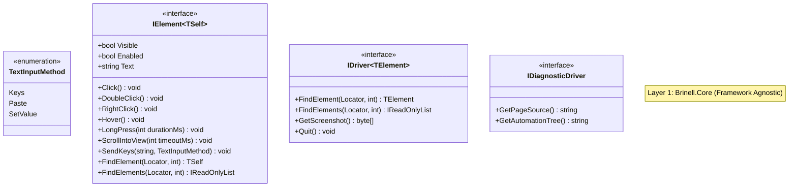
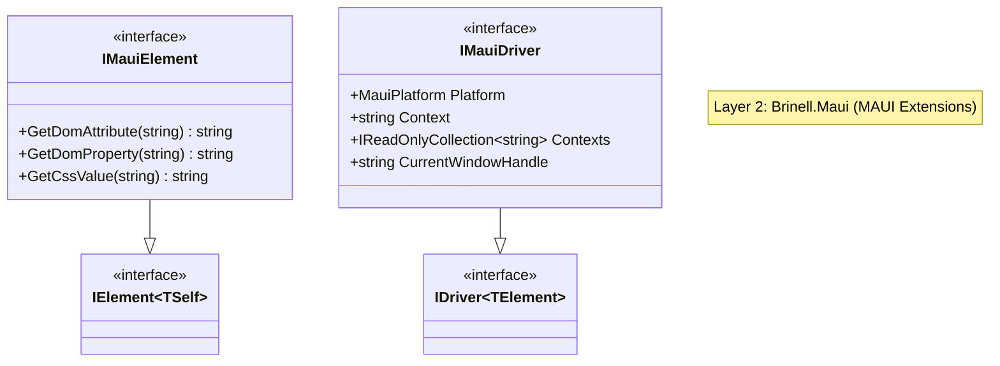
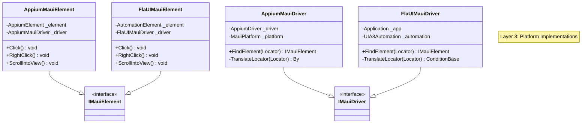
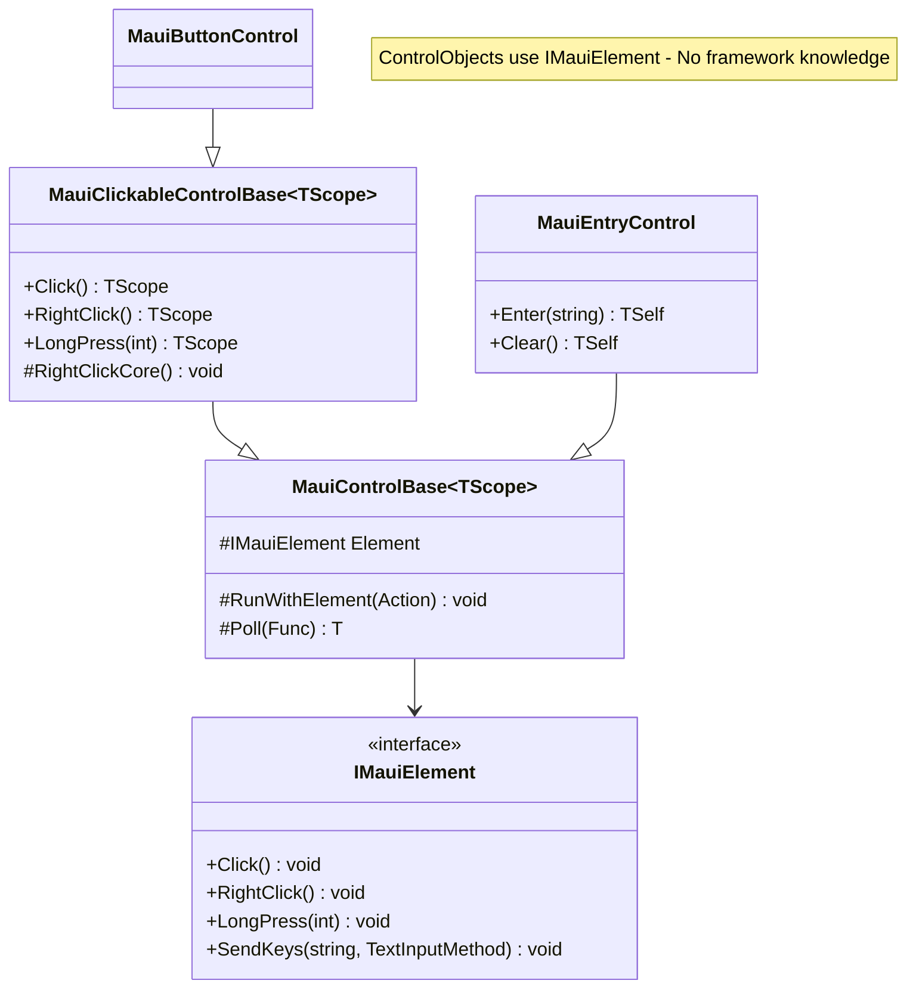

# SPEC-027: Unified Driver Abstraction - Design

**Spec ID:** 027  
**Feature:** unified-driver-abstraction  
**Status:** Draft  
**Created:** January 21, 2026

---

## 1. Overview

This design document describes the architecture for a unified driver abstraction layer that enables the Brinell MAUI test framework to support multiple automation backends (FlaUI for Windows, Appium for iOS/Android) while sharing the same ControlObject implementations.

### Design Goals

1. **Framework Independence** - ControlObjects work identically regardless of underlying driver
2. **Zero Escape Hatches** - Interfaces provide complete functionality without `Unwrap()` methods
3. **Type Safety** - Generic `IDriver<TElement>` prevents runtime casting errors
4. **Clean Separation** - Locator translation is internal to each driver implementation
5. **Preserve Existing Patterns** - Reuse scope interfaces, CRTP fluent chaining, logging

### Key Design Decisions

| Decision | Rationale |
|----------|-----------|
| Gestures in `IElement` | Universal across all UI tech (WPF, WinForms, HTML, MAUI, Stride) |
| Generic `IDriver<TElement>` | Consistent with existing `IElementScope<TElement>` pattern |
| No `PageSource` in core | Diagnostic feature → optional `IDiagnosticDriver` |
| Internal locator translation | Each driver encapsulates framework-specific conversion |

---

## 2. Steering Alignment

This design aligns with the Brinell framework's steering principles:

- **Single Responsibility** - Each interface has a focused purpose
- **Open/Closed** - New drivers can be added without modifying existing code
- **Liskov Substitution** - All drivers are interchangeable through interfaces
- **Interface Segregation** - Core vs diagnostic capabilities are separated
- **Dependency Inversion** - ControlObjects depend on abstractions, not implementations

---

## 3. Code Reuse Analysis

### Patterns to Preserve

| Pattern | Location | How Preserved |
|---------|----------|---------------|
| `IElementScope<TElement>` | `Brinell.Core/Interfaces/` | Unchanged - works with `IElement` |
| `IMauiElementScope` | `Brinell.Maui/Interfaces/` | Unchanged - uses `IMauiElement` |
| `IMauiScope<TScope>` | `Brinell.Maui/Interfaces/` | Unchanged - CRTP pattern preserved |
| `MauiControlBase<TScope>` | `Brinell.Maui/Controls/` | Minor refactor - use interface methods |
| `Poll()` / `PollWithElement()` | `MauiControlBase` | Unchanged - works at interface level |
| `Run()` / `RunWithElement()` | `MauiControlBase` | Unchanged - logging pattern preserved |
| `Locator` class | `Brinell.Core/Locators/` | Unchanged - pure value object |

### Code to Refactor

| Component | Current Issue | Refactored Design |
|-----------|--------------|-------------------|
| `MauiClickableControlBase.RightClickCore()` | Uses `UnwrapElement()` + Selenium Actions | Call `Element.RightClick()` |
| `MauiClickableControlBase.HoverCore()` | Uses `UnwrapElement()` + Selenium Actions | Call `Element.Hover()` |
| `MauiClickableControlBase.LongPressCore()` | Uses `UnwrapElement()` + Selenium Actions | Call `Element.LongPress()` |
| `MauiElement.ScrollIntoView()` | Uses `UnwrapDriver()` | Internal to element implementation |
| `LocatorExtensions.ToBy()` | Exposes `By` type | Internal to driver implementation |

---

## 4. Architecture

### 4.1 Package Structure

```
Brinell.Core/                          # Framework-agnostic abstractions
├── Interfaces/
│   ├── IElement.cs                    # Complete element operations
│   ├── IDriver.cs                     # Generic driver interface
│   └── IDiagnosticDriver.cs           # Optional debugging interface
├── Locators/
│   ├── Locator.cs                     # Pure value object
│   └── LocatorStrategy.cs             # Enum: AutomationId, XPath, etc.
└── Exceptions/
    └── LocatorNotSupportedException.cs

Brinell.Maui/                          # MAUI-specific extensions
├── Interfaces/
│   ├── IMauiElement.cs                # Extends IElement (DOM access)
│   ├── IMauiDriver.cs                 # Extends IDriver<IMauiElement>
│   └── IMauiElementScope.cs           # Existing scope interface
├── Controls/
│   ├── MauiControlBase.cs             # Uses IMauiElement (refactored)
│   ├── MauiClickableControlBase.cs    # Uses IMauiElement methods (refactored)
│   └── [Other controls...]
└── PageObjects/
    └── MauiPageObjectBase.cs          # Unchanged

Brinell.Maui.Appium/                   # Appium implementation (iOS/Android)
├── AppiumMauiDriver.cs                # Implements IMauiDriver
├── AppiumMauiElement.cs               # Implements IMauiElement
└── Internal/
    └── LocatorTranslator.cs           # Locator → By translation

Brinell.Maui.FlaUI/                    # FlaUI implementation (Windows)
├── FlaUIMauiDriver.cs                 # Implements IMauiDriver
├── FlaUIMauiElement.cs                # Implements IMauiElement
└── Internal/
    └── LocatorTranslator.cs           # Locator → ConditionBase translation
```

### 4.2 Layer Diagram







### 4.3 ControlObject Integration



---

## 5. Components and Interfaces

### 5.1 TextInputMethod Enum (Brinell.Core)

```csharp
namespace Brinell.Core;

/// <summary>
/// Specifies how text should be entered into an element.
/// </summary>
public enum TextInputMethod
{
    /// <summary>Types each character as keyboard events (slower but realistic).</summary>
    Keys,
    
    /// <summary>Pastes text from clipboard (faster, bypasses keyboard).</summary>
    Paste,
    
    /// <summary>Directly sets the element's value property (fastest, no events).</summary>
    SetValue
}
```

### 5.2 IElement Interface (Brinell.Core)

```csharp
namespace Brinell.Core.Interfaces;

/// <summary>
/// Core element interface providing state, location, and interaction capabilities.
/// All gestures (DoubleClick, RightClick, Hover, LongPress, ScrollIntoView) are included
/// because they are universal across all UI technologies.
/// Generic TSelf enables child finding to return the correct element type.
/// </summary>
/// <typeparam name="TSelf">The concrete element type for self-referencing returns.</typeparam>
public interface IElement<TSelf>
    where TSelf : IElement<TSelf>
{
    #region State Properties
    
    /// <summary>Gets whether the element is currently visible on screen.</summary>
    bool Visible { get; }
    
    /// <summary>Gets whether the element is enabled for interaction.</summary>
    bool Enabled { get; }
    
    /// <summary>Gets whether the element is selected (for toggles, checkboxes).</summary>
    bool Selected { get; }
    
    /// <summary>Gets the visible text content of the element, or null if not available.</summary>
    string? Text { get; }
    
    /// <summary>Gets the control type or tag name, or null if not available.</summary>
    string? TagName { get; }
    
    #endregion
    
    #region Location Properties
    
    /// <summary>Gets the top-left location of the element on screen.</summary>
    Point Location { get; }
    
    /// <summary>Gets the size of the element.</summary>
    Size Size { get; }
    
    #endregion
    
    #region Basic Actions
    
    /// <summary>Performs a click/tap on the element.</summary>
    void Click();
    
    /// <summary>Sends text to the element using the specified input method.</summary>
    /// <param name="text">The text to enter.</param>
    /// <param name="method">How to enter the text (Keys, Paste, or SetValue).</param>
    void SendKeys(string text, TextInputMethod method = TextInputMethod.Keys);
    
    /// <summary>Clears the element's value (for input fields).</summary>
    void Clear();
    
    #endregion
    
    #region Gesture Actions
    
    /// <summary>Performs a double-click on the element.</summary>
    void DoubleClick();
    
    /// <summary>Performs a right-click (context click) on the element.</summary>
    void RightClick();
    
    /// <summary>Hovers the pointer over the element.</summary>
    void Hover();
    
    /// <summary>Performs a long-press/hold on the element.</summary>
    /// <param name="durationMs">Duration in milliseconds (default 1000ms).</param>
    void LongPress(int durationMs = 1000);
    
    /// <summary>Scrolls the element into the visible viewport.</summary>
    /// <param name="timeoutMs">Maximum time to wait for scroll completion (default 5000ms).</param>
    void ScrollIntoView(int timeoutMs = 5000);
    
    #endregion
    
    #region Attributes
    
    /// <summary>Gets an attribute value from the element.</summary>
    /// <param name="name">The attribute name.</param>
    /// <returns>The attribute value, or null if not present.</returns>
    string? GetAttribute(string name);
    
    #endregion
    
    #region Child Finding
    
    /// <summary>Finds a child element using the specified locator.</summary>
    /// <param name="locator">The locator strategy and value.</param>
    /// <param name="timeoutMs">Maximum time to wait for the element (default 5000ms).</param>
    /// <returns>The found element.</returns>
    /// <exception cref="ElementNotFoundException">When no element matches within timeout.</exception>
    TSelf FindElement(Locator locator, int timeoutMs = 5000);
    
    /// <summary>Finds all child elements matching the specified locator.</summary>
    /// <param name="locator">The locator strategy and value.</param>
    /// <param name="timeoutMs">Maximum time to wait for at least one element (default 0ms = immediate).</param>
    /// <returns>List of matching elements (empty if none found).</returns>
    IReadOnlyList<TSelf> FindElements(Locator locator, int timeoutMs = 0);
    
    /// <summary>Tries to find a child element without throwing.</summary>
    /// <param name="locator">The locator strategy and value.</param>
    /// <param name="element">The found element, or null.</param>
    /// <param name="timeoutMs">Maximum time to wait for the element (default 0ms = immediate).</param>
    /// <returns>True if element was found.</returns>
    bool TryFindElement(Locator locator, out TSelf? element, int timeoutMs = 0);
    
    #endregion
}
```

### 5.3 IDriver<TElement> Interface (Brinell.Core)

```csharp
namespace Brinell.Core.Interfaces;

/// <summary>
/// Generic driver interface for UI automation.
/// The generic parameter enables type-safe element returns without runtime casting.
/// </summary>
/// <typeparam name="TElement">The element type returned by this driver.</typeparam>
public interface IDriver<TElement> : IDisposable
    where TElement : IElement<TElement>
{
    #region Element Finding
    
    /// <summary>Finds an element using the specified locator.</summary>
    /// <param name="locator">The locator strategy and value.</param>
    /// <param name="timeoutMs">Maximum time to wait for the element (default 5000ms).</param>
    /// <returns>The found element.</returns>
    /// <exception cref="ElementNotFoundException">When no element matches within timeout.</exception>
    TElement FindElement(Locator locator, int timeoutMs = 5000);
    
    /// <summary>Finds all elements matching the specified locator.</summary>
    /// <param name="locator">The locator strategy and value.</param>
    /// <param name="timeoutMs">Maximum time to wait for at least one element (default 0ms = immediate).</param>
    /// <returns>List of matching elements (empty if none found).</returns>
    IReadOnlyList<TElement> FindElements(Locator locator, int timeoutMs = 0);
    
    /// <summary>Tries to find an element without throwing.</summary>
    /// <param name="locator">The locator strategy and value.</param>
    /// <param name="element">The found element, or null.</param>
    /// <param name="timeoutMs">Maximum time to wait for the element (default 0ms = immediate).</param>
    /// <returns>True if element was found.</returns>
    bool TryFindElement(Locator locator, out TElement? element, int timeoutMs = 0);
    
    #endregion
    
    #region Session Management
    
    /// <summary>Closes the current window/context.</summary>
    void Close();
    
    /// <summary>Terminates the driver session and cleans up resources.</summary>
    void Quit();
    
    #endregion
    
    #region Screenshots
    
    /// <summary>Captures a screenshot of the current state.</summary>
    /// <returns>Screenshot as PNG byte array.</returns>
    byte[] GetScreenshot();
    
    #endregion
}
```

### 5.4 IDiagnosticDriver Interface (Brinell.Core)

```csharp
namespace Brinell.Core.Interfaces;

/// <summary>
/// Optional diagnostic interface for debugging and troubleshooting.
/// Not all drivers need to implement this.
/// </summary>
public interface IDiagnosticDriver
{
    /// <summary>Gets the page/window source (XML, HTML, or native format).</summary>
    string GetPageSource();
    
    /// <summary>Gets a text representation of the automation tree.</summary>
    string GetAutomationTree();
}
```

### 5.5 IMauiElement Interface (Brinell.Maui)

```csharp
namespace Brinell.Maui.Interfaces;

/// <summary>
/// MAUI-specific element interface extending IElement.
/// Adds DOM access methods for hybrid WebView apps.
/// </summary>
public interface IMauiElement : IElement<IMauiElement>
{
    #region DOM Access (Hybrid Apps)
    
    /// <summary>Gets a DOM attribute value (for WebView content).</summary>
    string? GetDomAttribute(string name);
    
    /// <summary>Gets a DOM property value (for WebView content).</summary>
    string? GetDomProperty(string name);
    
    /// <summary>Gets a computed CSS value (for WebView content), or null if not available.</summary>
    string? GetCssValue(string name);
    
    #endregion
}
```

### 5.6 IMauiDriver Interface (Brinell.Maui)

```csharp
namespace Brinell.Maui.Interfaces;

/// <summary>
/// MAUI-specific driver interface extending IDriver&lt;IMauiElement&gt;.
/// Adds platform detection, context switching for hybrid apps, and window management.
/// </summary>
public interface IMauiDriver : IDriver<IMauiElement>
{
    #region Platform
    
    /// <summary>Gets the target platform (Windows, Android, iOS, macOS).</summary>
    MauiPlatform Platform { get; }
    
    #endregion
    
    #region Context Switching (Hybrid Apps)
    
    /// <summary>Gets or sets the current context (NATIVE_APP, WEBVIEW_*, etc.).</summary>
    string Context { get; set; }
    
    /// <summary>Gets all available contexts.</summary>
    IReadOnlyCollection<string> Contexts { get; }
    
    #endregion
    
    #region Window Management
    
    /// <summary>Gets the current window handle.</summary>
    string CurrentWindowHandle { get; }
    
    /// <summary>Gets all window handles.</summary>
    IReadOnlyCollection<string> WindowHandles { get; }
    
    #endregion
}
```

---

## 6. Driver Implementations

### 6.1 AppiumMauiDriver (iOS/Android)

```csharp
namespace Brinell.Maui.Appium;

/// <summary>
/// Appium-based implementation of IMauiDriver for iOS and Android.
/// </summary>
public sealed class AppiumMauiDriver : IMauiDriver, IDiagnosticDriver
{
    private readonly AppiumDriver _driver;
    private readonly MauiPlatform _platform;
    private readonly ITestLogger _logger;
    
    public AppiumMauiDriver(AppiumDriver driver, MauiPlatform platform, ITestLogger logger)
    {
        _driver = driver ?? throw new ArgumentNullException(nameof(driver));
        _platform = platform;
        _logger = logger;
    }
    
    public MauiPlatform Platform => _platform;
    
    public string Context
    {
        get => _driver.Context;
        set => _driver.Context = value;
    }
    
    public IReadOnlyCollection<string> Contexts => _driver.Contexts;
    
    public string CurrentWindowHandle => _driver.CurrentWindowHandle;
    
    public IReadOnlyCollection<string> WindowHandles => _driver.WindowHandles.ToList();
    
    public IMauiElement FindElement(Locator locator, int timeoutMs = 5000)
    {
        var by = TranslateLocator(locator);
        var wait = new WebDriverWait(_driver, TimeSpan.FromMilliseconds(timeoutMs));
        var element = wait.Until(d => d.FindElement(by));
        return new AppiumMauiElement(element, this, _logger);
    }
    
    public IReadOnlyList<IMauiElement> FindElements(Locator locator, int timeoutMs = 0)
    {
        var by = TranslateLocator(locator);
        if (timeoutMs > 0)
        {
            var wait = new WebDriverWait(_driver, TimeSpan.FromMilliseconds(timeoutMs));
            wait.Until(d => d.FindElements(by).Count > 0);
        }
        return _driver.FindElements(by)
            .Select(e => new AppiumMauiElement(e, this, _logger))
            .ToList();
    }
    
    public bool TryFindElement(Locator locator, out IMauiElement? element, int timeoutMs = 0)
    {
        try
        {
            var by = TranslateLocator(locator);
            var found = _driver.FindElements(by).FirstOrDefault();
            if (found != null)
            {
                element = new AppiumMauiElement(found, this, _logger);
                return true;
            }
            element = null;
            return false;
        }
        catch
        {
            element = null;
            return false;
        }
    }
    
    public byte[] GetScreenshot()
    {
        var screenshot = _driver.GetScreenshot();
        return screenshot.AsByteArray;
    }
    
    public void Close() => _driver.Close();
    
    public void Quit() => _driver.Quit();
    
    public void Dispose() => Quit();
    
    // IDiagnosticDriver
    public string GetPageSource() => _driver.PageSource;
    public string GetAutomationTree() => _driver.PageSource; // Appium uses same format
    
    /// <summary>
    /// Translates Brinell Locator to Appium By.
    /// Internal to this driver - not exposed outside.
    /// </summary>
    private By TranslateLocator(Locator locator)
    {
        return locator.Strategy switch
        {
            LocatorStrategy.AutomationId => _platform switch
            {
                MauiPlatform.Android => By.Id(locator.Value),
                _ => MobileBy.AccessibilityId(locator.Value)
            },
            LocatorStrategy.XPath => By.XPath(locator.Value),
            LocatorStrategy.Name => MobileBy.AccessibilityId(locator.Value),
            LocatorStrategy.ClassName => By.ClassName(locator.Value),
            LocatorStrategy.Id => By.Id(locator.Value),
            _ => throw new LocatorNotSupportedException(locator.Strategy, "Appium")
        };
    }
}
```

### 6.2 AppiumMauiElement (iOS/Android)

```csharp
namespace Brinell.Maui.Appium;

/// <summary>
/// Appium-based implementation of IMauiElement for iOS and Android.
/// </summary>
public sealed class AppiumMauiElement : IMauiElement
{
    private readonly AppiumElement _element;
    private readonly AppiumMauiDriver _driver;
    private readonly ITestLogger _logger;
    
    internal AppiumMauiElement(AppiumElement element, AppiumMauiDriver driver, ITestLogger logger)
    {
        _element = element ?? throw new ArgumentNullException(nameof(element));
        _driver = driver;
        _logger = logger;
    }
    
    // IElement State
    public bool Visible => _element.Displayed;
    public bool Enabled => _element.Enabled;
    public bool Selected => _element.Selected;
    public string? Text => _element.Text;
    public string? TagName => _element.TagName;
    
    // IElement Location
    public Point Location => new(_element.Location.X, _element.Location.Y);
    public Size Size => new(_element.Size.Width, _element.Size.Height);
    
    // IElement Basic Actions
    public void Click() => _element.Click();
    
    public void SendKeys(string text, TextInputMethod method = TextInputMethod.Keys)
    {
        switch (method)
        {
            case TextInputMethod.Keys:
                _element.SendKeys(text);
                break;
            case TextInputMethod.Paste:
                // Copy to clipboard and paste
                Clipboard.SetText(text);
                _element.SendKeys(Keys.Control + "v");
                break;
            case TextInputMethod.SetValue:
                // Directly set value via JavaScript/script
                _driver.ExecuteScript("arguments[0].value = arguments[1]", _element, text);
                break;
        }
    }
    
    public void Clear() => _element.Clear();
    
    // IElement Gestures - implemented using Appium Actions
    public void DoubleClick()
    {
        var actions = new Actions(_driver.UnderlyingDriver);
        actions.DoubleClick(_element).Perform();
    }
    
    public void RightClick()
    {
        var actions = new Actions(_driver.UnderlyingDriver);
        actions.ContextClick(_element).Perform();
    }
    
    public void Hover()
    {
        var actions = new Actions(_driver.UnderlyingDriver);
        actions.MoveToElement(_element).Perform();
    }
    
    public void LongPress(int durationMs = 1000)
    {
        var actions = new Actions(_driver.UnderlyingDriver);
        actions.ClickAndHold(_element)
               .Pause(TimeSpan.FromMilliseconds(durationMs))
               .Release()
               .Perform();
    }
    
    public void ScrollIntoView(int timeoutMs = 5000)
    {
        var platform = _driver.Platform;
        var deadline = DateTime.UtcNow.AddMilliseconds(timeoutMs);
        
        while (DateTime.UtcNow < deadline)
        {
            if (_element.Displayed) return;
            
            if (platform == MauiPlatform.Android)
            {
                // Android: Use mobile: scrollGesture
                _driver.ExecuteScript("mobile: scrollGesture", new Dictionary<string, object>
                {
                    { "elementId", _element.Id },
                    { "direction", "down" },
                    { "percent", 0.5 }
                });
            }
            else if (platform == MauiPlatform.iOS)
            {
                // iOS: Use mobile: scroll
                _driver.ExecuteScript("mobile: scroll", new Dictionary<string, object>
                {
                    { "element", _element.Id },
                    { "toVisible", true }
                });
            }
        }
    }
    
    // IElement Attributes
    public string? GetAttribute(string name) => _element.GetAttribute(name);
    
    // IElement Child Finding
    public IMauiElement FindElement(Locator locator, int timeoutMs = 5000)
    {
        var by = TranslateLocator(locator);
        if (timeoutMs > 0)
        {
            var wait = new WebDriverWait(_driver.UnderlyingDriver, TimeSpan.FromMilliseconds(timeoutMs));
            var child = wait.Until(_ => _element.FindElement(by));
            return new AppiumMauiElement(child, _driver, _logger);
        }
        return new AppiumMauiElement(_element.FindElement(by), _driver, _logger);
    }
    
    public IReadOnlyList<IMauiElement> FindElements(Locator locator, int timeoutMs = 0)
    {
        var by = TranslateLocator(locator);
        if (timeoutMs > 0)
        {
            var wait = new WebDriverWait(_driver.UnderlyingDriver, TimeSpan.FromMilliseconds(timeoutMs));
            wait.Until(_ => _element.FindElements(by).Count > 0);
        }
        return _element.FindElements(by)
            .Select(e => new AppiumMauiElement(e, _driver, _logger))
            .ToList();
    }
    
    public bool TryFindElement(Locator locator, out IMauiElement? element, int timeoutMs = 0)
    {
        try
        {
            element = FindElement(locator, timeoutMs);
            return true;
        }
        catch
        {
            element = null;
            return false;
        }
    }
    
    // IMauiElement DOM Access
    public string? GetDomAttribute(string name) => _element.GetDomAttribute(name);
    public string? GetDomProperty(string name) => _element.GetDomProperty(name);
    public string? GetCssValue(string name) => _element.GetCssValue(name);
    
    private By TranslateLocator(Locator locator)
    {
        // Same translation logic as driver - could be shared
        return locator.Strategy switch
        {
            LocatorStrategy.AutomationId => _driver.Platform switch
            {
                MauiPlatform.Android => By.Id(locator.Value),
                _ => MobileBy.AccessibilityId(locator.Value)
            },
            LocatorStrategy.XPath => By.XPath(locator.Value),
            LocatorStrategy.Name => MobileBy.AccessibilityId(locator.Value),
            LocatorStrategy.ClassName => By.ClassName(locator.Value),
            _ => throw new LocatorNotSupportedException(locator.Strategy, "Appium")
        };
    }
}
```

### 6.3 FlaUIMauiDriver (Windows)

```csharp
namespace Brinell.Maui.FlaUI;

/// <summary>
/// FlaUI-based implementation of IMauiDriver for Windows.
/// </summary>
public sealed class FlaUIMauiDriver : IMauiDriver, IDiagnosticDriver
{
    private readonly Application _app;
    private readonly UIA3Automation _automation;
    private readonly Window _mainWindow;
    private readonly ITestLogger _logger;
    
    public FlaUIMauiDriver(Application app, ITestLogger logger)
    {
        _app = app ?? throw new ArgumentNullException(nameof(app));
        _automation = new UIA3Automation();
        _mainWindow = app.GetMainWindow(_automation);
        _logger = logger;
    }
    
    public MauiPlatform Platform => MauiPlatform.Windows;
    
    // Context switching not applicable for Windows native
    public string Context
    {
        get => "NATIVE_APP";
        set { /* No-op for Windows */ }
    }
    
    public IReadOnlyCollection<string> Contexts => new[] { "NATIVE_APP" };
    
    public string CurrentWindowHandle => _mainWindow.AutomationId;
    
    public IReadOnlyCollection<string> WindowHandles =>
        _app.GetAllTopLevelWindows(_automation)
            .Select(w => w.AutomationId)
            .ToList();
    
    public IMauiElement FindElement(Locator locator, int timeoutMs = 5000)
    {
        var condition = TranslateLocator(locator);
        var deadline = DateTime.UtcNow.AddMilliseconds(timeoutMs);
        
        while (DateTime.UtcNow < deadline)
        {
            var element = _mainWindow.FindFirstDescendant(condition);
            if (element != null)
                return new FlaUIMauiElement(element, this, _logger);
            Thread.Sleep(100);
        }
        
        throw new ElementNotFoundException($"Element not found: {locator}");
    }
    
    public IReadOnlyList<IMauiElement> FindElements(Locator locator, int timeoutMs = 0)
    {
        var condition = TranslateLocator(locator);
        
        if (timeoutMs > 0)
        {
            var deadline = DateTime.UtcNow.AddMilliseconds(timeoutMs);
            while (DateTime.UtcNow < deadline)
            {
                var elements = _mainWindow.FindAllDescendants(condition);
                if (elements.Length > 0)
                    return elements.Select(e => new FlaUIMauiElement(e, this, _logger)).ToList();
                Thread.Sleep(100);
            }
        }
        
        return _mainWindow.FindAllDescendants(condition)
            .Select(e => new FlaUIMauiElement(e, this, _logger))
            .ToList();
    }
    
    public bool TryFindElement(Locator locator, out IMauiElement? element, int timeoutMs = 0)
    {
        var condition = TranslateLocator(locator);
        var found = _mainWindow.FindFirstDescendant(condition);
        
        if (found != null)
        {
            element = new FlaUIMauiElement(found, this, _logger);
            return true;
        }
        
        element = null;
        return false;
    }
    
    public byte[] GetScreenshot()
    {
        var capture = Capture.MainScreen();
        using var stream = new MemoryStream();
        capture.Bitmap.Save(stream, System.Drawing.Imaging.ImageFormat.Png);
        return stream.ToArray();
    }
    
    public void Close() => _mainWindow.Close();
    
    public void Quit()
    {
        _app.Close();
        _automation.Dispose();
    }
    
    public void Dispose() => Quit();
    
    // IDiagnosticDriver
    public string GetPageSource() => GetAutomationTree();
    
    public string GetAutomationTree()
    {
        var sb = new StringBuilder();
        BuildAutomationTree(_mainWindow, sb, 0);
        return sb.ToString();
    }
    
    private void BuildAutomationTree(AutomationElement element, StringBuilder sb, int indent)
    {
        var prefix = new string(' ', indent * 2);
        sb.AppendLine($"{prefix}{element.ControlType}: {element.Name} [{element.AutomationId}]");
        
        foreach (var child in element.FindAllChildren())
        {
            BuildAutomationTree(child, sb, indent + 1);
        }
    }
    
    /// <summary>
    /// Translates Brinell Locator to FlaUI ConditionBase.
    /// Internal to this driver - not exposed outside.
    /// </summary>
    private ConditionBase TranslateLocator(Locator locator)
    {
        var cf = _automation.ConditionFactory;
        
        return locator.Strategy switch
        {
            LocatorStrategy.AutomationId => cf.ByAutomationId(locator.Value),
            LocatorStrategy.Name => cf.ByName(locator.Value),
            LocatorStrategy.ClassName => cf.ByClassName(locator.Value),
            LocatorStrategy.ControlType => cf.ByControlType(ParseControlType(locator.Value)),
            LocatorStrategy.XPath => throw new LocatorNotSupportedException(
                LocatorStrategy.XPath, "FlaUI", 
                "Use AutomationId or Name instead of XPath for Windows"),
            _ => throw new LocatorNotSupportedException(locator.Strategy, "FlaUI")
        };
    }
    
    private ControlType ParseControlType(string value)
    {
        return Enum.TryParse<ControlType>(value, ignoreCase: true, out var result)
            ? result
            : throw new ArgumentException($"Unknown control type: {value}");
    }
}
```

### 6.4 FlaUIMauiElement (Windows)

```csharp
namespace Brinell.Maui.FlaUI;

/// <summary>
/// FlaUI-based implementation of IMauiElement for Windows.
/// </summary>
public sealed class FlaUIMauiElement : IMauiElement
{
    private readonly AutomationElement _element;
    private readonly FlaUIMauiDriver _driver;
    private readonly ITestLogger _logger;
    
    internal FlaUIMauiElement(AutomationElement element, FlaUIMauiDriver driver, ITestLogger logger)
    {
        _element = element ?? throw new ArgumentNullException(nameof(element));
        _driver = driver;
        _logger = logger;
    }
    
    // IElement State
    public bool Visible => !_element.IsOffscreen;
    public bool Enabled => _element.IsEnabled;
    public bool Selected => _element.Patterns.SelectionItem?.Pattern?.IsSelected.Value ?? false;
    public string? Text => _element.Name ?? _element.Patterns.Value?.Pattern?.Value.Value;
    public string? TagName => _element.ControlType.ToString();
    
    // IElement Location
    public Point Location
    {
        get
        {
            var rect = _element.BoundingRectangle;
            return new Point((int)rect.X, (int)rect.Y);
        }
    }
    
    public Size Size
    {
        get
        {
            var rect = _element.BoundingRectangle;
            return new Size((int)rect.Width, (int)rect.Height);
        }
    }
    
    // IElement Basic Actions
    public void Click()
    {
        // Try Invoke pattern first (faster, more reliable)
        if (_element.Patterns.Invoke.TryGetPattern(out var invoke))
        {
            invoke.Invoke();
            return;
        }
        
        // Fall back to mouse click
        _element.Click();
    }
    
    public void SendKeys(string text, TextInputMethod method = TextInputMethod.Keys)
    {
        _element.Focus();
        switch (method)
        {
            case TextInputMethod.Keys:
                Keyboard.Type(text);
                break;
            case TextInputMethod.Paste:
                Clipboard.SetText(text);
                Keyboard.TypeSimultaneously(VirtualKeyShort.CONTROL, VirtualKeyShort.KEY_V);
                break;
            case TextInputMethod.SetValue:
                if (_element.Patterns.Value.TryGetPattern(out var value))
                    value.SetValue(text);
                else
                    Keyboard.Type(text);
                break;
        }
    }
    
    public void Clear()
    {
        if (_element.Patterns.Value.TryGetPattern(out var value))
        {
            value.SetValue(string.Empty);
            return;
        }
        
        // Fall back to select all + delete
        _element.Focus();
        Keyboard.TypeSimultaneously(VirtualKeyShort.CONTROL, VirtualKeyShort.KEY_A);
        Keyboard.Type(VirtualKeyShort.DELETE);
    }
    
    // IElement Gestures
    public void DoubleClick() => _element.DoubleClick();
    
    public void RightClick() => _element.RightClick();
    
    public void Hover()
    {
        var center = _element.BoundingRectangle.Center();
        Mouse.MoveTo(center);
    }
    
    public void LongPress(int durationMs = 1000)
    {
        var center = _element.BoundingRectangle.Center();
        Mouse.MoveTo(center);
        Mouse.Down();
        Thread.Sleep(durationMs);
        Mouse.Up();
    }
    
    public void ScrollIntoView(int timeoutMs = 5000)
    {
        if (_element.Patterns.ScrollItem.TryGetPattern(out var scrollItem))
        {
            scrollItem.ScrollIntoView();
            return;
        }
        
        // Element is already visible or doesn't support scroll
        // Focus to ensure it's visible
        _element.Focus();
    }
    
    // IElement Attributes
    public string? GetAttribute(string name)
    {
        // Map common attribute names to FlaUI properties
        return name.ToLowerInvariant() switch
        {
            "automationid" => _element.AutomationId,
            "name" => _element.Name,
            "classname" => _element.ClassName,
            "controltype" => _element.ControlType.ToString(),
            "value" => _element.Patterns.Value?.Pattern?.Value.Value,
            "isselected" => Selected.ToString(),
            _ => null
        };
    }
    
    // IElement Child Finding
    public IMauiElement FindElement(Locator locator, int timeoutMs = 5000)
    {
        var condition = TranslateLocator(locator);
        var deadline = DateTime.UtcNow.AddMilliseconds(timeoutMs);
        
        while (DateTime.UtcNow < deadline)
        {
            var child = _element.FindFirstDescendant(condition);
            if (child != null)
                return new FlaUIMauiElement(child, _driver, _logger);
            Thread.Sleep(100);
        }
        
        throw new ElementNotFoundException($"Element not found: {locator}");
    }
    
    public IReadOnlyList<IMauiElement> FindElements(Locator locator, int timeoutMs = 0)
    {
        var condition = TranslateLocator(locator);
        
        if (timeoutMs > 0)
        {
            var deadline = DateTime.UtcNow.AddMilliseconds(timeoutMs);
            while (DateTime.UtcNow < deadline)
            {
                var elements = _element.FindAllDescendants(condition);
                if (elements.Length > 0)
                    return elements.Select(e => new FlaUIMauiElement(e, _driver, _logger)).ToList();
                Thread.Sleep(100);
            }
        }
        
        return _element.FindAllDescendants(condition)
            .Select(e => new FlaUIMauiElement(e, _driver, _logger))
            .ToList();
    }
    
    public bool TryFindElement(Locator locator, out IMauiElement? element, int timeoutMs = 0)
    {
        try
        {
            element = FindElement(locator, timeoutMs);
            return true;
        }
        catch
        {
            element = null;
            return false;
        }
    }
    
    // IMauiElement DOM Access - Not applicable for Windows native
    public string? GetDomAttribute(string name) => null;
    public string? GetDomProperty(string name) => null;
    public string? GetCssValue(string name) => null;
    
    private ConditionBase TranslateLocator(Locator locator)
    {
        var cf = _driver.Automation.ConditionFactory;
        
        return locator.Strategy switch
        {
            LocatorStrategy.AutomationId => cf.ByAutomationId(locator.Value),
            LocatorStrategy.Name => cf.ByName(locator.Value),
            LocatorStrategy.ClassName => cf.ByClassName(locator.Value),
            _ => throw new LocatorNotSupportedException(locator.Strategy, "FlaUI")
        };
    }
}
```

---

## 7. Refactored ControlObjects

### 7.1 MauiClickableControlBase (Refactored)

The key refactoring is removing direct Selenium/Appium access and using interface methods:

```csharp
namespace Brinell.Maui.Controls;

public abstract class MauiClickableControlBase<TScope> : MauiControlBase<TScope>
    where TScope : IMauiScope<TScope>
{
    protected MauiClickableControlBase(Locator locator, TScope scope, string controlName)
        : base(locator, scope, controlName)
    {
    }
    
    public TScope Click()
    {
        RunWithElement("Click", e => e.Click());
        return Scope;
    }
    
    public TScope DoubleClick()
    {
        RunWithElement("DoubleClick", e => e.DoubleClick());
        return Scope;
    }
    
    public TScope RightClick()
    {
        // BEFORE (using escape hatch):
        // RunWithElement("RightClick", e =>
        // {
        //     var raw = e.UnwrapElement();
        //     var driver = Scope.Context.Driver.UnwrapDriver();
        //     var actions = new Actions(driver);
        //     actions.ContextClick(raw).Perform();
        // });
        
        // AFTER (using interface method):
        RunWithElement("RightClick", e => e.RightClick());
        return Scope;
    }
    
    public TScope Hover()
    {
        // BEFORE: Used UnwrapElement() + Selenium Actions
        // AFTER: Uses interface method
        RunWithElement("Hover", e => e.Hover());
        return Scope;
    }
    
    public TScope LongPress(int durationMs = 1000)
    {
        // BEFORE: Used UnwrapElement() + Selenium Actions  
        // AFTER: Uses interface method
        RunWithElement("LongPress", e => e.LongPress(durationMs));
        return Scope;
    }
    
    public TScope ScrollIntoView()
    {
        // BEFORE: Used UnwrapDriver() for gesture execution
        // AFTER: Uses interface method
        RunWithElement("ScrollIntoView", e => e.ScrollIntoView());
        return Scope;
    }
}
```

### 7.2 Before/After Comparison

| Method | Before (Escape Hatch) | After (Interface) |
|--------|----------------------|-------------------|
| `RightClick()` | `e.UnwrapElement()` → `Actions.ContextClick()` | `e.RightClick()` |
| `Hover()` | `e.UnwrapElement()` → `Actions.MoveToElement()` | `e.Hover()` |
| `LongPress()` | `e.UnwrapElement()` → `Actions.ClickAndHold()` | `e.LongPress(ms)` |
| `ScrollIntoView()` | `UnwrapDriver()` → platform scripts | `e.ScrollIntoView()` |

---

## 8. Driver Factory

### 8.1 MauiDriverFactory

```csharp
namespace Brinell.Maui;

/// <summary>
/// Factory for creating platform-appropriate drivers.
/// </summary>
public static class MauiDriverFactory
{
    public static IMauiDriver Create(MauiDriverOptions options, ITestLogger logger)
    {
        return options.Platform switch
        {
            MauiPlatform.Windows => CreateFlaUIDriver(options, logger),
            MauiPlatform.Android => CreateAppiumDriver(options, logger),
            MauiPlatform.iOS => CreateAppiumDriver(options, logger),
            MauiPlatform.macOS => CreateAppiumDriver(options, logger),
            _ => throw new NotSupportedException($"Platform not supported: {options.Platform}")
        };
    }
    
    private static IMauiDriver CreateFlaUIDriver(MauiDriverOptions options, ITestLogger logger)
    {
        var app = options.AppPath != null
            ? Application.Launch(options.AppPath)
            : Application.Attach(options.ProcessName 
                ?? throw new ArgumentException("AppPath or ProcessName required"));
        
        return new FlaUIMauiDriver(app, logger);
    }
    
    private static IMauiDriver CreateAppiumDriver(MauiDriverOptions options, ITestLogger logger)
    {
        var appiumOptions = new AppiumOptions();
        appiumOptions.PlatformName = options.Platform.ToString();
        
        if (options.AppPath != null)
            appiumOptions.App = options.AppPath;
            
        if (options.DeviceName != null)
            appiumOptions.DeviceName = options.DeviceName;
        
        foreach (var cap in options.AdditionalCapabilities)
        {
            appiumOptions.AddAdditionalAppiumOption(cap.Key, cap.Value);
        }
        
        var serverUri = options.AppiumServerUri ?? new Uri("http://127.0.0.1:4723");
        var driver = new AppiumDriver(serverUri, appiumOptions);
        
        return new AppiumMauiDriver(driver, options.Platform, logger);
    }
}

public class MauiDriverOptions
{
    public MauiPlatform Platform { get; set; }
    public string? AppPath { get; set; }
    public string? ProcessName { get; set; }
    public string? DeviceName { get; set; }
    public Uri? AppiumServerUri { get; set; }
    public Dictionary<string, object> AdditionalCapabilities { get; } = new();
}
```

---

## 9. Error Handling

### 9.1 Exception Types

```csharp
namespace Brinell.Core.Exceptions;

/// <summary>
/// Thrown when a locator strategy is not supported by a driver.
/// </summary>
public class LocatorNotSupportedException : Exception
{
    public LocatorStrategy Strategy { get; }
    public string DriverName { get; }
    
    public LocatorNotSupportedException(LocatorStrategy strategy, string driverName, string? suggestion = null)
        : base(BuildMessage(strategy, driverName, suggestion))
    {
        Strategy = strategy;
        DriverName = driverName;
    }
    
    private static string BuildMessage(LocatorStrategy strategy, string driver, string? suggestion)
    {
        var msg = $"Locator strategy '{strategy}' is not supported by {driver} driver.";
        if (suggestion != null)
            msg += $" {suggestion}";
        return msg;
    }
}

/// <summary>
/// Thrown when an element cannot be found.
/// </summary>
public class ElementNotFoundException : Exception
{
    public Locator Locator { get; }
    
    public ElementNotFoundException(string message) : base(message) { }
    
    public ElementNotFoundException(Locator locator)
        : base($"Element not found with locator: {locator.Strategy}='{locator.Value}'")
    {
        Locator = locator;
    }
}
```

---

## 10. Testing Strategy

### 10.1 Unit Tests (Mocked)

```csharp
namespace Brinell.Maui.Tests;

public class MauiButtonControlTests
{
    private readonly Mock<IMauiElement> _mockElement;
    private readonly Mock<IMauiDriver> _mockDriver;
    
    [Fact]
    public void RightClick_CallsElementRightClick()
    {
        // Arrange
        var button = CreateButtonControl();
        
        // Act
        button.RightClick();
        
        // Assert
        _mockElement.Verify(e => e.RightClick(), Times.Once);
    }
    
    [Fact]
    public void LongPress_PassesDuration()
    {
        // Arrange
        var button = CreateButtonControl();
        
        // Act
        button.LongPress(2000);
        
        // Assert
        _mockElement.Verify(e => e.LongPress(2000), Times.Once);
    }
}
```

### 10.2 Integration Tests (Both Drivers)

```csharp
namespace Brinell.Maui.UITests;

[Collection("MAUI Tests")]
public class ButtonControlIntegrationTests : MauiTestFixtureBase
{
    [SkippableFact]
    [Platform(MauiPlatform.Windows, MauiPlatform.Android)]
    public void RightClick_ShowsContextMenu()
    {
        // Arrange - works with FlaUI on Windows, Appium on Android
        var button = Page.ContextMenuButton;
        
        // Act
        button.RightClick();
        
        // Assert
        Page.ContextMenu.AssertVisible();
    }
    
    [SkippableFact]
    [Platform(MauiPlatform.iOS, MauiPlatform.Android)]
    public void LongPress_ShowsTooltip()
    {
        // Arrange - Appium only (mobile gesture)
        var button = Page.LongPressButton;
        
        // Act
        button.LongPress(1500);
        
        // Assert
        Page.Tooltip.AssertVisible();
    }
}
```

### 10.3 Test Matrix

| Test Category | FlaUI (Windows) | Appium (Android) | Appium (iOS) |
|--------------|-----------------|------------------|--------------|
| Click | ✓ | ✓ | ✓ |
| DoubleClick | ✓ | ✓ | ✓ |
| RightClick | ✓ | ✓ | ✓ |
| Hover | ✓ | ✓ | N/A |
| LongPress | ✓ | ✓ | ✓ |
| ScrollIntoView | ✓ | ✓ | ✓ |
| SendKeys | ✓ | ✓ | ✓ |
| FindElement | ✓ | ✓ | ✓ |
| Screenshot | ✓ | ✓ | ✓ |

---

## 11. Migration Path

### 11.1 Breaking Changes

Since no backward compatibility is required, the following breaking changes are acceptable:

1. **Removed**: `IMauiElement.UnwrapElement()` 
2. **Removed**: `IMauiDriver.UnwrapDriver()`
3. **Removed**: `LocatorExtensions.ToBy()` (public)
4. **Changed**: `IMauiElement` now extends `IElement`
5. **Changed**: `IMauiDriver` now extends `IDriver<IMauiElement>`
6. **Removed**: `PageSource` from core driver (use `IDiagnosticDriver` if needed)

### 11.2 Migration Steps

1. **Update Interface References** - Change any direct `AppiumElement`/`AppiumDriver` usage to `IMauiElement`/`IMauiDriver`
2. **Remove Unwrap Calls** - Replace `element.UnwrapElement()` with direct interface method calls
3. **Update Locator Usage** - Remove `ToBy()` calls; pass `Locator` directly to driver
4. **Use Driver Factory** - Update test fixtures to use `MauiDriverFactory`

---

## 12. Dependencies

### 12.1 NuGet Packages

| Package | Project | Version |
|---------|---------|---------|
| `FlaUI.Core` | `Brinell.Maui.FlaUI` | Latest (4.x) |
| `FlaUI.UIA3` | `Brinell.Maui.FlaUI` | Latest (4.x) |
| `Appium.WebDriver` | `Brinell.Maui.Appium` | Latest (6.x) |

### 12.2 Project References

```
Brinell.Core (no external deps)
    ↑
Brinell.Maui (refs Core)
    ↑               ↑
Brinell.Maui.FlaUI  Brinell.Maui.Appium
(refs FlaUI)        (refs Appium)
```

---

## 13. Open Questions

1. **FlaUI XPath Support** - FlaUI doesn't natively support XPath. Should we implement a custom XPath evaluator or throw `LocatorNotSupportedException`?
   - **Recommendation**: Throw exception with helpful message suggesting AutomationId or Name

2. **Gesture Consistency** - Mobile gestures (swipe, pinch) are not in scope, but should we add them to `IElement` for future?
   - **Recommendation**: Out of scope for this spec; add in future spec if needed

3. **macOS Support** - Should FlaUI or Appium be used for macOS?
   - **Recommendation**: Use Appium for macOS (similar to iOS); FlaUI is Windows-only

---

## 14. References

- [Requirements Document](requirements.spc.spx.md)
- [FlaUI GitHub](https://github.com/FlaUI/FlaUI)
- [FlaUI Patterns](https://github.com/FlaUI/FlaUI/wiki/Patterns)
- [Appium Documentation](https://appium.io/docs/)
- [Appium Actions API](https://appium.io/docs/en/commands/interactions/actions/)
