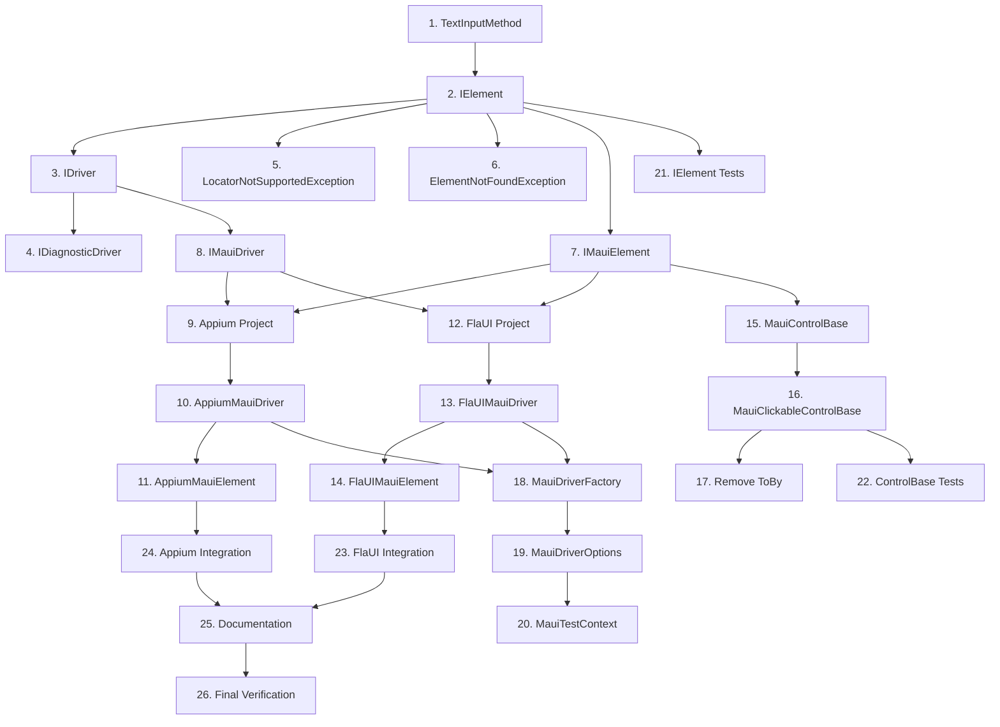

# SPEC-027: Unified Driver Abstraction - Tasks

**Spec ID:** 027  
**Feature:** unified-driver-abstraction  
**Status:** Draft  
**Created:** January 21, 2026

---

## Task Format

- `[ ]` = Pending, `[-]` = In-progress, `[x]` = Completed
- Include File path, Purpose, _Leverage, _Requirements, and _Prompt fields
- _Prompt provides AI guidance for implementing the task

---

## Phase 1: Core Interfaces (Brinell.Core)

### [ ] 1. Create TextInputMethod enum
- **File:** `srcnew/Brinell.Core/TextInputMethod.cs`
- **Purpose:** Define enum for text input strategies (Keys, Paste, SetValue)
- _Leverage: None (new file)_
- _Requirements: REQ-027.1_
- _Prompt: Role: C# Framework Developer | Task: Create TextInputMethod enum with Keys, Paste, SetValue values per design.spc.spx.md section 5.1 | Restrictions: Place in Brinell.Core namespace, add XML documentation | Success: Enum compiles, has proper docs, matches design spec_

### [ ] 2. Create IElement<TSelf> interface
- **File:** `srcnew/Brinell.Core/Interfaces/IElement.cs`
- **Purpose:** Define core element abstraction with self-referential generic for type-safe child finding
- _Leverage: design.spc.spx.md section 5.2_
- _Requirements: REQ-027.1_
- _Prompt: Role: C# Interface Architect | Task: Create IElement<TSelf> interface with Visible, Enabled, Selected, Text?, TagName?, Location, Size, Click, SendKeys(text, method), Clear, DoubleClick, RightClick, Hover, LongPress, ScrollIntoView, GetAttribute, FindElement, FindElements, TryFindElement per design section 5.2 | Restrictions: Use where TSelf : IElement<TSelf> constraint, add timeoutMs parameters, no framework references, XML docs on all members | Success: Interface compiles, all signatures match design, nullable types correct_

### [ ] 3. Create IDriver<TElement> interface
- **File:** `srcnew/Brinell.Core/Interfaces/IDriver.cs`
- **Purpose:** Define generic driver abstraction with typed element returns
- _Leverage: design.spc.spx.md section 5.3_
- _Requirements: REQ-027.3_
- _Prompt: Role: C# Interface Architect | Task: Create IDriver<TElement> interface extending IDisposable with FindElement, FindElements, TryFindElement (all with timeoutMs), Close, Quit, GetScreenshot per design section 5.3 | Restrictions: Use where TElement : IElement<TElement> constraint, XML docs on all members | Success: Interface compiles, constraint is correct, all signatures match design_

### [ ] 4. Create IDiagnosticDriver interface
- **File:** `srcnew/Brinell.Core/Interfaces/IDiagnosticDriver.cs`
- **Purpose:** Define optional diagnostic interface for debugging
- _Leverage: design.spc.spx.md section 5.4_
- _Requirements: REQ-027.3_
- _Prompt: Role: C# Framework Developer | Task: Create IDiagnosticDriver interface with GetPageSource() and GetAutomationTree() methods | Restrictions: Keep separate from IDriver, add XML docs explaining this is optional | Success: Interface compiles, docs explain optional nature_

### [ ] 5. Create LocatorNotSupportedException
- **File:** `srcnew/Brinell.Core/Exceptions/LocatorNotSupportedException.cs`
- **Purpose:** Exception for unsupported locator strategies per driver
- _Leverage: design.spc.spx.md section 9.1_
- _Requirements: REQ-027.5_
- _Prompt: Role: C# Developer | Task: Create LocatorNotSupportedException with Strategy, DriverName properties and constructor accepting optional suggestion message | Restrictions: Extend Exception, follow design section 9.1 | Success: Exception compiles, has meaningful message format_

### [ ] 6. Create ElementNotFoundException
- **File:** `srcnew/Brinell.Core/Exceptions/ElementNotFoundException.cs`
- **Purpose:** Exception for element not found scenarios
- _Leverage: design.spc.spx.md section 9.1_
- _Requirements: REQ-027.3_
- _Prompt: Role: C# Developer | Task: Create ElementNotFoundException with Locator property and constructors for message and Locator | Restrictions: Extend Exception, include locator details in message | Success: Exception compiles, message is informative_

---

## Phase 2: MAUI Interfaces (Brinell.Maui)

### [ ] 7. Refactor IMauiElement interface
- **File:** `srcnew/Brinell.Maui/Interfaces/IMauiElement.cs`
- **Purpose:** Extend IElement<IMauiElement> with DOM access methods
- _Leverage: design.spc.spx.md section 5.5, existing IMauiElement.cs_
- _Requirements: REQ-027.2_
- _Prompt: Role: C# Framework Developer | Task: Refactor IMauiElement to extend IElement<IMauiElement>, add GetDomAttribute?, GetDomProperty?, GetCssValue? methods | Restrictions: REMOVE UnwrapElement() method, keep only DOM methods as additions, reference Brinell.Core | Success: Interface extends IElement<IMauiElement>, no Unwrap methods, compiles_

### [ ] 8. Refactor IMauiDriver interface
- **File:** `srcnew/Brinell.Maui/Interfaces/IMauiDriver.cs`
- **Purpose:** Extend IDriver<IMauiElement> with MAUI-specific features
- _Leverage: design.spc.spx.md section 5.6, existing IMauiDriver.cs_
- _Requirements: REQ-027.4_
- _Prompt: Role: C# Framework Developer | Task: Refactor IMauiDriver to extend IDriver<IMauiElement>, add Platform, Context, Contexts, CurrentWindowHandle, WindowHandles properties | Restrictions: REMOVE UnwrapDriver() method, reference Brinell.Core | Success: Interface extends IDriver<IMauiElement>, no Unwrap methods, compiles_

---

## Phase 3: Appium Implementation (Brinell.Maui.Appium)

### [ ] 9. Create Brinell.Maui.Appium project
- **File:** `srcnew/Brinell.Maui.Appium/Brinell.Maui.Appium.csproj`
- **Purpose:** New project for Appium driver implementation
- _Leverage: existing Brinell.Maui.csproj as template_
- _Requirements: REQ-027.7_
- _Prompt: Role: .NET Project Architect | Task: Create new class library project Brinell.Maui.Appium targeting net8.0, add NuGet refs to Appium.WebDriver, project refs to Brinell.Core, Brinell.Maui | Restrictions: Use Directory.Build.props patterns, match existing project structure | Success: Project builds, references resolve_

### [ ] 10. Implement AppiumMauiDriver
- **File:** `srcnew/Brinell.Maui.Appium/AppiumMauiDriver.cs`
- **Purpose:** Appium-based IMauiDriver implementation for iOS/Android
- _Leverage: design.spc.spx.md section 6.1, existing MauiDriver.cs patterns_
- _Requirements: REQ-027.7_
- _Prompt: Role: C# Appium Developer | Task: Implement AppiumMauiDriver : IMauiDriver, IDiagnosticDriver with internal TranslateLocator method, FindElement/FindElements with WebDriverWait timeouts, Platform detection | Restrictions: NO public Unwrap methods, locator translation is private, use existing MauiDriver patterns | Success: Class implements all interface methods, locator translation works, compiles_

### [ ] 11. Implement AppiumMauiElement
- **File:** `srcnew/Brinell.Maui.Appium/AppiumMauiElement.cs`
- **Purpose:** Appium-based IMauiElement implementation with gestures
- _Leverage: design.spc.spx.md section 6.2, existing MauiElement.cs patterns_
- _Requirements: REQ-027.7_
- _Prompt: Role: C# Appium Developer | Task: Implement AppiumMauiElement : IMauiElement with Visible, Text?, gestures (RightClick, Hover, LongPress using Actions), ScrollIntoView (mobile: scrollGesture/scroll), SendKeys with TextInputMethod | Restrictions: NO Unwrap methods, gestures use Appium Actions API internally | Success: All gesture methods work, SendKeys supports all methods, compiles_

---

## Phase 4: FlaUI Implementation (Brinell.Maui.FlaUI)

### [ ] 12. Create Brinell.Maui.FlaUI project
- **File:** `srcnew/Brinell.Maui.FlaUI/Brinell.Maui.FlaUI.csproj`
- **Purpose:** New project for FlaUI driver implementation
- _Leverage: Brinell.Maui.Appium.csproj as template_
- _Requirements: REQ-027.6_
- _Prompt: Role: .NET Project Architect | Task: Create new class library Brinell.Maui.FlaUI targeting net8.0-windows, add NuGet refs to FlaUI.Core, FlaUI.UIA3, project refs to Brinell.Core, Brinell.Maui | Restrictions: Windows-only TFM, match project structure | Success: Project builds on Windows, references resolve_

### [ ] 13. Implement FlaUIMauiDriver
- **File:** `srcnew/Brinell.Maui.FlaUI/FlaUIMauiDriver.cs`
- **Purpose:** FlaUI-based IMauiDriver implementation for Windows
- _Leverage: design.spc.spx.md section 6.3_
- _Requirements: REQ-027.6_
- _Prompt: Role: C# FlaUI Developer | Task: Implement FlaUIMauiDriver : IMauiDriver, IDiagnosticDriver with internal TranslateLocator using ConditionFactory, FindElement with polling timeout, Platform=Windows, GetAutomationTree | Restrictions: NO XPath support (throw LocatorNotSupportedException), context switching returns NATIVE_APP | Success: Class implements all interface methods, locator translation works, compiles_

### [ ] 14. Implement FlaUIMauiElement
- **File:** `srcnew/Brinell.Maui.FlaUI/FlaUIMauiElement.cs`
- **Purpose:** FlaUI-based IMauiElement implementation with gestures
- _Leverage: design.spc.spx.md section 6.4_
- _Requirements: REQ-027.6_
- _Prompt: Role: C# FlaUI Developer | Task: Implement FlaUIMauiElement : IMauiElement with Visible (!IsOffscreen), Click using InvokePattern or mouse, SendKeys with TextInputMethod (Keys=Keyboard.Type, SetValue=ValuePattern), ScrollIntoView using ScrollItemPattern, RightClick, DoubleClick | Restrictions: DOM methods return null (not applicable), use FlaUI patterns when available | Success: All methods work with FlaUI, patterns used correctly, compiles_

---

## Phase 5: Refactor Existing ControlObjects

### [ ] 15. Update MauiControlBase
- **File:** `srcnew/Brinell.Maui/Controls/MauiControlBase.cs`
- **Purpose:** Update to use IMauiElement without Unwrap calls
- _Leverage: design.spc.spx.md section 7, existing MauiControlBase.cs_
- _Requirements: REQ-027.8_
- _Prompt: Role: C# Framework Developer | Task: Update MauiControlBase to ensure Element property is IMauiElement, verify RunWithElement uses interface methods | Restrictions: Do NOT use Unwrap(), preserve Poll/Run patterns, maintain existing API | Success: Class compiles without Unwrap references, tests still pass_

### [ ] 16. Refactor MauiClickableControlBase
- **File:** `srcnew/Brinell.Maui/Controls/MauiClickableControlBase.cs`
- **Purpose:** Replace Selenium Actions with IMauiElement interface methods
- _Leverage: design.spc.spx.md section 7.1, existing MauiClickableControlBase.cs_
- _Requirements: REQ-027.8_
- _Prompt: Role: C# Framework Developer | Task: Refactor RightClickCore to call e.RightClick(), HoverCore to call e.Hover(), LongPressCore to call e.LongPress(durationMs), ScrollIntoViewCore to call e.ScrollIntoView() | Restrictions: REMOVE all Selenium Actions code, REMOVE all UnwrapElement() calls, keep fluent API | Success: Methods use interface, no Selenium references, compiles, tests pass_

### [ ] 17. Remove LocatorExtensions.ToBy()
- **File:** `srcnew/Brinell.Maui/Extensions/LocatorExtensions.cs`
- **Purpose:** Remove public ToBy() extension that exposes Selenium types
- _Leverage: design.spc.spx.md section 5, REQ-027.5_
- _Requirements: REQ-027.5_
- _Prompt: Role: C# Framework Developer | Task: Remove or make internal the ToBy() extension method from LocatorExtensions | Restrictions: If other code depends on it, make internal; translation moved to driver implementations | Success: No public ToBy() method, code compiles_

---

## Phase 6: Driver Factory and Test Context

### [ ] 18. Create MauiDriverFactory
- **File:** `srcnew/Brinell.Maui/MauiDriverFactory.cs`
- **Purpose:** Factory for creating platform-appropriate drivers
- _Leverage: design.spc.spx.md section 8_
- _Requirements: REQ-027.9_
- _Prompt: Role: C# Framework Developer | Task: Create MauiDriverFactory with static Create(MauiDriverOptions, ITestLogger) method that returns FlaUIMauiDriver for Windows, AppiumMauiDriver for Android/iOS | Restrictions: Lazy-load driver assemblies to avoid runtime deps, handle missing FlaUI on non-Windows | Success: Factory creates correct driver per platform, handles missing deps gracefully_

### [ ] 19. Create MauiDriverOptions
- **File:** `srcnew/Brinell.Maui/MauiDriverOptions.cs`
- **Purpose:** Configuration options for driver creation
- _Leverage: design.spc.spx.md section 8_
- _Requirements: REQ-027.9_
- _Prompt: Role: C# Framework Developer | Task: Create MauiDriverOptions class with Platform, AppPath, ProcessName, DeviceName, AppiumServerUri, AdditionalCapabilities dictionary | Restrictions: Use sensible defaults, AppiumServerUri defaults to localhost:4723 | Success: Class compiles, defaults are reasonable_

### [ ] 20. Update MauiTestContext
- **File:** `srcnew/Brinell.Maui/Context/MauiTestContext.cs`
- **Purpose:** Integrate driver factory into test context
- _Leverage: existing MauiTestContext.cs_
- _Requirements: REQ-027.9_
- _Prompt: Role: C# Framework Developer | Task: Update MauiTestContext to use MauiDriverFactory for driver creation, allow explicit driver injection for testing | Restrictions: Preserve existing API, add overload for explicit driver | Success: Context creates correct driver, tests can inject mock drivers_

---

## Phase 7: Unit Tests

### [ ] 21. Create IElement mock tests
- **File:** `testsnew/Brinell.Core.Tests/Interfaces/IElementTests.cs`
- **Purpose:** Verify interface can be mocked and used correctly
- _Leverage: xUnit, Moq_
- _Requirements: REQ-027.1_
- _Prompt: Role: C# Test Developer | Task: Create unit tests that mock IElement<T>, verify all methods can be invoked, test FindElement returns correct type | Restrictions: Use Moq, test interface contracts only | Success: Tests pass, demonstrate interface is mockable_

### [ ] 22. Create MauiClickableControlBase tests
- **File:** `testsnew/Brinell.Maui.Tests/Controls/MauiClickableControlBaseTests.cs`
- **Purpose:** Verify refactored control uses interface methods
- _Leverage: xUnit, Moq, existing test patterns_
- _Requirements: REQ-027.8_
- _Prompt: Role: C# Test Developer | Task: Create unit tests for RightClick, Hover, LongPress, ScrollIntoView verifying they call corresponding IMauiElement methods | Restrictions: Mock IMauiElement, verify method calls with Moq | Success: Tests prove control delegates to element interface_

---

## Phase 8: Integration Tests

### [ ] 23. Create FlaUI driver integration tests
- **File:** `testsnew/Brinell.Maui.FlaUI.Tests/FlaUIDriverTests.cs`
- **Purpose:** Verify FlaUI driver works with real Windows app
- _Leverage: FlaUI, WPF test app_
- _Requirements: REQ-027.6_
- _Prompt: Role: C# Integration Test Developer | Task: Create integration tests that launch a simple WPF app, use FlaUIMauiDriver to find elements, click, enter text, verify state | Restrictions: Windows-only, use [SkippableFact] for CI, clean up processes | Success: Tests pass on Windows, demonstrate real automation_

### [ ] 24. Update Appium integration tests
- **File:** `testsnew/Brinell.Maui.UITests/ButtonControlTests.cs`
- **Purpose:** Verify existing tests work with refactored code
- _Leverage: existing tests, Appium_
- _Requirements: REQ-027.7, REQ-027.8_
- _Prompt: Role: C# Integration Test Developer | Task: Run existing Button tests with refactored MauiClickableControlBase, verify RightClick, LongPress work on Android | Restrictions: Preserve existing test logic, only verify refactoring didn't break | Success: Existing tests still pass with new implementation_

---

## Phase 9: Documentation and Cleanup

### [ ] 25. Update README and docs
- **File:** `srcnew/README.md`, `docs/`
- **Purpose:** Document new driver abstraction and usage
- _Leverage: existing docs structure_
- _Requirements: All_
- _Prompt: Role: Technical Writer | Task: Update README with driver abstraction overview, add section on FlaUI vs Appium selection, document TextInputMethod usage | Restrictions: Keep concise, include code examples | Success: Developers understand how to use new drivers_

### [ ] 26. Final integration verification
- **File:** N/A (verification task)
- **Purpose:** Verify all components work together
- _Leverage: All implemented code_
- _Requirements: All_
- _Prompt: Role: QA Engineer | Task: Run full test suite on Windows (FlaUI) and Android (Appium), verify no regressions, confirm ControlObjects work with both drivers | Restrictions: Document any issues found | Success: All tests pass, both drivers work correctly_

---

## Summary

| Phase | Tasks | Estimated Time |
|-------|-------|----------------|
| 1. Core Interfaces | 1-6 | 2-3 hours |
| 2. MAUI Interfaces | 7-8 | 1 hour |
| 3. Appium Implementation | 9-11 | 3-4 hours |
| 4. FlaUI Implementation | 12-14 | 3-4 hours |
| 5. ControlObject Refactor | 15-17 | 2 hours |
| 6. Factory & Context | 18-20 | 2 hours |
| 7. Unit Tests | 21-22 | 2 hours |
| 8. Integration Tests | 23-24 | 3 hours |
| 9. Documentation | 25-26 | 1-2 hours |
| **Total** | **26 tasks** | **~20-24 hours** |

---

## Dependencies

