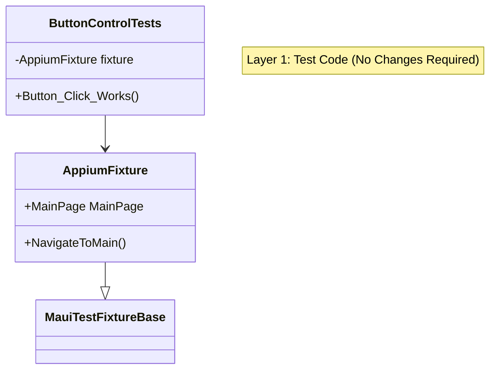
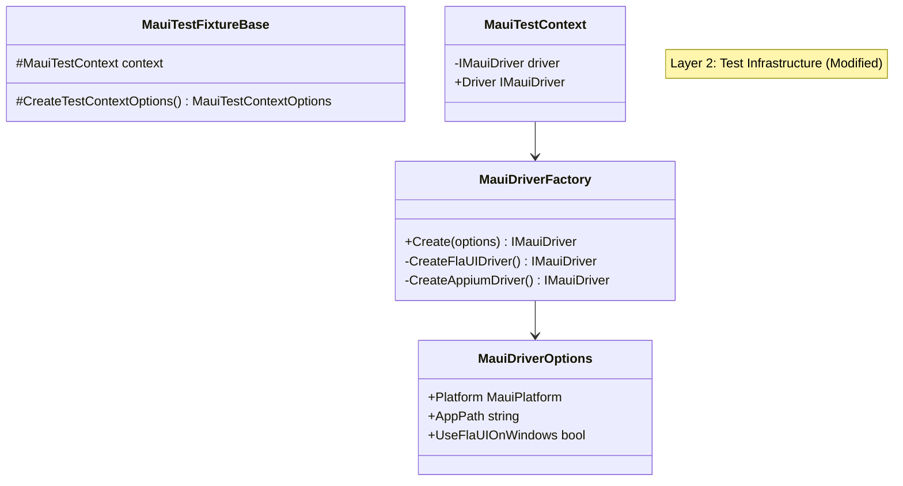
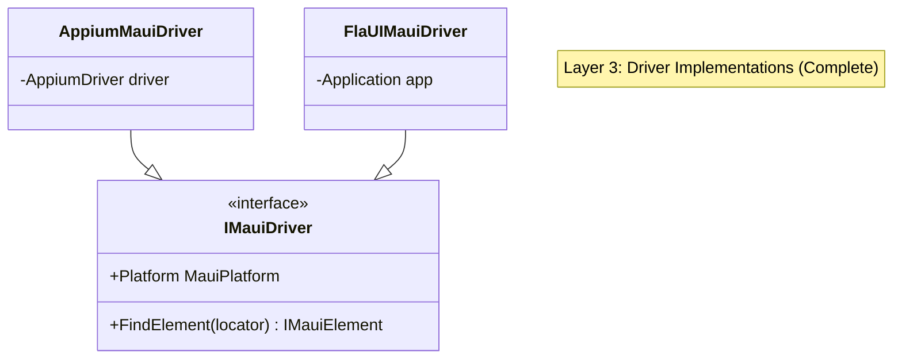

# SPEC-028: Testsnew Multi-Platform Validation - Design

**Spec ID:** 028  
**Feature:** testsnew-multiplatform-validation  
**Status:** Draft  
**Created:** January 21, 2026

---

## 1. Overview

This design document describes the architecture changes needed to enable `testsnew/Brinell.Maui.UITests` to run on both Android (Appium) and Windows (FlaUI) platforms.

### Design Goals

1. **Zero Test Changes** - Existing tests work without modification
2. **Environment-Based Selection** - Platform/driver selected via environment variables
3. **Backward Compatible** - Default behavior unchanged for existing users
4. **Clean Architecture** - Factory pattern with interface-based dependencies

---

## 2. Current Architecture Analysis

### What's Working (SPEC-027 Complete)

```
Brinell.Core/Interfaces/
├── IElement.cs           ✅ Complete - All gestures included
├── IDriver.cs            ✅ Complete - Generic driver interface
└── IDiagnosticDriver.cs  ✅ Complete - Optional diagnostics

Brinell.Maui/Interfaces/
├── IMauiElement.cs       ✅ Complete - Extends IElement
└── IMauiDriver.cs        ✅ Complete - Extends IDriver + IDiagnosticDriver

Brinell.Maui.Appium/
├── AppiumMauiDriver.cs   ✅ Complete - Implements IMauiDriver
└── AppiumMauiElement.cs  ✅ Complete - Implements IMauiElement

Brinell.Maui.FlaUI/
├── FlaUIMauiDriver.cs    ✅ Complete - Implements IMauiDriver
└── FlaUIMauiElement.cs   ✅ Complete - Implements IMauiElement
```

### What's Missing (Integration Gap)

```
Brinell.Maui/
├── MauiDriverFactory.cs    ❌ Missing - Platform-based driver selection
├── MauiDriverOptions.cs    ❌ Missing - Unified configuration
└── Context/
    └── MauiTestContext.cs  ⚠️ Needs refactoring - Direct Appium usage

Brinell.Maui/Testing/
└── MauiTestFixtureBase.cs  ⚠️ Needs refactoring - No FlaUI path
```

### Current Flow (Android Only)

```
MauiTestFixtureBase
    └── CreateTestContextOptions()
        └── new AppiumOptions()
            └── MauiTestContext(options)
                └── new AndroidDriver/WindowsDriver  ← Direct Appium creation
                    └── new MauiDriver(_rawDriver)   ← Legacy wrapper
```

### Target Flow (Multi-Platform)

```
MauiTestFixtureBase
    └── CreateTestContextOptions()
        └── new MauiDriverOptions()
            └── MauiTestContext(options)
                └── MauiDriverFactory.Create(options)
                    ├── FlaUIMauiDriver (Windows + USE_FLAUI=true)
                    └── AppiumMauiDriver (Android, iOS, or Windows default)
```

---

## 3. Component Design

### 3.1 MauiDriverOptions

A unified options class that works across all platforms and drivers.

```csharp
namespace Brinell.Maui;

/// <summary>
/// Configuration options for MAUI driver creation.
/// Works with both Appium and FlaUI drivers.
/// </summary>
public class MauiDriverOptions
{
    /// <summary>
    /// Target platform. Determines default driver type.
    /// </summary>
    public MauiPlatform Platform { get; set; } = MauiPlatform.Windows;
    
    /// <summary>
    /// Path to application executable or package.
    /// - Windows: Path to .exe
    /// - Android: Path to .apk
    /// - iOS: Path to .app or bundle ID
    /// </summary>
    public string? AppPath { get; set; }
    
    /// <summary>
    /// Process name to attach to (alternative to AppPath).
    /// Windows FlaUI only. Attaches to running process.
    /// </summary>
    public string? ProcessName { get; set; }
    
    /// <summary>
    /// Window handle to attach to (alternative to AppPath).
    /// Windows FlaUI only.
    /// </summary>
    public IntPtr? WindowHandle { get; set; }
    
    // Note: FlaUI is always used on Windows - no configuration needed
    
    /// <summary>
    /// Appium server URI. Required for Appium driver.
    /// Default: http://127.0.0.1:4723
    /// </summary>
    public Uri AppiumServerUri { get; set; } = new Uri("http://127.0.0.1:4723");
    
    /// <summary>
    /// Device name for Android/iOS.
    /// </summary>
    public string? DeviceName { get; set; }
    
    /// <summary>
    /// Platform version for iOS.
    /// </summary>
    public string? PlatformVersion { get; set; }
    
    /// <summary>
    /// Additional Appium capabilities.
    /// </summary>
    public Dictionary<string, object> AdditionalCapabilities { get; } = new();
    
    /// <summary>
    /// Timeout settings for waits and polling.
    /// </summary>
    public TimeoutSettings? Timeouts { get; set; }
    
    /// <summary>
    /// Logger for driver operations.
    /// </summary>
    public ITestLogger? Logger { get; set; }
    
    /// <summary>
    /// Creates options from environment variables.
    /// </summary>
    public static MauiDriverOptions FromEnvironment()
    {
        var platform = Environment.GetEnvironmentVariable("APPIUM_PLATFORM")?.ToLowerInvariant() switch
        {
            "android" => MauiPlatform.Android,
            "ios" => MauiPlatform.iOS,
            "windows" or _ => MauiPlatform.Windows
        };
        
        return new MauiDriverOptions
        {
            Platform = platform,
            AppPath = Environment.GetEnvironmentVariable("APPIUM_APP_PATH"),
            DeviceName = Environment.GetEnvironmentVariable("APPIUM_DEVICE_NAME"),
            PlatformVersion = Environment.GetEnvironmentVariable("APPIUM_PLATFORM_VERSION"),
            AppiumServerUri = new Uri(Environment.GetEnvironmentVariable("APPIUM_SERVER_URI") ?? "http://127.0.0.1:4723")
        };
    }
}
```

### 3.2 MauiDriverFactory

Factory for creating platform-appropriate drivers.

```csharp
namespace Brinell.Maui;

/// <summary>
/// Factory for creating platform-appropriate MAUI drivers.
/// Selects FlaUI for Windows when configured, Appium for mobile.
/// </summary>
public static class MauiDriverFactory
{
    /// <summary>
    /// Creates a driver based on the specified options.
    /// </summary>
    /// <param name="options">Driver configuration options.</param>
    /// <returns>An IMauiDriver instance appropriate for the platform.</returns>
    /// <exception cref="ArgumentException">When required options are missing.</exception>
    /// <exception cref="PlatformNotSupportedException">When FlaUI is requested on non-Windows.</exception>
    public static IMauiDriver Create(MauiDriverOptions options)
    {
        ArgumentNullException.ThrowIfNull(options);
        
        // Windows always uses FlaUI, mobile uses Appium
        return options.Platform switch
        {
            MauiPlatform.Windows => CreateFlaUIDriver(options),
            MauiPlatform.Android => CreateAppiumDriver(options),
            MauiPlatform.iOS => CreateAppiumDriver(options),
            _ => throw new ArgumentException($"Unsupported platform: {options.Platform}")
        };
    }
    
    private static IMauiDriver CreateFlaUIDriver(MauiDriverOptions options)
    {
        // Ensure we're on Windows
        if (!OperatingSystem.IsWindows())
        {
            throw new PlatformNotSupportedException(
                "FlaUI driver is only available on Windows. " +
                "Set USE_FLAUI=false or use APPIUM_PLATFORM=android.");
        }
        
        // Lazy load FlaUI to avoid compile-time dependency
        return FlaUIDriverLoader.Create(options);
    }
    
    private static IMauiDriver CreateAppiumDriver(MauiDriverOptions options)
    {
        ValidateAppiumOptions(options);
        
        var appiumOptions = BuildAppiumOptions(options);
        var driver = CreatePlatformDriver(options.AppiumServerUri, appiumOptions, options.Platform);
        
        return new AppiumMauiDriver(driver, options.Platform);
    }
    
    private static void ValidateAppiumOptions(MauiDriverOptions options)
    {
        if (string.IsNullOrEmpty(options.AppPath))
        {
            throw new ArgumentException(
                "AppPath is required for Appium driver. " +
                "Set APPIUM_APP_PATH environment variable or options.AppPath.",
                nameof(options));
        }
    }
    
    private static AppiumOptions BuildAppiumOptions(MauiDriverOptions options)
    {
        var appiumOptions = new AppiumOptions();
        
        switch (options.Platform)
        {
            case MauiPlatform.Windows:
                appiumOptions.PlatformName = "Windows";
                appiumOptions.AutomationName = "Windows";
                appiumOptions.App = options.AppPath;
                break;
                
            case MauiPlatform.Android:
                appiumOptions.PlatformName = "Android";
                appiumOptions.AutomationName = "UiAutomator2";
                appiumOptions.DeviceName = options.DeviceName ?? "emulator-5554";
                appiumOptions.App = options.AppPath;
                break;
                
            case MauiPlatform.iOS:
                appiumOptions.PlatformName = "iOS";
                appiumOptions.AutomationName = "XCUITest";
                appiumOptions.DeviceName = options.DeviceName ?? "iPhone 15";
                appiumOptions.PlatformVersion = options.PlatformVersion ?? "17.0";
                appiumOptions.App = options.AppPath;
                break;
        }
        
        foreach (var cap in options.AdditionalCapabilities)
        {
            appiumOptions.AddAdditionalAppiumOption(cap.Key, cap.Value);
        }
        
        return appiumOptions;
    }
    
    private static AppiumDriver CreatePlatformDriver(Uri serverUri, AppiumOptions options, MauiPlatform platform)
    {
        return platform switch
        {
            MauiPlatform.Android => new AndroidDriver(serverUri, options),
            MauiPlatform.iOS => new IOSDriver(serverUri, options),
            MauiPlatform.Windows => new WindowsDriver(serverUri, options),
            _ => throw new ArgumentException($"Unsupported platform: {platform}")
        };
    }
}

/// <summary>
/// Lazy loader for FlaUI driver to avoid assembly resolution on non-Windows.
/// </summary>
internal static class FlaUIDriverLoader
{
    public static IMauiDriver Create(MauiDriverOptions options)
    {
        // This method is only called on Windows, so FlaUI assembly will resolve
        if (options.WindowHandle.HasValue)
        {
            return new FlaUIMauiDriver(options.WindowHandle.Value);
        }
        else if (!string.IsNullOrEmpty(options.ProcessName))
        {
            var process = System.Diagnostics.Process.GetProcessesByName(options.ProcessName).FirstOrDefault()
                ?? throw new InvalidOperationException($"Process not found: {options.ProcessName}");
            return new FlaUIMauiDriver(process);
        }
        else if (!string.IsNullOrEmpty(options.AppPath))
        {
            return new FlaUIMauiDriver(options.AppPath);
        }
        else
        {
            throw new ArgumentException(
                "FlaUI driver requires AppPath, ProcessName, or WindowHandle. " +
                "Set APPIUM_APP_PATH environment variable or configure options.");
        }
    }
}
```

### 3.3 MauiTestContext Refactoring

Update to use factory instead of direct driver creation.

```csharp
// Current (in MauiTestContext constructor):
var platformName = options.AppiumOptions.PlatformName?.ToLowerInvariant();
(_rawDriver, _platform) = platformName switch
{
    "android" => ((AppiumDriver)new AndroidDriver(...), MauiPlatform.Android),
    "ios" => ((AppiumDriver)new IOSDriver(...), MauiPlatform.iOS),
    "windows" => ((AppiumDriver)new WindowsDriver(...), MauiPlatform.Windows),
    _ => throw new ArgumentException(...)
};
_driver = new MauiDriver(_rawDriver, _platform);

// New (refactored):
_driver = options.Driver ?? MauiDriverFactory.Create(options.ToDriverOptions());
_platform = _driver.Platform;
```

### 3.4 MauiTestContextOptions Update

Add support for driver injection and factory options.

```csharp
namespace Brinell.Maui.Context;

/// <summary>
/// Configuration options for MauiTestContext.
/// </summary>
public class MauiTestContextOptions
{
    /// <summary>
    /// Pre-created driver instance (for testing or custom drivers).
    /// If set, factory is not used.
    /// </summary>
    public IMauiDriver? Driver { get; set; }
    
    // Note: Windows always uses FlaUI - no configuration needed
    
    // ... existing properties ...
    
    /// <summary>
    /// Appium server URI (existing).
    /// </summary>
    public Uri AppiumServerUri { get; set; } = new Uri("http://127.0.0.1:4723");
    
    /// <summary>
    /// Appium options (existing, for backward compatibility).
    /// </summary>
    public AppiumOptions? AppiumOptions { get; set; }
    
    /// <summary>
    /// Timeout settings (existing).
    /// </summary>
    public TimeoutSettings? Timeouts { get; set; }
    
    /// <summary>
    /// Logger (existing).
    /// </summary>
    public ITestLogger? Logger { get; set; }
    
    /// <summary>
    /// Converts to MauiDriverOptions for factory.
    /// </summary>
    internal MauiDriverOptions ToDriverOptions()
    {
        var platform = AppiumOptions?.PlatformName?.ToLowerInvariant() switch
        {
            "android" => MauiPlatform.Android,
            "ios" => MauiPlatform.iOS,
            _ => MauiPlatform.Windows
        };
        
        return new MauiDriverOptions
        {
            Platform = platform,
            AppPath = AppiumOptions?.App,
            DeviceName = AppiumOptions?.DeviceName,
            PlatformVersion = AppiumOptions?.PlatformVersion,
            UseFlaUIOnWindows = UseFlaUIOnWindows,
            AppiumServerUri = AppiumServerUri,
            Timeouts = Timeouts,
            Logger = Logger
        };
    }
}
```

### 3.5 MauiTestFixtureBase Update

Add FlaUI support via environment variable.

```csharp
// In CreateTestContextOptions():
protected virtual MauiTestContextOptions CreateTestContextOptions()
{
    var platform = Platform;
    var appPath = Environment.GetEnvironmentVariable("APPIUM_APP_PATH")
        ?? GetDefaultAppPath(platform);
    
    // Factory handles driver selection: Windows=FlaUI, Mobile=Appium
    var appiumOptions = new AppiumOptions();
    switch (platform.ToLowerInvariant())
    {
        case "windows":
            // Minimal config - FlaUI will be used
            appiumOptions.PlatformName = "Windows";
            appiumOptions.App = appPath;
            break;
        case "android":
            ConfigureAndroidOptions(appiumOptions, appPath);
            break;
        case "ios":
            ConfigureiOSOptions(appiumOptions, appPath);
            break;
    }
    
    return new MauiTestContextOptions
    {
        AppiumServerUri = new Uri(serverUri),
        AppiumOptions = appiumOptions,
        Timeouts = new TimeoutSettings { ... }
    };
}
```

---

## 4. Architecture Diagram







---

## 5. Environment Variables

| Variable | Values | Default | Description |
|----------|--------|---------|-------------|
| `APPIUM_PLATFORM` | `windows`, `android`, `ios` | `windows` | Target platform |
| `APPIUM_APP_PATH` | File path | Test project default | App executable/package path |
| `APPIUM_SERVER_URI` | URL | `http://127.0.0.1:4723` | Appium server address |
| `APPIUM_DEVICE_NAME` | Device name | `emulator-5554` | Android/iOS device |
| ~~`USE_FLAUI`~~ | N/A | N/A | **Removed** - FlaUI always used on Windows |

### Example Configurations

**Android (Appium):**
```powershell
$env:APPIUM_PLATFORM = "android"
$env:APPIUM_APP_PATH = "path/to/app.apk"
$env:APPIUM_DEVICE_NAME = "emulator-5554"
dotnet test testsnew/Brinell.Maui.UITests
```

**Windows (FlaUI - automatic):**
```powershell
$env:APPIUM_PLATFORM = "windows"
$env:APPIUM_APP_PATH = "path/to/app.exe"
dotnet test testsnew/Brinell.Maui.UITests
```

---

## 6. Migration Path

### Phase 1: Add New Components (Non-Breaking)

1. Create `MauiDriverOptions.cs` in `Brinell.Maui/`
2. Create `MauiDriverFactory.cs` in `Brinell.Maui/`
3. Both are additive - no existing code changes

### Phase 2: Update MauiTestContextOptions (Non-Breaking)

1. Add `UseFlaUIOnWindows` property (default: false)
2. Add `Driver` property for injection
3. Add `ToDriverOptions()` method
4. Existing properties unchanged

### Phase 3: Refactor MauiTestContext (Internal Change)

1. Use factory when `Driver` not injected
2. Keep backward compatibility with `AppiumOptions`
3. Existing constructor signature unchanged

### Phase 4: Update MauiTestFixtureBase (Opt-In)

1. Check `USE_FLAUI` environment variable
2. Only affects Windows platform
3. Default behavior unchanged

### Platform-Driver Mapping

| Platform | Driver | Notes |
|----------|--------|-------|
| Windows | FlaUI | Always - faster, native UI Automation |
| Android | Appium | UiAutomator2 |
| iOS | Appium | XCUITest |

---

## 7. Error Handling

### Common Error Scenarios

| Scenario | Error Type | Message |
|----------|------------|---------|
| FlaUI on non-Windows | `PlatformNotSupportedException` | "FlaUI driver is only available on Windows" |
| No AppPath with Appium | `ArgumentException` | "AppPath is required for Appium driver" |
| No AppPath/Process with FlaUI | `ArgumentException` | "FlaUI driver requires AppPath, ProcessName, or WindowHandle" |
| Process not found | `InvalidOperationException` | "Process not found: {name}" |
| XPath with FlaUI | `LocatorNotSupportedException` | "XPath not supported by FlaUI. Use AutomationId instead" |

---

## 8. Testing Strategy

### Unit Tests

```csharp
public class MauiDriverFactoryTests
{
    [Fact]
    public void Create_WithAndroid_ReturnsAppiumDriver()
    {
        var options = new MauiDriverOptions
        {
            Platform = MauiPlatform.Android,
            AppPath = "/path/to/app.apk"
        };
        
        // Would need mock/stub for actual creation
        Assert.Equal(MauiPlatform.Android, options.Platform);
    }
    
    [Fact]
    public void Create_WithWindowsAndFlaUI_ReturnsFlaUIDriver()
    {
        var options = new MauiDriverOptions
        {
            Platform = MauiPlatform.Windows,
            UseFlaUIOnWindows = true,
            AppPath = "C:\\app.exe"
        };
        
        // Verify FlaUI is selected
        Assert.True(options.UseFlaUIOnWindows);
    }
    
    [Fact]
    public void FromEnvironment_ParsesVariables()
    {
        Environment.SetEnvironmentVariable("APPIUM_PLATFORM", "android");
        Environment.SetEnvironmentVariable("USE_FLAUI", "true");
        
        var options = MauiDriverOptions.FromEnvironment();
        
        Assert.Equal(MauiPlatform.Android, options.Platform);
        Assert.True(options.UseFlaUIOnWindows);
    }
}
```

### Integration Tests

Run full test suite on both platforms:

```powershell
# Android validation
$env:APPIUM_PLATFORM = "android"
dotnet test testsnew/Brinell.Maui.UITests --logger "trx;LogFileName=android-results.trx"

# Windows FlaUI validation  
$env:APPIUM_PLATFORM = "windows"
$env:USE_FLAUI = "true"
dotnet test testsnew/Brinell.Maui.UITests --logger "trx;LogFileName=windows-flaui-results.trx"

# Compare results
# Both should pass all tests
```

---

## 9. File Changes Summary

| File | Change Type | Description |
|------|-------------|-------------|
| `Brinell.Maui/MauiDriverOptions.cs` | **New** | Unified options class |
| `Brinell.Maui/MauiDriverFactory.cs` | **New** | Platform-based driver selection |
| `Brinell.Maui/Context/MauiTestContextOptions.cs` | **Modify** | Add FlaUI support properties |
| `Brinell.Maui/Context/MauiTestContext.cs` | **Modify** | Use factory for driver creation |
| `Brinell.Maui/Testing/MauiTestFixtureBase.cs` | **Modify** | Check USE_FLAUI env var |
| `Brinell.Maui/Brinell.Maui.csproj` | **Modify** | Add conditional FlaUI reference |

---

## 10. References

- [SPEC-027: Unified Driver Abstraction](./027-unified-driver-abstraction/design.spc.spx.md)
- [FlaUI Patterns](https://github.com/FlaUI/FlaUI/wiki/Patterns)
- [Appium Capabilities](https://appium.io/docs/en/writing-running-appium/caps/)
