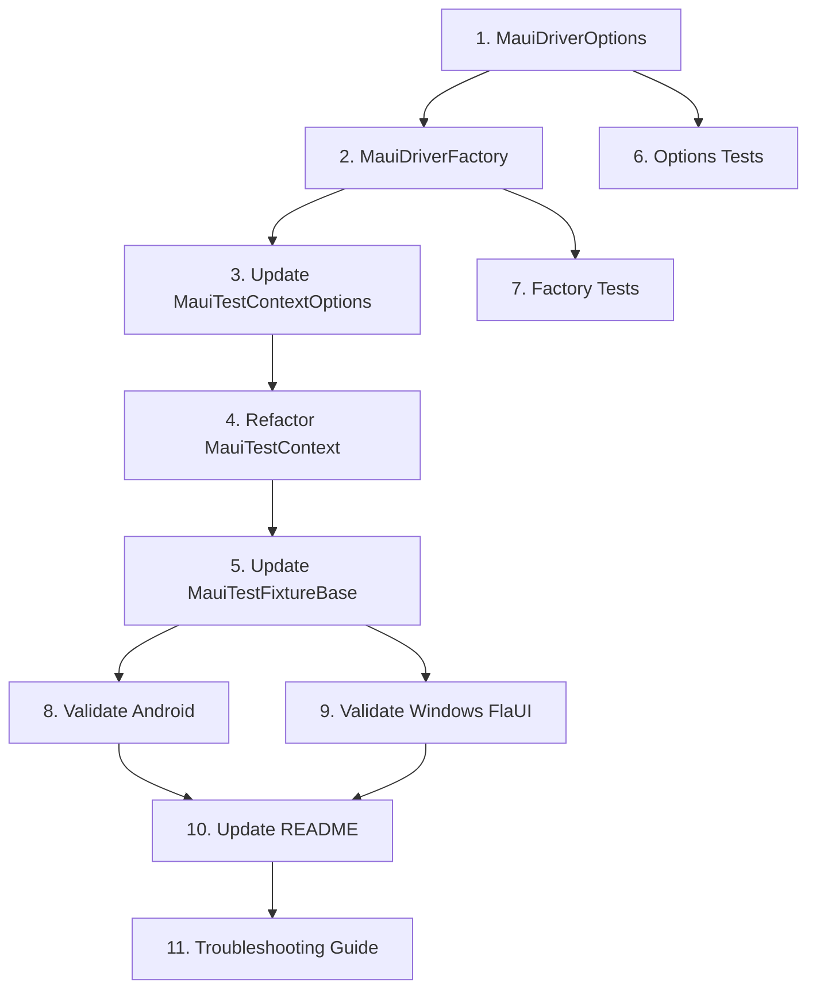

# SPEC-028: Testsnew Multi-Platform Validation - Tasks

**Spec ID:** 028  
**Feature:** testsnew-multiplatform-validation  
**Status:** Draft  
**Created:** January 21, 2026

---

## Task Format

- `[ ]` = Pending, `[-]` = In-progress, `[x]` = Completed
- Include File path, Purpose, _Leverage, _Requirements, and _Prompt fields
- _Prompt provides AI guidance for implementing the task

---

## Summary: SPEC-027 Implementation Status

### ✅ Completed Tasks (from SPEC-027)

| # | Task | File | Status |
|---|------|------|--------|
| 1 | TextInputMethod enum | `Brinell.Core/TextInputMethod.cs` | ✅ Done |
| 2 | IElement<TSelf> interface | `Brinell.Core/Interfaces/IElement.cs` | ✅ Done |
| 3 | IDriver<TElement> interface | `Brinell.Core/Interfaces/IDriver.cs` | ✅ Done |
| 4 | IDiagnosticDriver interface | `Brinell.Core/Interfaces/IDiagnosticDriver.cs` | ✅ Done |
| 5 | ElementNotFoundException | `Brinell.Core/Exceptions/` | ✅ Done |
| 6 | LocatorNotSupportedException | `Brinell.Core/Exceptions/` | ✅ Done |
| 7 | IMauiElement interface | `Brinell.Maui/Interfaces/IMauiElement.cs` | ✅ Done |
| 8 | IMauiDriver interface | `Brinell.Maui/Interfaces/IMauiDriver.cs` | ✅ Done |
| 9 | Brinell.Maui.Appium project | `Brinell.Maui.Appium/` | ✅ Done |
| 10 | AppiumMauiDriver | `Brinell.Maui.Appium/AppiumMauiDriver.cs` | ✅ Done |
| 11 | AppiumMauiElement | `Brinell.Maui.Appium/AppiumMauiElement.cs` | ✅ Done |
| 12 | Brinell.Maui.FlaUI project | `Brinell.Maui.FlaUI/` | ✅ Done |
| 13 | FlaUIMauiDriver | `Brinell.Maui.FlaUI/FlaUIMauiDriver.cs` | ✅ Done |
| 14 | FlaUIMauiElement | `Brinell.Maui.FlaUI/FlaUIMauiElement.cs` | ✅ Done |

### ❌ Remaining Tasks (This Spec)

| # | Task | File | Status |
|---|------|------|--------|
| 1 | MauiDriverOptions | `Brinell.Maui/MauiDriverOptions.cs` | ❌ Pending |
| 2 | MauiDriverFactory | `Brinell.Maui/MauiDriverFactory.cs` | ❌ Pending |
| 3 | Update MauiTestContextOptions | `Brinell.Maui/Context/MauiTestContextOptions.cs` | ❌ Pending |
| 4 | Refactor MauiTestContext | `Brinell.Maui/Context/MauiTestContext.cs` | ❌ Pending |
| 5 | Update MauiTestFixtureBase | `Brinell.Maui/Testing/MauiTestFixtureBase.cs` | ❌ Pending |
| 6 | Add factory unit tests | `testsnew/Brinell.Maui.Tests/` | ❌ Pending |
| 7 | Validate Android tests | Manual | ❌ Pending |
| 8 | Validate Windows FlaUI tests | Manual | ❌ Pending |
| 9 | Update documentation | `docs/` | ❌ Pending |

---

## Phase 1: Driver Factory Components

### [ ] 1. Create MauiDriverOptions class
- **File:** `srcnew/Brinell.Maui/MauiDriverOptions.cs`
- **Purpose:** Unified configuration for all driver types
- _Leverage: design.spc.spx.md section 3.1_
- _Requirements: REQ-028.2_
- _Prompt: Role: C# Framework Developer | Task: Create MauiDriverOptions class with Platform, AppPath, ProcessName, WindowHandle, AppiumServerUri, DeviceName, PlatformVersion, AdditionalCapabilities dictionary, Timeouts, Logger properties. Add static FromEnvironment() method that reads APPIUM_PLATFORM, APPIUM_APP_PATH, APPIUM_SERVER_URI env vars | Restrictions: No UseFlaUIOnWindows property - FlaUI is always used on Windows | Success: Class compiles, FromEnvironment parses all env vars correctly_

### [ ] 2. Create MauiDriverFactory class
- **File:** `srcnew/Brinell.Maui/MauiDriverFactory.cs`
- **Purpose:** Platform-based driver selection factory
- _Leverage: design.spc.spx.md section 3.2, existing AppiumMauiDriver and FlaUIMauiDriver_
- _Requirements: REQ-028.1_
- _Prompt: Role: C# Framework Developer | Task: Create MauiDriverFactory with static Create(MauiDriverOptions) method that returns IMauiDriver. Windows ALWAYS uses FlaUIMauiDriver, Android/iOS use AppiumMauiDriver. Create internal FlaUIDriverLoader class for lazy loading | Restrictions: No option to use Appium on Windows - FlaUI only, throw PlatformNotSupportedException if FlaUI on non-Windows | Success: Factory returns FlaUI for Windows, Appium for mobile_

---

## Phase 2: Test Context Integration

### [ ] 3. Update MauiTestContextOptions
- **File:** `srcnew/Brinell.Maui/Context/MauiTestContextOptions.cs`
- **Purpose:** Add driver injection support
- _Leverage: design.spc.spx.md section 3.4, existing MauiTestContextOptions_
- _Requirements: REQ-028.3_
- _Prompt: Role: C# Framework Developer | Task: Add Driver IMauiDriver? property for injection, and internal ToDriverOptions() method that converts existing AppiumOptions to MauiDriverOptions | Restrictions: Preserve all existing properties, no UseFlaUIOnWindows needed | Success: Existing tests still compile, new properties available_

### [ ] 4. Refactor MauiTestContext constructor
- **File:** `srcnew/Brinell.Maui/Context/MauiTestContext.cs`
- **Purpose:** Use factory instead of direct Appium driver creation
- _Leverage: design.spc.spx.md section 3.3, current MauiTestContext constructor_
- _Requirements: REQ-028.3_
- _Prompt: Role: C# Framework Developer | Task: Refactor constructor to check if options.Driver is set (use it directly if so), otherwise call MauiDriverFactory.Create(options.ToDriverOptions()). Store as IMauiDriver _driver field. Update Platform property to use _driver.Platform | Restrictions: Keep existing method signatures, preserve FindElement/TryFindElement implementations using _driver, remove direct _rawDriver usage where possible | Success: Context works with both injected drivers and factory-created drivers_

### [ ] 5. Update MauiTestFixtureBase
- **File:** `srcnew/Brinell.Maui/Testing/MauiTestFixtureBase.cs`
- **Purpose:** Simplified platform handling (factory does driver selection)
- _Leverage: design.spc.spx.md section 3.5, existing MauiTestFixtureBase_
- _Requirements: REQ-028.4_
- _Prompt: Role: C# Framework Developer | Task: Simplify CreateTestContextOptions() to pass platform info. Factory automatically uses FlaUI on Windows, Appium on mobile. Remove any Windows-specific Appium configuration | Restrictions: Keep Android/iOS Appium config, remove Windows Appium config | Success: Windows uses FlaUI automatically, mobile uses Appium_

---

## Phase 3: Unit Tests

### [ ] 6. Create MauiDriverOptions tests
- **File:** `testsnew/Brinell.Maui.Tests/MauiDriverOptionsTests.cs`
- **Purpose:** Verify options class behavior
- _Leverage: xUnit patterns_
- _Requirements: REQ-028.2_
- _Prompt: Role: C# Test Developer | Task: Create unit tests for MauiDriverOptions including default values, FromEnvironment parsing (mock env vars), and property setters | Restrictions: Use xUnit, test env var parsing by setting/clearing in test setup/teardown | Success: Tests verify all default values and env var parsing_

### [ ] 7. Create MauiDriverFactory tests
- **File:** `testsnew/Brinell.Maui.Tests/MauiDriverFactoryTests.cs`
- **Purpose:** Verify factory creates correct driver types
- _Leverage: xUnit, conditional tests for Windows_
- _Requirements: REQ-028.1_
- _Prompt: Role: C# Test Developer | Task: Create unit tests for MauiDriverFactory. Test that Windows+UseFlaUI returns FlaUIMauiDriver (skip on non-Windows), Android returns AppiumMauiDriver. Test error cases: missing AppPath throws, FlaUI on non-Windows throws | Restrictions: Use [SkippableFact] for platform-specific tests, mock or use test app paths | Success: Tests verify correct driver selection per platform_

---

## Phase 4: Integration Validation

### [ ] 8. Validate Android tests
- **File:** N/A (manual validation)
- **Purpose:** Verify all testsnew tests pass on Android
- _Leverage: Existing Android emulator setup_
- _Requirements: REQ-028.5_
- _Prompt: Role: QA Engineer | Task: Start Appium server, start Android emulator, build sample MAUI app for Android, set APPIUM_PLATFORM=android and APPIUM_APP_PATH, run dotnet test testsnew/Brinell.Maui.UITests, document results | Restrictions: All tests must pass, document any failures with details | Success: 100% test pass rate on Android_

**Validation Steps:**
```powershell
# 1. Start Appium server
appium

# 2. Start Android emulator
# (use Android Studio or emulator command)

# 3. Build MAUI app for Android
cd samples/Brinell.Samples.Maui.App
dotnet build -f net10.0-android

# 4. Set environment variables
$env:APPIUM_PLATFORM = "android"
$env:APPIUM_APP_PATH = "<path-to-apk>"
$env:APPIUM_DEVICE_NAME = "emulator-5554"

# 5. Run tests
cd testsnew/Brinell.Maui.UITests
dotnet test --logger "trx;LogFileName=android-results.trx"

# 6. Review results
# Open TestResults/android-results.trx
```

### [ ] 9. Validate Windows FlaUI tests
- **File:** N/A (manual validation)
- **Purpose:** Verify all testsnew tests pass on Windows with FlaUI
- _Leverage: Completed FlaUI driver implementation_
- _Requirements: REQ-028.5_
- _Prompt: Role: QA Engineer | Task: Build sample MAUI app for Windows, set APPIUM_PLATFORM=windows, APPIUM_APP_PATH, run dotnet test testsnew/Brinell.Maui.UITests, document results. FlaUI is used automatically on Windows | Restrictions: All tests must pass, document any failures with details | Success: 100% test pass rate on Windows with FlaUI_

**Validation Steps:**
```powershell
# 1. Build MAUI app for Windows
cd samples/Brinell.Samples.Maui.App
dotnet build -f net10.0-windows10.0.19041.0

# 2. Set environment variables (FlaUI is automatic on Windows)
$env:APPIUM_PLATFORM = "windows"
$env:APPIUM_APP_PATH = "<path-to-exe>"

# 3. Run tests
cd testsnew/Brinell.Maui.UITests
dotnet test --logger "trx;LogFileName=windows-flaui-results.trx"

# 4. Review results
# Open TestResults/windows-flaui-results.trx
```

---

## Phase 5: Documentation and Cleanup

### [ ] 10. Update README with multi-platform instructions
- **File:** `srcnew/README.md`
- **Purpose:** Document how to run tests on different platforms
- _Leverage: Environment variable design_
- _Requirements: REQ-028.4_
- _Prompt: Role: Technical Writer | Task: Add "Multi-Platform Testing" section with environment variable table, example commands for Android, Windows Appium, and Windows FlaUI | Restrictions: Keep concise, include troubleshooting tips | Success: Users can run tests on both platforms following docs_

### [ ] 11. Add troubleshooting guide
- **File:** `docs/testsnew-troubleshooting.md`
- **Purpose:** Help users debug common issues
- _Leverage: Known error scenarios_
- _Requirements: NFR-028 Reliability_
- _Prompt: Role: Technical Writer | Task: Create troubleshooting guide covering: Appium not starting, emulator not found, FlaUI element not found, locator strategy errors, app not launching | Restrictions: Include error messages and solutions | Success: Users can self-diagnose common issues_

---

## Task Dependencies



---

## Estimated Effort

| Phase | Tasks | Estimated Time |
|-------|-------|----------------|
| 1. Factory Components | 1-2 | 2 hours |
| 2. Context Integration | 3-5 | 3 hours |
| 3. Unit Tests | 6-7 | 2 hours |
| 4. Integration Validation | 8-9 | 4 hours |
| 5. Documentation | 10-11 | 1 hour |
| **Total** | **11 tasks** | **~12 hours** |

---

## Success Criteria

### Minimum Viable Completion

1. ✅ `MauiDriverFactory.Create()` returns FlaUI for Windows, Appium for Android/iOS
2. ✅ `MauiTestContext` uses factory for driver creation
3. ✅ Windows uses FlaUI automatically (no configuration needed)
4. ✅ All existing tests pass on Android with Appium
5. ✅ All existing tests pass on Windows with FlaUI

### Full Completion

1. ✅ All minimum viable criteria
2. ✅ Unit tests for factory and options (80%+ coverage)
3. ✅ Documentation updated
4. ✅ Troubleshooting guide created
5. ✅ No regressions in existing test behavior

---

## Test Matrix

Tests to validate across platforms:

| Test File | Android | Windows FlaUI |
|-----------|---------|---------------|
| `ButtonControlTests.cs` | [ ] Pass | [ ] Pass |
| `EntryControlTests.cs` | [ ] Pass | [ ] Pass |
| `ContainerScopingTests.cs` | [ ] Pass | [ ] Pass |
| `TabbedPageTests.cs` | [ ] Pass | [ ] Pass |
| `MainPageTests.cs` | [ ] Pass | [ ] Pass |
| `DiagnosticTests.cs` | [ ] Pass | [ ] Pass |
| `Toggle/*.cs` | [ ] Pass | [ ] Pass |
| `Selection/*.cs` | [ ] Pass | [ ] Pass |
| `Range/*.cs` | [ ] Pass | [ ] Pass |
| `Display/*.cs` | [ ] Pass | [ ] Pass |

---

## References

- [SPEC-027: Unified Driver Abstraction](./027-unified-driver-abstraction/tasks.spc.spx.md)
- [FlaUI Quick Start](https://github.com/FlaUI/FlaUI#quick-start)
- [Appium Getting Started](https://appium.io/docs/en/about-appium/getting-started/)
